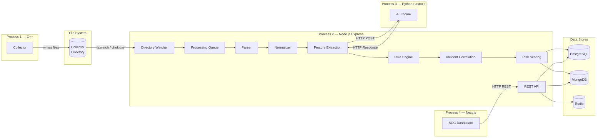
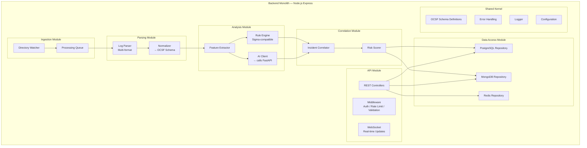
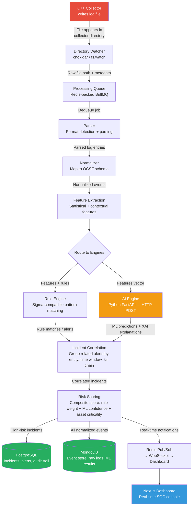

# 🏗️ Architecture Analysis — AI-Powered Security Analytics Platform

> **Role**: Lead Software Architect
> **Date**: 2026-07-18
> **Architecture Style**: Modular Monolith
> **Scope**: Single engineer, 4–6 months
> **Status**: ✅ All Decisions Finalized (Revision 3)

---

## 1. Architectural Philosophy

This platform is designed around **software engineering excellence**, not distributed systems engineering.

| Principle | Application |
|---|---|
| **Modular Monolith** | Single deployable backend with strict module boundaries — no microservices, no service mesh, no orchestration |
| **Clean Architecture** | Dependency inversion: domain logic has zero dependencies on frameworks, databases, or external services |
| **SOLID Principles** | Every module, class, and function adheres to Single Responsibility, Open/Closed, Liskov Substitution, Interface Segregation, and Dependency Inversion |
| **Repository Pattern** | All data access is abstracted behind repository interfaces — swap PostgreSQL for anything without touching business logic |
| **Separation of Concerns** | Each module owns its domain, exposes only interfaces, and communicates through well-defined contracts |
| **Single Engineer Feasibility** | Every design decision is filtered through: "Can one person build, test, and maintain this in 4–6 months?" |

---

## 2. System Boundaries — 4 Processes, Not Services

This is **not** a microservices architecture. The system runs as **4 separate processes** that communicate through simple, well-understood mechanisms:

| Process | Language | Role | Communication |
|---|---|---|---|
| **Collector** | C++ | Gathers logs from sources, writes normalized files to a watched directory | File I/O → Collector Directory |
| **Backend** | Node.js (Express) | The monolith — watches directory, queues, parses, normalizes, detects, correlates, scores, serves API | File watcher (chokidar), HTTP to AI, PostgreSQL/MongoDB/Redis |
| **AI Engine** | Python (FastAPI) | ML inference — anomaly detection, threat classification, XAI explanations | HTTP REST (called by Backend) |
| **Frontend** | Next.js | SOC analyst dashboard — visualizations, alerts, investigation, management | HTTP REST (calls Backend API) |

### Process Communication Map



> [!NOTE]
> **Why file-based communication between Collector and Backend?**
> - Dead simple. No message broker to configure, monitor, or debug.
> - The collector directory acts as a natural buffer — if the backend is down, files accumulate safely.
> - Atomic file writes ensure no partial reads.
> - A single engineer can reason about and debug this trivially.
> - If throughput demands grow later, the directory watcher can be swapped for a Redis queue or even Kafka — **without touching any upstream or downstream module** (Open/Closed principle).

---

## 3. Technology Stack (Final)

| Layer | Technology | Purpose |
|---|---|---|
| **Collector** | C++ (C++20) | High-performance log collection — syslog, file tailing, Windows Event Log |
| **Backend** | Node.js + Express | Modular monolith — pipeline orchestration, API, business logic |
| **AI Engine** | Python + FastAPI | ML inference — anomaly detection, classification, explainability |
| **Frontend** | Next.js (React + TypeScript) | SOC analyst dashboard with SSR |
| **Relational DB** | PostgreSQL | Structured data — users, rules, incidents, audit logs, configurations |
| **Document DB** | MongoDB | Semi-structured data — raw/normalized logs, enrichment cache, AI results |
| **Cache / Queue** | Redis | In-memory processing queue, session cache, rate limiting, pub/sub for real-time dashboard updates |

> [!IMPORTANT]
> **No Kafka. No Kubernetes. No Terraform. No ClickHouse. No OpenSearch. No MLflow. No Ray.** Every technology in this stack can be installed with a single command and run on a developer laptop.

---

## 4. Backend Modular Architecture (Clean Architecture)

The Node.js backend is a **single Express application** with strict internal module boundaries. Each module is a self-contained vertical slice following Clean Architecture layers:

### Layer Structure (Inside-Out)

```
┌─────────────────────────────────────────────────────────┐
│                    Frameworks / Drivers                   │
│         Express, Mongoose, pg, Redis, chokidar           │
├─────────────────────────────────────────────────────────┤
│                  Interface Adapters                       │
│     Controllers, Repositories (impl), Presenters         │
├─────────────────────────────────────────────────────────┤
│                  Application Layer                        │
│         Use Cases, DTOs, Application Services             │
├─────────────────────────────────────────────────────────┤
│                    Domain Layer                           │
│   Entities, Value Objects, Domain Services, Interfaces    │
│              (ZERO external dependencies)                 │
└─────────────────────────────────────────────────────────┘
```

### Module Map



### Module Dependency Rules (Enforced)

| Rule | Description |
|---|---|
| **No circular dependencies** | Module A → Module B means Module B cannot import from Module A |
| **Domain depends on nothing** | Domain entities and interfaces have zero `import` from frameworks |
| **Repositories are interfaces** | `IIncidentRepository`, `ILogRepository` — defined in domain, implemented in data access |
| **Modules communicate through interfaces** | No module directly instantiates another module's classes |
| **Shared Kernel is minimal** | Only truly cross-cutting: schema definitions, error types, logger, config |

---

## 5. Data Pipeline — Detailed Flow

This is the exact processing pipeline inside the backend monolith:



### Pipeline Stage Details

| Stage | Responsibility | Input | Output | Error Handling |
|---|---|---|---|---|
| **Directory Watcher** | Detects new files in collector directory | File system events | Job enqueued in Redis | Retry with backoff, dead-letter queue in Redis |
| **Processing Queue** | Ordered, persistent job queue (BullMQ) | Job descriptor | Dequeued job to parser | Failed jobs stored for inspection, configurable retry |
| **Parser** | Detects log format (syslog, JSON, CSV, CEF, LEEF) and parses | Raw file content | Structured log entries | Unknown formats → quarantine directory |
| **Normalizer** | Maps parsed logs to OCSF canonical schema | Parsed entries | OCSF-normalized events | Unmappable fields preserved in `unmapped` extension |
| **Feature Extraction** | Computes statistical and contextual features for detection | Normalized events | Feature vectors | Graceful degradation if enrichment sources unavailable |
| **Rule Engine** | Matches events against Sigma-compatible detection rules | Features + rule set | Rule match alerts | Rule syntax errors caught at load time, not runtime |
| **AI Engine** | ML anomaly detection, threat classification, XAI | Feature vectors (HTTP) | Predictions + explanations | Timeout → fallback to rule-only detection |
| **Incident Correlation** | Groups related alerts by entity, time window, kill chain stage | Alerts from both engines | Correlated incidents | Uncorrelated alerts stored as standalone |
| **Risk Scoring** | Composite scoring: rule weight × ML confidence × asset criticality | Correlated incidents | Scored incidents | Missing factors default to neutral weight |

---

## 6. Database Design Philosophy

### PostgreSQL — Structured, Relational, Transactional

| What Goes Here | Why |
|---|---|
| Users, roles, permissions | RBAC requires strong consistency and transactions |
| Detection rules (Sigma) | Versioned, auditable, relational (rule → rule group → policy) |
| Incidents & alerts | Lifecycle management (open → investigating → resolved → closed) |
| Audit logs | Immutable, compliance-critical — needs transactional guarantees |
| Configuration | System settings, tenant configs, retention policies |
| Asset inventory | Known assets, criticality scores, network topology |

### MongoDB — Semi-Structured, High-Volume, Flexible Schema

| What Goes Here | Why |
|---|---|
| Raw ingested logs | Schema varies wildly across sources — MongoDB's flexible schema is ideal |
| Normalized events (OCSF) | High write throughput, TTL indexes for automatic retention |
| AI/ML results | Prediction objects with nested explanations — natural document fit |
| Enrichment cache | GeoIP, threat intel lookups — document-oriented |
| Search indexes | MongoDB Atlas Search or text indexes for log investigation |

### Redis — Ephemeral, Speed-Critical

| What Goes Here | Why |
|---|---|
| Processing queue (BullMQ) | Persistent job queue with retry, priority, and dead-letter support |
| Session store | Fast session lookups for authenticated users |
| Real-time pub/sub | Push incident alerts to dashboard via WebSocket |
| Rate limiting | API rate limiting with sliding window counters |
| Feature cache | Frequently accessed features for correlation (e.g., IP reputation) |

---

## 7. AI Engine Design (Python FastAPI)

The AI engine is a **separate process** but architecturally simple — it's a stateless HTTP service the backend calls synchronously or asynchronously.

| Capability | Model / Approach | Endpoint | Latency Target |
|---|---|---|---|
| **Anomaly Detection** | Isolation Forest / Autoencoder | `POST /api/v1/detect/anomaly` | < 200ms |
| **Threat Classification** | Random Forest / XGBoost | `POST /api/v1/classify/threat` | < 150ms |
| **XAI Explanations** | SHAP values on detection models | `POST /api/v1/explain` | < 2s |
| **Log Clustering** | DBSCAN / HDBSCAN | `POST /api/v1/cluster` | < 500ms |
| **NLP Query** | Sentence transformers for natural language log search | `POST /api/v1/search/nl` | < 1s |
| **Health Check** | — | `GET /api/v1/health` | < 10ms |

> [!NOTE]
> **No MLflow. No Ray. No Kubernetes.** Models are trained offline (Jupyter notebooks), serialized (joblib/ONNX), and loaded at FastAPI startup. Model versioning is handled by a simple `models/` directory with version-stamped filenames and a config file pointing to the active version.

---

## 8. Collector Design (C++)

The C++ collector is a **standalone binary** that runs on the target host or on the SIEM server itself.

| Feature | Detail |
|---|---|
| **Input Sources** | Syslog (UDP/TCP), file tailing (like `tail -f`), Windows Event Log (via ETW), JSON over HTTP |
| **Output** | Writes structured log files (JSON-lines format) to the collector directory |
| **Buffering** | In-memory ring buffer → flush to disk at configurable intervals or buffer fullness |
| **File Rotation** | Writes to timestamped files, rotates at configurable size (e.g., 10MB) |
| **Reliability** | Atomic writes (write to `.tmp`, rename to `.json`) — no partial reads by the watcher |
| **Configuration** | YAML config file — sources, output directory, buffer size, rotation policy |
| **Build System** | CMake — cross-platform (Linux + Windows) |

---

## 9. Frontend Design (Next.js)

| Page / Feature | Purpose |
|---|---|
| **Dashboard** | Real-time overview — incident count, risk distribution, top sources, timeline |
| **Incidents** | Incident list with filtering, sorting, status management, drill-down |
| **Investigation** | Log search, event timeline for a specific incident, entity graph |
| **Rules** | Sigma rule editor (YAML), rule testing, enable/disable, import/export |
| **AI Insights** | XAI explanations for ML-flagged incidents, confidence scores, model performance |
| **Settings** | User management, data source configuration, retention policies |
| **Audit Log** | Immutable record of all analyst actions |

---

## 10. Project Directory Structure (Revised)

```
AI-SIEM/
│
├── docs/                                  # All documentation
│   ├── architecture/                      # ADRs, system design
│   │   └── decisions/                     # Architecture Decision Records
│   ├── diagrams/                          # Mermaid source files
│   ├── api/                               # OpenAPI specs
│   └── guides/                            # Developer guides
│
├── backend/                               # Node.js Express — Modular Monolith
│   ├── src/
│   │   ├── modules/                       # Feature modules (vertical slices)
│   │   │   ├── ingestion/                 # Directory watcher + queue
│   │   │   │   ├── domain/               # Entities, interfaces
│   │   │   │   ├── application/           # Use cases
│   │   │   │   ├── infrastructure/        # chokidar, BullMQ impl
│   │   │   │   └── interface/             # Controllers (if API-exposed)
│   │   │   ├── parsing/                   # Parser + normalizer
│   │   │   │   ├── domain/
│   │   │   │   ├── application/
│   │   │   │   ├── infrastructure/
│   │   │   │   └── interface/
│   │   │   ├── analysis/                  # Feature extraction + rule engine + AI client
│   │   │   │   ├── domain/
│   │   │   │   ├── application/
│   │   │   │   ├── infrastructure/
│   │   │   │   └── interface/
│   │   │   ├── correlation/               # Incident correlation + risk scoring
│   │   │   │   ├── domain/
│   │   │   │   ├── application/
│   │   │   │   ├── infrastructure/
│   │   │   │   └── interface/
│   │   │   ├── incidents/                 # Incident CRUD, lifecycle management
│   │   │   │   ├── domain/
│   │   │   │   ├── application/
│   │   │   │   ├── infrastructure/
│   │   │   │   └── interface/
│   │   │   ├── rules/                     # Detection rule management
│   │   │   │   ├── domain/
│   │   │   │   ├── application/
│   │   │   │   ├── infrastructure/
│   │   │   │   └── interface/
│   │   │   ├── auth/                      # Authentication + authorization
│   │   │   │   ├── domain/
│   │   │   │   ├── application/
│   │   │   │   ├── infrastructure/
│   │   │   │   └── interface/
│   │   │   └── dashboard/                 # Dashboard data aggregation
│   │   │       ├── domain/
│   │   │       ├── application/
│   │   │       ├── infrastructure/
│   │   │       └── interface/
│   │   ├── shared/                        # Shared kernel
│   │   │   ├── domain/                    # Base entity, value objects, OCSF schema
│   │   │   ├── infrastructure/            # Logger, config, error handler
│   │   │   └── interfaces/                # Shared DTOs, middleware
│   │   ├── config/                        # App configuration
│   │   └── app.ts                         # Express app bootstrap
│   ├── tests/
│   │   ├── unit/
│   │   ├── integration/
│   │   └── e2e/
│   ├── package.json
│   └── tsconfig.json
│
├── frontend/                              # Next.js SOC Dashboard
│   ├── src/
│   │   ├── app/                           # Next.js App Router pages
│   │   ├── components/                    # Reusable UI components
│   │   ├── hooks/                         # Custom React hooks
│   │   ├── services/                      # API client services
│   │   ├── stores/                        # State management
│   │   ├── types/                         # TypeScript type definitions
│   │   └── utils/                         # Utilities
│   ├── public/
│   ├── package.json
│   └── next.config.js
│
├── collector/                             # C++ Log Collector
│   ├── src/
│   │   ├── sources/                       # Input source implementations
│   │   ├── buffer/                        # Ring buffer
│   │   ├── output/                        # File writer
│   │   ├── config/                        # YAML config parser
│   │   └── main.cpp
│   ├── include/                           # Header files
│   ├── tests/                             # Google Test
│   ├── CMakeLists.txt
│   └── config.yaml                        # Default configuration
│
├── ai/                                    # Python FastAPI AI Engine
│   ├── app/
│   │   ├── api/                           # FastAPI route handlers
│   │   ├── models/                        # ML model loading + inference
│   │   ├── preprocessing/                 # Feature preprocessing
│   │   ├── explainability/                # SHAP / LIME
│   │   ├── schemas/                       # Pydantic request/response models
│   │   └── main.py                        # FastAPI app
│   ├── models/                            # Serialized model files (.joblib, .onnx)
│   ├── notebooks/                         # Training notebooks
│   ├── tests/
│   ├── requirements.txt
│   └── Dockerfile
│
├── shared/                                # Cross-process shared definitions
│   └── schemas/                           # OCSF schema (JSON Schema files)
│
├── infrastructure/                        # Simple deployment
│   ├── docker/                            # Dockerfiles for each process
│   └── docker-compose.yml                 # Single command to run everything
│
├── scripts/                               # Dev/ops utilities
│   ├── setup/                             # Environment setup
│   ├── seed/                              # Test data generators
│   └── dev.sh                             # Start all 4 processes
│
└── research/                              # Reference papers
    └── papers/                            # Existing PDFs
```

---

## 11. Risk Assessment (Revised)

| Risk | Probability | Impact | Mitigation |
|---|---|---|---|
| Single backend process becomes bottleneck | Medium | 🟡 High | BullMQ concurrency tuning, worker threads for CPU-bound parsing, async I/O everywhere |
| C++ collector memory safety bugs | Medium | 🔴 Critical | Modern C++20, smart pointers, AddressSanitizer in CI, fuzzing |
| AI Engine HTTP latency slows pipeline | Medium | 🟡 High | Async HTTP calls, timeout + fallback to rule-only mode, batch predictions |
| MongoDB grows unbounded | High | 🟡 High | TTL indexes, configurable retention, archival to compressed files |
| Scope creep beyond 4–6 month timeline | High | 🟠 Medium | Strict MVP feature list, phased delivery milestones |
| File-based collector communication fails under extreme load | Low | 🟠 Medium | Ring buffer in collector, configurable batch size, upgrade path to Redis queue |

---

## 12. Decisions — Final Status

| # | Decision | Status |
|---|---|---|
| **D1** | Architecture style | ✅ **Decided** — Modular Monolith |
| **D2** | Event schema standard | ✅ **Decided** — OCSF (with documented extensions for missing fields) |
| **D3** | Languages | ✅ **Decided** — C++ / Node.js (Express) / Python (FastAPI) / Next.js |
| **D4** | Storage | ✅ **Decided** — PostgreSQL + MongoDB + Redis |
| **D5** | Message bus | ✅ **Decided** — None (file-based + Redis BullMQ) |
| **D6** | Frontend framework | ✅ **Decided** — Next.js |
| **D7** | Project layout | ✅ **Decided** — Revised modular layout (see Section 10) |
| **D8** | Multi-tenancy | ✅ **Decided** — Single-tenant MVP; architecture designed for future multi-tenancy |
| **D9** | ML serving | ✅ **Decided** — Python FastAPI, models loaded at startup |
| **D10** | Deployment | ✅ **Decided** — Docker Compose (single command) |

### D2 — OCSF Extension Policy

> All logs (Windows, Linux, network devices, applications) are normalized to the **OCSF (Open Cybersecurity Schema Framework)** before entering the detection pipeline. If OCSF does not contain a required field, the field is added as a **documented extension** under the `unmapped` object — a custom schema is never created. Extensions are tracked in `docs/architecture/ocsf-extensions.md`.

### D8 — Multi-Tenancy Future Path

> The MVP targets a **single organization** and a **single SOC team**. No tenant isolation, tenant management, or tenant-aware data models will be implemented. However, the architecture is designed so that multi-tenancy can be introduced later:
> - Repository interfaces accept an optional `orgId` parameter (ignored in MVP)
> - Database schemas include a reserved `org_id` column (defaulting to a single constant)
> - Configuration supports namespace prefixes for future tenant-scoping
>
> Multi-tenancy is documented as a **future enhancement** in the ADR.

---

## 13. Next Steps

> **✅ All 10 architectural decisions are finalized.** Ready to generate documentation on your command.

Documents to be generated in `docs/`:

| # | Document | Location |
|---|---|---|
| 1 | **ADR-001** — Modular Monolith | `docs/architecture/decisions/ADR-001-modular-monolith.md` |
| 2 | **System Design Document** | `docs/architecture/system-design.md` |
| 3 | **Data Flow Specification** | `docs/architecture/data-flow.md` |
| 4 | **API Specification** | `docs/api/rest-api.md` |
| 5 | **Database Schema Design** | `docs/architecture/database-schema.md` |
| 6 | **AI Engine Specification** | `docs/architecture/ai-engine.md` |
| 7 | **Collector Specification** | `docs/architecture/collector.md` |
| 8 | **Frontend Architecture** | `docs/architecture/frontend.md` |
| 9 | **OCSF Extensions Registry** | `docs/architecture/ocsf-extensions.md` |
| 10 | **Development Guide** | `docs/guides/development-guide.md` |

> **⏸️ Awaiting your instruction to begin generating documentation.**
