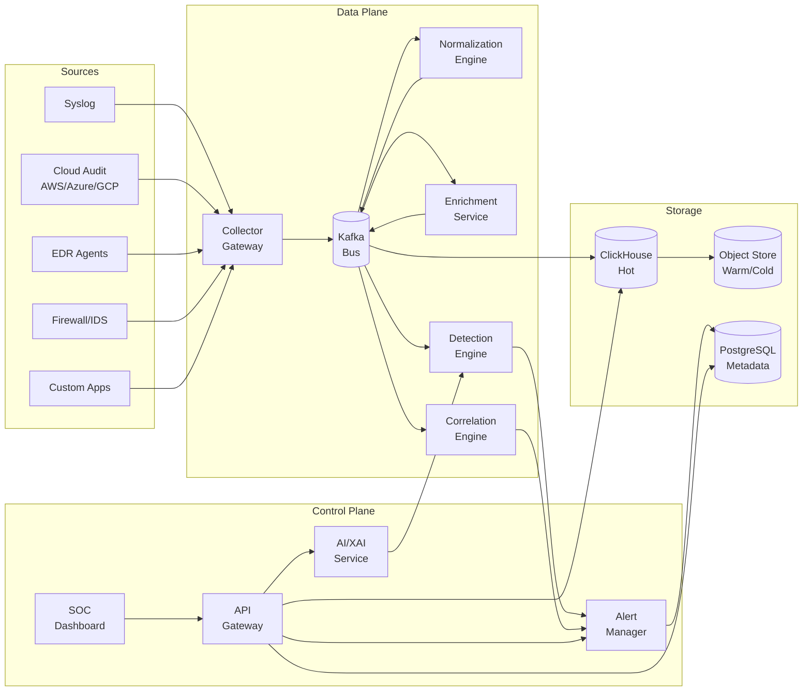

# 🏗️ Architecture Analysis — AI-Powered Security Analytics Platform

> **Role**: Lead Software Architect
> **Date**: 2026-07-18
> **Status**: ⏳ Awaiting Approval

---

## 1. Project Understanding

Based on the workspace structure and the research papers present, this project aims to build a **production-grade AI-Powered SIEM (Security Information and Event Management) platform**. The following capabilities are inferred from the research material:

| Capability | Source Signal |
|---|---|
| Log aggregation & normalization | Research paper on log aggregation design criteria |
| AI/ML-driven threat detection | Multiple papers on AI in SIEM |
| Explainable AI (XAI) for security analysts | Two papers on XAI in SIEM |
| Automated detection rule management | Paper on automated SIEM detection rule translation |
| Human-AI collaborative SOC workflows | Paper on SOC 2.0 human-AI collaboration |
| Cloud-native security operations | Paper on cloud security framework with SIEM |

---

## 2. Architectural Weaknesses Identified

### Current Directory Structure

```
AI-SIEM/
├── docs/           (empty)
├── architecture/   (empty)
├── backend/        (empty)
├── frontend/       (empty)
├── collector/      (empty)
├── ai/             (empty)
├── database/       (empty)
├── diagrams/       (empty)
└── [6 research PDFs]
```

### Weakness Assessment

| # | Weakness | Severity | Explanation |
|---|---|---|---|
| **W1** | **Flat monolithic directory layout** | 🔴 Critical | The current structure (`backend/`, `frontend/`, `ai/`, `collector/`, `database/`) implies a monolith. A SIEM must ingest **millions of events/sec** — a monolith cannot scale horizontally per component. |
| **W2** | **No separation of data plane vs. control plane** | 🔴 Critical | SIEM architectures must separate the high-throughput data pipeline (ingest → normalize → enrich → store) from the low-throughput control plane (user management, rules, dashboards). Mixing them in a single `backend/` is a scalability and reliability risk. |
| **W3** | **`collector/` as a single directory** | 🟡 High | Real-world SIEM collectors vary wildly — syslog, Windows Event Log, cloud audit trails, EDR, firewall, NetFlow. A single flat directory won't accommodate multi-protocol, multi-format collectors with independent lifecycle management. |
| **W4** | **`ai/` is undifferentiated** | 🟡 High | "AI" in a SIEM spans at least 4 distinct concerns: (1) real-time anomaly detection, (2) batch threat hunting models, (3) NLP for log parsing, (4) XAI explanation generation. These have radically different compute, latency, and deployment requirements. |
| **W5** | **No `infrastructure/` or `deployment/` directory** | 🟡 High | No evidence of IaC (Terraform, Helm charts), CI/CD pipeline definitions, or containerization strategy. A production SIEM without these is not deployable. |
| **W6** | **`database/` is ambiguous** | 🟠 Medium | A SIEM typically requires **multiple storage engines** — a hot tier (time-series/search), a warm/cold tier (object storage), a relational DB (for config/users), and potentially a graph DB (for entity relationships). A single `database/` directory doesn't reflect this. |
| **W7** | **No `shared/` or `common/` library** | 🟠 Medium | Cross-cutting concerns like log schema definitions, authentication, error handling, and data models will be duplicated across services without a shared library. |
| **W8** | **No observability or self-monitoring structure** | 🟠 Medium | Ironic for a monitoring platform — there's no evidence of self-monitoring, health checks, or operational metrics for the platform itself. |
| **W9** | **`diagrams/` is outside `docs/`** | 🟢 Low | Diagrams should live alongside architectural documentation in `docs/` for cohesion, not as a sibling directory. |
| **W10** | **`architecture/` directory overlaps with `docs/`** | 🟢 Low | Architecture documents are documentation — having both `architecture/` and `docs/` as siblings creates ambiguity about where design docs belong. |

---

## 3. Recommended Architectural Improvements

### A. Adopt an Event-Driven Microservices Architecture

Instead of the current implied monolith, the system should be decomposed into **independently deployable services** connected by a high-throughput message bus (Apache Kafka or Redpanda):

| Service | Responsibility | Scaling Model |
|---|---|---|
| **Collector Gateway** | Multi-protocol log ingestion (syslog, HTTP/REST, agent-based) | Horizontal, per-protocol |
| **Normalization Engine** | Parse, normalize to common schema (ECS/OCSF) | Horizontal, stateless |
| **Enrichment Service** | GeoIP, threat intel, asset context enrichment | Horizontal, cache-heavy |
| **Detection Engine** | Rule-based (Sigma/YARA) + ML anomaly detection | Horizontal, GPU for ML |
| **Correlation Engine** | Multi-event correlation, kill-chain detection | Stateful, partitioned |
| **Alert Manager** | Deduplication, prioritization, notification routing | Moderate scale |
| **AI/XAI Service** | Explainable AI, NLP query, threat classification | GPU-backed, async |
| **API Gateway** | REST/GraphQL API for frontend & integrations | Horizontal |
| **Frontend (SOC Console)** | Analyst dashboard, investigation workspace | CDN-served SPA |

### B. Adopt a Standard Log Schema

Without a canonical event schema, every downstream service will implement its own parsing logic. Two industry-standard options:

| Schema | Pros | Cons | Recommendation |
|---|---|---|---|
| **OCSF** (Open Cybersecurity Schema Framework) | Vendor-neutral, strong industry momentum (AWS, Splunk, IBM backing), purpose-built for security | Newer, smaller community | ✅ **Recommended** |
| **ECS** (Elastic Common Schema) | Mature, large community, well-documented | Tied to Elastic ecosystem | Good alternative |

### C. Multi-Tier Storage Strategy

A single `database/` directory cannot represent the reality of SIEM storage. A production SIEM requires:

| Tier | Technology Candidates | Retention | Use Case |
|---|---|---|---|
| **Hot** | ClickHouse / OpenSearch | 7–30 days | Real-time search, dashboards, active investigation |
| **Warm** | Apache Parquet on object storage | 90–365 days | Threat hunting, batch analytics, ML training |
| **Cold** | S3 / MinIO compressed archives | 1–7 years | Compliance, forensics, legal hold |
| **Metadata** | PostgreSQL | Indefinite | Users, rules, configs, audit trails, case management |
| **Graph** (optional) | Neo4j / Apache AGE | Rolling window | Entity relationship mapping, lateral movement analysis |

### D. Restructured Project Layout

```
AI-SIEM/
│
├── docs/                              # All documentation lives here
│   ├── architecture/                  # ADRs, system design documents
│   │   └── decisions/                 # Architecture Decision Records (ADRs)
│   ├── diagrams/                      # Mermaid source files (.mmd)
│   ├── api/                           # OpenAPI / AsyncAPI specifications
│   ├── runbooks/                      # Operational runbooks
│   └── guides/                        # Developer & operator guides
│
├── services/                          # Microservices (each independently deployable)
│   ├── collector-gateway/             # Multi-protocol log ingestion
│   ├── normalization-engine/          # Log parsing & schema normalization
│   ├── enrichment-service/            # Context enrichment (GeoIP, threat intel)
│   ├── detection-engine/              # Rule-based + ML threat detection
│   ├── correlation-engine/            # Multi-event correlation
│   ├── alert-manager/                 # Alert lifecycle management
│   ├── ai-service/                    # AI/ML models + XAI explanations
│   └── api-gateway/                   # External API surface
│
├── frontend/                          # SOC analyst dashboard (SPA)
│   ├── src/
│   └── public/
│
├── shared/                            # Shared libraries & schemas
│   ├── schemas/                       # OCSF event schema definitions
│   ├── proto/                         # Protobuf / Avro definitions (if used)
│   ├── auth/                          # Shared authentication library
│   └── utils/                         # Common utilities
│
├── infrastructure/                    # Infrastructure as Code
│   ├── docker/                        # Dockerfiles & docker-compose
│   ├── kubernetes/                    # Helm charts / K8s manifests
│   ├── terraform/                     # Cloud infrastructure provisioning
│   └── ci-cd/                         # CI/CD pipeline definitions
│
├── scripts/                           # Dev/ops scripts
│   ├── setup/                         # Environment setup scripts
│   ├── seed/                          # Test data generators
│   └── benchmarks/                    # Performance benchmarking tools
│
├── tests/                             # Integration & E2E tests
│   ├── integration/
│   ├── e2e/
│   └── load/                          # Load testing (k6, Locust)
│
└── research/                          # Reference papers & notes
    └── papers/                        # Move existing PDFs here
```

### E. Key Cross-Cutting Concerns

These must be addressed architecturally, not as afterthoughts:

| Concern | Recommendation |
|---|---|
| **Authentication & Authorization** | OIDC/SAML for SSO, RBAC with fine-grained permissions (analyst, admin, auditor roles) |
| **Multi-Tenancy** | Tenant isolation at the data layer from day one — retrofitting is extremely costly |
| **Encryption** | TLS everywhere (in-transit), AES-256 at rest, key management via Vault/KMS |
| **Audit Logging** | Immutable audit trail of all analyst actions — compliance requirement |
| **Rate Limiting & Backpressure** | Essential for a system that faces unpredictable log bursts |
| **Self-Monitoring** | The SIEM must monitor itself — metrics (Prometheus), logs (self-ingestion), traces (OpenTelemetry) |
| **Data Retention Policies** | Configurable per-tenant, per-data-source retention with automated lifecycle management |

### F. AI/ML Architecture Decomposition

The `ai/` directory should be decomposed into distinct ML workloads:

| AI Component | Model Type | Latency Requirement | Deployment |
|---|---|---|---|
| **Real-Time Anomaly Detection** | Streaming ML (Isolation Forest, Autoencoders) | < 100ms | Inline in Detection Engine |
| **Batch Threat Hunting** | Deep learning, graph neural networks | Minutes–hours | Scheduled jobs on GPU cluster |
| **NLP Log Parser** | Transformer-based parsing | < 500ms | Sidecar to Normalization Engine |
| **XAI Explanation Generator** | SHAP/LIME on detection models | < 2s | On-demand via AI Service |
| **Automated Rule Generation** | LLM-based Sigma rule synthesis | Seconds | Interactive via AI Service |
| **Alert Triage / Prioritization** | Classification model (trained on analyst feedback) | < 200ms | Inline in Alert Manager |

---

## 4. Technology Stack Recommendation (Preliminary)

> [!IMPORTANT]
> These are initial recommendations. Final choices should be validated through prototyping and your approval.

| Layer | Technology | Rationale |
|---|---|---|
| **Message Bus** | Apache Kafka / Redpanda | Industry standard for high-throughput event streaming |
| **Hot Storage** | ClickHouse | Superior query performance for analytical workloads, column-oriented |
| **Search** | OpenSearch | Full-text search for log investigation |
| **Metadata DB** | PostgreSQL | Proven, rich ecosystem, strong RBAC |
| **Cache** | Redis / Dragonfly | Enrichment cache, session management |
| **Backend Language** | Go (data plane) + Python (AI/ML) | Go for high-throughput, low-latency services; Python for ML ecosystem |
| **Frontend** | React + TypeScript | Rich ecosystem for complex dashboards |
| **API** | gRPC (internal) + REST/GraphQL (external) | gRPC for inter-service performance, REST for external consumption |
| **Orchestration** | Kubernetes | Industry standard for microservice orchestration |
| **Observability** | OpenTelemetry + Prometheus + Grafana | Self-monitoring stack |
| **ML Platform** | MLflow + Ray Serve | Model versioning, serving, and distributed training |
| **IaC** | Terraform + Helm | Cloud-agnostic infrastructure provisioning |

---

## 5. High-Level Data Flow (Conceptual)



---

## 6. Risk Assessment

| Risk | Probability | Impact | Mitigation |
|---|---|---|---|
| Kafka becomes a single point of failure | Medium | 🔴 Critical | Multi-broker cluster, cross-AZ replication, dead-letter queues |
| ML models produce false positives at scale | High | 🟡 High | XAI explanations, analyst feedback loop, confidence thresholds |
| ClickHouse storage costs explode | Medium | 🟡 High | Aggressive tiered storage, automated downsampling, retention policies |
| Schema evolution breaks downstream | Medium | 🟡 High | Schema registry (Confluent/Apicurio), backward-compatible evolution |
| Multi-tenancy data leakage | Low | 🔴 Critical | Row-level security, tenant-scoped API tokens, penetration testing |
| Team lacks Go expertise | Medium | 🟠 Medium | Consider Rust as alternative, or use Java/Kotlin with GraalVM |

---

## 7. Decisions Requiring Your Approval

Before I proceed with any documentation or system design, I need your decision on:

> [!IMPORTANT]
> ### Decision Points

| # | Decision | Options | My Recommendation |
|---|---|---|---|
| **D1** | Architecture style | Microservices vs. Modular Monolith | Microservices (for independent scaling of data plane) |
| **D2** | Event schema standard | OCSF vs. ECS vs. Custom | OCSF |
| **D3** | Primary backend language | Go vs. Rust vs. Java/Kotlin vs. Python | Go (data plane) + Python (AI) |
| **D4** | Hot storage engine | ClickHouse vs. OpenSearch vs. Both | ClickHouse (analytics) + OpenSearch (search) |
| **D5** | Message bus | Kafka vs. Redpanda vs. Pulsar | Kafka (maturity) or Redpanda (simplicity) |
| **D6** | Frontend framework | React vs. Vue vs. Angular | React + TypeScript |
| **D7** | Restructure project layout | Proposed layout vs. keep current | Proposed layout |
| **D8** | Multi-tenancy from day one | Yes vs. add later | Yes — retrofitting is 10x more expensive |
| **D9** | ML serving strategy | Embedded vs. Dedicated service | Hybrid (real-time embedded, batch via service) |
| **D10** | Deployment target | Kubernetes vs. Docker Compose (dev) + K8s (prod) | Docker Compose (dev) + K8s (prod) |

---

## Next Steps (Pending Your Approval)

Once you approve the direction, I will produce the following documents in order:

1. **ADR-001**: Architecture style decision (Microservices)
2. **System Design Document**: Full system design with detailed Mermaid diagrams
3. **Data Flow Specification**: Event lifecycle from ingestion to alert
4. **API Contract Specification**: OpenAPI/AsyncAPI definitions
5. **Storage Strategy Document**: Multi-tier storage design
6. **AI/ML Architecture Document**: Model pipeline and serving strategy
7. **Infrastructure & Deployment Guide**: IaC and CI/CD pipeline design
8. **Security & Compliance Document**: Authentication, encryption, audit strategy

> **⏸️ Stopping here as instructed. Awaiting your review and approval before generating any design documents.**
