# High-Level Design (HLD)

## AI-Powered Security Analytics Platform

| Field | Value |
|---|---|
| **Document ID** | HLD-001 |
| **Version** | 1.0 |
| **Date** | 2026-07-18 |
| **Status** | Draft |
| **Architecture Reference** | [ADR-001](file:///d:/AI%20SIEM/docs/architecture/decisions/ADR-001-modular-monolith.md) |
| **Requirements Reference** | [SRS-001](file:///d:/AI%20SIEM/docs/SRS.md) |

---

## Table of Contents

1. [Overall Architecture](#1-overall-architecture)
2. [Component Diagram](#2-component-diagram)
3. [Data Flow](#3-data-flow)
4. [Module Responsibilities](#4-module-responsibilities)
5. [Technology Stack](#5-technology-stack)
6. [Communication Between Modules](#6-communication-between-modules)

---

## 1. Overall Architecture

The AI-Powered Security Analytics Platform follows a **Modular Monolith** architecture. The system is composed of **4 independent processes** that communicate through **file-based I/O**, **HTTP REST**, and **WebSocket**. There are no distributed message brokers, no service meshes, and no container orchestration.

### 1.1 Architectural Style

| Property | Value |
|---|---|
| **Style** | Modular Monolith |
| **Design Principles** | Clean Architecture, SOLID, Repository Pattern, Dependency Injection |
| **Processes** | 4 (Collector, Backend, AI Engine, Frontend) |
| **Databases** | 3 (PostgreSQL, MongoDB, Redis) |
| **Deployment** | Docker Compose (single command) |
| **Tenancy** | Single-tenant (MVP) |

### 1.2 System Context Diagram

This diagram shows the platform in context with its external actors and the environment it operates within.

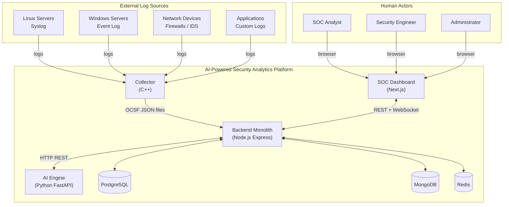

### 1.3 High-Level Architecture Diagram

This diagram details the internal structure of each process and how they interconnect.

```mermaid
graph TB
    subgraph P1["Process 1 - C++ Collector"]
        SRC["Log Sources<br/>Syslog / File Tail / ETW / HTTP"]
        OCSF_C["OCSF Converter"]
        BATCH["Batcher"]
        AWRITE["Atomic Writer<br/>.tmp to .json"]
        CHKPT["Checkpoint Manager"]
        HB["Heartbeat Writer"]

        SRC --> OCSF_C --> BATCH --> AWRITE
        SRC -.->|position tracking| CHKPT
        HB -.->|periodic status| AWRITE
    end

    subgraph FS["File System"]
        CDIR[("Collector<br/>Directory")]
    end

    subgraph P2["Process 2 - Node.js Express Backend"]

        subgraph IL["Ingestion Layer"]
            DW["Directory Watcher"]
            IPQ{{"IProcessingQueue"}}
            BMQ["BullMQQueue"]
        end

        subgraph WL["Worker Layer"]
            WP["Worker Pool"]
        end

        subgraph PP["Processing Pipeline"]
            PAR["Parser"]
            NOR["Normalizer"]
            FEX["Feature Extractor"]
        end

        subgraph DL["Detection Layer"]
            RUL["Rule Engine<br/>Sigma-compatible"]
            AIC["AI Client<br/>HTTP to FastAPI"]
        end

        subgraph CL["Correlation Layer"]
            COR["Incident Correlator"]
            RSC["Risk Scorer"]
        end

        subgraph AL["API Layer"]
            CTR["REST Controllers"]
            WSK["WebSocket Server"]
            MW["Middleware<br/>Auth / Validation / Rate Limit"]
        end

        subgraph DAL["Data Access Layer"]
            IREP{{"Repository Interfaces"}}
            PGREP["PostgreSQL Repos"]
            MGREP["MongoDB Repos"]
            RDREP["Redis Repos"]
        end

        subgraph CM["Collector Monitoring"]
            CMON["Collector Status Module"]
        end

        DW --> IPQ --> BMQ --> WP
        WP --> PAR --> NOR --> FEX
        FEX --> RUL
        FEX --> AIC
        RUL --> COR
        AIC --> COR
        COR --> RSC
        RSC --> IREP
        IREP --> PGREP
        IREP --> MGREP
        IREP --> RDREP
        CTR --> IREP
        CMON --> IREP
        RSC -.->|publish| WSK
    end

    subgraph P3["Process 3 - Python FastAPI AI Engine"]
        AIAPI["API Routes"]
        IFMOD["Isolation Forest<br/>Anomaly Detection"]
        SHAP_E["SHAP<br/>Explainability"]
        TCMOD["Threat Classifier<br/>Optional"]
        MLOAD["Model Loader<br/>joblib / ONNX"]

        AIAPI --> IFMOD --> SHAP_E
        AIAPI --> TCMOD
        MLOAD -.->|startup load| IFMOD
        MLOAD -.->|startup load| TCMOD
    end

    subgraph P4["Process 4 - Next.js Frontend"]
        PAGES["Pages<br/>Dashboard / Incidents / Rules<br/>Investigation / AI Insights<br/>Collector Monitor / Settings"]
        COMP["Components<br/>Charts / Tables / Editors"]
        SVC["API Services<br/>REST Client + WebSocket"]

        PAGES --> COMP
        PAGES --> SVC
    end

    subgraph DS["Data Stores"]
        PG2[("PostgreSQL<br/>Incidents, Rules, Users<br/>Audit, Config")]
        MDB2[("MongoDB<br/>Events, Logs<br/>AI Results")]
        RD2[("Redis<br/>Queue, Cache<br/>Pub/Sub, Sessions")]
    end

    AWRITE -->|atomic file write| CDIR
    HB -->|heartbeat file| CDIR
    CDIR -->|file system watch| DW
    AIC -->|HTTP POST| AIAPI
    AIAPI -->|HTTP Response| AIC
    SVC -->|REST + WebSocket| CTR
    SVC -->|REST + WebSocket| WSK
    PGREP --> PG2
    MGREP --> MDB2
    RDREP --> RD2
    BMQ --> RD2
    WSK -.->|pub/sub| RD2

    style P1 fill:#e74c3c,color:#fff
    style P3 fill:#f39c12,color:#fff
    style P4 fill:#3498db,color:#fff
```

---

## 2. Component Diagram

### 2.1 Process-Level Component Diagram

This diagram shows the four processes and the three data stores as top-level components, with their interfaces and dependencies.

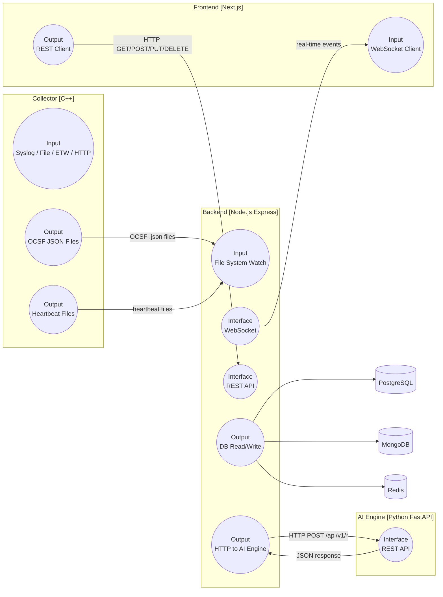

### 2.2 Backend Internal Component Diagram

The backend monolith is organized into **9 modules**, a **workers layer**, and a **shared kernel**. Each module follows Clean Architecture with 4 layers: Domain, Application, Infrastructure, Interface.

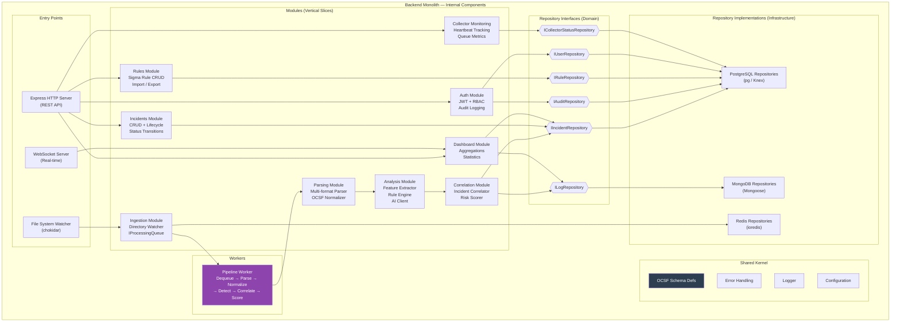

### 2.3 AI Engine Component Diagram

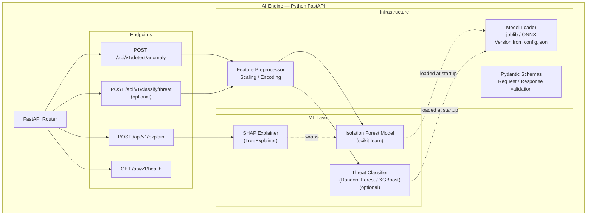

### 2.4 Collector Component Diagram

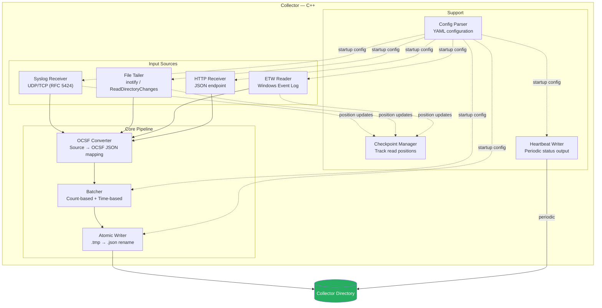

### 2.5 Frontend Component Diagram

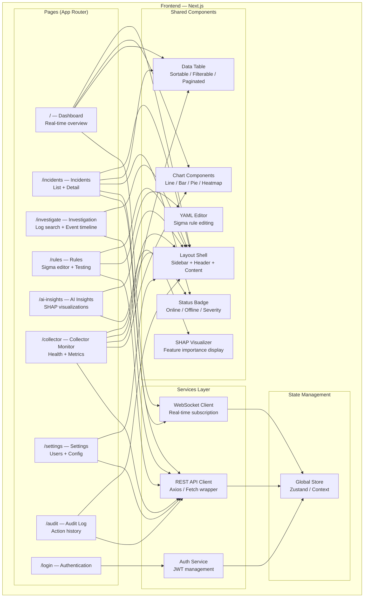

---

## 3. Data Flow

### 3.1 End-to-End Data Flow

This diagram traces a security event from its source through the entire platform to the analyst's screen.

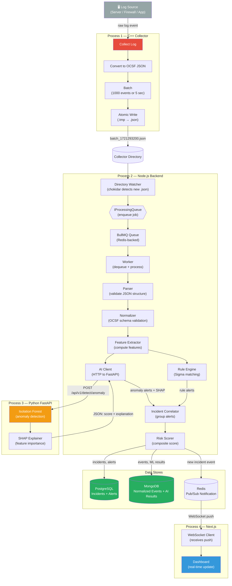

### 3.2 Collector Internal Data Flow

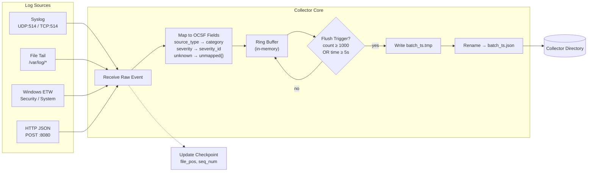

### 3.3 Backend Pipeline Data Flow (Worker Detail)

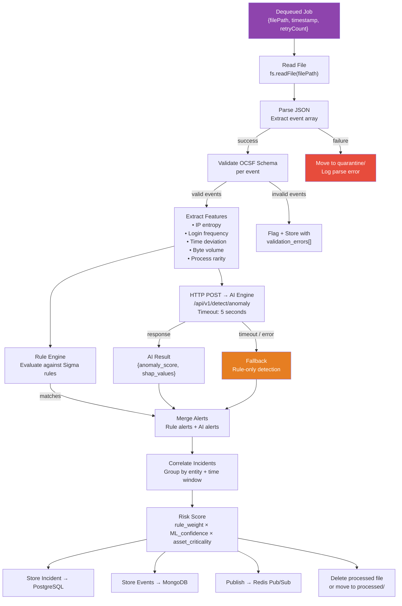

### 3.4 Authentication & Authorization Flow

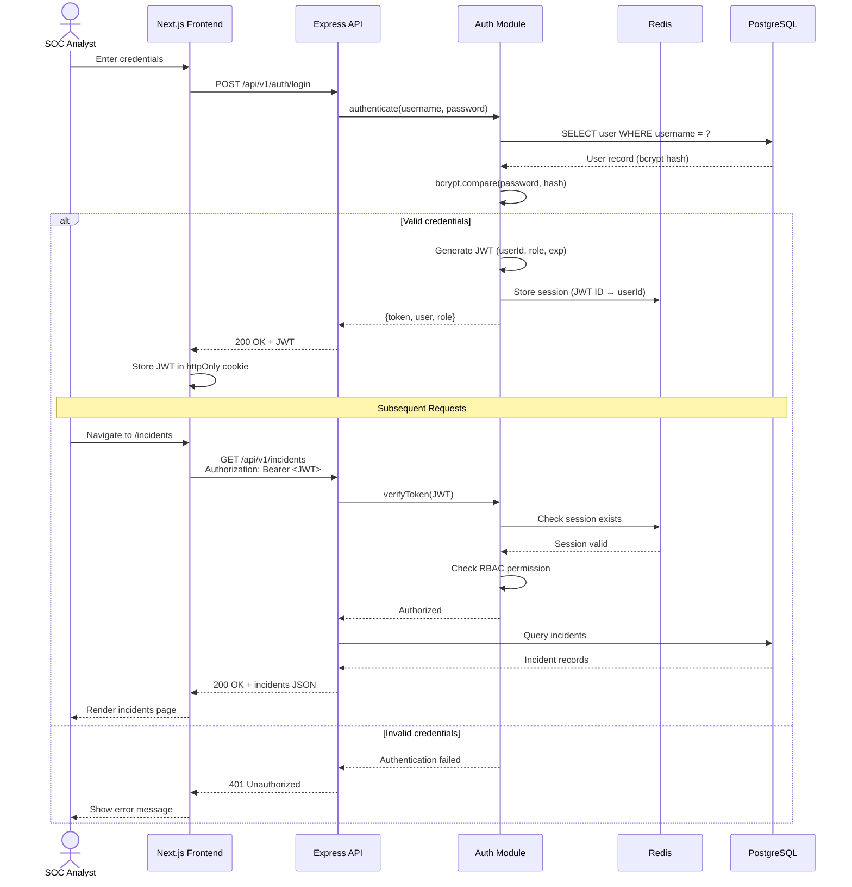

### 3.5 Real-Time Dashboard Update Flow

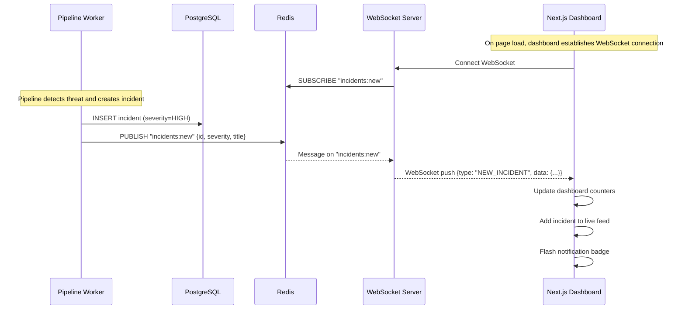

---

## 4. Module Responsibilities

### 4.1 Collector (C++) — Process 1

| Module | Responsibility | Inputs | Outputs |
|---|---|---|---|
| **Syslog Receiver** | Listen on UDP/TCP port 514, receive RFC 5424 syslog messages | Network packets | Raw syslog strings |
| **File Tailer** | Monitor log files for new lines, track read position | File system | Raw log lines |
| **ETW Reader** | Subscribe to Windows Event Log channels via ETW | Windows Event Tracing | Structured event records |
| **HTTP Receiver** | Accept JSON-formatted log events via REST endpoint | HTTP POST requests | JSON objects |
| **OCSF Converter** | Map source-specific fields to OCSF schema; place unknown fields in `unmapped` | Raw events from any source | OCSF JSON objects |
| **Batcher** | Accumulate events until batch threshold (count or time) is reached | Individual OCSF events | Array of OCSF events |
| **Atomic Writer** | Write batch to `.tmp` file, then rename to `.json` for atomic visibility | Batch array | File in collector directory |
| **Checkpoint Manager** | Persist file read positions and sequence numbers for crash recovery | Read positions from sources | Checkpoint file on disk |
| **Heartbeat Writer** | Periodically write health status (timestamp, CPU, memory, events collected) | Internal metrics | Heartbeat file in collector directory |

### 4.2 Backend (Node.js Express) — Process 2

#### 4.2.1 Ingestion Module

| Component | Responsibility |
|---|---|
| **Directory Watcher** | Monitors collector directory using chokidar; detects new `.json` files; enqueues jobs into `IProcessingQueue` |
| **IProcessingQueue** | Abstract interface for the processing queue. Methods: `enqueue()`, `dequeue()`, `retry()`, `deadLetter()`, `getStatus()` |
| **BullMQQueue** | Infrastructure implementation of `IProcessingQueue` using BullMQ (Redis-backed). Handles persistence, retry logic, priority, and dead-letter |

#### 4.2.2 Workers

| Component | Responsibility |
|---|---|
| **Pipeline Worker** | Dequeues jobs from `IProcessingQueue` independently of Directory Watcher. Orchestrates the full processing pipeline: parse → normalize → extract features → rule engine + AI → correlate → score → store. Multiple workers run concurrently (configurable: 1–16) |

#### 4.2.3 Parsing Module

| Component | Responsibility |
|---|---|
| **Parser** | Reads batch file content, parses JSON, validates structure. Detects format (OCSF JSON expected from collector). Routes malformed files to quarantine |
| **Normalizer** | Validates each parsed event against the OCSF JSON Schema. Flags schema violations. Applies enrichment mappings (e.g., IP → GeoIP if available) |

#### 4.2.4 Analysis Module

| Component | Responsibility |
|---|---|
| **Feature Extractor** | Computes statistical and contextual features from normalized events: IP entropy, login frequency, time-of-day deviation, byte volume anomaly, process execution rarity |
| **Rule Engine** | Evaluates feature-enriched events against Sigma-compatible detection rules loaded from PostgreSQL. Returns rule match alerts with severity and rule metadata |
| **AI Client** | HTTP client that sends feature vectors to the Python FastAPI AI Engine. Handles timeouts gracefully (fallback to rule-only). Implements `IAIClient` interface |

#### 4.2.5 Correlation Module

| Component | Responsibility |
|---|---|
| **Incident Correlator** | Groups related alerts (from Rule Engine and AI Engine) by entity (user, host, IP), time window (configurable, default 15 min), and kill chain stage. Creates new incidents or merges alerts into existing open incidents |
| **Risk Scorer** | Computes composite risk score: `rule_weight × ML_confidence × asset_criticality`. Assigns severity level (Critical, High, Medium, Low, Informational). Handles missing factors with neutral defaults (1.0) |

#### 4.2.6 Incidents Module

| Component | Responsibility |
|---|---|
| **Incident Service** | CRUD operations for incidents. Lifecycle management: Open → Investigating → Resolved → Closed. Assignment, notes, linking to constituent alerts and events |

#### 4.2.7 Rules Module

| Component | Responsibility |
|---|---|
| **Rule Service** | CRUD operations for Sigma-compatible detection rules. Enable/disable without deletion. Import/export in YAML format. Rule testing against historical events (dry-run) |

#### 4.2.8 Auth Module

| Component | Responsibility |
|---|---|
| **Auth Service** | Local username/password authentication with bcrypt. JWT token generation and validation (stored in Redis). RBAC enforcement (Admin, Security Engineer, SOC Analyst). Session management |
| **Audit Logger** | Records all user actions (login, rule changes, incident updates, config changes) as immutable audit entries in PostgreSQL |

#### 4.2.9 Collector Monitoring Module

| Component | Responsibility |
|---|---|
| **Collector Status Service** | Reads heartbeat files from collector directory. Tracks: status (Online/Offline/Degraded), last heartbeat timestamp, files processed count, queue size (from `IProcessingQueue.getStatus()`), failed/quarantined file count, collector resource usage, last batch processed timestamp |

#### 4.2.10 Dashboard Module

| Component | Responsibility |
|---|---|
| **Dashboard Service** | Aggregation queries for dashboard widgets: incident counts by severity, trend over time, top affected assets, recent incidents feed. Provides data for all dashboard visualizations |

#### 4.2.11 Shared Kernel

| Component | Responsibility |
|---|---|
| **OCSF Schema Definitions** | TypeScript types/interfaces for all OCSF event categories used in the platform |
| **Error Handling** | Centralized error classes (DomainError, ApplicationError, InfrastructureError) with consistent structure |
| **Logger** | Structured JSON logging with correlation IDs, request tracing, and configurable log levels |
| **Configuration** | Environment-based configuration loading (12-Factor App). Validation on startup |

### 4.3 AI Engine (Python FastAPI) — Process 3

| Component | Responsibility |
|---|---|
| **Anomaly Detection Endpoint** | Receives feature vectors, runs Isolation Forest inference, returns anomaly scores |
| **Explainability Endpoint** | Computes SHAP values for a given prediction, returns feature importance rankings |
| **Threat Classification Endpoint** (optional) | Classifies events by threat category using Random Forest / XGBoost |
| **Feature Preprocessor** | Scales and encodes incoming features to match model training format |
| **Model Loader** | Loads serialized models (joblib/ONNX) at startup based on `models/config.json` version pointer |
| **Pydantic Schemas** | Request/response validation for all endpoints |

### 4.4 Frontend (Next.js) — Process 4

| Page | Responsibility |
|---|---|
| **Dashboard (`/`)** | Real-time overview with incident counters, severity charts, timeline, top affected assets |
| **Incidents (`/incidents`)** | Incident list with filtering/sorting. Detail view with alerts, events, AI explanation, risk breakdown |
| **Investigation (`/investigate`)** | Log search with time range, source, severity, keyword filters. Event timeline. Pivot to related incidents |
| **Rules (`/rules`)** | Sigma rule YAML editor with syntax highlighting. Rule testing (dry-run). Import/export. Enable/disable |
| **AI Insights (`/ai-insights`)** | SHAP explanation visualizations. Model confidence scores. Anomaly score distributions |
| **Collector Monitor (`/collector`)** | Collector status, heartbeat, files processed, queue size, failed files, resource usage |
| **Settings (`/settings`)** | User management (CRUD + roles). Data source configuration. Retention policies |
| **Audit Log (`/audit`)** | Immutable record of all analyst and admin actions, filterable by user, action type, time range |

---

## 5. Technology Stack

### 5.1 Complete Technology Map

| Layer | Technology | Version Target | Purpose |
|---|---|---|---|
| **Collector** | C++ | C++20 | High-performance log collection and OCSF conversion |
| | CMake | 3.20+ | Cross-platform build system |
| | nlohmann/json | 3.x | JSON serialization/deserialization |
| | yaml-cpp | 0.7+ | YAML configuration parsing |
| | spdlog | 1.x | Fast structured logging |
| | Google Test | 1.x | Unit testing framework |
| **Backend** | Node.js | 20 LTS | JavaScript runtime |
| | Express | 4.x | HTTP framework |
| | TypeScript | 5.x | Type-safe JavaScript |
| | BullMQ | 5.x | Redis-backed job queue (behind IProcessingQueue) |
| | chokidar | 3.x | File system watcher |
| | pg (node-postgres) | 8.x | PostgreSQL client |
| | Mongoose | 8.x | MongoDB ODM |
| | ioredis | 5.x | Redis client |
| | jsonwebtoken | 9.x | JWT token management |
| | bcrypt | 5.x | Password hashing |
| | Joi or Zod | latest | Request validation |
| | ws | 8.x | WebSocket server |
| | Winston or Pino | latest | Structured logging |
| | Jest | 29.x | Unit/integration testing |
| **AI Engine** | Python | 3.11+ | ML runtime |
| | FastAPI | 0.100+ | Async REST framework |
| | scikit-learn | 1.x | Isolation Forest, Random Forest |
| | SHAP | 0.x | Model explainability |
| | XGBoost | 2.x | Optional threat classification |
| | Pydantic | 2.x | Request/response validation |
| | joblib | 1.x | Model serialization |
| | uvicorn | 0.x | ASGI server |
| | pytest | 8.x | Testing framework |
| **Frontend** | Next.js | 14+ | React SSR framework |
| | React | 18+ | UI library |
| | TypeScript | 5.x | Type safety |
| | Recharts or Chart.js | latest | Dashboard charts |
| | Zustand or React Context | latest | State management |
| | Axios or Fetch | latest | REST API client |
| | Monaco Editor | latest | YAML rule editor |
| **PostgreSQL** | PostgreSQL | 16 | Relational database |
| **MongoDB** | MongoDB | 7.x | Document database |
| **Redis** | Redis | 7.x | Cache, queue, pub/sub |
| **Deployment** | Docker | latest | Containerization |
| | Docker Compose | v2 | Multi-container orchestration |

### 5.2 Technology Rationale Matrix

| Decision | Chosen | Rejected Alternatives | Rationale |
|---|---|---|---|
| Collector language | C++ | Go, Rust | Maximum throughput for log parsing; zero-copy potential; existing team skill |
| Backend framework | Express (Node.js) | Fastify, NestJS, Koa | Mature ecosystem, largest community, minimal magic, easy to reason about |
| AI framework | FastAPI (Python) | Flask, Django REST | Async-native, auto OpenAPI docs, Pydantic validation, best-in-class for ML serving |
| Frontend framework | Next.js | Vite + React, Remix | SSR for fast initial load, App Router, API routes for BFF, industry standard |
| Relational DB | PostgreSQL | MySQL, SQLite | JSONB support, row-level security, advanced indexing, proven at scale |
| Document DB | MongoDB | CouchDB, DynamoDB | Flexible schema for heterogeneous logs, TTL indexes, text search, strong Node.js ecosystem |
| Cache/Queue | Redis + BullMQ | In-memory queue, RabbitMQ | BullMQ provides persistent queue with retry/DLQ; Redis provides pub/sub + cache; single dependency |

---

## 6. Communication Between Modules

### 6.1 Inter-Process Communication Matrix

| From | To | Protocol | Data Format | Pattern | Latency |
|---|---|---|---|---|---|
| **Collector** | **Backend** | File system (atomic write + watch) | OCSF JSON files (.json) | Async, fire-and-forget | Seconds (batch interval) |
| **Collector** | **Backend** | File system (heartbeat files) | JSON status file | Async, periodic | 30s intervals |
| **Backend** | **AI Engine** | HTTP REST | JSON request/response | Sync, request-reply | < 200ms target |
| **Frontend** | **Backend** | HTTP REST | JSON request/response | Sync, request-reply | < 500ms target |
| **Backend** | **Frontend** | WebSocket (via Redis Pub/Sub) | JSON event push | Async, publish-subscribe | < 3s target |

### 6.2 Inter-Process Communication Diagram

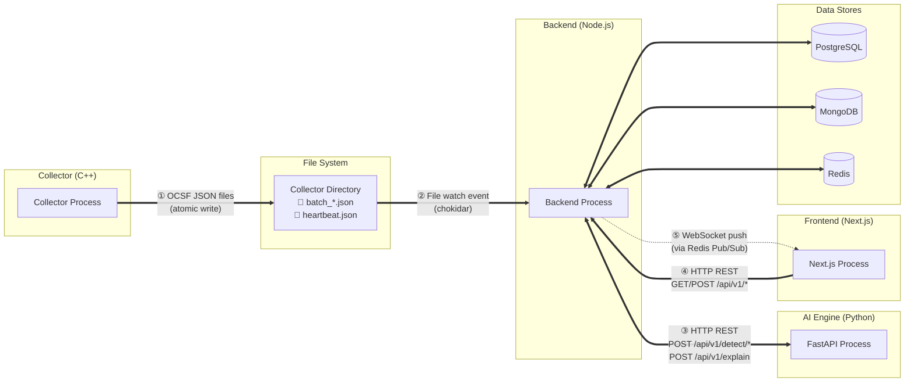

### 6.3 Intra-Backend Module Communication

Inside the backend monolith, modules communicate through **dependency injection** and **interfaces** — never through direct class instantiation or shared mutable state.

```mermaid
graph TD
    subgraph "Module Communication Contracts"

        ING["Ingestion Module"] -->|"IProcessingQueue.enqueue()"| IPQ{{"IProcessingQueue"}}
        IPQ -->|"BullMQQueue.dequeue()"| WRK["Workers"]

        WRK -->|"IParser.parse()"| PAR{{"IParser"}}
        PAR -->|"INormalizer.normalize()"| NOR{{"INormalizer"}}
        NOR -->|"IFeatureExtractor.extract()"| FEX{{"IFeatureExtractor"}}

        FEX -->|"IRuleEngine.evaluate()"| RUL{{"IRuleEngine"}}
        FEX -->|"IAIClient.detect()"| AIC{{"IAIClient"}}

        RUL -->|"IIncidentCorrelator.correlate()"| COR{{"IIncidentCorrelator"}}
        AIC -->|"IIncidentCorrelator.correlate()"| COR

        COR -->|"IRiskScorer.score()"| RSC{{"IRiskScorer"}}

        RSC -->|"IIncidentRepository.save()"| IREP{{"IIncidentRepository"}}
        RSC -->|"ILogRepository.saveBatch()"| ILREP{{"ILogRepository"}}

        CTR["REST Controllers"] -->|"IIncidentService.findAll()"| ISVC{{"IIncidentService"}}
        CTR -->|"IRuleService.create()"| IRSVC{{"IRuleService"}}
        CTR -->|"ICollectorStatus.getStatus()"| ICSVC{{"ICollectorStatusService"}}
    end

    style IPQ fill:#3498db,color:#fff
    style PAR fill:#3498db,color:#fff
    style NOR fill:#3498db,color:#fff
    style FEX fill:#3498db,color:#fff
    style RUL fill:#3498db,color:#fff
    style AIC fill:#3498db,color:#fff
    style COR fill:#3498db,color:#fff
    style RSC fill:#3498db,color:#fff
    style IREP fill:#3498db,color:#fff
    style ILREP fill:#3498db,color:#fff
    style ISVC fill:#3498db,color:#fff
    style IRSVC fill:#3498db,color:#fff
    style ICSVC fill:#3498db,color:#fff
```

> [!NOTE]
> Every diamond node (blue) in the diagram above is an **interface** defined in the domain layer. Concrete implementations live in the infrastructure layer and are injected at application startup. This is the **Dependency Inversion Principle** in action — the entire pipeline can be tested with mock implementations, and any component can be replaced without modifying its consumers.

### 6.4 API Contract Summary

#### Backend REST API (Express)

| Method | Endpoint | Module | Description |
|---|---|---|---|
| `POST` | `/api/v1/auth/login` | Auth | Authenticate user, return JWT |
| `POST` | `/api/v1/auth/logout` | Auth | Invalidate session |
| `GET` | `/api/v1/incidents` | Incidents | List incidents (paginated, filterable) |
| `GET` | `/api/v1/incidents/:id` | Incidents | Get incident detail with alerts and events |
| `PUT` | `/api/v1/incidents/:id` | Incidents | Update incident (status, assignee, notes) |
| `GET` | `/api/v1/events` | Dashboard | Search normalized events (paginated, filterable) |
| `GET` | `/api/v1/events/:id` | Dashboard | Get single OCSF event detail |
| `GET` | `/api/v1/rules` | Rules | List detection rules |
| `POST` | `/api/v1/rules` | Rules | Create new Sigma rule |
| `PUT` | `/api/v1/rules/:id` | Rules | Update rule |
| `DELETE` | `/api/v1/rules/:id` | Rules | Delete rule |
| `POST` | `/api/v1/rules/:id/test` | Rules | Dry-run rule against historical events |
| `GET` | `/api/v1/dashboard/summary` | Dashboard | Aggregated dashboard data |
| `GET` | `/api/v1/collector/status` | Collector Monitoring | Current collector health and metrics |
| `GET` | `/api/v1/users` | Auth | List users (Admin only) |
| `POST` | `/api/v1/users` | Auth | Create user (Admin only) |
| `PUT` | `/api/v1/users/:id` | Auth | Update user (Admin only) |
| `GET` | `/api/v1/audit` | Auth | Audit log (paginated, filterable) |
| `GET` | `/api/v1/health` | Shared | Health check |
| `WS` | `/ws` | Dashboard | WebSocket for real-time updates |

#### AI Engine REST API (FastAPI)

| Method | Endpoint | Description |
|---|---|---|
| `POST` | `/api/v1/detect/anomaly` | Isolation Forest anomaly detection |
| `POST` | `/api/v1/explain` | SHAP explanation for anomaly score |
| `POST` | `/api/v1/classify/threat` | Optional threat classification |
| `GET` | `/api/v1/health` | Health check |

---

> **This HLD is governed by [ADR-001](file:///d:/AI%20SIEM/docs/architecture/decisions/ADR-001-modular-monolith.md) and implements the requirements defined in [SRS-001](file:///d:/AI%20SIEM/docs/SRS.md).**
>
> **Document Version**: 1.0
> **Last Updated**: 2026-07-18
