# AI Engine Design

## AI-Powered Security Analytics Platform

| Field | Value |
|---|---|
| **Document ID** | AI-ENGINE-001 |
| **Version** | 1.0 |
| **Date** | 2026-07-18 |
| **Status** | Draft |
| **Language** | Python 3.11+ (FastAPI) |
| **Primary Model** | Isolation Forest (scikit-learn) |
| **Explainability** | SHAP (TreeExplainer) |
| **Architecture Reference** | [ADR-001](file:///d:/AI%20SIEM/docs/architecture/decisions/ADR-001-modular-monolith.md) |
| **Backend Integration** | [BACKEND-002](file:///d:/AI%20SIEM/docs/backend-detection.md) |

---

## Table of Contents

1. [Architecture](#1-architecture)
2. [Feature Engineering](#2-feature-engineering)
3. [Training](#3-training)
4. [Inference](#4-inference)
5. [Threshold Selection](#5-threshold-selection)
6. [Model Update Strategy](#6-model-update-strategy)
7. [Backend-AI Communication](#7-backend-ai-communication)

---

## 1. Architecture

### 1.1 AI Engine Position in the Platform

The AI Engine runs as a **standalone Python FastAPI process** (Process 3). It has no database access, no file system access to the collector directory, and no state beyond loaded models. It is a **stateless inference service** called by the backend via HTTP.

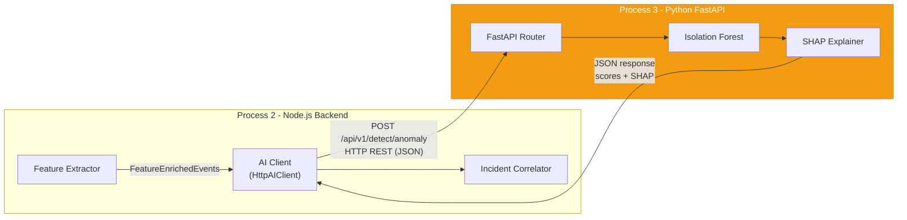

### 1.2 Internal Architecture

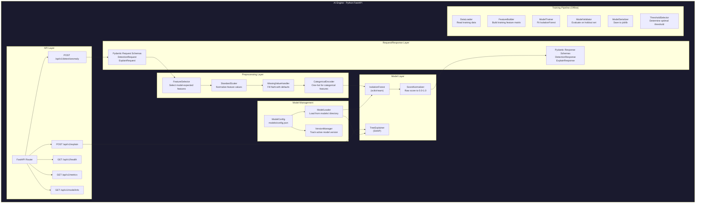

### 1.3 Class Diagram

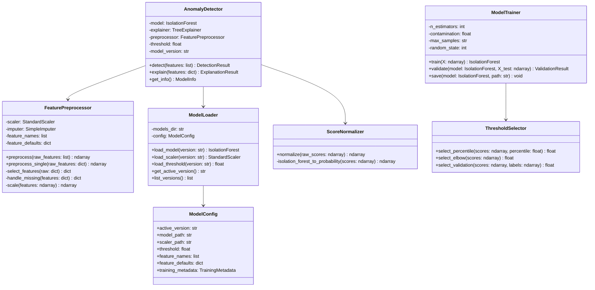

### 1.4 Design Principles

| Principle | Application |
|---|---|
| **Stateless inference** | The AI Engine holds no state beyond the loaded model. Every request is independent. This enables horizontal scaling in the future |
| **Graceful degradation** | If the AI Engine is down, the backend continues with rule-only detection. The AI Engine is additive, never required |
| **Separated training** | Training is an offline process (script or notebook). The inference service never trains during production requests |
| **Explainable results** | Every anomaly score is accompanied by SHAP feature importance values. Analysts see *why* an event was flagged |
| **Versioned models** | Models are versioned with metadata. Rollback to a previous model is a config file change |

---

## 2. Feature Engineering

### 2.1 Feature Pipeline

Features are extracted by the **backend** (Feature Extractor in BACKEND-001) and sent to the AI Engine as a pre-computed feature vector. The AI Engine does **not** compute features — it only receives, preprocesses, and scores them.

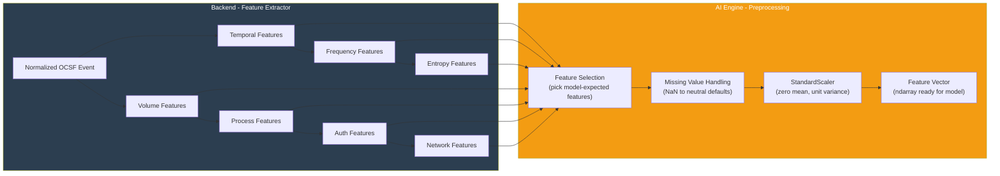

### 2.2 Feature Definitions

The Isolation Forest model is trained on a fixed set of numerical features. These are the features the AI Engine expects in every inference request.

| # | Feature Name | Source Plugin | Type | Range | Description |
|---|---|---|---|---|---|
| 1 | `hour_of_day` | Temporal | int | 0-23 | Hour when event occurred |
| 2 | `day_of_week` | Temporal | int | 0-6 | Day of week (0=Monday) |
| 3 | `is_business_hours` | Temporal | binary | 0/1 | 1 if 09:00-17:00 Mon-Fri |
| 4 | `time_since_last_event` | Temporal | float | 0+ | Seconds since previous event from same source |
| 5 | `time_deviation_score` | Temporal | float | -inf to +inf | Z-score vs historical mean |
| 6 | `events_per_minute_src_ip` | Frequency | float | 0+ | Events/min from this source IP |
| 7 | `events_per_hour_user` | Frequency | float | 0+ | Events/hour for this user |
| 8 | `unique_dst_ips_per_src` | Frequency | int | 0+ | Distinct destination IPs |
| 9 | `unique_users_per_src_ip` | Frequency | int | 0+ | Distinct users from source IP |
| 10 | `frequency_deviation` | Frequency | float | -inf to +inf | Rate vs 24hr rolling average |
| 11 | `src_ip_entropy` | Entropy | float | 0.0-8.0 | Shannon entropy of source IP distribution |
| 12 | `username_entropy` | Entropy | float | 0.0-8.0 | Entropy of username characters |
| 13 | `process_name_entropy` | Entropy | float | 0.0-8.0 | Entropy of process name |
| 14 | `bytes_sent` | Volume | float | 0+ | Bytes transmitted |
| 15 | `bytes_received` | Volume | float | 0+ | Bytes received |
| 16 | `bytes_ratio` | Volume | float | 0+ | sent/received ratio |
| 17 | `severity_id` | Core OCSF | int | 0-6 | Event severity |
| 18 | `failed_login_count_10min` | Auth | int | 0+ | Failed logins in last 10 min (0 if N/A) |
| 19 | `failed_to_success_ratio` | Auth | float | 0.0-1.0 | Failure ratio (0 if N/A) |
| 20 | `new_source_ip` | Auth | binary | 0/1 | Is source IP new for this user (0 if N/A) |

### 2.3 Feature Defaults (Missing Values)

Not all features apply to all event types. For example, authentication features do not apply to network events. Missing features are filled with **neutral defaults** that do not bias the model toward anomaly.

| Feature | Default Value | Rationale |
|---|---|---|
| `time_since_last_event` | `median` (from training set) | Median is typical |
| `time_deviation_score` | `0.0` | Zero deviation = typical |
| `events_per_minute_src_ip` | `0.0` | No events = no frequency signal |
| `events_per_hour_user` | `0.0` | No events = no frequency signal |
| `unique_dst_ips_per_src` | `1` | Single destination is normal |
| `unique_users_per_src_ip` | `1` | Single user is normal |
| `frequency_deviation` | `0.0` | No deviation |
| `src_ip_entropy` | `0.0` | Zero entropy = single source (normal) |
| `username_entropy` | `0.0` | Zero entropy = normal username |
| `process_name_entropy` | `0.0` | Zero entropy |
| `bytes_sent` | `0` | No transfer |
| `bytes_received` | `0` | No transfer |
| `bytes_ratio` | `1.0` | Balanced ratio |
| `failed_login_count_10min` | `0` | No failures |
| `failed_to_success_ratio` | `0.0` | All successes |
| `new_source_ip` | `0` | Known IP |

### 2.4 Feature Preprocessing Pipeline

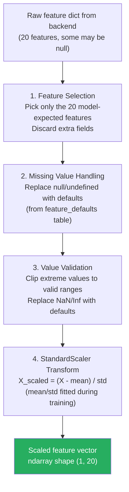

### 2.5 Feature Correlation Awareness

Certain features are intentionally correlated to capture complementary signals:

| Feature Group | Correlation | Why Both Are Kept |
|---|---|---|
| `events_per_minute_src_ip` + `frequency_deviation` | High | Rate captures absolute value; deviation captures relative change from baseline |
| `failed_login_count_10min` + `failed_to_success_ratio` | Medium | Count captures volume; ratio captures proportion |
| `bytes_sent` + `bytes_ratio` | Medium | Absolute volume vs directional balance |
| `hour_of_day` + `is_business_hours` | High | Hour is granular; business hours is a binary simplification. Isolation Forest handles correlated features well due to random subspace selection |

> [!NOTE]
> Isolation Forest is robust to feature correlation because it uses random feature subsets per tree. Feature selection here prioritizes **detection coverage** over statistical independence.

---

## 3. Training

### 3.1 Training Architecture

Training is an **offline process** — a Python script or Jupyter notebook executed outside of the production inference service. The trained model is serialized to disk and loaded by the inference service at startup.

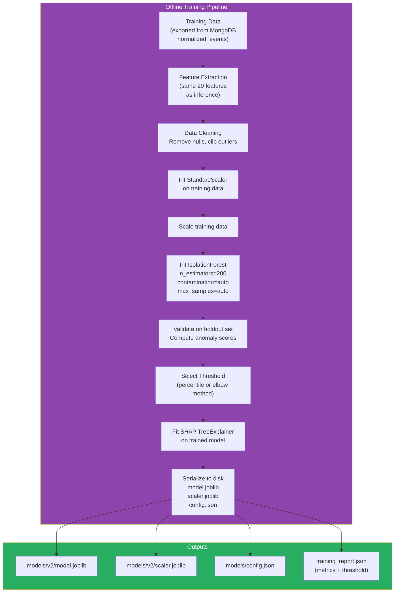

### 3.2 Training Data Requirements

| Requirement | Value | Rationale |
|---|---|---|
| **Minimum samples** | 10,000 events | Sufficient diversity for Isolation Forest to establish normal patterns |
| **Recommended samples** | 100,000 - 1,000,000 events | Better normal pattern coverage |
| **Time span** | At least 7 days of data | Captures daily/weekly patterns (business hours, weekends) |
| **Label requirement** | **None** (unsupervised) | Isolation Forest is unsupervised — it learns "normal" without labels |
| **Data composition** | Predominantly normal traffic (95%+) | Anomalies are by definition rare; the model learns the normal distribution |
| **Feature completeness** | All 20 features present (or filled with defaults) | Consistent feature vector shape |

### 3.3 Isolation Forest Hyperparameters

| Hyperparameter | Value | Rationale |
|---|---|---|
| `n_estimators` | 200 | Number of isolation trees. 200 provides stable anomaly scores without excessive memory. Scikit-learn default is 100 — 200 gives smoother scoring |
| `max_samples` | `"auto"` (min(256, n_samples)) | Subsampling size per tree. `auto` uses 256, which is the original paper's recommendation for efficient isolation |
| `contamination` | `"auto"` | Expected proportion of anomalies. `auto` uses the offset-based threshold from the original paper. Overridden by our custom threshold selection |
| `max_features` | `1.0` (all features) | Each tree considers all features when selecting splits. Random subspace is handled by `max_samples`, not `max_features` |
| `n_jobs` | `-1` | Use all CPU cores during training |
| `random_state` | `42` | Reproducible training runs |
| `bootstrap` | `False` | Original Isolation Forest uses sampling without replacement |

### 3.4 Training Script Pseudocode

```python
# scripts/train_model.py

import json
import joblib
import numpy as np
import pandas as pd
from sklearn.ensemble import IsolationForest
from sklearn.preprocessing import StandardScaler
from sklearn.model_selection import train_test_split
from datetime import datetime

# ============================================================
# 1. Load Training Data
# ============================================================
# Export from MongoDB: normalized_events collection
# Query: last 30 days, all event classes
data = pd.read_json("training_data/events_export.json", lines=True)

# ============================================================
# 2. Extract Features (same 20 features as inference)
# ============================================================
FEATURE_NAMES = [
    "hour_of_day", "day_of_week", "is_business_hours",
    "time_since_last_event", "time_deviation_score",
    "events_per_minute_src_ip", "events_per_hour_user",
    "unique_dst_ips_per_src", "unique_users_per_src_ip",
    "frequency_deviation",
    "src_ip_entropy", "username_entropy", "process_name_entropy",
    "bytes_sent", "bytes_received", "bytes_ratio",
    "severity_id",
    "failed_login_count_10min", "failed_to_success_ratio",
    "new_source_ip"
]

FEATURE_DEFAULTS = {
    "time_since_last_event": None,  # Will use median
    "time_deviation_score": 0.0,
    "events_per_minute_src_ip": 0.0,
    "events_per_hour_user": 0.0,
    "unique_dst_ips_per_src": 1,
    "unique_users_per_src_ip": 1,
    "frequency_deviation": 0.0,
    "src_ip_entropy": 0.0,
    "username_entropy": 0.0,
    "process_name_entropy": 0.0,
    "bytes_sent": 0,
    "bytes_received": 0,
    "bytes_ratio": 1.0,
    "failed_login_count_10min": 0,
    "failed_to_success_ratio": 0.0,
    "new_source_ip": 0
}

X = extract_features(data, FEATURE_NAMES)  # Returns DataFrame

# ============================================================
# 3. Clean Data
# ============================================================
# Fill missing values with defaults
for feature, default in FEATURE_DEFAULTS.items():
    if default is None:
        X[feature].fillna(X[feature].median(), inplace=True)
    else:
        X[feature].fillna(default, inplace=True)

# Replace infinities
X.replace([np.inf, -np.inf], 0.0, inplace=True)

# ============================================================
# 4. Split: Train / Holdout
# ============================================================
X_train, X_holdout = train_test_split(X, test_size=0.2, random_state=42)

# ============================================================
# 5. Fit Scaler on Training Data
# ============================================================
scaler = StandardScaler()
X_train_scaled = scaler.fit_transform(X_train)
X_holdout_scaled = scaler.transform(X_holdout)

# ============================================================
# 6. Train Isolation Forest
# ============================================================
model = IsolationForest(
    n_estimators=200,
    max_samples="auto",
    contamination="auto",
    max_features=1.0,
    n_jobs=-1,
    random_state=42,
    bootstrap=False
)
model.fit(X_train_scaled)

# ============================================================
# 7. Score Holdout Set
# ============================================================
raw_scores = model.decision_function(X_holdout_scaled)
# decision_function: negative = more anomalous, positive = more normal

# Normalize to 0.0 - 1.0 (higher = more anomalous)
normalized_scores = 1.0 - (raw_scores - raw_scores.min()) / (raw_scores.max() - raw_scores.min())

# ============================================================
# 8. Select Threshold
# ============================================================
threshold = select_threshold_percentile(normalized_scores, percentile=95)

# ============================================================
# 9. Serialize Model Artifacts
# ============================================================
version = datetime.now().strftime("v%Y%m%d_%H%M%S")
model_dir = f"models/{version}"

joblib.dump(model, f"{model_dir}/model.joblib")
joblib.dump(scaler, f"{model_dir}/scaler.joblib")

# Update config.json
config = {
    "active_version": version,
    "versions": {
        version: {
            "model_path": f"{version}/model.joblib",
            "scaler_path": f"{version}/scaler.joblib",
            "threshold": float(threshold),
            "feature_names": FEATURE_NAMES,
            "feature_defaults": FEATURE_DEFAULTS,
            "training_metadata": {
                "trained_at": datetime.utcnow().isoformat(),
                "training_samples": len(X_train),
                "holdout_samples": len(X_holdout),
                "n_estimators": 200,
                "contamination": "auto",
                "score_mean": float(normalized_scores.mean()),
                "score_std": float(normalized_scores.std()),
                "anomaly_count_at_threshold": int((normalized_scores >= threshold).sum()),
                "anomaly_rate_at_threshold": float((normalized_scores >= threshold).mean())
            }
        }
    }
}
with open("models/config.json", "w") as f:
    json.dump(config, f, indent=2)
```

### 3.5 Training Output: config.json

```json
{
  "active_version": "v20260718_120000",
  "versions": {
    "v20260718_120000": {
      "model_path": "v20260718_120000/model.joblib",
      "scaler_path": "v20260718_120000/scaler.joblib",
      "threshold": 0.65,
      "feature_names": [
        "hour_of_day", "day_of_week", "is_business_hours",
        "time_since_last_event", "time_deviation_score",
        "events_per_minute_src_ip", "events_per_hour_user",
        "unique_dst_ips_per_src", "unique_users_per_src_ip",
        "frequency_deviation",
        "src_ip_entropy", "username_entropy", "process_name_entropy",
        "bytes_sent", "bytes_received", "bytes_ratio",
        "severity_id",
        "failed_login_count_10min", "failed_to_success_ratio",
        "new_source_ip"
      ],
      "feature_defaults": {
        "time_deviation_score": 0.0,
        "events_per_minute_src_ip": 0.0,
        "frequency_deviation": 0.0,
        "bytes_ratio": 1.0,
        "failed_login_count_10min": 0,
        "new_source_ip": 0
      },
      "training_metadata": {
        "trained_at": "2026-07-18T12:00:00Z",
        "training_samples": 800000,
        "holdout_samples": 200000,
        "n_estimators": 200,
        "contamination": "auto",
        "score_mean": 0.32,
        "score_std": 0.18,
        "anomaly_count_at_threshold": 10000,
        "anomaly_rate_at_threshold": 0.05
      }
    },
    "v20260701_080000": {
      "model_path": "v20260701_080000/model.joblib",
      "scaler_path": "v20260701_080000/scaler.joblib",
      "threshold": 0.60,
      "feature_names": ["..."],
      "training_metadata": { "...": "..." }
    }
  }
}
```

### 3.6 Training Data Export Script

```python
# scripts/export_training_data.py
# Run against MongoDB to export normalized events for training

from pymongo import MongoClient
from datetime import datetime, timedelta
import json

client = MongoClient("mongodb://localhost:27017")
db = client["siem_events"]

# Export last 30 days of events with features
start_date = datetime.utcnow() - timedelta(days=30)

cursor = db.normalized_events.find(
    {
        "time": {"$gte": start_date},
        "features": {"$exists": True}
    },
    {
        "event_id": 1,
        "class_uid": 1,
        "severity_id": 1,
        "time": 1,
        "features": 1,
        "_id": 0
    }
).batch_size(10000)

with open("training_data/events_export.json", "w") as f:
    for doc in cursor:
        f.write(json.dumps(doc, default=str) + "\n")
```

---

## 4. Inference

### 4.1 Inference Flow

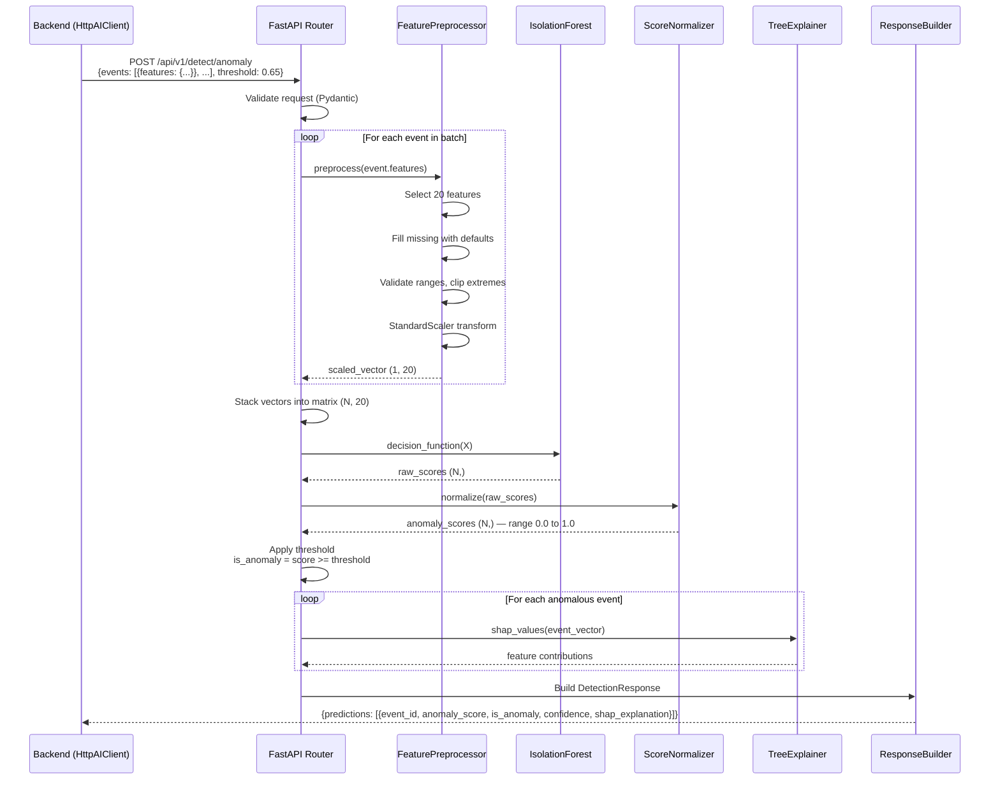

### 4.2 Score Normalization

Isolation Forest's `decision_function()` returns raw anomaly scores where:
- **Negative values** = more anomalous (further from normal)
- **Positive values** = more normal (closer to normal)
- **Zero** = boundary

The ScoreNormalizer converts these to a **0.0 to 1.0 range** where **higher = more anomalous**:

```python
def normalize(raw_scores: np.ndarray) -> np.ndarray:
    """
    Convert IsolationForest decision_function output to 0.0-1.0.
    Higher = more anomalous.
    """
    # Clip extreme values to training-observed range
    clipped = np.clip(raw_scores, self.train_min, self.train_max)

    # Min-max normalization, then invert
    normalized = (clipped - self.train_min) / (self.train_max - self.train_min)
    inverted = 1.0 - normalized  # Invert: negative raw → high anomaly score

    return np.clip(inverted, 0.0, 1.0)
```

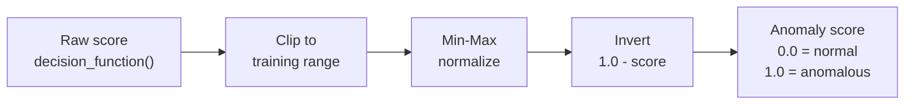

### 4.3 SHAP Explanation Generation

SHAP (SHapley Additive exPlanations) values explain **which features contributed most** to an event's anomaly score. Only computed for events that exceed the anomaly threshold — this is the most expensive step.

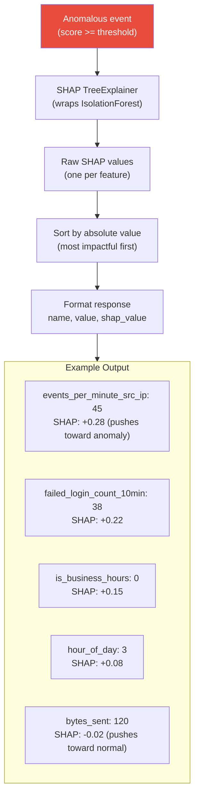

**SHAP value interpretation:**
- **Positive SHAP** = Feature pushes the prediction toward anomaly
- **Negative SHAP** = Feature pushes the prediction toward normal
- **Magnitude** = How much influence this feature had

### 4.4 API Request/Response Schemas

#### Detection Request

```json
{
  "events": [
    {
      "event_id": "evt-abc123",
      "features": {
        "hour_of_day": 3,
        "day_of_week": 5,
        "is_business_hours": 0,
        "time_since_last_event": 0.5,
        "time_deviation_score": 2.8,
        "events_per_minute_src_ip": 45,
        "events_per_hour_user": 120,
        "unique_dst_ips_per_src": 1,
        "unique_users_per_src_ip": 3,
        "frequency_deviation": 4.2,
        "src_ip_entropy": 0.0,
        "username_entropy": 1.58,
        "process_name_entropy": 0.0,
        "bytes_sent": 120,
        "bytes_received": 4500,
        "bytes_ratio": 0.027,
        "severity_id": 3,
        "failed_login_count_10min": 38,
        "failed_to_success_ratio": 0.97,
        "new_source_ip": 1
      }
    }
  ],
  "threshold": 0.65,
  "include_shap": true
}
```

#### Detection Response

```json
{
  "predictions": [
    {
      "event_id": "evt-abc123",
      "anomaly_score": 0.89,
      "is_anomaly": true,
      "confidence": 0.92,
      "shap_explanation": {
        "base_value": 0.32,
        "features": [
          { "name": "events_per_minute_src_ip", "value": 45.0, "shap_value": 0.28 },
          { "name": "failed_login_count_10min", "value": 38.0, "shap_value": 0.22 },
          { "name": "is_business_hours", "value": 0.0, "shap_value": 0.15 },
          { "name": "failed_to_success_ratio", "value": 0.97, "shap_value": 0.12 },
          { "name": "time_deviation_score", "value": 2.8, "shap_value": 0.08 },
          { "name": "new_source_ip", "value": 1.0, "shap_value": 0.06 }
        ]
      }
    }
  ],
  "model_version": "v20260718_120000",
  "processing_time_ms": 45,
  "events_processed": 1,
  "anomalies_detected": 1
}
```

### 4.5 Confidence Calculation

The `confidence` field indicates how certain the model is about its prediction:

```python
def compute_confidence(anomaly_score: float, threshold: float) -> float:
    """
    Confidence increases with distance from the threshold.
    At threshold: confidence = 0.5 (uncertain).
    Far above threshold: confidence approaches 1.0.
    Far below threshold: confidence approaches 1.0 (confident normal).
    """
    distance = abs(anomaly_score - threshold)
    # Sigmoid-like mapping: distance → confidence
    confidence = 1.0 / (1.0 + np.exp(-10 * distance))
    return round(confidence, 4)
```

| Anomaly Score | Threshold | Distance | Confidence | Interpretation |
|---|---|---|---|---|
| 0.89 | 0.65 | 0.24 | 0.92 | High confidence anomaly |
| 0.70 | 0.65 | 0.05 | 0.62 | Borderline anomaly |
| 0.65 | 0.65 | 0.00 | 0.50 | Maximum uncertainty |
| 0.40 | 0.65 | 0.25 | 0.92 | High confidence normal |
| 0.10 | 0.65 | 0.55 | 0.99 | Very confident normal |

---

## 5. Threshold Selection

### 5.1 Threshold Selection Methods

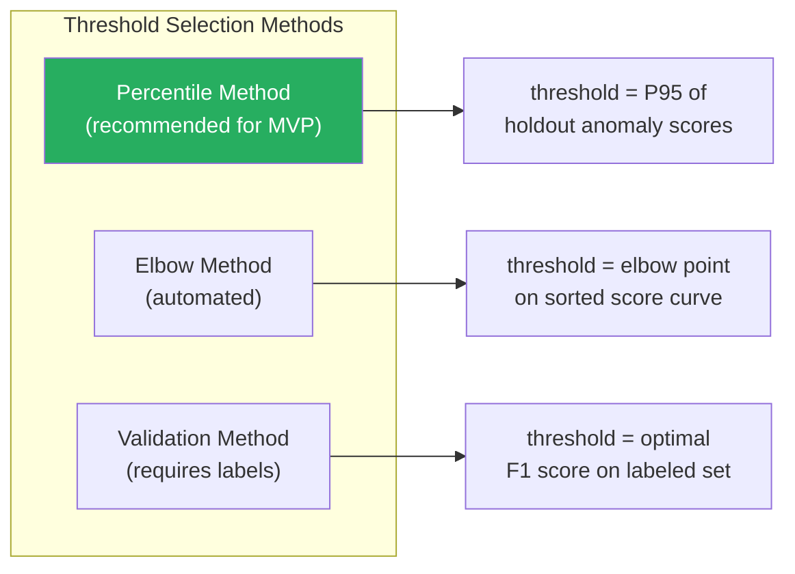

### 5.2 Percentile Method (Recommended)

The simplest and most practical approach for an unsupervised model:

1. Score the holdout set with the trained model
2. Normalize scores to 0.0-1.0
3. Set threshold at the **95th percentile** — the top 5% of scores are flagged as anomalous

```python
def select_threshold_percentile(scores: np.ndarray, percentile: float = 95) -> float:
    """
    Set threshold at the given percentile of the holdout anomaly scores.
    Default: 95th percentile = top 5% flagged as anomalies.
    """
    threshold = np.percentile(scores, percentile)
    return float(round(threshold, 4))
```

| Percentile | Expected Anomaly Rate | Use Case |
|---|---|---|
| 90th | ~10% | Aggressive — catches more but noisier |
| 95th | ~5% | **Balanced (recommended for MVP)** |
| 97th | ~3% | Conservative — fewer but higher quality |
| 99th | ~1% | Very conservative — only extreme anomalies |

### 5.3 Elbow Method

Finds the natural "elbow" in the sorted anomaly score distribution:

```python
def select_threshold_elbow(scores: np.ndarray) -> float:
    """
    Find the elbow point in the sorted anomaly score curve.
    The elbow is where the rate of change increases dramatically.
    """
    sorted_scores = np.sort(scores)[::-1]  # Descending
    n = len(sorted_scores)
    x = np.arange(n)

    # Line from first to last point
    line_start = np.array([0, sorted_scores[0]])
    line_end = np.array([n - 1, sorted_scores[-1]])

    # Distance from each point to the line
    distances = []
    for i in range(n):
        point = np.array([i, sorted_scores[i]])
        distance = np.abs(np.cross(line_end - line_start, line_start - point)) / np.linalg.norm(line_end - line_start)
        distances.append(distance)

    elbow_index = np.argmax(distances)
    return float(sorted_scores[elbow_index])
```

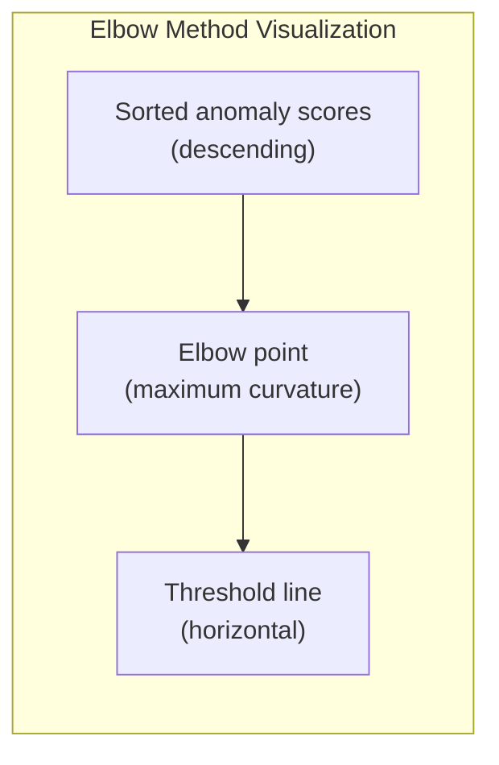

### 5.4 Validation Method (Post-MVP)

If labeled data becomes available (e.g., analyst-confirmed incidents), the threshold can be optimized for F1 score:

```python
def select_threshold_validation(
    scores: np.ndarray,
    labels: np.ndarray,  # 1 = anomaly, 0 = normal
    metric: str = "f1"
) -> float:
    """
    Find threshold that maximizes the chosen metric
    on a labeled validation set.
    """
    thresholds = np.arange(0.01, 1.0, 0.01)
    best_threshold = 0.5
    best_metric = 0.0

    for t in thresholds:
        predictions = (scores >= t).astype(int)
        if metric == "f1":
            score = f1_score(labels, predictions)
        elif metric == "precision":
            score = precision_score(labels, predictions)
        elif metric == "recall":
            score = recall_score(labels, predictions)

        if score > best_metric:
            best_metric = score
            best_threshold = t

    return float(best_threshold)
```

### 5.5 Threshold Tuning by Security Engineers

The threshold is configurable via:

1. **config.json** — set during training
2. **API parameter** — the backend sends `threshold` in each request (allows dynamic override)
3. **Dashboard setting** — Security Engineers can adjust via the settings page (persisted in PostgreSQL `configuration` table)

| Adjustment | Effect |
|---|---|
| Lower threshold (e.g., 0.50) | More events flagged as anomalous → higher recall, lower precision, more noise |
| Higher threshold (e.g., 0.80) | Fewer events flagged → higher precision, lower recall, quieter dashboard |

---

## 6. Model Update Strategy

### 6.1 Update Lifecycle

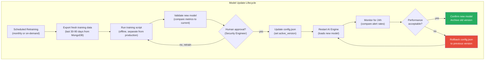

### 6.2 Retraining Schedule

| Trigger | Frequency | Rationale |
|---|---|---|
| **Scheduled** | Monthly | Capture evolving "normal" as the environment changes |
| **Drift detected** | On-demand | When anomaly rates suddenly increase/decrease without real threats |
| **Major infrastructure change** | On-demand | New servers, network changes, new applications alter normal patterns |
| **Analyst feedback** | On-demand | When analysts report excessive false positives or missed detections |

### 6.3 Model Validation Criteria

Before deploying a new model, it must pass these checks against the current production model:

| Metric | Comparison | Acceptable Range |
|---|---|---|
| **Anomaly rate on holdout** | New vs current | Within 2x of current rate |
| **Score distribution** | Mean/std of new vs current | Mean within +/- 0.1 of current |
| **SHAP consistency** | Top-5 important features | At least 3 of 5 must overlap |
| **Inference latency** | P99 latency | Must be within 2x of current |
| **Training data overlap** | New training set vs old | At least 50% shared time range |

### 6.4 Version Rollback

Rollback is a **config file change** — no retraining needed:

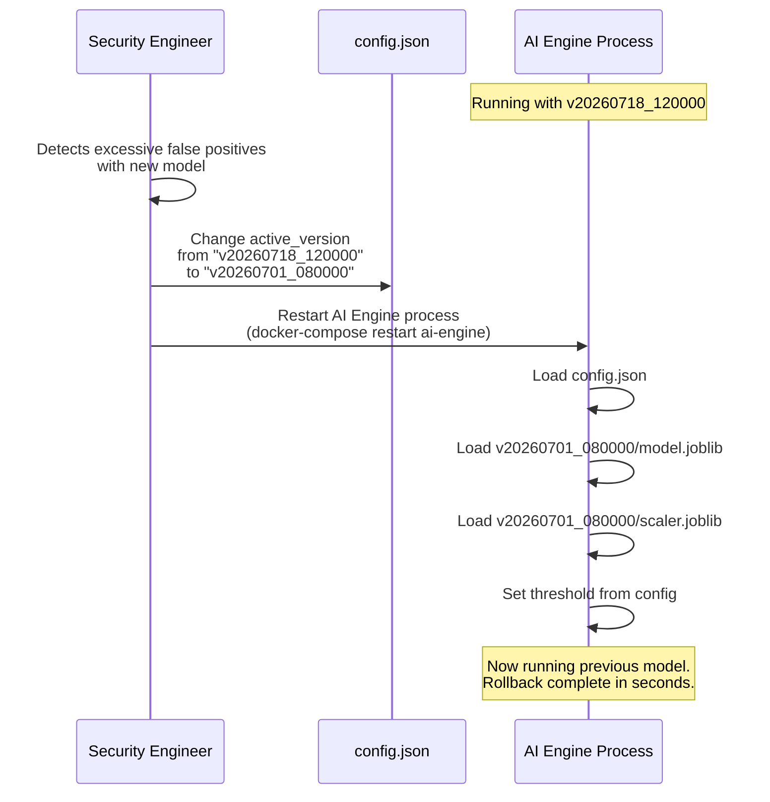

### 6.5 Model Directory Structure

```
ai-engine/
├── models/
│   ├── config.json                    # Active version pointer
│   ├── v20260718_120000/
│   │   ├── model.joblib               # Isolation Forest model
│   │   ├── scaler.joblib              # StandardScaler (fitted)
│   │   └── training_report.json       # Training metrics
│   ├── v20260701_080000/
│   │   ├── model.joblib
│   │   ├── scaler.joblib
│   │   └── training_report.json
│   └── v20260615_090000/
│       ├── model.joblib
│       ├── scaler.joblib
│       └── training_report.json
├── scripts/
│   ├── train_model.py                 # Training script
│   ├── export_training_data.py        # MongoDB export
│   ├── evaluate_model.py              # Compare models
│   └── threshold_analysis.py          # Threshold exploration
├── training_data/                     # Exported data (gitignored)
│   └── events_export.json
├── app/
│   ├── main.py                        # FastAPI entry point
│   ├── routes/
│   │   ├── detection.py               # /detect/anomaly endpoint
│   │   ├── explain.py                 # /explain endpoint
│   │   └── health.py                  # /health, /metrics, /model/info
│   ├── core/
│   │   ├── detector.py                # AnomalyDetector class
│   │   ├── preprocessor.py            # FeaturePreprocessor
│   │   ├── score_normalizer.py        # ScoreNormalizer
│   │   └── model_loader.py            # ModelLoader
│   ├── schemas/
│   │   ├── detection.py               # Pydantic request/response
│   │   └── health.py                  # Health schemas
│   └── config.py                      # Application settings
├── tests/
│   ├── test_detector.py
│   ├── test_preprocessor.py
│   ├── test_score_normalizer.py
│   └── test_routes.py
├── requirements.txt
├── Dockerfile
└── README.md
```

### 6.6 Model Retention Policy

| Version Age | Action |
|---|---|
| Current active | Always retained |
| Previous version (N-1) | Always retained (rollback target) |
| N-2 and older | Retained for 90 days, then archived |
| Archived | Moved to cold storage. Can be restored manually |

---

## 7. Backend-AI Communication

### 7.1 Communication Architecture

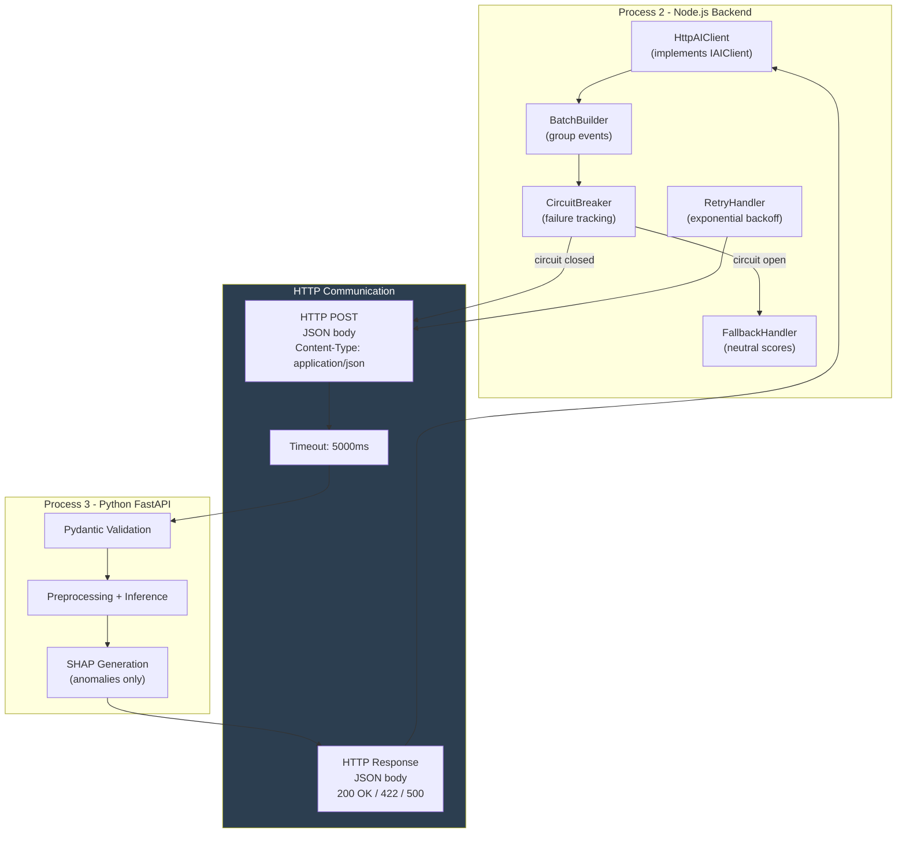

### 7.2 Communication Protocol

| Property | Value |
|---|---|
| **Protocol** | HTTP/1.1 REST |
| **Content type** | `application/json` |
| **Base URL** | `http://ai-engine:8000` (Docker internal network) |
| **Authentication** | None (internal network only, not exposed externally) |
| **Timeout** | 5000ms (configurable) |
| **Max body size** | 10MB |
| **Connection pooling** | HTTP Keep-Alive (axios defaults) |

### 7.3 Complete Request-Response Lifecycle

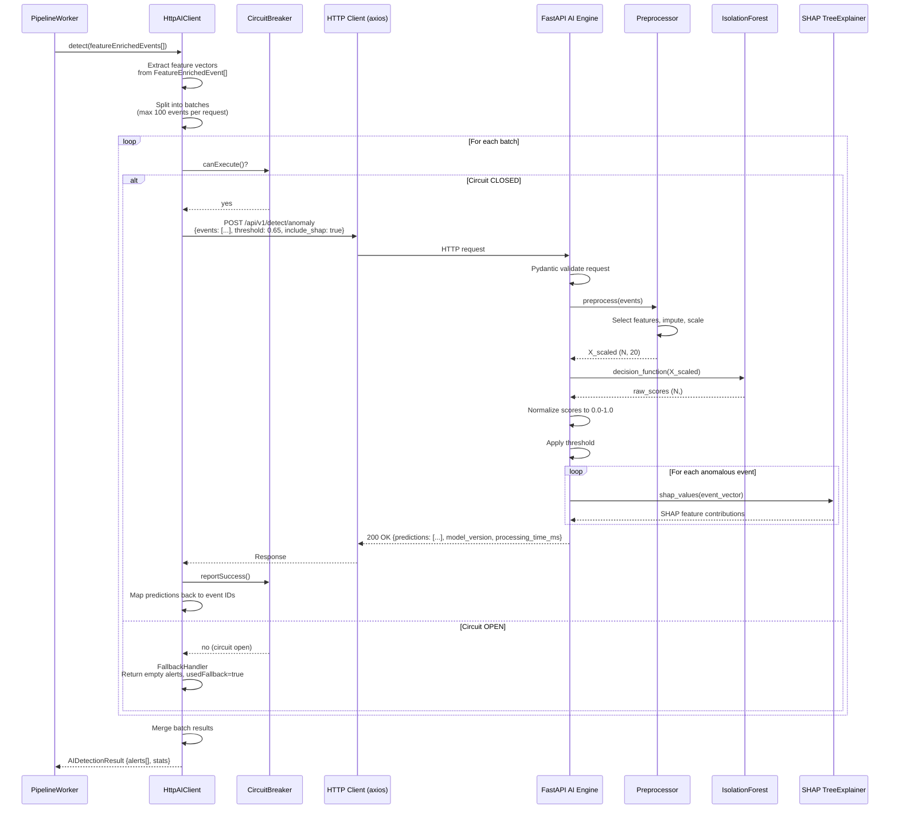

### 7.4 Error Handling Matrix

| Error | HTTP Status | Backend Action | AI Engine Action |
|---|---|---|---|
| **Request timeout** | N/A (timeout) | Circuit breaker records failure. Fallback: rule-only | N/A |
| **Connection refused** | N/A (ECONNREFUSED) | Circuit breaker records failure. Fallback: rule-only | AI Engine is down |
| **Invalid request body** | `422 Unprocessable Entity` | Log error, skip AI for this batch | Return Pydantic validation errors |
| **Model not loaded** | `503 Service Unavailable` | Circuit breaker records failure. Retry after delay | Return error: model loading |
| **Internal server error** | `500 Internal Server Error` | Circuit breaker records failure. Fallback: rule-only | Log exception, return error |
| **Partial SHAP failure** | `200 OK` (partial) | Accept results without SHAP for failed events | Return predictions with `shap_explanation: null` for failed events |
| **Request too large** | `413 Payload Too Large` | Split batch into smaller chunks, retry | Reject request |

### 7.5 Circuit Breaker Detail

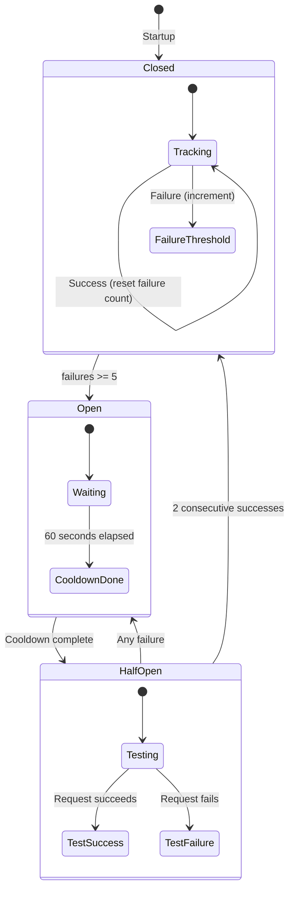

| Parameter | Value | Description |
|---|---|---|
| `failure_threshold` | 5 | Consecutive failures to open circuit |
| `cooldown_ms` | 60,000 (60s) | Time before half-open |
| `success_threshold` | 2 | Consecutive successes to close circuit |
| `timeout_ms` | 5,000 (5s) | HTTP request timeout |

### 7.6 Batch Optimization

Events are grouped into batches to minimize HTTP round-trips:

```mermaid
flowchart TD
    ALL["1000 FeatureEnrichedEvents<br/>(from a single worker job)"]
    SPLIT["Split into batches of 100"]
    B1["Batch 1: events 1-100"]
    B2["Batch 2: events 101-200"]
    BN["Batch 10: events 901-1000"]
    HTTP1["HTTP POST (batch 1)"]
    HTTP2["HTTP POST (batch 2)"]
    HTTPN["HTTP POST (batch 10)"]
    MERGE["Merge all responses"]

    ALL --> SPLIT
    SPLIT --> B1 --> HTTP1
    SPLIT --> B2 --> HTTP2
    SPLIT --> BN --> HTTPN
    HTTP1 --> MERGE
    HTTP2 --> MERGE
    HTTPN --> MERGE

    style ALL fill:#3498db,color:#fff
    style MERGE fill:#27ae60,color:#fff
```

| Setting | Default | Description |
|---|---|---|
| `ai.batch_size` | 100 | Max events per HTTP request |
| `ai.concurrent_requests` | 2 | Max parallel HTTP requests to AI Engine |
| `ai.max_queue_per_worker` | 1000 | Max events queued for AI per worker job |

### 7.7 AI Engine Endpoints Summary

| Method | Endpoint | Purpose | Timeout |
|---|---|---|---|
| `POST` | `/api/v1/detect/anomaly` | Batch anomaly detection + SHAP | 5s |
| `POST` | `/api/v1/explain` | SHAP explanation for a single event | 3s |
| `GET` | `/api/v1/health` | Health check (model loaded? inference working?) | 1s |
| `GET` | `/api/v1/metrics` | Inference metrics (latency, throughput, error rate) | 1s |
| `GET` | `/api/v1/model/info` | Active model version, training metadata, threshold | 1s |

### 7.8 Health Check Response

```json
{
  "status": "healthy",
  "model_loaded": true,
  "model_version": "v20260718_120000",
  "uptime_seconds": 86423,
  "total_predictions": 1250000,
  "avg_latency_ms": 35,
  "p99_latency_ms": 120,
  "errors_total": 12
}
```

The backend's AI Client calls `/api/v1/health` periodically (every 30s) to monitor the AI Engine. The result is surfaced in the Collector Monitoring dashboard.

### 7.9 Network Deployment

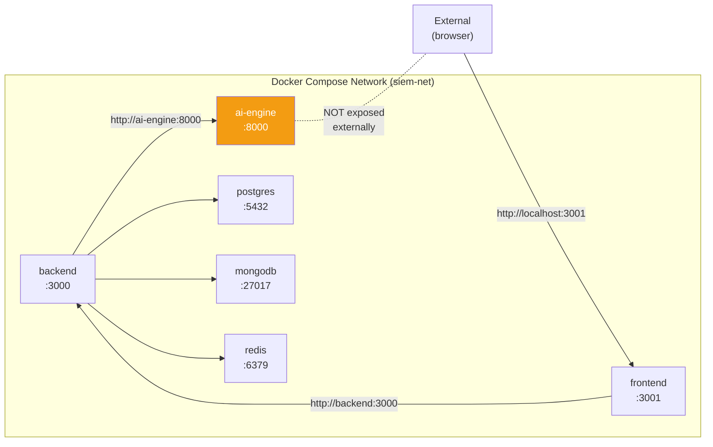

> [!IMPORTANT]
> The AI Engine is **never exposed to external traffic**. It listens only on the Docker internal network (`siem-net`). All requests come from the backend via `http://ai-engine:8000`. There is no authentication on this internal API because the network boundary provides isolation.

---

> **This document is governed by [ADR-001](file:///d:/AI%20SIEM/docs/architecture/decisions/ADR-001-modular-monolith.md). The AI Engine is Process 3 in the platform architecture. It is a stateless inference service using Isolation Forest (scikit-learn) with SHAP explainability, called by the backend's AI Client (see [BACKEND-002](file:///d:/AI%20SIEM/docs/backend-detection.md)) via HTTP REST. Training is offline; inference is real-time.**
>
> **Document Version**: 1.0
> **Last Updated**: 2026-07-18
