# Backend Design — Detection & Response Pipeline

## AI-Powered Security Analytics Platform

| Field | Value |
|---|---|
| **Document ID** | BACKEND-002 |
| **Version** | 1.0 |
| **Date** | 2026-07-18 |
| **Status** | Draft |
| **Language** | Node.js + Express + TypeScript |
| **Architecture Reference** | [ADR-001](file:///d:/AI%20SIEM/docs/architecture/decisions/ADR-001-modular-monolith.md) |
| **HLD Reference** | [HLD-001](file:///d:/AI%20SIEM/docs/HLD.md) |
| **Pipeline Part 1** | [BACKEND-001 - Ingestion & Processing](file:///d:/AI%20SIEM/docs/backend.md) |

---

## Table of Contents

1. [Overview](#1-overview)
2. [Rule Engine](#2-rule-engine)
3. [AI Client](#3-ai-client)
4. [Incident Correlation](#4-incident-correlation)
5. [Risk Scoring](#5-risk-scoring)
6. [Detection Output & Storage](#6-detection-output--storage)

---

## 1. Overview

### 1.1 Pipeline Position

This document covers the **detection and response pipeline** — the second half of the worker pipeline. It receives feature-enriched events from BACKEND-001 and produces scored incidents stored in the database.

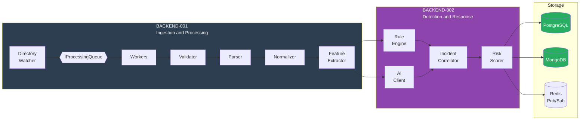

### 1.2 Component Diagram

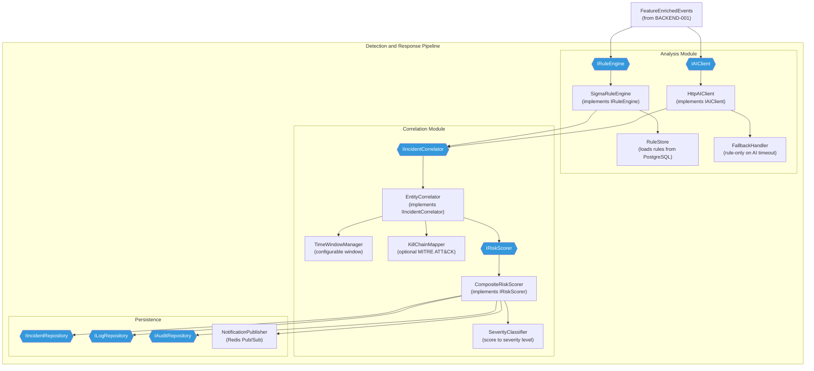

---

## 2. Rule Engine

### 2.1 Component Diagram

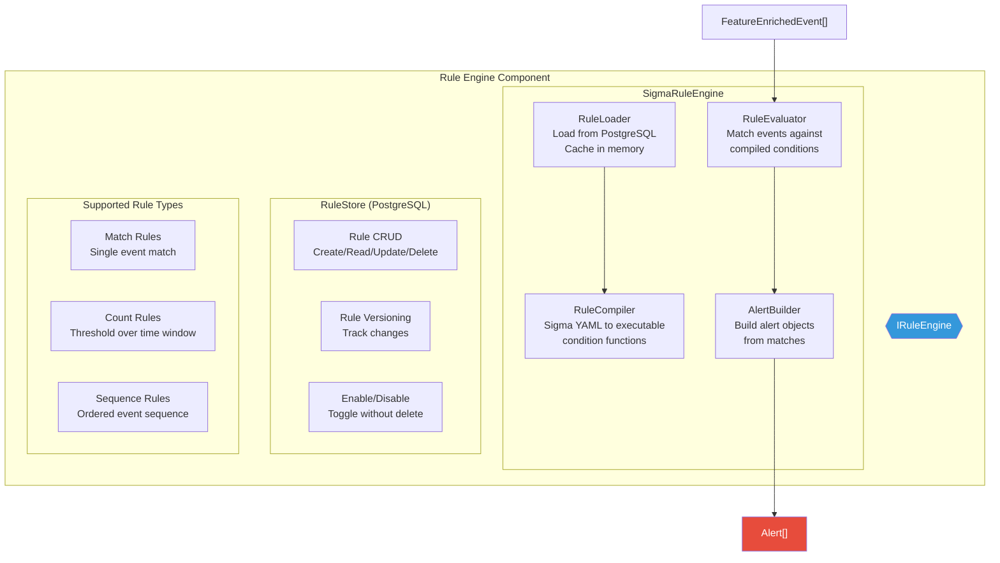

### 2.2 IRuleEngine Interface

```typescript
// Domain Layer - modules/analysis/domain/IRuleEngine.ts

interface IRuleEngine {
  /**
   * Evaluate a batch of events against all active rules.
   * Returns alerts for all matching rules.
   */
  evaluate(events: FeatureEnrichedEvent[]): Promise<RuleEvaluationResult>;

  /**
   * Reload rules from the store (called on rule CRUD).
   */
  reloadRules(): Promise<void>;

  /**
   * Get engine stats.
   */
  getStats(): RuleEngineStats;
}

interface RuleEvaluationResult {
  alerts: RuleAlert[];
  stats: EvaluationStats;
}

interface RuleAlert {
  alertId: string;            // UUID v4
  ruleId: string;             // ID of the matched rule
  ruleName: string;           // Human-readable rule name
  ruleDescription: string;
  severity: RuleSeverity;     // Rule-defined severity
  weight: number;             // Rule weight for risk scoring (0.0 - 1.0)
  matchedEvents: string[];    // IDs of events that triggered this rule
  matchedCondition: string;   // Which condition matched
  tags: string[];             // MITRE ATT&CK tags, custom tags
  timestamp: Date;            // When the alert was generated
  metadata: Record<string, any>; // Additional rule-specific data
}

type RuleSeverity = "critical" | "high" | "medium" | "low" | "informational";

interface EvaluationStats {
  rulesEvaluated: number;
  rulesMatched: number;
  alertsGenerated: number;
  evaluationDuration_ms: number;
  eventsEvaluated: number;
}

interface RuleEngineStats {
  totalRules: number;
  activeRules: number;
  disabledRules: number;
  lastReloadAt: Date;
  rulesByType: Record<string, number>;
}
```

### 2.3 Sigma Rule Structure

Rules are stored in PostgreSQL as YAML and compiled into executable conditions at load time.

```yaml
# Example: Brute Force Detection Rule
title: SSH Brute Force Attempt
id: rule-bf-ssh-001
description: >
  Detects multiple failed SSH login attempts from the same
  source IP within a short time window.
status: active
level: high
weight: 0.8

# OCSF class filter
logsource:
  class_uid: 3002        # Authentication
  category_uid: 3         # Identity & Access Management

# Detection condition
detection:
  selection:
    message|contains: "Failed password"
    severityId: 3

  condition:
    type: count
    field: srcEndpoint.ip
    threshold: 10
    timewindow: 5m

# Metadata
tags:
  - attack.credential_access
  - attack.t1110
  - mitre.brute_force

falsepositives:
  - Legitimate password reset attempts
  - Automated testing
```

### 2.4 Rule Types

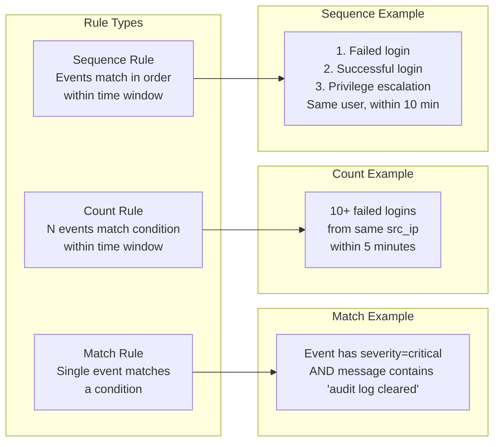

| Type | Condition | State Required | MVP Status |
|---|---|---|---|
| **Match** | Single event matches field conditions | Stateless | ✅ MVP |
| **Count** | N events match condition within time window | Redis counter (rolling window) | ✅ MVP |
| **Sequence** | Ordered events within time window | Redis sorted set (event sequence tracking) | ⏳ Post-MVP |

### 2.5 Rule Compilation

On startup and after any rule CRUD operation, the Rule Engine compiles Sigma YAML into executable JavaScript condition functions:

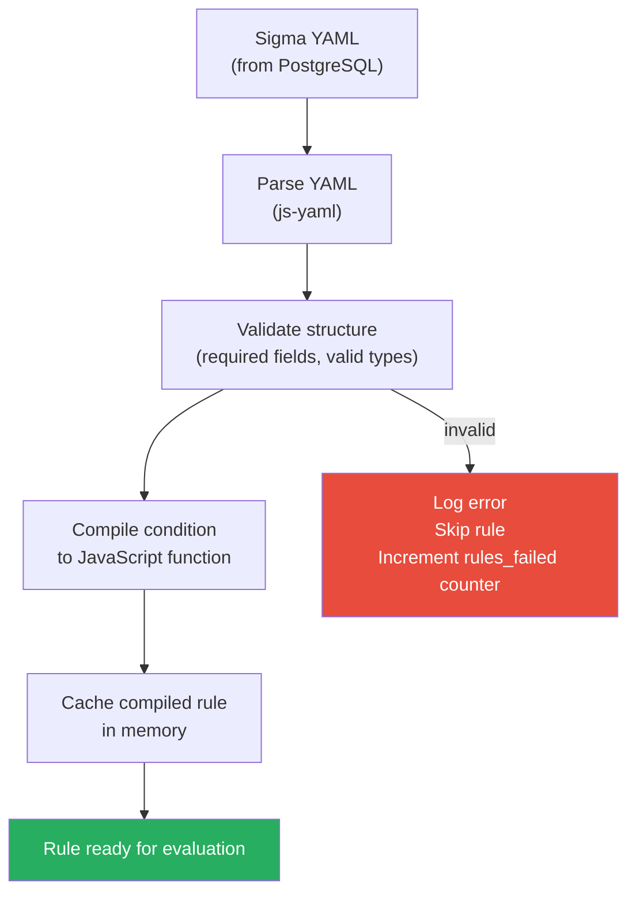

### 2.6 Rule Evaluation Flow

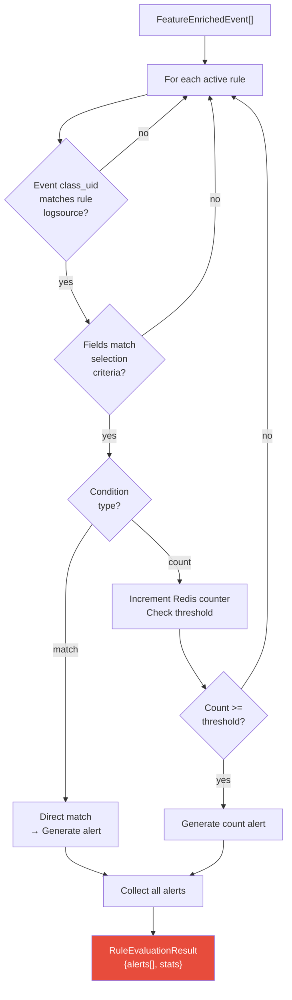

### 2.7 Rule Management API (Exposed via REST)

| Operation | Handler | Description |
|---|---|---|
| `GET /api/v1/rules` | `RuleController.list()` | List all rules (paginated, filterable by status/severity/tag) |
| `GET /api/v1/rules/:id` | `RuleController.getById()` | Get single rule with YAML content |
| `POST /api/v1/rules` | `RuleController.create()` | Create new rule from YAML; compile and validate |
| `PUT /api/v1/rules/:id` | `RuleController.update()` | Update rule YAML; recompile |
| `DELETE /api/v1/rules/:id` | `RuleController.delete()` | Soft-delete rule (archived, not destroyed) |
| `PUT /api/v1/rules/:id/enable` | `RuleController.enable()` | Activate rule in engine |
| `PUT /api/v1/rules/:id/disable` | `RuleController.disable()` | Deactivate without deleting |
| `POST /api/v1/rules/:id/test` | `RuleController.test()` | Dry-run against historical events |
| `POST /api/v1/rules/import` | `RuleController.import()` | Bulk import YAML rules |
| `GET /api/v1/rules/export` | `RuleController.export()` | Export all rules as YAML archive |

### 2.8 Preloaded Rule Set (MVP)

The MVP ships with 10+ built-in Sigma rules:

| Rule | Class | Type | Detects |
|---|---|---|---|
| SSH Brute Force | Authentication | Count | 10+ failed SSH logins from same IP in 5 min |
| RDP Brute Force | Authentication | Count | 10+ failed RDP logins from same IP in 5 min |
| Successful Login After Failures | Authentication | Sequence | Failed logins followed by success (same user) |
| New Service Installed | System Activity | Match | Windows Event 7045 — new service installation |
| Audit Log Cleared | System Activity | Match | Windows Event 1102 or `/var/log` cleared |
| Privilege Escalation | Authorization | Match | Special privileges assigned (Event 4672) |
| Suspicious Process Execution | Process Activity | Match | Known malicious process names (mimikatz, nc, etc.) |
| Unusual Login Time | Authentication | Match | Login outside business hours + high time_deviation_score |
| High Data Transfer | Network Activity | Match | bytes_sent > threshold from internal to external |
| Multiple Account Lockouts | Authentication | Count | 5+ lockout events in 10 min |

---

## 3. AI Client

### 3.1 Component Diagram

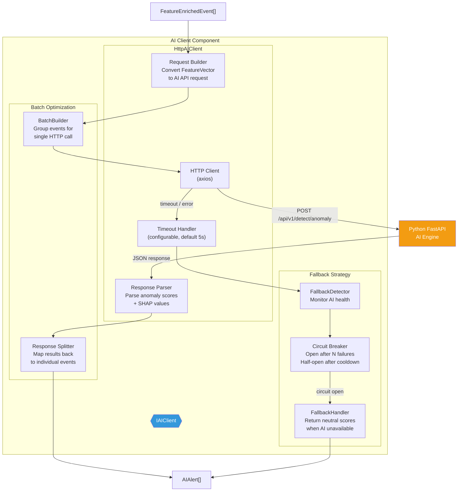

### 3.2 IAIClient Interface

```typescript
// Domain Layer - modules/analysis/domain/IAIClient.ts

interface IAIClient {
  /**
   * Send events to AI Engine for anomaly detection.
   * Returns AI-generated alerts with anomaly scores and SHAP explanations.
   */
  detect(events: FeatureEnrichedEvent[]): Promise<AIDetectionResult>;

  /**
   * Request SHAP explanation for a specific event.
   */
  explain(event: FeatureEnrichedEvent): Promise<AIExplanation>;

  /**
   * Check AI Engine health.
   */
  healthCheck(): Promise<AIHealthStatus>;

  /**
   * Get client stats (latency, errors, circuit state).
   */
  getStats(): AIClientStats;
}

interface AIDetectionResult {
  alerts: AIAlert[];
  stats: AIDetectionStats;
}

interface AIAlert {
  alertId: string;
  eventId: string;             // ID of the event that triggered this alert
  anomalyScore: number;        // 0.0 (normal) to 1.0 (highly anomalous)
  isAnomaly: boolean;          // anomalyScore > threshold
  confidence: number;          // Model confidence (0.0 - 1.0)
  threatCategory: string | null; // Optional classification result
  shapValues: SHAPExplanation | null;
  modelVersion: string;
  timestamp: Date;
}

interface SHAPExplanation {
  baseValue: number;           // Expected model output
  features: SHAPFeature[];     // Feature contributions, sorted by abs(value)
}

interface SHAPFeature {
  name: string;                // Feature name (e.g., "frequency.events_per_minute_src_ip")
  value: number;               // Actual feature value
  shapValue: number;           // SHAP contribution (positive = pushes toward anomaly)
}

interface AIDetectionStats {
  eventsSubmitted: number;
  anomaliesDetected: number;
  requestDuration_ms: number;
  usedFallback: boolean;
}

interface AIClientStats {
  totalRequests: number;
  successfulRequests: number;
  failedRequests: number;
  fallbacksUsed: number;
  avgLatency_ms: number;
  circuitState: "closed" | "open" | "half-open";
  lastHealthCheck: Date | null;
}
```

### 3.3 Request/Response Flow

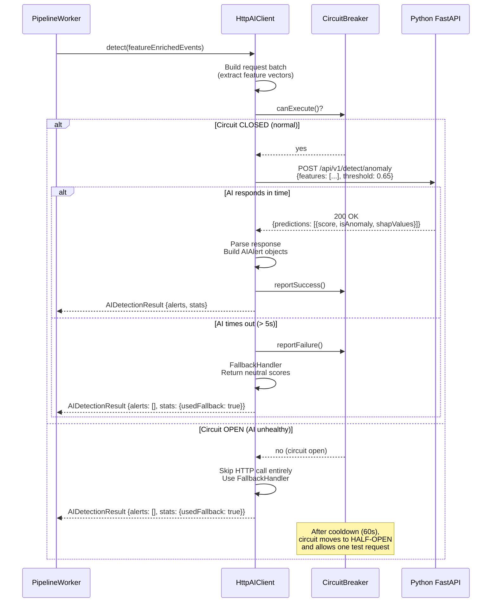

### 3.4 Circuit Breaker Configuration

| Setting | Default | Description |
|---|---|---|
| `ai.timeout_ms` | `5000` | HTTP request timeout |
| `ai.circuit_failure_threshold` | `5` | Consecutive failures to open circuit |
| `ai.circuit_cooldown_ms` | `60000` | Time before half-open test |
| `ai.circuit_success_threshold` | `2` | Consecutive successes in half-open to close circuit |
| `ai.anomaly_threshold` | `0.65` | Score above which an event is classified as anomalous |
| `ai.batch_size` | `100` | Max events per HTTP request |
| `ai.base_url` | `http://ai-engine:8000` | AI Engine base URL |

### 3.5 Circuit Breaker State Machine

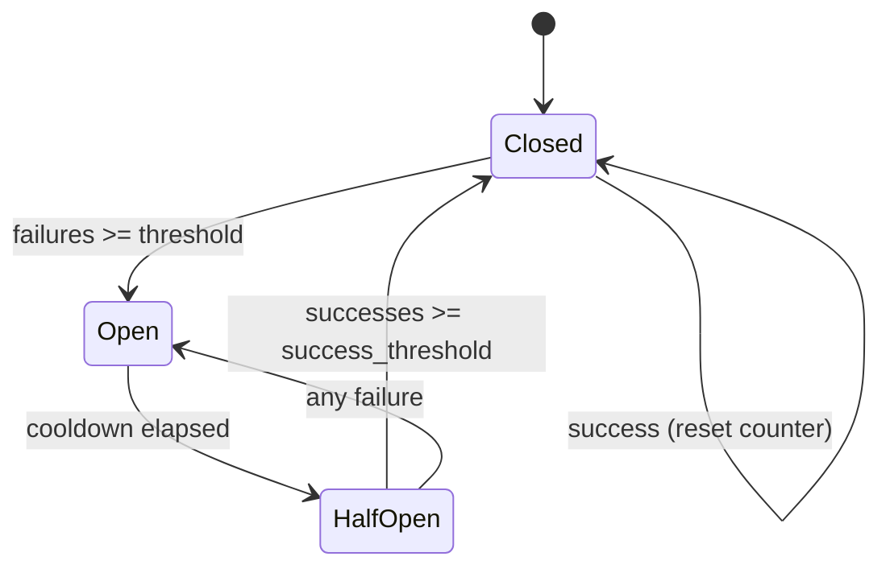

### 3.6 Fallback Behavior

When the AI Engine is unavailable (timeout, error, circuit open), the AI Client returns a **neutral result**:

| Field | Fallback Value | Rationale |
|---|---|---|
| `alerts` | `[]` (empty) | No AI alerts generated |
| `anomalyScore` | Not computed | Events not scored by ML |
| `usedFallback` | `true` | Flagged for transparency |
| Pipeline continues? | **Yes** | Rule Engine alerts still processed |

> [!IMPORTANT]
> **The AI Engine is additive, not required.** When it is unavailable, the pipeline continues with rule-only detection. No events are lost. The dashboard displays a warning: "AI Engine offline — rule-only detection active."

---

## 4. Incident Correlation

### 4.1 Component Diagram

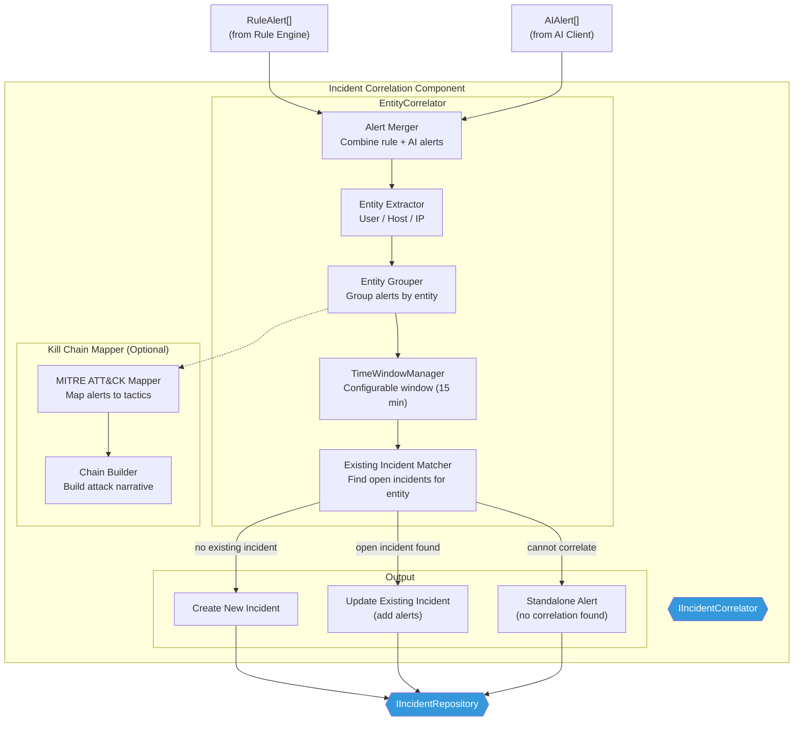

### 4.2 IIncidentCorrelator Interface

```typescript
// Domain Layer - modules/correlation/domain/IIncidentCorrelator.ts

interface IIncidentCorrelator {
  /**
   * Correlate rule alerts and AI alerts into incidents.
   * May create new incidents, update existing ones, or store standalone alerts.
   */
  correlate(
    ruleAlerts: RuleAlert[],
    aiAlerts: AIAlert[],
    events: FeatureEnrichedEvent[]
  ): Promise<CorrelationResult>;

  /**
   * Get correlator stats.
   */
  getStats(): CorrelatorStats;
}

interface CorrelationResult {
  newIncidents: Incident[];
  updatedIncidents: IncidentUpdate[];
  standaloneAlerts: Alert[];
  stats: CorrelationStats;
}

interface CorrelationStats {
  alertsReceived: number;
  incidentsCreated: number;
  incidentsUpdated: number;
  standaloneAlerts: number;
  correlationDuration_ms: number;
  entitiesExtracted: number;
}
```

### 4.3 Correlation Algorithm

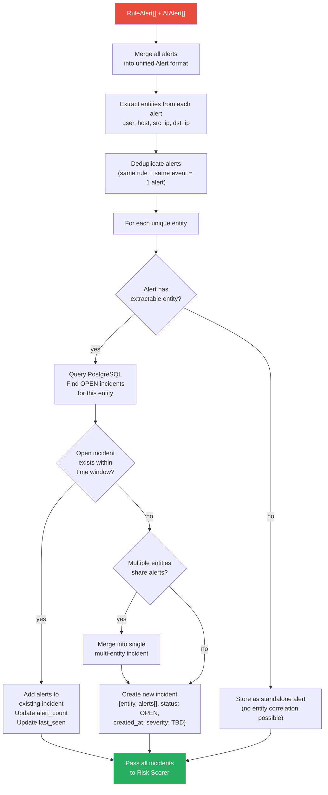

### 4.4 Entity Extraction Rules

| Alert Field | Extracted Entity | Entity Type |
|---|---|---|
| `matchedEvents[].srcEndpoint.ip` | `192.168.1.100` | `src_ip` |
| `matchedEvents[].dstEndpoint.ip` | `10.0.0.5` | `dst_ip` |
| `matchedEvents[].actor.user.name` | `root` | `user` |
| `matchedEvents[].device.hostname` | `web-server-01` | `host` |
| `matchedEvents[].srcEndpoint.hostname` | `attacker-host` | `src_host` |

### 4.5 Correlation Rules

| Rule | Description | Example |
|---|---|---|
| **Same entity, within time window** | Alerts sharing an entity within the configured window are correlated | Failed login + successful login from `root` within 15 min |
| **Same source IP across entities** | Alerts from the same source IP targeting different users/hosts | Brute force from `192.168.1.100` against 5 different accounts |
| **Kill chain progression** | Alerts that map to consecutive MITRE ATT&CK tactics | Credential Access → Initial Access → Privilege Escalation |
| **AI + Rule agreement** | Both engines flag the same event | Rule matches brute force AND AI flags anomalous frequency |

### 4.6 Correlation Configuration

| Setting | Default | Description |
|---|---|---|
| `correlation.time_window_minutes` | `15` | Max time between alerts to be correlated |
| `correlation.max_alerts_per_incident` | `500` | Cap alerts per incident (prevent unbounded growth) |
| `correlation.entity_types` | `["user", "src_ip", "dst_ip", "host"]` | Which entity types to correlate on |
| `correlation.merge_cross_entity` | `true` | Merge incidents that share alerts across entities |
| `correlation.kill_chain_enabled` | `false` | Enable MITRE ATT&CK kill chain mapping (post-MVP) |

### 4.7 Incident Data Model

```typescript
// Domain Layer - modules/incidents/domain/Incident.ts

interface Incident {
  id: string;                   // UUID v4
  title: string;                // Auto-generated: "{severity} - {primary rule/AI finding} on {entity}"
  description: string;          // Auto-generated summary
  status: IncidentStatus;
  severity: IncidentSeverity;   // Set by Risk Scorer
  riskScore: number;            // Composite score (set by Risk Scorer)

  // Entities
  entities: IncidentEntity[];

  // Alerts
  alerts: Alert[];
  alertCount: number;

  // Events
  eventIds: string[];           // IDs of underlying OCSF events
  eventCount: number;

  // Kill Chain (optional)
  killChainStages: string[];    // MITRE ATT&CK tactics detected

  // Assignment
  assignedTo: string | null;    // User ID of assigned analyst
  notes: IncidentNote[];

  // Timestamps
  createdAt: Date;
  updatedAt: Date;
  firstEventAt: Date;           // Earliest event in this incident
  lastEventAt: Date;            // Latest event in this incident

  // Metadata
  source: "rule" | "ai" | "both"; // What generated this incident
  orgId: string;                // Reserved for future multi-tenancy (default: "default")
}

type IncidentStatus = "open" | "investigating" | "resolved" | "closed";
type IncidentSeverity = "critical" | "high" | "medium" | "low" | "informational";
```

### 4.8 Incident Lifecycle

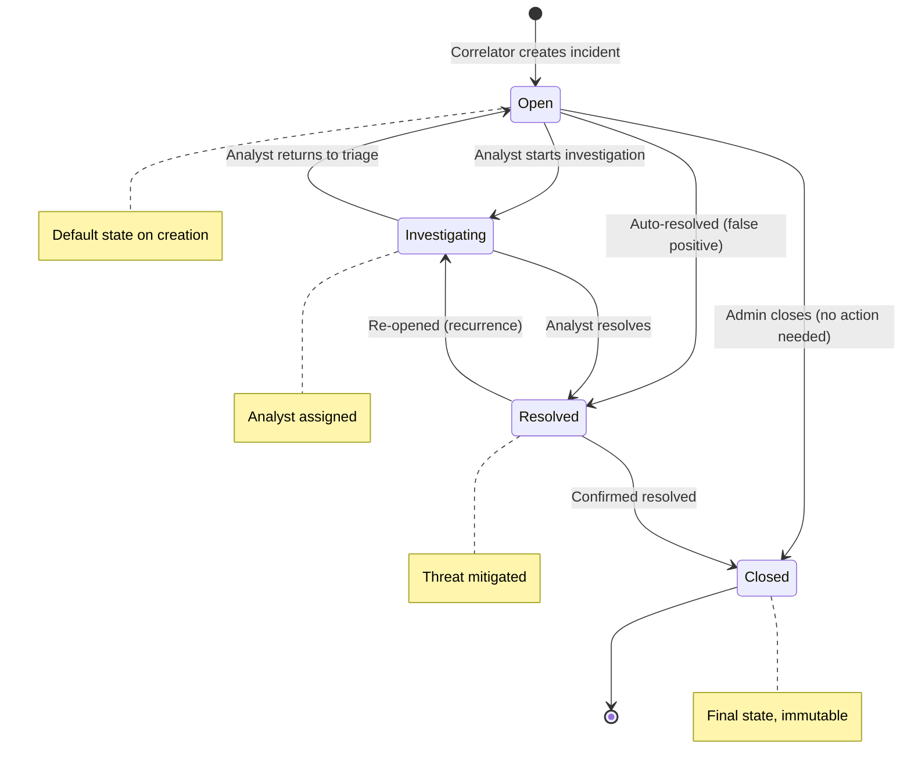

---

## 5. Risk Scoring

### 5.1 Component Diagram

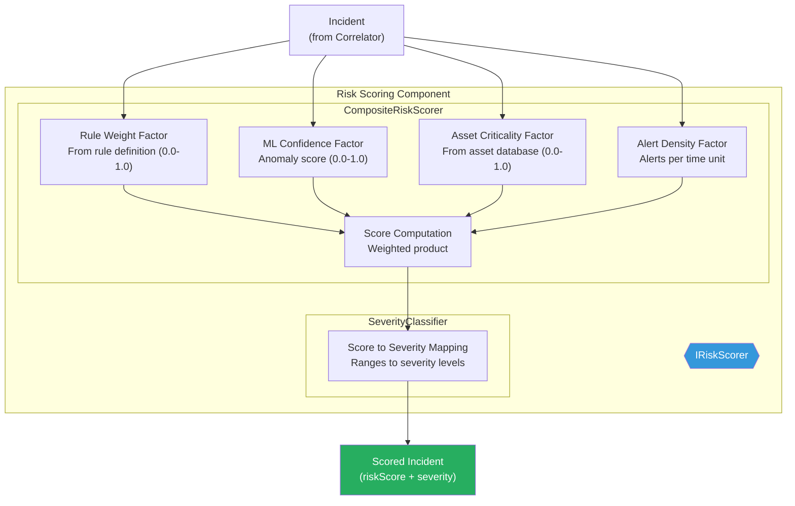

### 5.2 IRiskScorer Interface

```typescript
// Domain Layer - modules/correlation/domain/IRiskScorer.ts

interface IRiskScorer {
  /**
   * Compute risk score and severity for an incident.
   */
  score(incident: Incident): Promise<ScoredIncident>;

  /**
   * Batch score multiple incidents.
   */
  scoreBatch(incidents: Incident[]): Promise<ScoredIncident[]>;
}

interface ScoredIncident extends Incident {
  riskScore: number;                    // 0.0 - 100.0
  severity: IncidentSeverity;
  scoreBreakdown: ScoreBreakdown;
}

interface ScoreBreakdown {
  ruleWeightComponent: number;          // 0.0 - 1.0
  mlConfidenceComponent: number;        // 0.0 - 1.0
  assetCriticalityComponent: number;    // 0.0 - 1.0
  alertDensityComponent: number;        // 0.0 - 1.0
  formula: string;                      // Human-readable formula used
}
```

### 5.3 Scoring Formula

The composite risk score is computed as a **weighted product**, normalized to 0-100:

```
RiskScore = 100 × (
    W_rule × RuleWeightFactor +
    W_ml   × MLConfidenceFactor +
    W_asset × AssetCriticalityFactor +
    W_density × AlertDensityFactor
)
```

Where `W_*` are configurable weights that sum to 1.0.

### 5.4 Factor Computation

| Factor | Source | Computation | Range | Default Weight |
|---|---|---|---|---|
| **Rule Weight** | Highest `weight` field from matched rules in the incident | `max(alert.weight for alert in incident.alerts where alert is RuleAlert)` | 0.0 - 1.0 | 0.35 |
| **ML Confidence** | Highest anomaly score from AI alerts in the incident | `max(alert.anomalyScore for alert in incident.alerts where alert is AIAlert)` | 0.0 - 1.0 | 0.30 |
| **Asset Criticality** | Asset database lookup for the incident's primary entity | `assetRepository.getCriticality(entity)` or `0.5` (neutral default) | 0.0 - 1.0 | 0.20 |
| **Alert Density** | Number of alerts normalized by time window | `min(1.0, alertCount / densityThreshold)` | 0.0 - 1.0 | 0.15 |

### 5.5 Missing Factor Handling

Per ADR-001, missing factors default to a **neutral weight (0.5)**:

| Scenario | Factor Value | Impact |
|---|---|---|
| AI Engine was unavailable (fallback used) | `mlConfidence = 0.5` | Neutral — doesn't inflate or deflate score |
| Asset not in database | `assetCriticality = 0.5` | Neutral |
| No rule alerts (AI-only detection) | `ruleWeight = 0.5` | Neutral |
| No AI alerts (rule-only detection) | `mlConfidence = 0.5` | Neutral |

### 5.6 Severity Classification

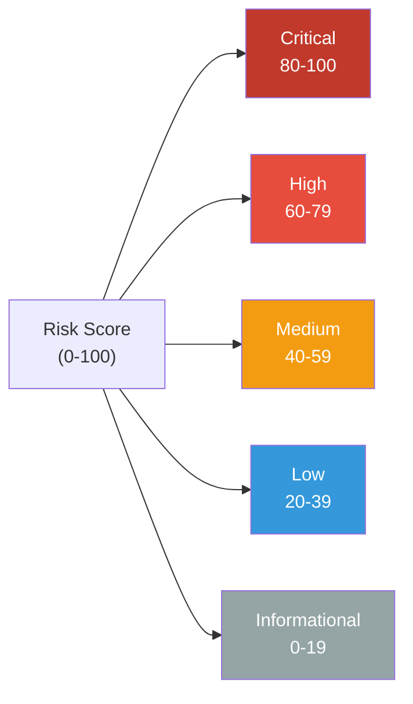

| Score Range | Severity | Dashboard Behavior |
|---|---|---|
| **80 - 100** | Critical | Immediate notification, top of incident queue, red badge |
| **60 - 79** | High | Notification, elevated in queue, orange badge |
| **40 - 59** | Medium | Normal queue position, yellow badge |
| **20 - 39** | Low | Below fold, blue badge |
| **0 - 19** | Informational | Collapsed by default, grey badge |

### 5.7 Scoring Configuration

| Setting | Default | Description |
|---|---|---|
| `scoring.weight_rule` | `0.35` | Weight for rule component |
| `scoring.weight_ml` | `0.30` | Weight for ML component |
| `scoring.weight_asset` | `0.20` | Weight for asset criticality |
| `scoring.weight_density` | `0.15` | Weight for alert density |
| `scoring.density_threshold` | `20` | Alert count that maps to density=1.0 |
| `scoring.neutral_default` | `0.5` | Default when a factor is unavailable |
| `scoring.severity_critical` | `80` | Minimum score for Critical |
| `scoring.severity_high` | `60` | Minimum score for High |
| `scoring.severity_medium` | `40` | Minimum score for Medium |
| `scoring.severity_low` | `20` | Minimum score for Low |

### 5.8 Score Breakdown Example

```json
{
  "riskScore": 78.5,
  "severity": "high",
  "scoreBreakdown": {
    "ruleWeightComponent": 0.8,
    "mlConfidenceComponent": 0.92,
    "assetCriticalityComponent": 0.9,
    "alertDensityComponent": 0.6,
    "formula": "100 * (0.35*0.8 + 0.30*0.92 + 0.20*0.9 + 0.15*0.6) = 78.5"
  }
}
```

> This incident scored High: a brute force rule fired (weight 0.8), the AI flagged it as highly anomalous (0.92), the target is a critical asset (0.9 — production database server), with moderate alert density (12 alerts in 15 min).

---

## 6. Detection Output & Storage

### 6.1 Storage Flow

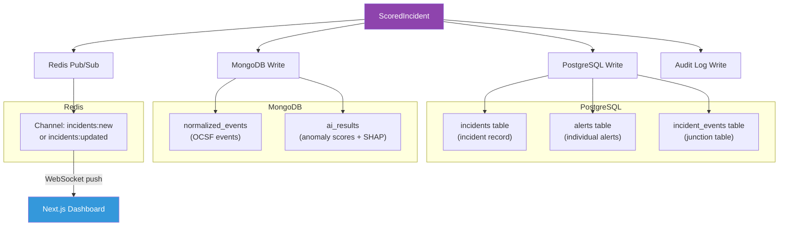

### 6.2 Storage Responsibility Split

| Data | Storage | Rationale |
|---|---|---|
| Incident record (id, title, severity, status, riskScore, assignedTo, notes) | **PostgreSQL** | Relational, transactional, lifecycle management |
| Alert records (alertId, ruleId/aiModel, severity, matchedCondition) | **PostgreSQL** | Relational to incidents (foreign key) |
| Incident-event junctions (incidentId, eventId) | **PostgreSQL** | Join table for many-to-many relationship |
| Normalized OCSF events (full event documents) | **MongoDB** | High volume, flexible schema, TTL indexes |
| AI results (anomaly scores, SHAP values per event) | **MongoDB** | Nested documents, variable structure |
| Real-time notifications | **Redis Pub/Sub** | Push to WebSocket server for live dashboard |
| Audit trail (incident created/updated) | **PostgreSQL** | Immutable compliance log |

### 6.3 Notification Payload

When a new or updated incident is persisted, a notification is published to Redis for real-time dashboard updates:

```json
{
  "type": "INCIDENT_CREATED",
  "data": {
    "incidentId": "inc-abc123",
    "title": "HIGH - SSH Brute Force on web-server-01",
    "severity": "high",
    "riskScore": 78.5,
    "alertCount": 12,
    "primaryEntity": "192.168.1.100",
    "createdAt": "2026-07-18T03:15:30.000Z",
    "source": "both"
  }
}
```

| Channel | Event Type | Description |
|---|---|---|
| `incidents:new` | `INCIDENT_CREATED` | New incident created |
| `incidents:updated` | `INCIDENT_UPDATED` | Alerts added to existing incident |
| `incidents:status` | `INCIDENT_STATUS_CHANGED` | Analyst changed status |
| `collector:status` | `COLLECTOR_HEARTBEAT` | Collector health update |

### 6.4 End-to-End Worker Pipeline (Complete)

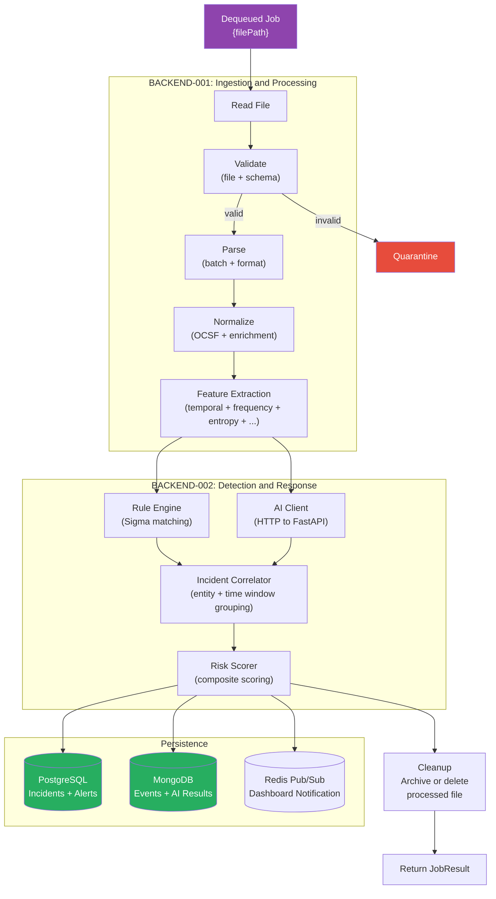

---

> **This document is governed by [ADR-001](file:///d:/AI%20SIEM/docs/architecture/decisions/ADR-001-modular-monolith.md) and continues from [BACKEND-001](file:///d:/AI%20SIEM/docs/backend.md). Together, BACKEND-001 and BACKEND-002 define the complete worker pipeline: from file detection to scored incidents in the database and real-time dashboard notifications.**
>
> **Document Version**: 1.0
> **Last Updated**: 2026-07-18
