# Backend Design — Ingestion & Processing Pipeline

## AI-Powered Security Analytics Platform

| Field | Value |
|---|---|
| **Document ID** | BACKEND-001 |
| **Version** | 1.0 |
| **Date** | 2026-07-18 |
| **Status** | Draft |
| **Language** | Node.js + Express + TypeScript |
| **Architecture Reference** | [ADR-001](file:///d:/AI%20SIEM/docs/architecture/decisions/ADR-001-modular-monolith.md) |
| **HLD Reference** | [HLD-001](file:///d:/AI%20SIEM/docs/HLD.md) |
| **SRS Reference** | [SRS-001](file:///d:/AI%20SIEM/docs/SRS.md) |

---

## Table of Contents

1. [Overview](#1-overview)
2. [Directory Watcher](#2-directory-watcher)
3. [Processing Queue](#3-processing-queue)
4. [Worker Design](#4-worker-design)
5. [Validation](#5-validation)
6. [Parsing](#6-parsing)
7. [Normalization](#7-normalization)
8. [Feature Extraction](#8-feature-extraction)

---

## 1. Overview

### 1.1 Pipeline Scope

This document covers the **ingestion and processing pipeline** — the data plane of the backend monolith. It handles the journey of every OCSF batch file from the collector directory to feature-ready events that enter the detection engines.

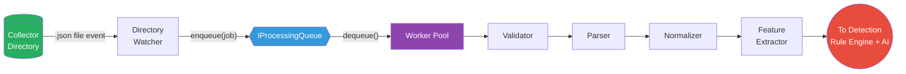

### 1.2 Design Principles

| Principle | Application in Pipeline |
|---|---|
| **Clean Architecture** | Each stage is an interface in the domain layer; implementations live in infrastructure |
| **Single Responsibility** | Watcher only watches. Queue only queues. Parser only parses. No stage does another stage's work |
| **Dependency Inversion** | Workers depend on `IValidator`, `IParser`, `INormalizer`, `IFeatureExtractor` — never on concrete classes |
| **Open/Closed** | New log formats are added by implementing `IFormatParser`; new features by implementing `IFeatureExtractorPlugin` |
| **Fail-Safe** | Every stage has a defined error path: quarantine, skip, log, or retry — never crash the worker |

### 1.3 Pipeline Component Diagram

```mermaid
graph TB
    subgraph PIPELINE["Backend - Ingestion and Processing Pipeline"]

        subgraph INGESTION["Ingestion Module"]
            DW["DirectoryWatcher<br/>(chokidar)"]
            IPQ{{"IProcessingQueue"}}
            BMQ["BullMQQueue<br/>(implements IProcessingQueue)"]
        end

        subgraph WORKERS["Worker Layer"]
            WP["WorkerManager<br/>(Concurrency controller)"]
            PW1["PipelineWorker 1"]
            PW2["PipelineWorker 2"]
            PW3["PipelineWorker N..."]
        end

        subgraph VALIDATION["Validation Stage"]
            IVAL{{"IValidator"}}
            FVAL["FileValidator<br/>(file integrity)"]
            SVAL["SchemaValidator<br/>(batch envelope)"]
        end

        subgraph PARSING["Parsing Stage"]
            IPAR{{"IParser"}}
            BPAR["BatchParser<br/>(extracts events from batch)"]
            IFMT{{"IFormatParser"}}
            FMT_JSON["JSONFormatParser"]
            FMT_SYSLOG["SyslogFormatParser"]
            FMT_CEF["CEFFormatParser"]
        end

        subgraph NORMALIZATION["Normalization Stage"]
            INOR{{"INormalizer"}}
            OCSF_NOR["OCSFNormalizer<br/>(schema validation + enrichment)"]
            OCSF_REG["OCSFSchemaRegistry<br/>(loaded OCSF JSON Schemas)"]
        end

        subgraph FEATURES["Feature Extraction Stage"]
            IFEX{{"IFeatureExtractor"}}
            FEX_CORE["CoreFeatureExtractor<br/>(orchestrator)"]
            IFEP{{"IFeaturePlugin"}}
            FEP_TIME["TemporalFeatures"]
            FEP_FREQ["FrequencyFeatures"]
            FEP_ENT["EntropyFeatures"]
            FEP_VOL["VolumeFeatures"]
            FEP_PROC["ProcessFeatures"]
        end
    end

    DW -->|"file event"| IPQ
    IPQ --> BMQ
    BMQ --> WP
    WP --> PW1
    WP --> PW2
    WP --> PW3

    PW1 --> IVAL
    IVAL --> FVAL
    IVAL --> SVAL
    SVAL --> IPAR
    IPAR --> BPAR
    BPAR --> IFMT
    IFMT --> FMT_JSON
    IFMT --> FMT_SYSLOG
    IFMT --> FMT_CEF
    BPAR --> INOR
    INOR --> OCSF_NOR
    OCSF_NOR --> OCSF_REG
    OCSF_NOR --> IFEX
    IFEX --> FEX_CORE
    FEX_CORE --> IFEP
    IFEP --> FEP_TIME
    IFEP --> FEP_FREQ
    IFEP --> FEP_ENT
    IFEP --> FEP_VOL
    IFEP --> FEP_PROC

    style IPQ fill:#3498db,color:#fff
    style IVAL fill:#3498db,color:#fff
    style IPAR fill:#3498db,color:#fff
    style INOR fill:#3498db,color:#fff
    style IFEX fill:#3498db,color:#fff
    style IFMT fill:#3498db,color:#fff
    style IFEP fill:#3498db,color:#fff
    style WP fill:#8e44ad,color:#fff
```

### 1.4 Interface Map

Every pipeline stage is defined by an interface in the domain layer. Concrete implementations live in the infrastructure layer.

| Interface | Layer | Implementation | Layer |
|---|---|---|---|
| `IDirectoryWatcher` | Domain | `ChokidarDirectoryWatcher` | Infrastructure |
| `IProcessingQueue` | Domain | `BullMQQueue` | Infrastructure |
| `IValidator` | Domain | `CompositeValidator` (FileValidator + SchemaValidator) | Infrastructure |
| `IParser` | Domain | `BatchParser` | Application |
| `IFormatParser` | Domain | `JSONFormatParser`, `SyslogFormatParser`, `CEFFormatParser` | Infrastructure |
| `INormalizer` | Domain | `OCSFNormalizer` | Application |
| `IFeatureExtractor` | Domain | `CoreFeatureExtractor` | Application |
| `IFeaturePlugin` | Domain | `TemporalFeatures`, `FrequencyFeatures`, `EntropyFeatures`, etc. | Infrastructure |

---

## 2. Directory Watcher

### 2.1 Component Diagram

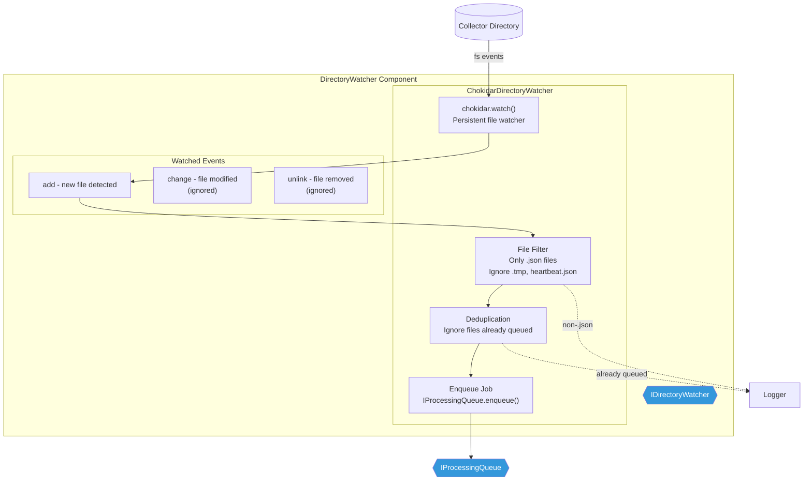

### 2.2 Responsibilities

| Responsibility | Detail |
|---|---|
| **Watch directory** | Monitor the collector directory for new `.json` files using chokidar |
| **Filter files** | Only process files with `.json` extension; ignore `.tmp` files (in-progress collector writes) and `heartbeat.json` |
| **Deduplication** | Maintain an in-memory set of recently queued file paths to avoid re-queuing the same file |
| **Enqueue jobs** | Create a `QueueJob` descriptor and push it to `IProcessingQueue` |
| **Error handling** | Log and continue on any individual file error; never crash the watcher |

### 2.3 Watcher Configuration

| Setting | Default | Description |
|---|---|---|
| `watcher.directory` | `/var/siem/collector/` | Directory to watch |
| `watcher.poll_interval_ms` | `100` | Polling fallback interval (used when native FS events are unavailable) |
| `watcher.stable_threshold_ms` | `500` | Wait time after last file modification before considering the file "stable" (prevents reading mid-write) |
| `watcher.ignored_patterns` | `["*.tmp", "heartbeat.json"]` | Glob patterns to ignore |
| `watcher.dedup_ttl_seconds` | `300` | How long to remember queued file paths for deduplication |

### 2.4 File Stability Check

The collector writes atomically (`.tmp` to `.json` rename), so `.json` files are always complete. However, as a defense-in-depth measure, the watcher includes a stability check:

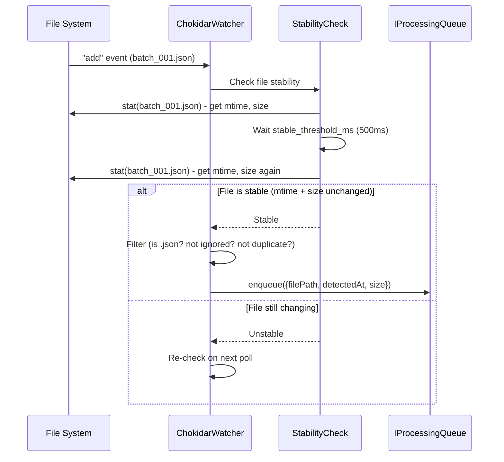

### 2.5 QueueJob Descriptor

When the watcher enqueues a file, it creates a job descriptor:

| Field | Type | Description |
|---|---|---|
| `jobId` | `string` | Unique ID (UUID v4) |
| `filePath` | `string` | Absolute path to the batch file |
| `detectedAt` | `Date` | Timestamp when the file was detected |
| `fileSize` | `number` | File size in bytes (from `fs.stat`) |
| `retryCount` | `number` | Number of times this job has been retried (starts at 0) |
| `priority` | `number` | Job priority (default: 0; lower = higher priority) |

### 2.6 Interface Definition

```typescript
// Domain Layer - modules/ingestion/domain/IDirectoryWatcher.ts

interface IDirectoryWatcher {
  start(): Promise<void>;
  stop(): Promise<void>;
  onFileDetected(callback: (job: QueueJob) => Promise<void>): void;
  getStats(): WatcherStats;
}

interface WatcherStats {
  isRunning: boolean;
  filesDetected: number;
  filesQueued: number;
  filesIgnored: number;
  lastFileDetectedAt: Date | null;
}
```

---

## 3. Processing Queue

### 3.1 Component Diagram

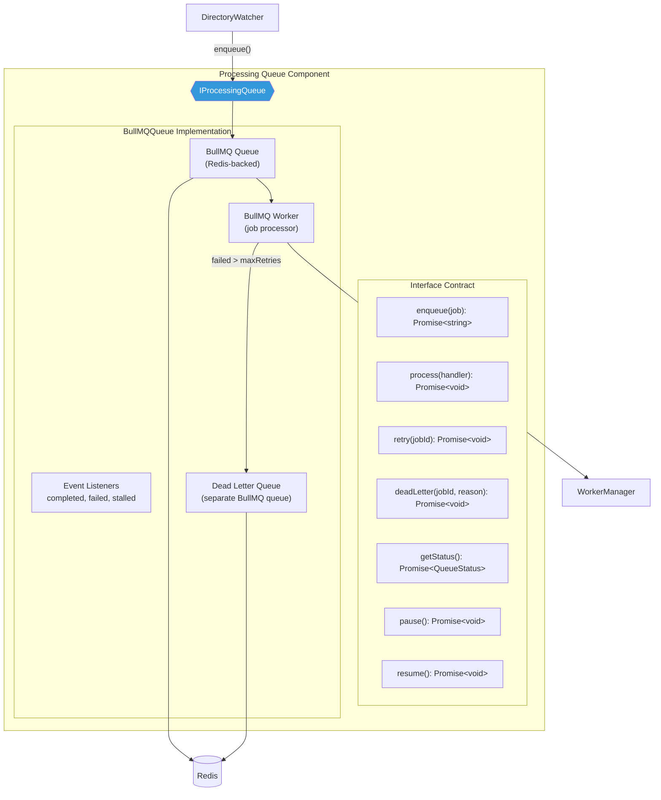

### 3.2 IProcessingQueue Interface

This is the **critical abstraction** mandated by ADR-001. No component outside the infrastructure layer ever touches BullMQ directly.

```typescript
// Domain Layer - modules/ingestion/domain/IProcessingQueue.ts

interface IProcessingQueue {
  /**
   * Add a job to the queue.
   * Returns the assigned job ID.
   */
  enqueue(job: QueueJob): Promise<string>;

  /**
   * Register a handler that processes jobs.
   * The queue implementation calls this handler for each dequeued job.
   * Concurrency is controlled by the implementation.
   */
  process(handler: JobHandler): Promise<void>;

  /**
   * Manually retry a specific failed job.
   */
  retry(jobId: string): Promise<void>;

  /**
   * Move a job to the dead letter queue with a reason.
   */
  deadLetter(jobId: string, reason: string): Promise<void>;

  /**
   * Get current queue status and metrics.
   */
  getStatus(): Promise<QueueStatus>;

  /**
   * Pause job processing (queue continues to accept jobs).
   */
  pause(): Promise<void>;

  /**
   * Resume processing after pause.
   */
  resume(): Promise<void>;

  /**
   * Graceful shutdown: stop processing, wait for active jobs to complete.
   */
  close(): Promise<void>;
}

type JobHandler = (job: QueueJob) => Promise<JobResult>;

interface QueueStatus {
  waiting: number;
  active: number;
  completed: number;
  failed: number;
  deadLettered: number;
  isPaused: boolean;
}

interface JobResult {
  success: boolean;
  eventsProcessed: number;
  errors: string[];
  duration_ms: number;
}
```

### 3.3 BullMQ Implementation Configuration

| Setting | Default | Description |
|---|---|---|
| `queue.name` | `"siem-pipeline"` | BullMQ queue name |
| `queue.concurrency` | `4` | Number of jobs processed in parallel |
| `queue.max_retries` | `3` | Max retry attempts before dead-letter |
| `queue.retry_backoff_ms` | `1000` | Initial retry backoff (exponential: 1s, 2s, 4s) |
| `queue.job_timeout_ms` | `60000` | Max time for a single job to complete |
| `queue.stall_interval_ms` | `30000` | How often to check for stalled jobs |
| `queue.remove_on_complete` | `true` | Remove successfully completed jobs from Redis |
| `queue.remove_on_fail` | `false` | Keep failed jobs for inspection |

### 3.4 Retry and Dead-Letter Flow

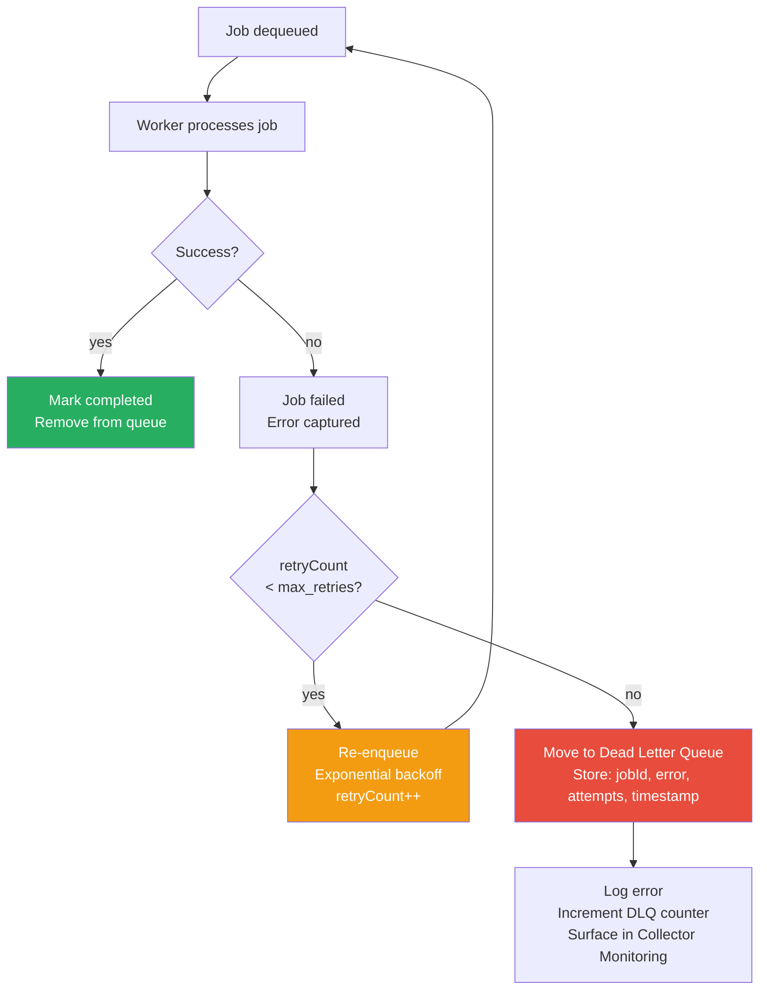

### 3.5 Queue Swappability

Per ADR-001, the queue is behind `IProcessingQueue` so it can be replaced. Possible future implementations:

| Implementation | When to Use |
|---|---|
| `BullMQQueue` (current) | Production — Redis-backed, persistent, retry, DLQ |
| `InMemoryQueue` | Unit testing — no Redis dependency, synchronous processing |
| `KafkaQueue` (future) | If throughput exceeds Redis capacity (Phase 3) |

---

## 4. Worker Design

### 4.1 Component Diagram

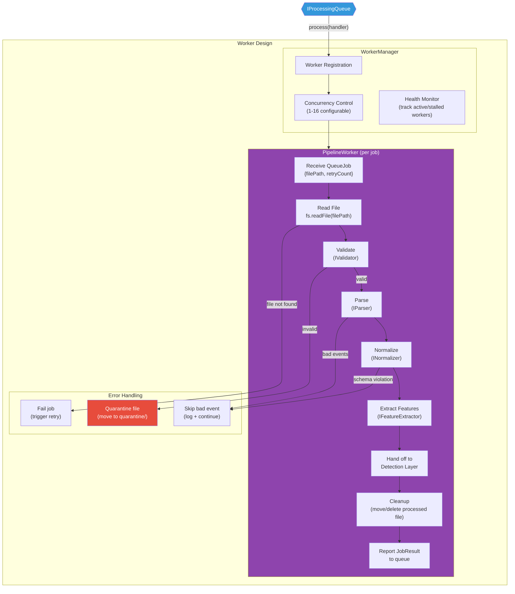

### 4.2 WorkerManager Responsibilities

| Responsibility | Detail |
|---|---|
| **Register with queue** | Calls `IProcessingQueue.process(handler)` with the pipeline handler function |
| **Concurrency control** | Configures BullMQ concurrency (1-16 workers via `WORKER_CONCURRENCY` env var) |
| **Health monitoring** | Tracks active workers, detects stalled workers, logs long-running jobs |
| **Graceful shutdown** | On `SIGTERM`: stops accepting new jobs, waits for active jobs to complete (with timeout), then exits |

### 4.3 PipelineWorker — Job Execution Flow

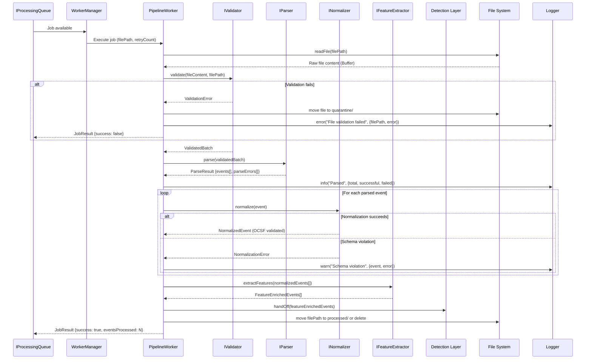

### 4.4 Worker Error Classification

| Error Type | Action | Retry? | Quarantine? |
|---|---|---|---|
| File not found | Fail job | Yes (file may appear) | No |
| File read permission denied | Fail job | Yes (permissions may be fixed) | No |
| Invalid JSON (corrupt file) | Quarantine file | No | Yes |
| Invalid batch envelope | Quarantine file | No | Yes |
| Individual event parse error | Skip event, continue | N/A (event-level, not job-level) | No |
| Individual schema violation | Flag event, continue | N/A | No |
| Feature extraction error | Skip features, pass event through | N/A | No |
| Unexpected exception | Fail job | Yes (transient) | No |

### 4.5 Worker Metrics

| Metric | Type | Description |
|---|---|---|
| `worker.jobs_processed` | Counter | Total jobs completed (success + failure) |
| `worker.jobs_succeeded` | Counter | Jobs that completed successfully |
| `worker.jobs_failed` | Counter | Jobs that exhausted retries |
| `worker.events_processed` | Counter | Total events processed across all jobs |
| `worker.events_skipped` | Counter | Events skipped due to parse/validation errors |
| `worker.job_duration_ms` | Histogram | Time to process a single job |
| `worker.active_count` | Gauge | Currently active workers |
| `worker.files_quarantined` | Counter | Files moved to quarantine directory |

### 4.6 File Lifecycle

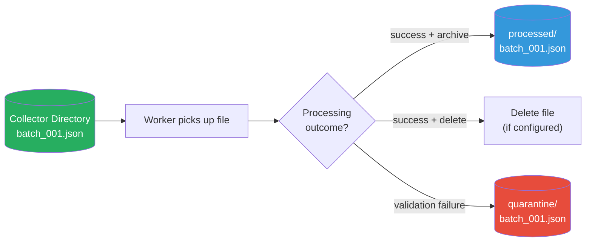

| Mode | Config Value | Behavior |
|---|---|---|
| **Archive** | `worker.processed_action: "archive"` | Move to `processed/` directory after success |
| **Delete** | `worker.processed_action: "delete"` | Delete file after success |
| **Quarantine** | Automatic | Move to `quarantine/` on validation failure (always) |

---

## 5. Validation

### 5.1 Component Diagram

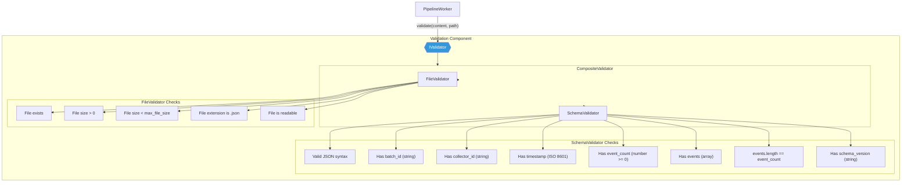

### 5.2 Validation Interface

```typescript
// Domain Layer - modules/parsing/domain/IValidator.ts

interface IValidator {
  validate(content: Buffer, filePath: string): Promise<ValidationResult>;
}

interface ValidationResult {
  isValid: boolean;
  batch: ValidatedBatch | null;
  errors: ValidationError[];
}

interface ValidationError {
  code: ValidationErrorCode;
  message: string;
  field?: string;
}

enum ValidationErrorCode {
  FILE_NOT_FOUND = "FILE_NOT_FOUND",
  FILE_EMPTY = "FILE_EMPTY",
  FILE_TOO_LARGE = "FILE_TOO_LARGE",
  INVALID_EXTENSION = "INVALID_EXTENSION",
  PERMISSION_DENIED = "PERMISSION_DENIED",
  INVALID_JSON = "INVALID_JSON",
  MISSING_FIELD = "MISSING_FIELD",
  INVALID_FIELD_TYPE = "INVALID_FIELD_TYPE",
  EVENT_COUNT_MISMATCH = "EVENT_COUNT_MISMATCH",
  UNSUPPORTED_SCHEMA_VERSION = "UNSUPPORTED_SCHEMA_VERSION",
}
```

### 5.3 Validation Pipeline

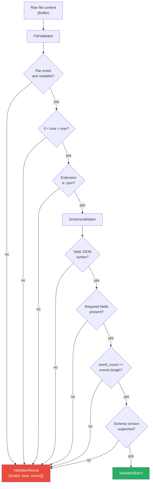

### 5.4 Validation Thresholds

| Check | Threshold | Rationale |
|---|---|---|
| Maximum file size | 50 MB | Prevents memory exhaustion on a single batch |
| Minimum file size | 1 byte | Empty files are invalid |
| Supported schema versions | `["1.0.0", "1.1.0"]` | Forward compatibility with collector upgrades |
| Maximum event count | 100,000 | Sanity limit per batch |

### 5.5 ValidatedBatch Type

After passing validation, the raw content is deserialized into a typed `ValidatedBatch`:

| Field | Type | Description |
|---|---|---|
| `batchId` | `string` | Unique batch identifier from collector |
| `collectorId` | `string` | Which collector produced this batch |
| `timestamp` | `Date` | When the batch was created |
| `eventCount` | `number` | Declared event count |
| `schemaVersion` | `string` | OCSF schema version |
| `events` | `RawOCSFEvent[]` | Array of unparsed OCSF event objects |

---

## 6. Parsing

### 6.1 Component Diagram

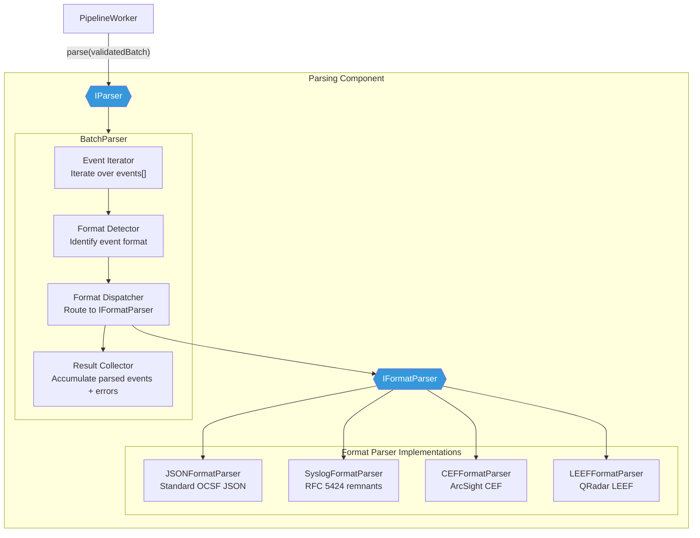

### 6.2 Parser Interface

```typescript
// Domain Layer - modules/parsing/domain/IParser.ts

interface IParser {
  parse(batch: ValidatedBatch): Promise<ParseResult>;
}

interface ParseResult {
  events: ParsedEvent[];
  errors: ParseError[];
  stats: ParseStats;
}

interface ParsedEvent {
  raw: RawOCSFEvent;          // Original event object
  parsed: Record<string, any>; // Extracted/typed fields
  sourceFormat: string;        // Detected format ("ocsf_json", "syslog", "cef")
  parseTimestamp: Date;        // When parsing occurred
}

interface ParseError {
  eventIndex: number;
  error: string;
  rawEvent: RawOCSFEvent;
}

interface ParseStats {
  totalEvents: number;
  successfullyParsed: number;
  failedToParse: number;
  formatBreakdown: Record<string, number>; // {"ocsf_json": 980, "syslog": 15, "cef": 5}
}
```

### 6.3 Format Parser Interface

```typescript
// Domain Layer - modules/parsing/domain/IFormatParser.ts

interface IFormatParser {
  /**
   * Returns true if this parser can handle the given event.
   */
  canParse(event: RawOCSFEvent): boolean;

  /**
   * Parse the event into structured fields.
   */
  parse(event: RawOCSFEvent): Promise<ParsedEvent>;

  /**
   * Returns the format name this parser handles.
   */
  formatName(): string;
}
```

### 6.4 Format Detection Logic

The collector already converts events to OCSF JSON, so the **primary format is always OCSF JSON**. However, the parser supports additional formats for forward compatibility and edge cases:

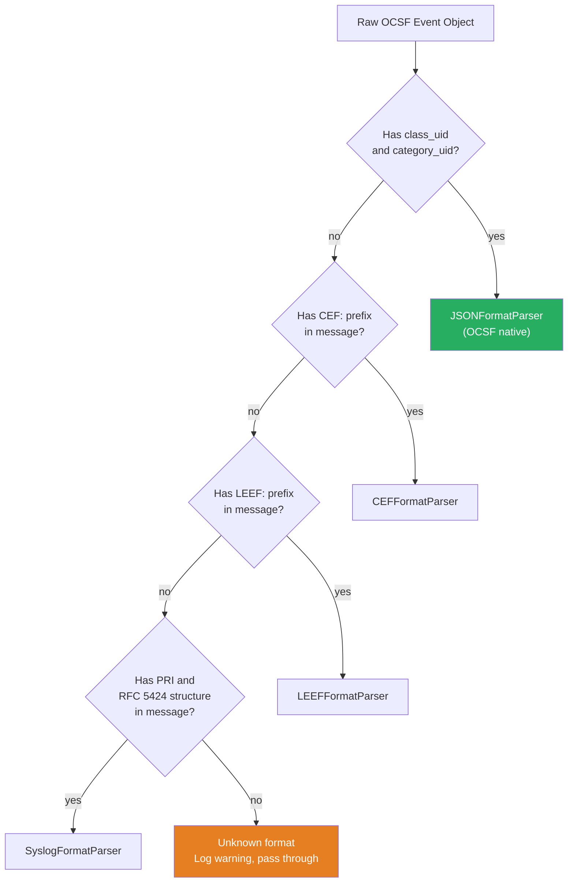

> [!NOTE]
> In the MVP, **99%+ of events will be OCSF JSON** because the collector does the conversion. The CEF/LEEF/Syslog parsers exist for cases where the collector's `unmapped` field contains an embedded original log that needs additional parsing.

### 6.5 JSONFormatParser — Primary Parser

The primary parser validates and extracts typed fields from OCSF JSON events:

| Extraction | Source Field | Typed Output |
|---|---|---|
| Event class | `class_uid` | `OCSFEventClass` enum |
| Event category | `category_uid` | `OCSFCategory` enum |
| Severity | `severity_id` | `OCSFSeverity` enum (0-6) |
| Timestamp | `time` | `Date` (ISO 8601) |
| Source endpoint | `src_endpoint` | `Endpoint { ip, hostname, port, mac }` |
| Destination endpoint | `dst_endpoint` | `Endpoint { ip, hostname, port, mac }` |
| Actor | `actor` | `Actor { user, process, session }` |
| Device | `device` | `Device { hostname, ip, os, type }` |
| Message | `message` | `string` |
| Metadata | `metadata` | `Metadata { product, version, log_level }` |
| Unmapped | `unmapped` | `Record<string, any>` (preserved as-is) |

---

## 7. Normalization

### 7.1 Component Diagram

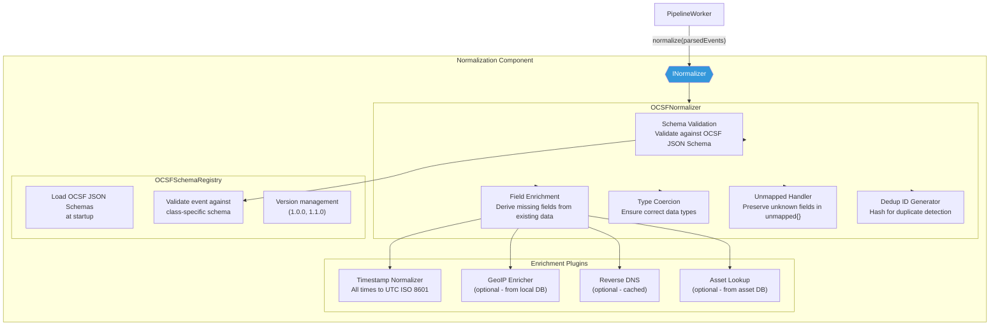

### 7.2 Normalizer Interface

```typescript
// Domain Layer - modules/parsing/domain/INormalizer.ts

interface INormalizer {
  normalize(events: ParsedEvent[]): Promise<NormalizationResult>;
}

interface NormalizationResult {
  events: NormalizedEvent[];
  errors: NormalizationError[];
  stats: NormalizationStats;
}

interface NormalizedEvent {
  id: string;                    // Unique event ID (UUID v4)
  dedupHash: string;             // SHA-256 hash for duplicate detection
  classUid: number;              // OCSF class UID
  categoryUid: number;           // OCSF category UID
  severityId: number;            // 0-6
  time: Date;                    // Normalized to UTC
  message: string;
  srcEndpoint: Endpoint | null;
  dstEndpoint: Endpoint | null;
  actor: Actor | null;
  device: Device | null;
  metadata: Metadata;
  unmapped: Record<string, any>;
  enrichments: Enrichments;      // Added by enrichment plugins
  schemaValid: boolean;          // Whether event passed OCSF schema validation
  validationErrors: string[];    // Schema validation errors (if any)
  rawEvent: Record<string, any>; // Original event (preserved for investigation)
}

interface NormalizationError {
  eventId: string;
  eventIndex: number;
  error: string;
  severity: "warning" | "error";
}

interface NormalizationStats {
  totalEvents: number;
  schemaValid: number;
  schemaInvalid: number;
  enriched: number;
  duplicatesDetected: number;
}
```

### 7.3 Normalization Pipeline

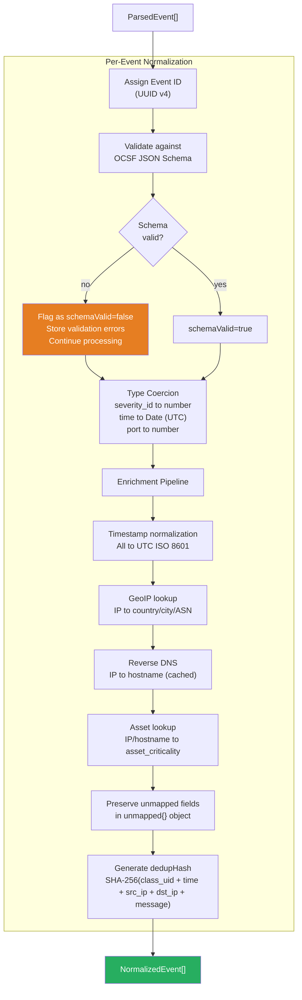

### 7.4 Schema Validation Detail

| Check | Rule | On Failure |
|---|---|---|
| `class_uid` | Must be a valid OCSF class UID (integer) | Flag event, continue |
| `category_uid` | Must be a valid OCSF category UID (integer) | Flag event, continue |
| `severity_id` | Integer 0-6 | Default to 1 (Informational) |
| `time` | Valid ISO 8601 timestamp | Use current timestamp, flag |
| `metadata.version` | Matches supported schema versions | Flag event, continue |
| Required fields per class | Class-specific required fields (e.g., Authentication requires `actor`) | Flag event, continue |

> [!IMPORTANT]
> Schema-invalid events are **never dropped**. They are flagged with `schemaValid: false` and continue through the pipeline. The analyst can see validation warnings in the investigation view. This prevents data loss while surfacing quality issues.

### 7.5 Deduplication Hash

The dedup hash is a SHA-256 computed from:

```
SHA-256(
  class_uid +
  category_uid +
  time (ISO 8601) +
  src_endpoint.ip +
  dst_endpoint.ip +
  message (first 256 chars)
)
```

This allows the backend to detect if the collector sent the same event twice (at-least-once delivery guarantee from collector). Deduplication is **detection only** in the normalization stage — the downstream Incident Correlator decides whether to drop or merge duplicates.

### 7.6 Enrichment Plugins

| Plugin | Input | Output | Source | MVP Status |
|---|---|---|---|---|
| **TimestampNormalizer** | Any timestamp format | UTC ISO 8601 `Date` | Built-in | ✅ MVP |
| **GeoIPEnricher** | IP address | `{country, city, latitude, longitude, asn}` | MaxMind GeoLite2 (local DB) | ✅ MVP |
| **ReverseDNS** | IP address | Hostname | DNS lookup (with Redis cache, 1hr TTL) | ⏳ Optional MVP |
| **AssetLookup** | IP / hostname | `{asset_name, criticality_score, owner}` | PostgreSQL asset table | ⏳ Optional MVP |

---

## 8. Feature Extraction

### 8.1 Component Diagram

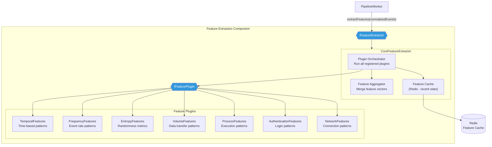

### 8.2 Feature Extractor Interface

```typescript
// Domain Layer - modules/analysis/domain/IFeatureExtractor.ts

interface IFeatureExtractor {
  extractFeatures(events: NormalizedEvent[]): Promise<FeatureExtractionResult>;
}

interface FeatureExtractionResult {
  events: FeatureEnrichedEvent[];
  stats: FeatureExtractionStats;
}

interface FeatureEnrichedEvent extends NormalizedEvent {
  features: FeatureVector;
}

interface FeatureVector {
  temporal: TemporalFeatureSet;
  frequency: FrequencyFeatureSet;
  entropy: EntropyFeatureSet;
  volume: VolumeFeatureSet;
  process: ProcessFeatureSet | null;
  authentication: AuthFeatureSet | null;
  network: NetworkFeatureSet | null;
}

interface FeatureExtractionStats {
  totalEvents: number;
  featuresExtracted: number;
  pluginsExecuted: string[];
  cacheMisses: number;
  cacheHits: number;
  duration_ms: number;
}
```

### 8.3 Feature Plugin Interface

```typescript
// Domain Layer - modules/analysis/domain/IFeaturePlugin.ts

interface IFeaturePlugin {
  /**
   * Unique name of this feature plugin.
   */
  name(): string;

  /**
   * Which OCSF event classes this plugin applies to.
   * Return empty array for "all classes".
   */
  applicableClasses(): number[];

  /**
   * Extract features from a batch of events.
   * Batch processing allows cross-event statistical features.
   */
  extract(events: NormalizedEvent[], cache: IFeatureCache): Promise<Map<string, PluginFeatureSet>>;
}

interface IFeatureCache {
  get(key: string): Promise<any | null>;
  set(key: string, value: any, ttlSeconds: number): Promise<void>;
  increment(key: string): Promise<number>;
}
```

### 8.4 Feature Plugin Details

#### 8.4.1 Temporal Features

Detects anomalies based on **when** events occur.

| Feature | Computation | Why It Matters |
|---|---|---|
| `hour_of_day` | Extract hour (0-23) from event timestamp | Logins at 3 AM are suspicious |
| `day_of_week` | Extract day (0-6) from event timestamp | Weekend activity for office-hour assets |
| `is_business_hours` | Boolean: 9:00-17:00 local time, Mon-Fri | Off-hours activity flag |
| `time_since_last_event` | Seconds since previous event from same source | Burst detection |
| `time_deviation_score` | Z-score vs. historical mean event time for this entity | How unusual is this timing |

#### 8.4.2 Frequency Features

Detects anomalies based on **how often** events occur.

| Feature | Computation | Why It Matters |
|---|---|---|
| `events_per_minute_src_ip` | Count of events from source IP in last 60s (Redis counter) | Brute force / DoS detection |
| `events_per_hour_user` | Count of events for user in last 3600s | Account compromise |
| `unique_dst_ips_per_src` | Distinct destination IPs contacted by source in last 10min | Port scanning / lateral movement |
| `unique_users_per_src_ip` | Distinct usernames from same source IP in last 10min | Credential stuffing |
| `frequency_deviation` | Current rate vs. 24hr rolling average for this entity | Anomalous activity spikes |

#### 8.4.3 Entropy Features

Detects anomalies based on **randomness** in string fields.

| Feature | Computation | Why It Matters |
|---|---|---|
| `src_ip_entropy` | Shannon entropy of source IP distribution in batch | DGA detection (random IPs) |
| `username_entropy` | Shannon entropy of characters in username | Randomly generated usernames |
| `process_name_entropy` | Shannon entropy of process name characters | Obfuscated malware names |
| `url_entropy` | Shannon entropy of URL path characters | C2 beaconing with encoded URLs |

#### 8.4.4 Volume Features

Detects anomalies based on **data volumes**.

| Feature | Computation | Why It Matters |
|---|---|---|
| `bytes_sent` | Total bytes sent (from network events) | Data exfiltration |
| `bytes_received` | Total bytes received | Large payload downloads |
| `bytes_ratio` | sent / received ratio | Unusual transfer patterns |
| `volume_deviation` | Current volume vs. 24hr rolling average | Exfiltration spikes |

#### 8.4.5 Process Features

Detects anomalies in **process execution** (applies to process activity events only).

| Feature | Computation | Why It Matters |
|---|---|---|
| `process_rarity_score` | 1 - (occurrence_count / total_processes) over 24hr window | Rare processes are suspicious |
| `parent_child_anomaly` | Is this parent-child process pair seen before? (Boolean from Redis set) | `explorer.exe` spawning `powershell.exe` vs `cmd.exe` spawning `nc.exe` |
| `process_path_depth` | Depth of process path (`C:\a\b\c.exe` = 3) | Deep paths often malware |
| `command_line_length` | Character count of command line arguments | Extremely long command lines = obfuscation |

#### 8.4.6 Authentication Features

Detects anomalies in **login behavior** (applies to authentication events only).

| Feature | Computation | Why It Matters |
|---|---|---|
| `failed_login_count_10min` | Failed logins for this user in last 10 min (Redis counter) | Brute force detection |
| `failed_to_success_ratio` | Failed / total login attempts in last 1hr | Credential compromise |
| `geo_distance_km` | Distance between current login location and last known location (from GeoIP) | Impossible travel |
| `new_source_ip` | Has this user ever logged in from this IP? (Boolean from Redis set) | Account takeover from new location |
| `concurrent_sessions` | Active sessions for this user (Redis set size) | Session hijacking |

#### 8.4.7 Network Features

Detects anomalies in **network connections** (applies to network activity events only).

| Feature | Computation | Why It Matters |
|---|---|---|
| `is_internal_to_external` | Source is RFC1918, destination is public | Potential C2 / exfiltration |
| `dst_port_rarity` | How common is this destination port in last 24hr | Unusual port = suspicious service |
| `connection_duration` | Duration of network connection (if available) | Long-lived connections = tunneling |
| `dns_query_length` | Length of DNS query name | DNS tunneling detection |
| `is_known_bad_port` | Port in known-bad list (4444, 5555, etc.) | Common backdoor ports |

### 8.5 Feature Extraction Flow

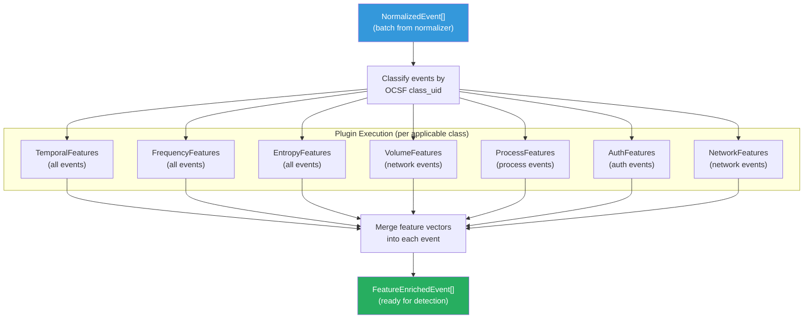

### 8.6 Feature Cache Strategy

Many features require historical context (e.g., "events per minute from this IP in the last 60 seconds"). The feature cache uses Redis to maintain rolling counters and sets:

| Cache Key Pattern | Data Type | TTL | Purpose |
|---|---|---|---|
| `feat:epm:{src_ip}` | Redis Counter | 60s | Events per minute by source IP |
| `feat:eph:{user}` | Redis Counter | 3600s | Events per hour by user |
| `feat:dst_ips:{src_ip}` | Redis Set | 600s | Unique destination IPs per source |
| `feat:users:{src_ip}` | Redis Set | 600s | Unique usernames per source IP |
| `feat:proc:{hostname}` | Redis Hash | 86400s | Process name occurrence counts |
| `feat:parent_child` | Redis Set | 86400s | Known parent-child process pairs |
| `feat:failed_login:{user}` | Redis Counter | 600s | Failed logins per user (10 min) |
| `feat:user_ips:{user}` | Redis Set | 604800s | Known IPs per user (7 days) |
| `feat:sessions:{user}` | Redis Set | 28800s | Active sessions per user (8hr) |
| `feat:avg:{entity}:{metric}` | Redis String (JSON) | 86400s | Rolling average for deviation calc |

> [!NOTE]
> **Redis is used as a feature cache, not a feature store.** If Redis is cleared, features gracefully degrade — deviation scores default to 0, rarity scores default to 0.5, and boolean features default to `false`. No pipeline failures.

### 8.7 Feature Vector Output Example

A fully feature-enriched event ready for the detection layer:

```json
{
  "id": "evt-abc123",
  "classUid": 3002,
  "categoryUid": 3,
  "severityId": 3,
  "time": "2026-07-18T03:15:22.000Z",
  "message": "Failed password for root from 192.168.1.100",
  "srcEndpoint": { "ip": "192.168.1.100" },
  "dstEndpoint": { "ip": "10.0.0.5" },
  "actor": { "user": { "name": "root" } },
  "schemaValid": true,
  "features": {
    "temporal": {
      "hour_of_day": 3,
      "day_of_week": 5,
      "is_business_hours": false,
      "time_since_last_event": 0.5,
      "time_deviation_score": 2.8
    },
    "frequency": {
      "events_per_minute_src_ip": 45,
      "events_per_hour_user": 120,
      "unique_dst_ips_per_src": 1,
      "unique_users_per_src_ip": 3,
      "frequency_deviation": 4.2
    },
    "entropy": {
      "src_ip_entropy": 0.0,
      "username_entropy": 1.58
    },
    "volume": null,
    "process": null,
    "authentication": {
      "failed_login_count_10min": 45,
      "failed_to_success_ratio": 0.98,
      "geo_distance_km": 0,
      "new_source_ip": true,
      "concurrent_sessions": 0
    },
    "network": null
  }
}
```

> This event shows clear brute force indicators: 45 failed logins in 10 minutes, 98% failure ratio, at 3 AM (off-hours), from a new source IP, with high frequency deviation. The Rule Engine and AI Engine will both flag this.

---

> **This document is governed by [ADR-001](file:///d:/AI%20SIEM/docs/architecture/decisions/ADR-001-modular-monolith.md). The processing pipeline runs entirely within the Node.js Express monolith. All stages are behind interfaces in the domain layer, with implementations in the infrastructure layer. No external message brokers, no distributed processing.**
>
> **Document Version**: 1.0
> **Last Updated**: 2026-07-18
