# Collector Agent Design

## AI-Powered Security Analytics Platform

| Field | Value |
|---|---|
| **Document ID** | COLLECTOR-001 |
| **Version** | 1.0 |
| **Date** | 2026-07-18 |
| **Status** | Draft |
| **Language** | C++ (C++20) |
| **Architecture Reference** | [ADR-001](file:///d:/AI%20SIEM/docs/architecture/decisions/ADR-001-modular-monolith.md) |
| **HLD Reference** | [HLD-001](file:///d:/AI%20SIEM/docs/HLD.md) |
| **SRS Reference** | [SRS-001](file:///d:/AI%20SIEM/docs/SRS.md) |

---

## Table of Contents

1. [Internal Architecture](#1-internal-architecture)
2. [Scheduler](#2-scheduler)
3. [Windows Reader](#3-windows-reader)
4. [Linux Reader](#4-linux-reader)
5. [Internal Queue](#5-internal-queue)
6. [Batch Manager](#6-batch-manager)
7. [Checkpoint Manager](#7-checkpoint-manager)
8. [Logger](#8-logger)
9. [Configuration](#9-configuration)
10. [Failure Recovery](#10-failure-recovery)
11. [Folder Structure](#11-folder-structure)

---

## 1. Internal Architecture

### 1.1 Design Principles

The Collector Agent is a **standalone C++ binary** that runs independently of the backend. Its architecture follows:

| Principle | Application |
|---|---|
| **Single Responsibility** | Each component has one job: read, convert, batch, write, or checkpoint |
| **Interface Segregation** | All readers implement a common `ILogReader` interface; all writers implement `IOutputWriter` |
| **Open/Closed** | New log sources are added by implementing `ILogReader`; no existing code is modified |
| **Dependency Injection** | Components receive dependencies via constructor; enables unit testing with mocks |
| **Fail-Safe Design** | Every failure path is handled: buffer overflow, disk full, source unreachable, corrupt data |

### 1.2 Responsibility Boundaries (Enforced by ADR-001)

| The Collector Does | The Collector Never Does |
|---|---|
| Read raw logs from sources | Parsing or detection logic |
| Convert to OCSF JSON | AI/ML inference |
| Batch events by count or time | Incident generation or correlation |
| Maintain read checkpoints | Database operations |
| Write files atomically (.tmp to .json) | Network communication with backend |
| Emit heartbeat status | Risk scoring or alert management |

### 1.3 Component Overview Diagram

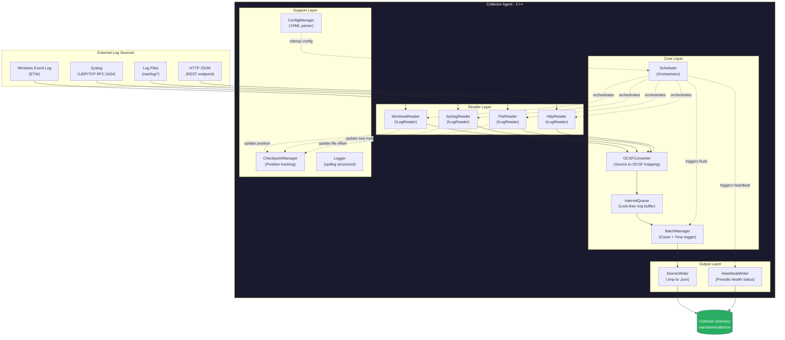

### 1.4 Internal Data Flow Diagram

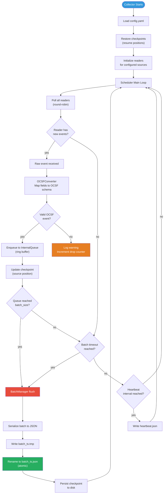

### 1.5 Interface Definitions

All core abstractions are defined as pure virtual interfaces (C++ abstract classes).

| Interface | Methods | Implementations |
|---|---|---|
| `ILogReader` | `start()`, `stop()`, `poll()` returning `vector<RawEvent>`, `getPosition()` returning `ReaderPosition` | `WindowsReader`, `SyslogReader`, `FileReader`, `HttpReader` |
| `IOCSFConverter` | `convert(RawEvent)` returning `optional<OCSFEvent>` | `OCSFConverter` (with source-specific mapping strategies) |
| `IInternalQueue` | `enqueue(OCSFEvent)`, `dequeueBatch(size_t)` returning `vector<OCSFEvent>`, `size()`, `isFull()` | `RingBufferQueue` |
| `IBatchManager` | `shouldFlush()` returning `bool`, `flush()` returning `Batch`, `getStats()` | `BatchManager` |
| `IOutputWriter` | `writeBatch(Batch)`, `writeHeartbeat(HealthStatus)` | `AtomicFileWriter`, `HeartbeatWriter` |
| `ICheckpointManager` | `save(sourceId, ReaderPosition)`, `load(sourceId)` returning `optional<ReaderPosition>`, `persist()` | `FileCheckpointManager` |
| `ILogger` | `info()`, `warn()`, `error()`, `debug()`, `fatal()` | `SpdlogLogger` |
| `IConfigManager` | `load(path)`, `get<T>(key)`, `validate()` | `YamlConfigManager` |

### 1.6 Class Relationship Diagram

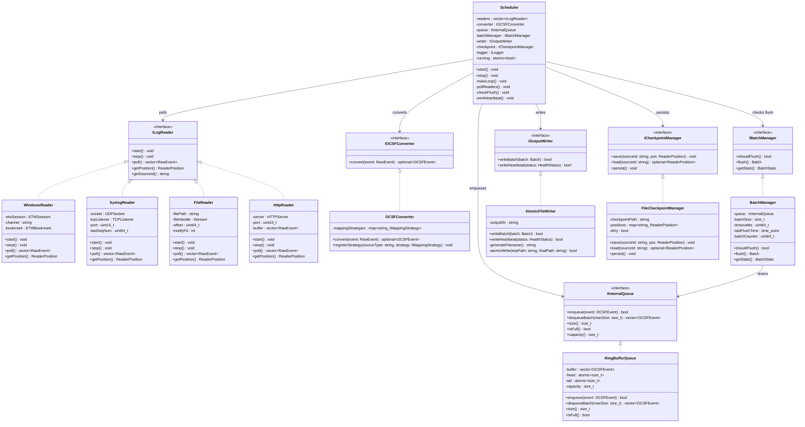

---

## 2. Scheduler

The Scheduler is the **central orchestrator** of the Collector Agent. It owns the main loop and coordinates all components.

### 2.1 Scheduler Architecture

```mermaid
flowchart TD
    subgraph SCHEDULER["Scheduler - Main Loop"]
        INIT["Initialize<br/>Load config, restore checkpoints,<br/>create readers"]
        POLL_PHASE["Poll Phase<br/>Round-robin poll all readers"]
        CONVERT_PHASE["Convert Phase<br/>RawEvent to OCSFEvent"]
        ENQUEUE_PHASE["Enqueue Phase<br/>Push to InternalQueue"]
        FLUSH_CHECK["Flush Check<br/>batch_size reached OR timeout elapsed"]
        WRITE_PHASE["Write Phase<br/>BatchManager flush to AtomicWriter"]
        CKPT_PHASE["Checkpoint Phase<br/>Persist reader positions"]
        HB_PHASE["Heartbeat Phase<br/>Write health status if interval elapsed"]
        SLEEP["Sleep<br/>poll_interval_ms"]
    end

    INIT --> POLL_PHASE
    POLL_PHASE --> CONVERT_PHASE
    CONVERT_PHASE --> ENQUEUE_PHASE
    ENQUEUE_PHASE --> FLUSH_CHECK
    FLUSH_CHECK -->|"needs flush"| WRITE_PHASE
    FLUSH_CHECK -->|"no flush needed"| HB_PHASE
    WRITE_PHASE --> CKPT_PHASE
    CKPT_PHASE --> HB_PHASE
    HB_PHASE --> SLEEP
    SLEEP --> POLL_PHASE

    style WRITE_PHASE fill:#e74c3c,color:#fff
    style CKPT_PHASE fill:#f39c12,color:#fff
```

### 2.2 Scheduler Responsibilities

| Responsibility | Detail |
|---|---|
| **Lifecycle management** | Starts and stops all readers, manages graceful shutdown (flush remaining buffer, persist checkpoints) |
| **Poll orchestration** | Round-robin polls all active readers on each loop iteration |
| **OCSF conversion dispatch** | Passes raw events from readers to OCSFConverter |
| **Queue management** | Enqueues converted events into InternalQueue |
| **Flush coordination** | Asks BatchManager if flush conditions are met; triggers flush and write |
| **Checkpoint persistence** | After every successful batch write, persists all reader positions |
| **Heartbeat emission** | Checks if heartbeat interval has elapsed; triggers HeartbeatWriter |
| **Error handling** | Catches and logs errors from any component; never crashes the main loop |

### 2.3 Scheduler Timing

| Timer | Default | Purpose |
|---|---|---|
| `poll_interval_ms` | 100ms | How often the scheduler polls readers for new events |
| `batch_timeout_seconds` | 5s | Maximum time between batch flushes (even if batch_size not reached) |
| `heartbeat_interval_seconds` | 30s | How often a heartbeat status file is written |
| `checkpoint_persist_interval_seconds` | 10s | How often checkpoints are flushed to disk (also on every batch write) |

### 2.4 Scheduler State Machine

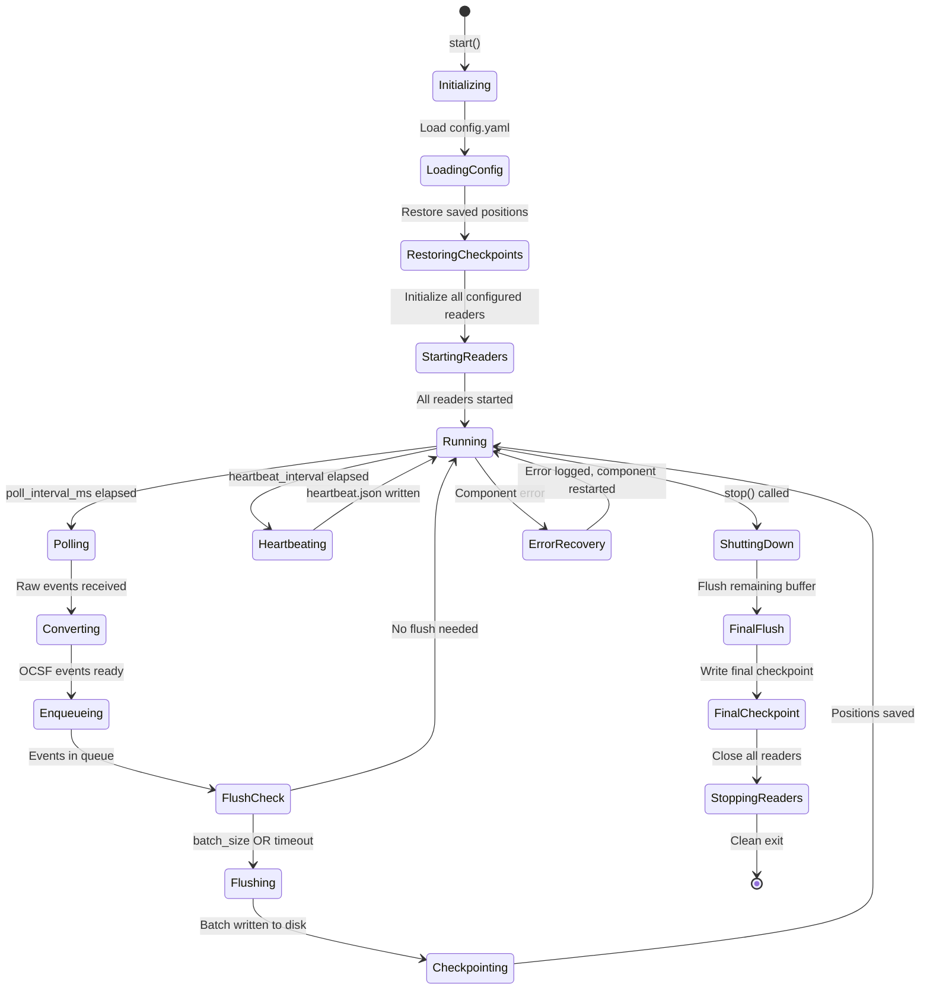

---

## 3. Windows Reader

The Windows Reader collects events from the Windows Event Log using **ETW (Event Tracing for Windows)**.

### 3.1 Architecture

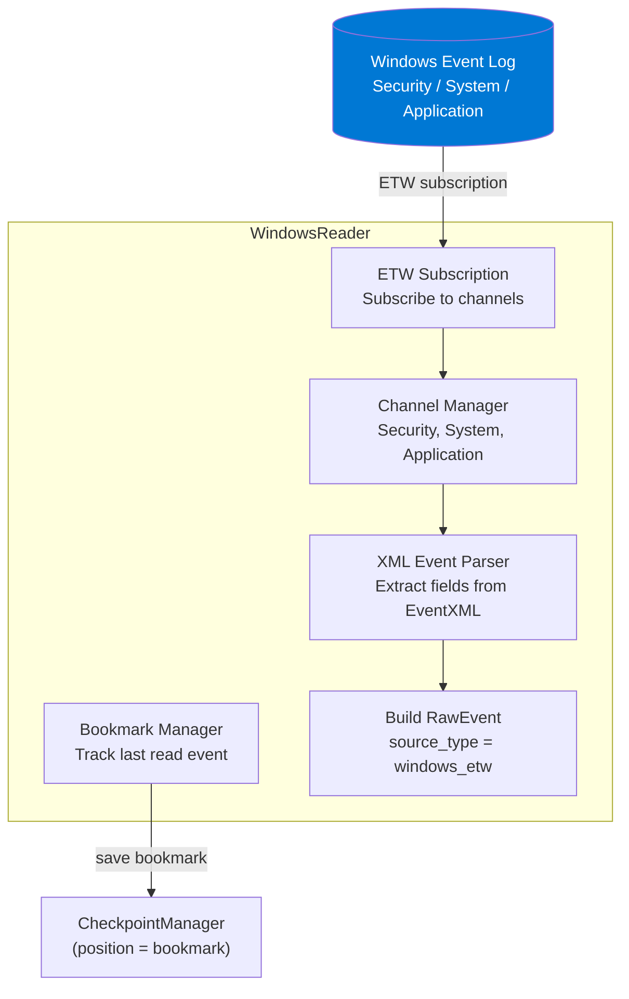

### 3.2 Channel Configuration

| Channel | Event Types | Windows Log Name |
|---|---|---|
| **Security** | Logon/logoff, privilege use, audit policy changes, process creation | `Security` |
| **System** | Service start/stop, driver load, system errors | `System` |
| **Application** | Application errors, warnings, informational | `Application` |
| **Sysmon** (optional) | Process creation with hashes, network connections, file creation | `Microsoft-Windows-Sysmon/Operational` |
| **PowerShell** (optional) | Script block logging, module logging | `Microsoft-Windows-PowerShell/Operational` |

### 3.3 Windows Event to OCSF Mapping (Examples)

| Windows Event ID | Windows Description | OCSF Category | OCSF Class |
|---|---|---|---|
| 4624 | Successful logon | Identity & Access | Authentication |
| 4625 | Failed logon | Identity & Access | Authentication |
| 4648 | Logon using explicit credentials | Identity & Access | Authentication |
| 4672 | Special privileges assigned | Identity & Access | Authorization |
| 4688 | New process created | System Activity | Process Activity |
| 4720 | User account created | Identity & Access | Account Change |
| 7045 | New service installed | System Activity | Service Activity |
| 1102 | Audit log cleared | System Activity | Audit Activity |

### 3.4 Checkpoint Strategy

| Item | Mechanism |
|---|---|
| **Position tracking** | ETW bookmark (XML blob) saved per channel |
| **Resume** | On restart, subscription starts from saved bookmark |
| **Missing bookmark** | Falls back to `oldest` or `newest` (configurable) |

---

## 4. Linux Reader

The Linux Reader collects events from two primary sources: **syslog** and **file tailing**.

### 4.1 Syslog Reader Architecture

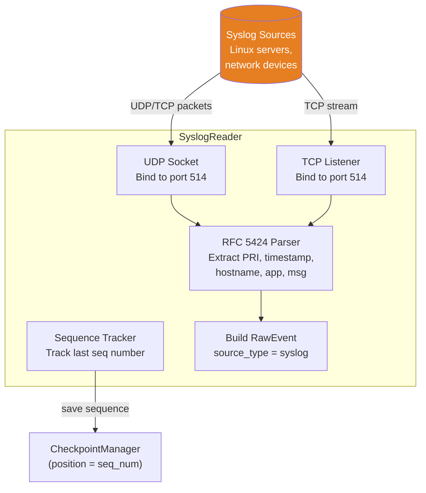

### 4.2 File Reader Architecture

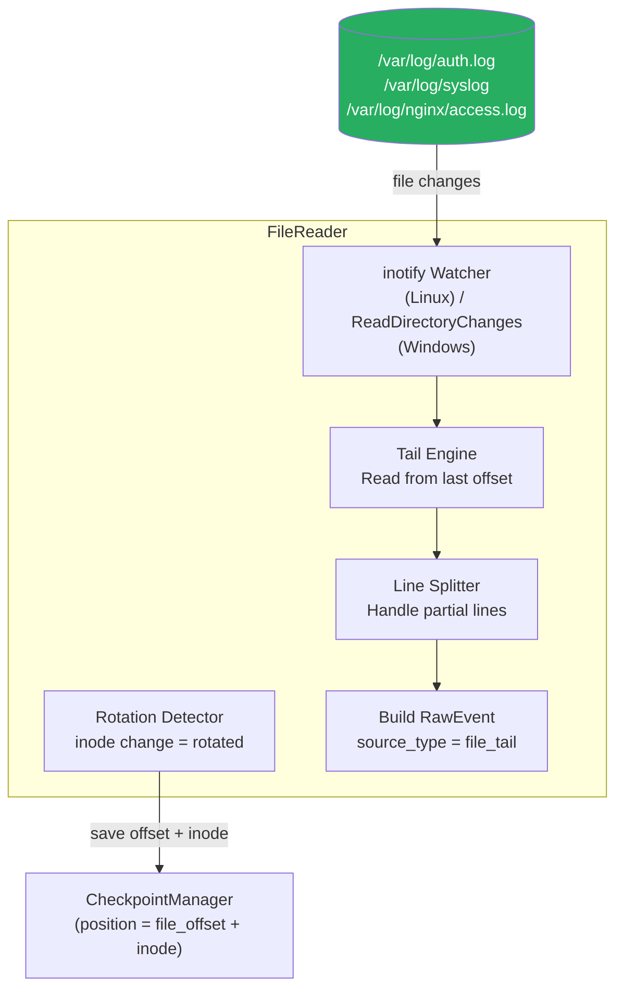

### 4.3 Syslog Field Mapping

| RFC 5424 Field | OCSF Mapping |
|---|---|
| `PRI` (facility + severity) | `severity_id`, `metadata.log_level` |
| `TIMESTAMP` | `time` |
| `HOSTNAME` | `src_endpoint.hostname` |
| `APP-NAME` | `metadata.product.name` |
| `PROCID` | `actor.process.pid` |
| `MSGID` | `metadata.uid` |
| `MSG` | `message` |

### 4.4 File Reader Features

| Feature | Detail |
|---|---|
| **Tail from offset** | Resumes reading from the last saved byte offset |
| **Log rotation detection** | Detects inode change (file was rotated); re-opens the new file and reads from beginning |
| **Partial line handling** | Buffers incomplete lines until newline is received |
| **Multi-file monitoring** | Watches multiple log files concurrently via inotify/ReadDirectoryChanges |
| **Glob pattern support** | Configuration supports glob patterns (e.g., `/var/log/nginx/*.log`) |

### 4.5 Checkpoint Strategy

| Reader | Position Type | Resume Behavior |
|---|---|---|
| **SyslogReader** | `{last_seq_num: uint64}` | Cannot truly resume UDP (stateless); logs warning on restart. TCP can resume if sender supports. |
| **FileReader** | `{file_path, inode, byte_offset}` | Seeks to saved offset. If inode changed (rotation), reads new file from beginning |

---

## 5. Internal Queue

The Internal Queue is a **lock-free ring buffer** that decouples readers from the batch writer. It absorbs bursts without blocking readers.

### 5.1 Ring Buffer Architecture

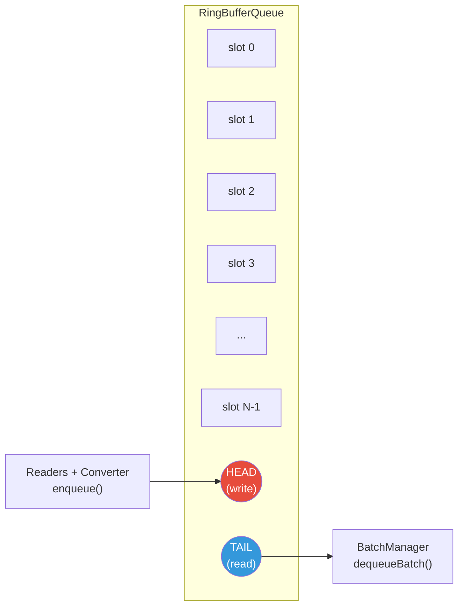

### 5.2 Queue Properties

| Property | Value |
|---|---|
| **Data structure** | Fixed-size circular buffer (`std::vector<OCSFEvent>`) |
| **Thread safety** | Lock-free using `std::atomic<size_t>` for head and tail pointers |
| **Capacity** | Configurable (default: 100,000 events) |
| **Overflow policy** | Drop oldest events when full (log warning + increment drop counter) |
| **Memory allocation** | Pre-allocated at startup; no dynamic allocation in hot path |

### 5.3 Queue Operations

| Operation | Complexity | Behavior |
|---|---|---|
| `enqueue(event)` | O(1) | Write event at head position; advance head. Returns `false` if full (overflow) |
| `dequeueBatch(maxSize)` | O(n) | Read up to `maxSize` events from tail; advance tail. Returns vector of events |
| `size()` | O(1) | Returns `(head - tail) % capacity` |
| `isFull()` | O(1) | Returns `(head + 1) % capacity == tail` |
| `capacity()` | O(1) | Returns configured capacity |

### 5.4 Backpressure Strategy

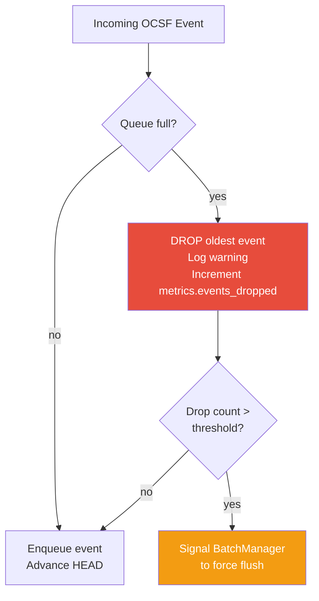

---

## 6. Batch Manager

The Batch Manager decides **when** to flush the queue to disk and **how** to assemble a batch.

### 6.1 Flush Triggers

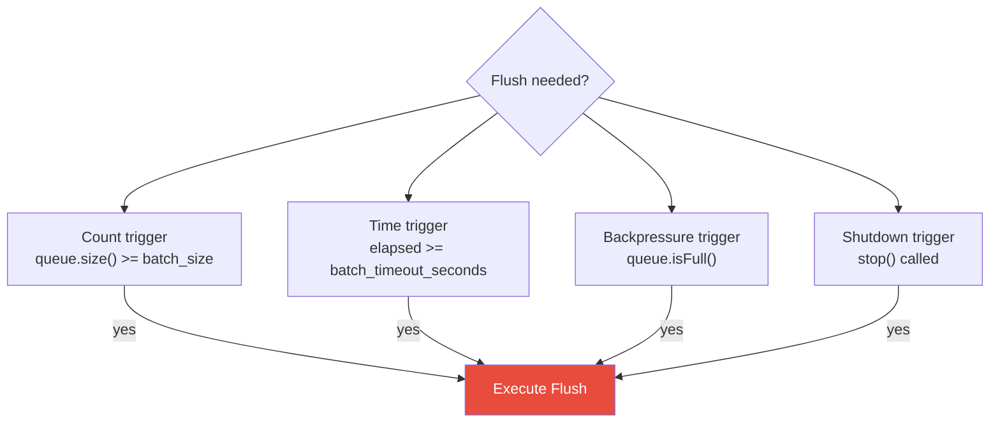

| Trigger | Condition | Default |
|---|---|---|
| **Count** | `queue.size() >= batch_size` | 1000 events |
| **Time** | `now - lastFlushTime >= batch_timeout` | 5 seconds |
| **Backpressure** | `queue.isFull()` | Queue at capacity |
| **Shutdown** | `stop()` called | Graceful shutdown flush |

### 6.2 Batch Assembly Process

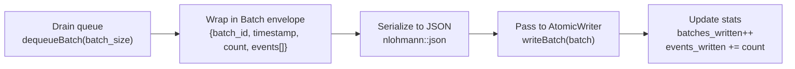

### 6.3 Batch File Format

Each batch file is a JSON document with the following structure:

```json
{
  "batch_id": "batch_1721293200_001",
  "collector_id": "collector-host-01",
  "timestamp": "2026-07-18T12:00:00.000Z",
  "event_count": 1000,
  "schema_version": "1.1.0",
  "events": [
    {
      "class_uid": 3002,
      "category_uid": 3,
      "severity_id": 3,
      "time": "2026-07-18T11:59:58.123Z",
      "message": "Failed password for root from 192.168.1.100",
      "src_endpoint": {
        "ip": "192.168.1.100",
        "hostname": "attacker-host"
      },
      "dst_endpoint": {
        "ip": "10.0.0.5",
        "hostname": "target-server"
      },
      "metadata": {
        "product": { "name": "sshd", "vendor_name": "OpenSSH" },
        "version": "1.1.0",
        "log_level": "warning"
      },
      "unmapped": {
        "original_log": "<raw syslog line>"
      }
    }
  ]
}
```

### 6.4 AtomicWriter Process

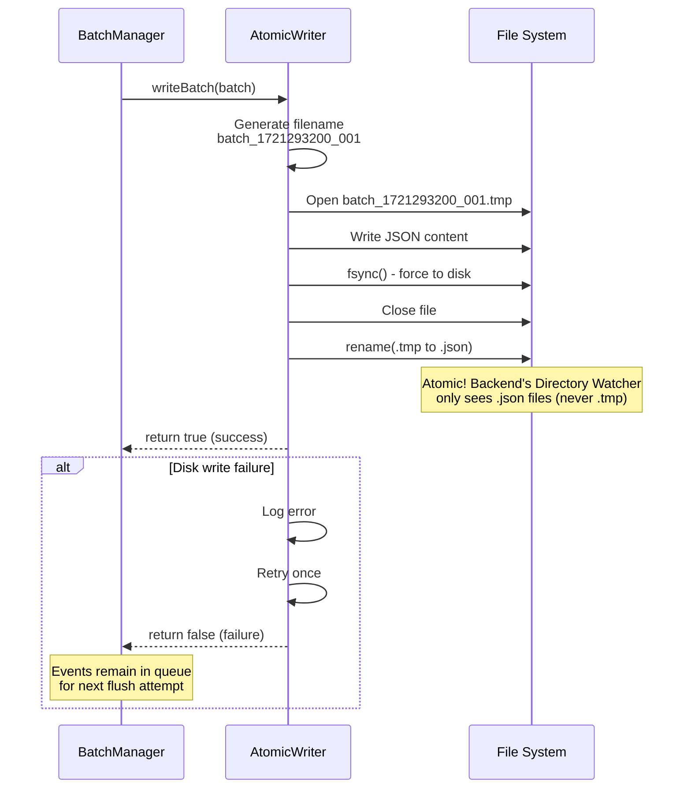

### 6.5 Batch Statistics

| Metric | Type | Description |
|---|---|---|
| `batches_written` | Counter | Total batch files written since startup |
| `events_written` | Counter | Total events written across all batches |
| `events_dropped` | Counter | Events dropped due to queue overflow |
| `last_flush_time` | Timestamp | When the last batch was flushed |
| `avg_batch_size` | Gauge | Rolling average events per batch |
| `flush_duration_ms` | Histogram | Time taken to serialize + write + rename |

---

## 7. Checkpoint Manager

The Checkpoint Manager provides **crash recovery** by tracking the read position of every source.

### 7.1 Checkpoint Architecture

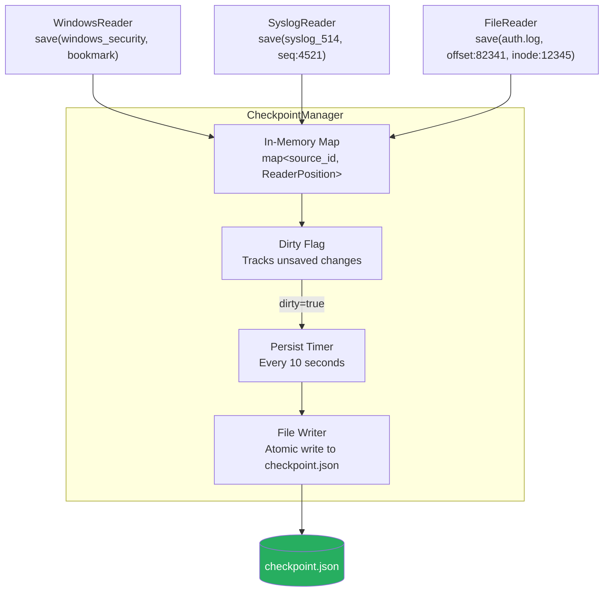

### 7.2 Checkpoint File Format

```json
{
  "version": 1,
  "last_updated": "2026-07-18T12:00:10.000Z",
  "sources": {
    "windows_security": {
      "type": "etw_bookmark",
      "bookmark": "<xml bookmark blob>",
      "last_event_time": "2026-07-18T11:59:58.000Z"
    },
    "syslog_514": {
      "type": "sequence_number",
      "last_seq_num": 4521,
      "last_event_time": "2026-07-18T11:59:59.000Z"
    },
    "file_/var/log/auth.log": {
      "type": "file_offset",
      "inode": 12345,
      "byte_offset": 82341,
      "last_event_time": "2026-07-18T11:59:57.000Z"
    }
  }
}
```

### 7.3 Checkpoint Lifecycle

| Event | Action |
|---|---|
| **Collector starts** | Load `checkpoint.json`; pass positions to readers for resume |
| **Event successfully enqueued** | Update in-memory position for that source; set dirty flag |
| **Batch successfully written** | Immediately persist checkpoint to disk (ensures consistency: if batch was written, positions are saved) |
| **Periodic timer (10s)** | If dirty flag is set, persist to disk |
| **Graceful shutdown** | Final persist before exit |
| **Checkpoint file missing** | Start all sources from beginning (or `newest` if configured) |
| **Checkpoint file corrupt** | Log error; start from beginning; backup corrupt file |

### 7.4 Atomicity Guarantee

Checkpoint writes use the same atomic pattern as batch writes:

1. Write to `checkpoint.json.tmp`
2. `fsync()` to force to disk
3. Rename to `checkpoint.json`

This ensures the checkpoint file is never partially written.

---

## 8. Logger

The Logger provides **structured, leveled logging** for all collector components using spdlog.

### 8.1 Logger Configuration

| Property | Value |
|---|---|
| **Library** | spdlog (high-performance C++ logging) |
| **Format** | Structured JSON for production; colored text for development |
| **Levels** | TRACE, DEBUG, INFO, WARN, ERROR, CRITICAL |
| **Output targets** | Console (stderr) + rotating file (`collector.log`) |
| **Rotation** | 10MB per file, 5 rotated files retained |
| **Async** | Async logging with 8K slot ring buffer (non-blocking) |

### 8.2 Log Entry Structure

```json
{
  "timestamp": "2026-07-18T12:00:05.123Z",
  "level": "INFO",
  "component": "BatchManager",
  "message": "Batch flushed successfully",
  "data": {
    "batch_id": "batch_1721293200_001",
    "event_count": 1000,
    "flush_duration_ms": 45,
    "queue_size_after": 234
  }
}
```

### 8.3 Logging Standards

| Level | Usage | Example |
|---|---|---|
| **TRACE** | Detailed internal state (poll loop iteration, individual event processing) | `"Polling reader: syslog_514"` |
| **DEBUG** | Diagnostic information useful during development | `"OCSF conversion result: 15 events converted, 0 dropped"` |
| **INFO** | Normal operational events | `"Batch written: batch_1721293200_001 (1000 events)"` |
| **WARN** | Recoverable issues that need attention | `"Queue overflow: 5 events dropped"` |
| **ERROR** | Failures that affect functionality but don't crash the collector | `"Disk write failed for batch_1721293200_002: No space left"` |
| **CRITICAL** | Unrecoverable failures that will cause shutdown | `"Cannot bind to syslog port 514: Permission denied"` |

---

## 9. Configuration

### 9.1 Configuration File (config.yaml)

```yaml
# Collector Agent Configuration
collector:
  id: "collector-host-01"
  log_level: "INFO"                       # TRACE | DEBUG | INFO | WARN | ERROR | CRITICAL
  log_format: "json"                      # json | text
  log_file: "./logs/collector.log"
  log_max_size_mb: 10
  log_max_files: 5

# Output Configuration
output:
  directory: "/var/siem/collector/"        # Where batch files are written
  heartbeat_interval_seconds: 30
  checkpoint_file: "./checkpoint.json"
  checkpoint_persist_interval_seconds: 10

# Scheduler Configuration
scheduler:
  poll_interval_ms: 100                   # How often to poll readers
  batch_size: 1000                        # Events per batch file
  batch_timeout_seconds: 5               # Max seconds before flush
  queue_capacity: 100000                  # Ring buffer capacity

# Source Definitions
sources:
  - id: "syslog_514"
    type: "syslog"
    enabled: true
    protocol: "udp"                       # udp | tcp | both
    bind_address: "0.0.0.0"
    port: 514
    start_position: "newest"              # oldest | newest (used if no checkpoint)

  - id: "auth_log"
    type: "file"
    enabled: true
    paths:
      - "/var/log/auth.log"
      - "/var/log/secure"
    start_position: "oldest"

  - id: "nginx_access"
    type: "file"
    enabled: true
    paths:
      - "/var/log/nginx/access.log"
      - "/var/log/nginx/error.log"
    start_position: "newest"

  - id: "windows_security"
    type: "windows_etw"
    enabled: false                        # Disabled on Linux
    channels:
      - "Security"
      - "System"
      - "Application"
    start_position: "oldest"

  - id: "http_json"
    type: "http"
    enabled: true
    bind_address: "0.0.0.0"
    port: 8080
    max_body_size_kb: 512

# OCSF Mapping Configuration
ocsf:
  schema_version: "1.1.0"
  unknown_field_policy: "unmapped"        # unmapped | drop | error
  custom_mappings_dir: "./mappings/"      # Directory with custom OCSF mapping files
```

### 9.2 Configuration Loading

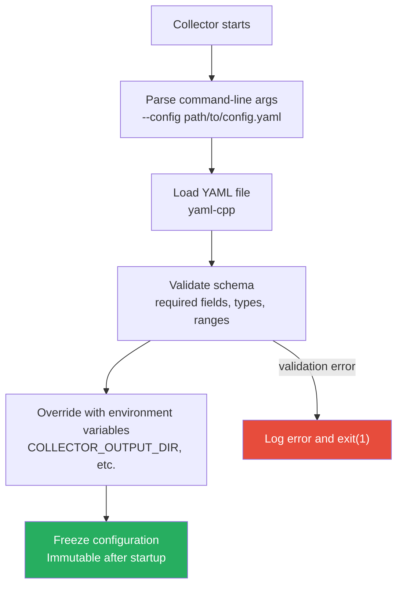

### 9.3 Configuration Validation Rules

| Field | Validation | Error on Failure |
|---|---|---|
| `collector.id` | Non-empty string | `"collector.id is required"` |
| `output.directory` | Directory exists and is writable | `"Output directory not writable: /path"` |
| `scheduler.batch_size` | Integer, 1 to 100,000 | `"batch_size must be between 1 and 100000"` |
| `scheduler.queue_capacity` | Integer, >= batch_size × 2 | `"queue_capacity must be at least 2x batch_size"` |
| `sources` | At least one enabled source | `"No enabled sources configured"` |
| `sources[].port` | Integer, 1 to 65535 (for syslog/http) | `"Invalid port number"` |
| `sources[].paths` | Each path exists (for file type) | `"Log file not found: /path"` (warning, not fatal) |

### 9.4 Environment Variable Overrides

| Environment Variable | Overrides | Example |
|---|---|---|
| `COLLECTOR_ID` | `collector.id` | `collector-prod-01` |
| `COLLECTOR_LOG_LEVEL` | `collector.log_level` | `DEBUG` |
| `COLLECTOR_OUTPUT_DIR` | `output.directory` | `/mnt/siem/collector/` |
| `COLLECTOR_BATCH_SIZE` | `scheduler.batch_size` | `5000` |
| `COLLECTOR_BATCH_TIMEOUT` | `scheduler.batch_timeout_seconds` | `10` |

---

## 10. Failure Recovery

### 10.1 Failure Scenarios and Recovery

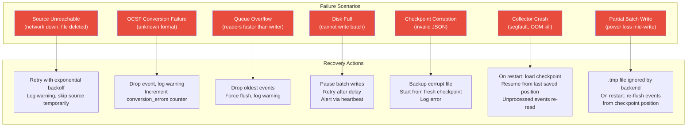

### 10.2 Failure Recovery Matrix

| Scenario | Detection | Automatic Recovery | Data Loss? | Severity |
|---|---|---|---|---|
| **Source unreachable** | `poll()` returns error or empty | Exponential backoff retry (1s, 2s, 4s, ... max 60s). Source marked as `degraded` in heartbeat | No (checkpointed) | Medium |
| **OCSF conversion failure** | `convert()` returns `nullopt` | Event dropped, warning logged, counter incremented | Single event | Low |
| **Queue overflow** | `enqueue()` returns `false` | Drop oldest events; force immediate batch flush | Oldest unbatched events | Medium |
| **Disk full** | `write()` returns error, `errno == ENOSPC` | Pause writes, retry every 5s, report `degraded` via heartbeat | No (events remain in queue) | High |
| **Checkpoint corruption** | JSON parse error on load | Backup corrupt file to `.corrupt.bak`, create fresh checkpoint, restart from beginning | Events between last good checkpoint and crash may be re-read (duplicates, not loss) | Medium |
| **Collector process crash** | Process exits unexpectedly | On restart: load last persisted checkpoint, resume from saved positions | Events since last checkpoint persist may be re-read (at-least-once delivery) | High |
| **Partial batch write** | `.tmp` file exists without `.json` | On startup: delete orphaned `.tmp` files. Events re-read from checkpoint positions | At-least-once delivery | Low |
| **Config file missing** | File not found on startup | Exit with clear error message. Cannot auto-recover | N/A | Critical |

### 10.3 Delivery Guarantee

> [!IMPORTANT]
> The Collector provides **at-least-once** delivery. In crash scenarios, some events between the last checkpoint persist and the crash point may be re-read and re-written to a new batch. The backend's pipeline (Parser/Normalizer) should be prepared for potential duplicate events. Deduplication is the backend's responsibility, not the collector's.

### 10.4 Graceful Shutdown Sequence

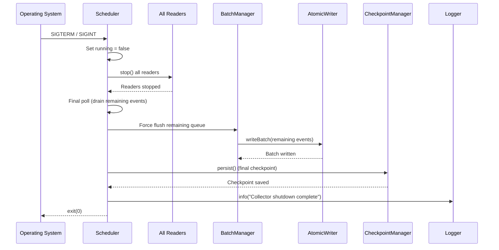

---

## 11. Folder Structure

### 11.1 Source Code Layout

```
collector/
├── CMakeLists.txt                         # Root CMake build file
├── config.yaml                            # Default configuration
├── README.md                              # Collector documentation
│
├── include/                               # Public headers (interfaces)
│   ├── collector/
│   │   ├── interfaces/                    # Pure virtual interfaces
│   │   │   ├── ILogReader.h
│   │   │   ├── IOCSFConverter.h
│   │   │   ├── IInternalQueue.h
│   │   │   ├── IBatchManager.h
│   │   │   ├── IOutputWriter.h
│   │   │   ├── ICheckpointManager.h
│   │   │   ├── ILogger.h
│   │   │   └── IConfigManager.h
│   │   ├── types/                         # Shared data types
│   │   │   ├── RawEvent.h
│   │   │   ├── OCSFEvent.h
│   │   │   ├── Batch.h
│   │   │   ├── ReaderPosition.h
│   │   │   ├── HealthStatus.h
│   │   │   ├── BatchStats.h
│   │   │   └── QueueStatus.h
│   │   └── core/
│   │       └── Scheduler.h
│   └── version.h                          # Version constants
│
├── src/                                   # Implementation files
│   ├── main.cpp                           # Entry point, CLI args, bootstrap
│   ├── core/
│   │   └── Scheduler.cpp                  # Orchestrator implementation
│   ├── readers/                           # ILogReader implementations
│   │   ├── WindowsReader.cpp
│   │   ├── WindowsReader.h
│   │   ├── SyslogReader.cpp
│   │   ├── SyslogReader.h
│   │   ├── FileReader.cpp
│   │   ├── FileReader.h
│   │   ├── HttpReader.cpp
│   │   └── HttpReader.h
│   ├── ocsf/                              # OCSF conversion
│   │   ├── OCSFConverter.cpp
│   │   ├── OCSFConverter.h
│   │   ├── IMappingStrategy.h             # Interface for source-specific mapping
│   │   ├── SyslogMappingStrategy.cpp
│   │   ├── SyslogMappingStrategy.h
│   │   ├── WindowsMappingStrategy.cpp
│   │   ├── WindowsMappingStrategy.h
│   │   ├── FileMappingStrategy.cpp
│   │   ├── FileMappingStrategy.h
│   │   ├── HttpMappingStrategy.cpp
│   │   └── HttpMappingStrategy.h
│   ├── queue/                             # Internal queue
│   │   ├── RingBufferQueue.cpp
│   │   └── RingBufferQueue.h
│   ├── batch/                             # Batch management
│   │   ├── BatchManager.cpp
│   │   ├── BatchManager.h
│   │   ├── AtomicFileWriter.cpp
│   │   ├── AtomicFileWriter.h
│   │   ├── HeartbeatWriter.cpp
│   │   └── HeartbeatWriter.h
│   ├── checkpoint/                        # Checkpoint persistence
│   │   ├── FileCheckpointManager.cpp
│   │   └── FileCheckpointManager.h
│   ├── config/                            # Configuration loading
│   │   ├── YamlConfigManager.cpp
│   │   └── YamlConfigManager.h
│   └── logging/                           # Logger wrapper
│       ├── SpdlogLogger.cpp
│       └── SpdlogLogger.h
│
├── mappings/                              # Custom OCSF mapping files
│   ├── syslog_mappings.json
│   ├── windows_mappings.json
│   └── custom_app_mappings.json
│
├── tests/                                 # Google Test unit tests
│   ├── CMakeLists.txt
│   ├── test_main.cpp
│   ├── readers/
│   │   ├── SyslogReader_test.cpp
│   │   ├── FileReader_test.cpp
│   │   └── HttpReader_test.cpp
│   ├── ocsf/
│   │   ├── OCSFConverter_test.cpp
│   │   └── SyslogMappingStrategy_test.cpp
│   ├── queue/
│   │   └── RingBufferQueue_test.cpp
│   ├── batch/
│   │   ├── BatchManager_test.cpp
│   │   └── AtomicFileWriter_test.cpp
│   ├── checkpoint/
│   │   └── FileCheckpointManager_test.cpp
│   ├── config/
│   │   └── YamlConfigManager_test.cpp
│   └── mocks/                             # Mock implementations for testing
│       ├── MockLogReader.h
│       ├── MockOCSFConverter.h
│       ├── MockInternalQueue.h
│       ├── MockBatchManager.h
│       ├── MockOutputWriter.h
│       └── MockCheckpointManager.h
│
├── scripts/
│   ├── build.sh                           # Build script
│   ├── run.sh                             # Run script with default config
│   └── test.sh                            # Run tests
│
├── docker/
│   └── Dockerfile                         # Multi-stage build
│
└── docs/
    └── OCSF_MAPPING_GUIDE.md              # How to create custom mappings
```

### 11.2 Runtime Directory Layout

When the collector is running, the following directory structure exists on disk:

```
/var/siem/
├── collector/                             # OUTPUT DIRECTORY (watched by backend)
│   ├── batch_1721293200_001.json          # Completed batch (ready for backend)
│   ├── batch_1721293210_002.json          # Completed batch
│   ├── batch_1721293220_003.tmp           # In-progress write (ignored by backend)
│   └── heartbeat.json                     # Latest health status
│
├── collector-state/                       # COLLECTOR INTERNAL STATE
│   ├── checkpoint.json                    # Current reader positions
│   ├── checkpoint.json.tmp                # Atomic write in-progress (if exists)
│   └── checkpoint.json.corrupt.bak        # Backup of corrupt checkpoint (if recovered)
│
├── collector-quarantine/                  # QUARANTINE (if any files fail)
│   └── (empty in normal operation)
│
└── collector-logs/                        # COLLECTOR LOGS
    ├── collector.log                      # Current log file
    ├── collector.1.log                    # Rotated log
    └── collector.2.log                    # Rotated log
```

### 11.3 Build Dependencies

| Dependency | Version | Purpose | License |
|---|---|---|---|
| **nlohmann/json** | 3.x | JSON serialization/deserialization | MIT |
| **yaml-cpp** | 0.7+ | YAML configuration parsing | MIT |
| **spdlog** | 1.x | High-performance structured logging | MIT |
| **fmt** | 10.x | String formatting (spdlog dependency) | MIT |
| **Google Test** | 1.x | Unit testing framework | BSD-3 |
| **Google Mock** | 1.x | Mocking framework (bundled with GTest) | BSD-3 |
| **cpp-httplib** | 0.x | Lightweight HTTP server for HttpReader | MIT |
| **asio** (standalone) | 1.x | Async networking for Syslog TCP | BSL-1.0 |

### 11.4 CMake Build Targets

| Target | Command | Description |
|---|---|---|
| `collector` | `cmake --build . --target collector` | Main collector binary |
| `collector_tests` | `cmake --build . --target collector_tests` | Unit test binary |
| `run_tests` | `ctest --output-on-failure` | Execute all tests |
| `format` | `cmake --build . --target format` | Run clang-format |
| `sanitize` | `cmake -DSANITIZE=ON ..` | Build with AddressSanitizer + UBSan |

---

> **This document is governed by [ADR-001](file:///d:/AI%20SIEM/docs/architecture/decisions/ADR-001-modular-monolith.md). The Collector Agent's responsibilities are strictly bounded: collect, convert, batch, checkpoint, write. It never performs parsing, detection, AI inference, incident generation, or database operations.**
>
> **Document Version**: 1.0
> **Last Updated**: 2026-07-18
