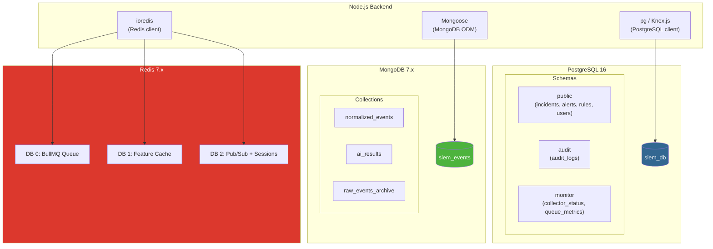
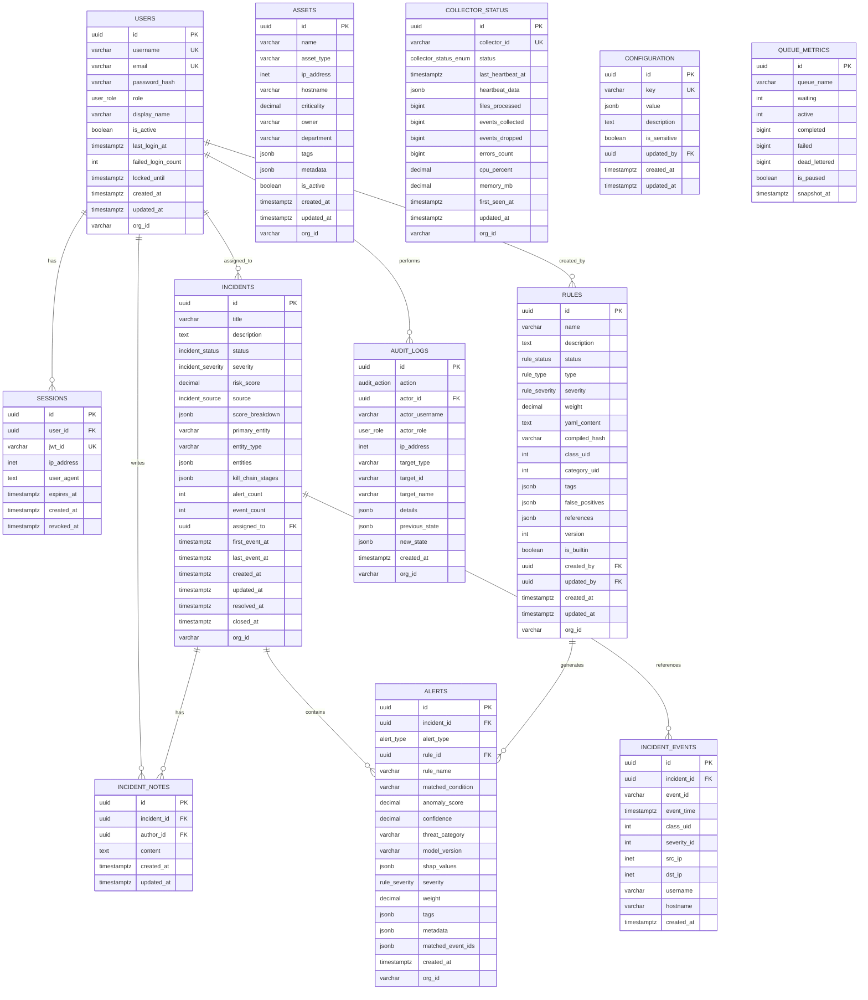
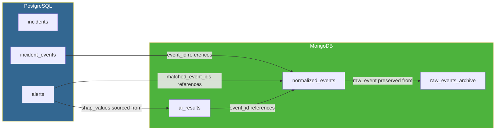
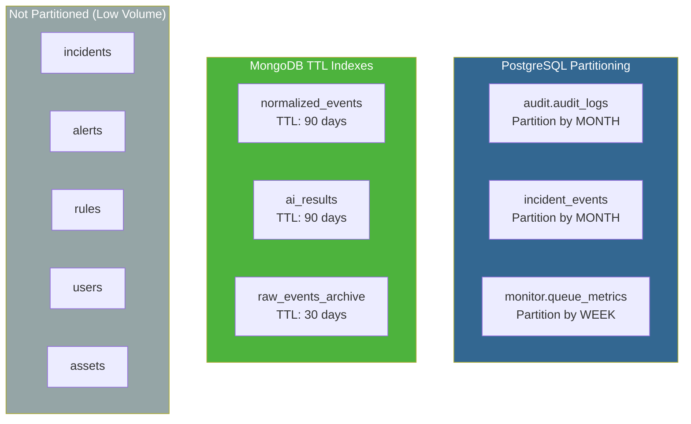
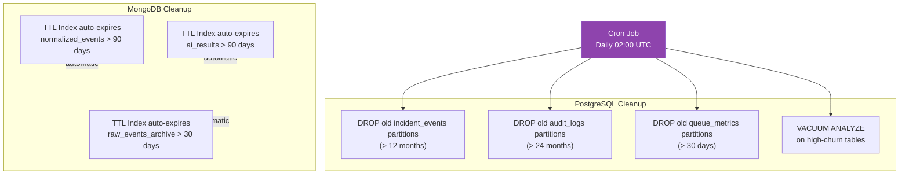
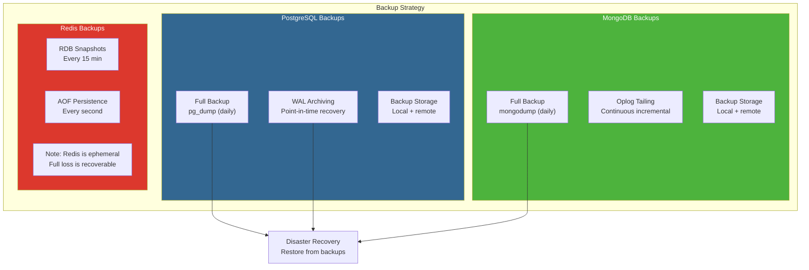

# Database Design

## AI-Powered Security Analytics Platform

| Field | Value |
|---|---|
| **Document ID** | DB-001 |
| **Version** | 1.0 |
| **Date** | 2026-07-18 |
| **Status** | Draft |
| **Architecture Reference** | [ADR-001](file:///d:/AI%20SIEM/docs/architecture/decisions/ADR-001-modular-monolith.md) |
| **HLD Reference** | [HLD-001](file:///d:/AI%20SIEM/docs/HLD.md) |
| **Backend Detection** | [BACKEND-002](file:///d:/AI%20SIEM/docs/backend-detection.md) |

---

## Table of Contents

1. [Overview](#1-overview)
2. [PostgreSQL Schema](#2-postgresql-schema)
3. [MongoDB Schema](#3-mongodb-schema)
4. [ER Diagram](#4-er-diagram)
5. [Relationships](#5-relationships)
6. [Indexes](#6-indexes)
7. [Constraints](#7-constraints)
8. [Partitioning](#8-partitioning)
9. [Retention Policy](#9-retention-policy)
10. [Backup Strategy](#10-backup-strategy)

---

## 1. Overview

### 1.1 Storage Responsibility Split

| Database | Stores | Rationale |
|---|---|---|
| **PostgreSQL 16** | Incidents, Alerts, Rules, Users, Roles, Sessions, Audit Logs, Collector Status, Asset Registry, Configuration | Relational integrity, ACID transactions, foreign key enforcement, lifecycle management |
| **MongoDB 7.x** | Normalized OCSF Events, AI Detection Results, Raw Event Archive | High-volume document storage, flexible schema for heterogeneous events, TTL indexes for retention |
| **Redis 7.x** | BullMQ Queue, Feature Cache, Pub/Sub Channels, Session Cache | Ephemeral data, real-time operations — not a persistent data store (documented in BACKEND-001) |

### 1.2 Database Topology



---

## 2. PostgreSQL Schema

### 2.1 Complete SQL Schema

```sql
-- ============================================================
-- AI-Powered Security Analytics Platform
-- PostgreSQL Schema — Version 1.0
-- Database: siem_db
-- ============================================================

-- Enable required extensions
CREATE EXTENSION IF NOT EXISTS "uuid-ossp";       -- UUID generation
CREATE EXTENSION IF NOT EXISTS "pgcrypto";         -- Encryption functions
CREATE EXTENSION IF NOT EXISTS "pg_trgm";          -- Trigram text search

-- Create schemas
CREATE SCHEMA IF NOT EXISTS audit;
CREATE SCHEMA IF NOT EXISTS monitor;

-- ============================================================
-- ENUM TYPES
-- ============================================================

CREATE TYPE incident_status AS ENUM (
    'open',
    'investigating',
    'resolved',
    'closed'
);

CREATE TYPE incident_severity AS ENUM (
    'critical',
    'high',
    'medium',
    'low',
    'informational'
);

CREATE TYPE incident_source AS ENUM (
    'rule',
    'ai',
    'both'
);

CREATE TYPE alert_type AS ENUM (
    'rule',
    'ai'
);

CREATE TYPE rule_status AS ENUM (
    'active',
    'disabled',
    'archived'
);

CREATE TYPE rule_type AS ENUM (
    'match',
    'count',
    'sequence'
);

CREATE TYPE rule_severity AS ENUM (
    'critical',
    'high',
    'medium',
    'low',
    'informational'
);

CREATE TYPE user_role AS ENUM (
    'admin',
    'security_engineer',
    'soc_analyst'
);

CREATE TYPE collector_status_enum AS ENUM (
    'online',
    'degraded',
    'offline'
);

CREATE TYPE audit_action AS ENUM (
    'login',
    'logout',
    'incident_create',
    'incident_update',
    'incident_status_change',
    'incident_assign',
    'rule_create',
    'rule_update',
    'rule_delete',
    'rule_enable',
    'rule_disable',
    'rule_import',
    'user_create',
    'user_update',
    'user_delete',
    'config_change',
    'collector_config_change'
);

-- ============================================================
-- TABLE: incidents
-- Primary incident record with lifecycle management
-- ============================================================

CREATE TABLE incidents (
    id                UUID PRIMARY KEY DEFAULT uuid_generate_v4(),
    title             VARCHAR(500) NOT NULL,
    description       TEXT,
    status            incident_status NOT NULL DEFAULT 'open',
    severity          incident_severity NOT NULL DEFAULT 'medium',
    risk_score        DECIMAL(5,2) NOT NULL DEFAULT 0.00,
    source            incident_source NOT NULL DEFAULT 'rule',

    -- Score breakdown (JSONB for flexibility)
    score_breakdown   JSONB NOT NULL DEFAULT '{}'::jsonb,

    -- Entity references
    primary_entity    VARCHAR(255),
    entity_type       VARCHAR(50),
    entities          JSONB NOT NULL DEFAULT '[]'::jsonb,

    -- Kill chain (optional MITRE ATT&CK)
    kill_chain_stages JSONB NOT NULL DEFAULT '[]'::jsonb,

    -- Counts (denormalized for dashboard performance)
    alert_count       INTEGER NOT NULL DEFAULT 0,
    event_count       INTEGER NOT NULL DEFAULT 0,

    -- Assignment
    assigned_to       UUID REFERENCES users(id) ON DELETE SET NULL,

    -- Timestamps
    first_event_at    TIMESTAMPTZ,
    last_event_at     TIMESTAMPTZ,
    created_at        TIMESTAMPTZ NOT NULL DEFAULT NOW(),
    updated_at        TIMESTAMPTZ NOT NULL DEFAULT NOW(),
    resolved_at       TIMESTAMPTZ,
    closed_at         TIMESTAMPTZ,

    -- Multi-tenancy placeholder
    org_id            VARCHAR(100) NOT NULL DEFAULT 'default'
);

-- ============================================================
-- TABLE: alerts
-- Individual alerts generated by Rule Engine or AI Client
-- ============================================================

CREATE TABLE alerts (
    id                UUID PRIMARY KEY DEFAULT uuid_generate_v4(),
    incident_id       UUID REFERENCES incidents(id) ON DELETE CASCADE,
    alert_type        alert_type NOT NULL,

    -- Rule-specific fields (null for AI alerts)
    rule_id           UUID REFERENCES rules(id) ON DELETE SET NULL,
    rule_name         VARCHAR(255),
    matched_condition VARCHAR(500),

    -- AI-specific fields (null for rule alerts)
    anomaly_score     DECIMAL(5,4),
    confidence        DECIMAL(5,4),
    threat_category   VARCHAR(100),
    model_version     VARCHAR(50),
    shap_values       JSONB,

    -- Common fields
    severity          rule_severity NOT NULL DEFAULT 'medium',
    weight            DECIMAL(3,2) NOT NULL DEFAULT 0.50,
    tags              JSONB NOT NULL DEFAULT '[]'::jsonb,
    metadata          JSONB NOT NULL DEFAULT '{}'::jsonb,

    -- Events that triggered this alert
    matched_event_ids JSONB NOT NULL DEFAULT '[]'::jsonb,

    -- Timestamps
    created_at        TIMESTAMPTZ NOT NULL DEFAULT NOW(),

    -- Multi-tenancy placeholder
    org_id            VARCHAR(100) NOT NULL DEFAULT 'default'
);

-- ============================================================
-- TABLE: incident_events
-- Junction table: many-to-many between incidents and OCSF events
-- Event IDs reference MongoDB documents
-- ============================================================

CREATE TABLE incident_events (
    id                UUID PRIMARY KEY DEFAULT uuid_generate_v4(),
    incident_id       UUID NOT NULL REFERENCES incidents(id) ON DELETE CASCADE,
    event_id          VARCHAR(255) NOT NULL,         -- References MongoDB normalized_events._id
    event_time        TIMESTAMPTZ NOT NULL,
    class_uid         INTEGER,
    severity_id       INTEGER,
    src_ip            INET,
    dst_ip            INET,
    username          VARCHAR(255),
    hostname          VARCHAR(255),

    created_at        TIMESTAMPTZ NOT NULL DEFAULT NOW(),

    UNIQUE(incident_id, event_id)
);

-- ============================================================
-- TABLE: incident_notes
-- Analyst notes and comments on incidents
-- ============================================================

CREATE TABLE incident_notes (
    id                UUID PRIMARY KEY DEFAULT uuid_generate_v4(),
    incident_id       UUID NOT NULL REFERENCES incidents(id) ON DELETE CASCADE,
    author_id         UUID NOT NULL REFERENCES users(id) ON DELETE CASCADE,
    content           TEXT NOT NULL,
    created_at        TIMESTAMPTZ NOT NULL DEFAULT NOW(),
    updated_at        TIMESTAMPTZ NOT NULL DEFAULT NOW()
);

-- ============================================================
-- TABLE: rules
-- Sigma-compatible detection rules
-- ============================================================

CREATE TABLE rules (
    id                UUID PRIMARY KEY DEFAULT uuid_generate_v4(),
    name              VARCHAR(255) NOT NULL,
    description       TEXT,
    status            rule_status NOT NULL DEFAULT 'active',
    type              rule_type NOT NULL DEFAULT 'match',
    severity          rule_severity NOT NULL DEFAULT 'medium',
    weight            DECIMAL(3,2) NOT NULL DEFAULT 0.50,

    -- Rule definition
    yaml_content      TEXT NOT NULL,                 -- Raw Sigma YAML
    compiled_hash     VARCHAR(64),                   -- SHA-256 of compiled rule (for change detection)

    -- OCSF class/category filter
    class_uid         INTEGER,
    category_uid      INTEGER,

    -- Tags and metadata
    tags              JSONB NOT NULL DEFAULT '[]'::jsonb,
    false_positives   JSONB NOT NULL DEFAULT '[]'::jsonb,
    references        JSONB NOT NULL DEFAULT '[]'::jsonb,

    -- Versioning
    version           INTEGER NOT NULL DEFAULT 1,

    -- Is this a system-provided rule?
    is_builtin        BOOLEAN NOT NULL DEFAULT FALSE,

    -- Author
    created_by        UUID REFERENCES users(id) ON DELETE SET NULL,
    updated_by        UUID REFERENCES users(id) ON DELETE SET NULL,

    -- Timestamps
    created_at        TIMESTAMPTZ NOT NULL DEFAULT NOW(),
    updated_at        TIMESTAMPTZ NOT NULL DEFAULT NOW(),

    -- Multi-tenancy placeholder
    org_id            VARCHAR(100) NOT NULL DEFAULT 'default'
);

-- ============================================================
-- TABLE: users
-- Application user accounts
-- ============================================================

CREATE TABLE users (
    id                UUID PRIMARY KEY DEFAULT uuid_generate_v4(),
    username          VARCHAR(100) NOT NULL,
    email             VARCHAR(255) NOT NULL,
    password_hash     VARCHAR(255) NOT NULL,          -- bcrypt hash
    role              user_role NOT NULL DEFAULT 'soc_analyst',
    display_name      VARCHAR(255),

    -- Status
    is_active         BOOLEAN NOT NULL DEFAULT TRUE,
    last_login_at     TIMESTAMPTZ,
    failed_login_count INTEGER NOT NULL DEFAULT 0,
    locked_until      TIMESTAMPTZ,

    -- Timestamps
    created_at        TIMESTAMPTZ NOT NULL DEFAULT NOW(),
    updated_at        TIMESTAMPTZ NOT NULL DEFAULT NOW(),

    -- Multi-tenancy placeholder
    org_id            VARCHAR(100) NOT NULL DEFAULT 'default',

    UNIQUE(username, org_id),
    UNIQUE(email, org_id)
);

-- ============================================================
-- TABLE: sessions
-- Active user sessions (JWT tracking)
-- ============================================================

CREATE TABLE sessions (
    id                UUID PRIMARY KEY DEFAULT uuid_generate_v4(),
    user_id           UUID NOT NULL REFERENCES users(id) ON DELETE CASCADE,
    jwt_id            VARCHAR(255) NOT NULL UNIQUE,   -- JWT jti claim
    ip_address        INET,
    user_agent        TEXT,
    expires_at        TIMESTAMPTZ NOT NULL,
    created_at        TIMESTAMPTZ NOT NULL DEFAULT NOW(),
    revoked_at        TIMESTAMPTZ
);

-- ============================================================
-- TABLE: audit.audit_logs
-- Immutable audit trail of all user and system actions
-- ============================================================

CREATE TABLE audit.audit_logs (
    id                UUID PRIMARY KEY DEFAULT uuid_generate_v4(),
    action            audit_action NOT NULL,
    actor_id          UUID REFERENCES users(id) ON DELETE SET NULL,
    actor_username    VARCHAR(100),
    actor_role        user_role,
    ip_address        INET,

    -- What was acted upon
    target_type       VARCHAR(100),                   -- 'incident', 'rule', 'user', 'config'
    target_id         VARCHAR(255),
    target_name       VARCHAR(255),

    -- Change details
    details           JSONB NOT NULL DEFAULT '{}'::jsonb,
    previous_state    JSONB,
    new_state         JSONB,

    -- Timestamps
    created_at        TIMESTAMPTZ NOT NULL DEFAULT NOW(),

    -- Multi-tenancy placeholder
    org_id            VARCHAR(100) NOT NULL DEFAULT 'default'
);

-- ============================================================
-- TABLE: monitor.collector_status
-- Latest status of each collector agent
-- ============================================================

CREATE TABLE monitor.collector_status (
    id                UUID PRIMARY KEY DEFAULT uuid_generate_v4(),
    collector_id      VARCHAR(255) NOT NULL UNIQUE,
    status            collector_status_enum NOT NULL DEFAULT 'offline',

    -- Heartbeat data
    last_heartbeat_at TIMESTAMPTZ,
    heartbeat_data    JSONB NOT NULL DEFAULT '{}'::jsonb,

    -- Metrics
    files_processed   BIGINT NOT NULL DEFAULT 0,
    events_collected  BIGINT NOT NULL DEFAULT 0,
    events_dropped    BIGINT NOT NULL DEFAULT 0,
    errors_count      BIGINT NOT NULL DEFAULT 0,

    -- Resource usage
    cpu_percent       DECIMAL(5,2),
    memory_mb         DECIMAL(10,2),

    -- Timestamps
    first_seen_at     TIMESTAMPTZ NOT NULL DEFAULT NOW(),
    updated_at        TIMESTAMPTZ NOT NULL DEFAULT NOW(),

    -- Multi-tenancy placeholder
    org_id            VARCHAR(100) NOT NULL DEFAULT 'default'
);

-- ============================================================
-- TABLE: monitor.queue_metrics
-- Periodic snapshots of queue health
-- ============================================================

CREATE TABLE monitor.queue_metrics (
    id                UUID PRIMARY KEY DEFAULT uuid_generate_v4(),
    queue_name        VARCHAR(100) NOT NULL,
    waiting           INTEGER NOT NULL DEFAULT 0,
    active            INTEGER NOT NULL DEFAULT 0,
    completed         BIGINT NOT NULL DEFAULT 0,
    failed            BIGINT NOT NULL DEFAULT 0,
    dead_lettered     BIGINT NOT NULL DEFAULT 0,
    is_paused         BOOLEAN NOT NULL DEFAULT FALSE,
    snapshot_at       TIMESTAMPTZ NOT NULL DEFAULT NOW()
);

-- ============================================================
-- TABLE: assets
-- Asset registry for risk scoring (asset criticality)
-- ============================================================

CREATE TABLE assets (
    id                UUID PRIMARY KEY DEFAULT uuid_generate_v4(),
    name              VARCHAR(255) NOT NULL,
    asset_type        VARCHAR(100) NOT NULL,          -- 'server', 'workstation', 'network_device', 'application'
    ip_address        INET,
    hostname          VARCHAR(255),
    criticality       DECIMAL(3,2) NOT NULL DEFAULT 0.50,  -- 0.0 - 1.0
    owner             VARCHAR(255),
    department        VARCHAR(255),
    tags              JSONB NOT NULL DEFAULT '[]'::jsonb,
    metadata          JSONB NOT NULL DEFAULT '{}'::jsonb,

    is_active         BOOLEAN NOT NULL DEFAULT TRUE,
    created_at        TIMESTAMPTZ NOT NULL DEFAULT NOW(),
    updated_at        TIMESTAMPTZ NOT NULL DEFAULT NOW(),

    -- Multi-tenancy placeholder
    org_id            VARCHAR(100) NOT NULL DEFAULT 'default'
);

-- ============================================================
-- TABLE: configuration
-- Application-level key-value configuration
-- ============================================================

CREATE TABLE configuration (
    id                UUID PRIMARY KEY DEFAULT uuid_generate_v4(),
    key               VARCHAR(255) NOT NULL UNIQUE,
    value             JSONB NOT NULL,
    description       TEXT,
    is_sensitive      BOOLEAN NOT NULL DEFAULT FALSE,
    updated_by        UUID REFERENCES users(id) ON DELETE SET NULL,
    created_at        TIMESTAMPTZ NOT NULL DEFAULT NOW(),
    updated_at        TIMESTAMPTZ NOT NULL DEFAULT NOW()
);

-- ============================================================
-- TRIGGER: Auto-update updated_at
-- ============================================================

CREATE OR REPLACE FUNCTION update_updated_at_column()
RETURNS TRIGGER AS $$
BEGIN
    NEW.updated_at = NOW();
    RETURN NEW;
END;
$$ LANGUAGE plpgsql;

CREATE TRIGGER trg_incidents_updated_at
    BEFORE UPDATE ON incidents
    FOR EACH ROW EXECUTE FUNCTION update_updated_at_column();

CREATE TRIGGER trg_rules_updated_at
    BEFORE UPDATE ON rules
    FOR EACH ROW EXECUTE FUNCTION update_updated_at_column();

CREATE TRIGGER trg_users_updated_at
    BEFORE UPDATE ON users
    FOR EACH ROW EXECUTE FUNCTION update_updated_at_column();

CREATE TRIGGER trg_incident_notes_updated_at
    BEFORE UPDATE ON incident_notes
    FOR EACH ROW EXECUTE FUNCTION update_updated_at_column();

CREATE TRIGGER trg_assets_updated_at
    BEFORE UPDATE ON assets
    FOR EACH ROW EXECUTE FUNCTION update_updated_at_column();

CREATE TRIGGER trg_collector_status_updated_at
    BEFORE UPDATE ON monitor.collector_status
    FOR EACH ROW EXECUTE FUNCTION update_updated_at_column();

CREATE TRIGGER trg_configuration_updated_at
    BEFORE UPDATE ON configuration
    FOR EACH ROW EXECUTE FUNCTION update_updated_at_column();
```

---

## 3. MongoDB Schema

### 3.1 Collection: normalized_events

Stores all OCSF-normalized security events. High volume — this is the largest collection.

```javascript
// MongoDB Schema: normalized_events
// Database: siem_events

db.createCollection("normalized_events", {
  validator: {
    $jsonSchema: {
      bsonType: "object",
      required: [
        "event_id",
        "class_uid",
        "category_uid",
        "severity_id",
        "time",
        "message",
        "metadata",
        "ingestion"
      ],
      properties: {
        // ---- Core OCSF Fields ----
        event_id: {
          bsonType: "string",
          description: "Unique event identifier (UUID v4)"
        },
        dedup_hash: {
          bsonType: "string",
          description: "SHA-256 deduplication hash"
        },
        class_uid: {
          bsonType: "int",
          description: "OCSF event class UID"
        },
        category_uid: {
          bsonType: "int",
          description: "OCSF event category UID"
        },
        severity_id: {
          bsonType: "int",
          minimum: 0,
          maximum: 6,
          description: "OCSF severity (0=Unknown, 1=Info, 2=Low, 3=Medium, 4=High, 5=Critical, 6=Fatal)"
        },
        time: {
          bsonType: "date",
          description: "Event timestamp (normalized to UTC)"
        },
        message: {
          bsonType: "string",
          description: "Human-readable event message"
        },

        // ---- Endpoint Information ----
        src_endpoint: {
          bsonType: "object",
          properties: {
            ip: { bsonType: "string" },
            hostname: { bsonType: "string" },
            port: { bsonType: "int" },
            mac: { bsonType: "string" }
          }
        },
        dst_endpoint: {
          bsonType: "object",
          properties: {
            ip: { bsonType: "string" },
            hostname: { bsonType: "string" },
            port: { bsonType: "int" },
            mac: { bsonType: "string" }
          }
        },

        // ---- Actor Information ----
        actor: {
          bsonType: "object",
          properties: {
            user: {
              bsonType: "object",
              properties: {
                name: { bsonType: "string" },
                uid: { bsonType: "string" },
                domain: { bsonType: "string" },
                type: { bsonType: "string" }
              }
            },
            process: {
              bsonType: "object",
              properties: {
                name: { bsonType: "string" },
                pid: { bsonType: "int" },
                cmd_line: { bsonType: "string" },
                path: { bsonType: "string" }
              }
            },
            session: {
              bsonType: "object",
              properties: {
                uid: { bsonType: "string" },
                type: { bsonType: "string" }
              }
            }
          }
        },

        // ---- Device Information ----
        device: {
          bsonType: "object",
          properties: {
            hostname: { bsonType: "string" },
            ip: { bsonType: "string" },
            os: {
              bsonType: "object",
              properties: {
                name: { bsonType: "string" },
                version: { bsonType: "string" }
              }
            },
            type: { bsonType: "string" }
          }
        },

        // ---- Metadata ----
        metadata: {
          bsonType: "object",
          required: ["version"],
          properties: {
            version: { bsonType: "string" },
            product: {
              bsonType: "object",
              properties: {
                name: { bsonType: "string" },
                vendor_name: { bsonType: "string" },
                version: { bsonType: "string" }
              }
            },
            log_level: { bsonType: "string" }
          }
        },

        // ---- Enrichments (added by normalizer) ----
        enrichments: {
          bsonType: "object",
          properties: {
            geo_src: {
              bsonType: "object",
              properties: {
                country: { bsonType: "string" },
                city: { bsonType: "string" },
                latitude: { bsonType: "double" },
                longitude: { bsonType: "double" },
                asn: { bsonType: "string" }
              }
            },
            geo_dst: {
              bsonType: "object",
              properties: {
                country: { bsonType: "string" },
                city: { bsonType: "string" },
                latitude: { bsonType: "double" },
                longitude: { bsonType: "double" },
                asn: { bsonType: "string" }
              }
            },
            reverse_dns_src: { bsonType: "string" },
            reverse_dns_dst: { bsonType: "string" },
            asset_criticality: { bsonType: "double" }
          }
        },

        // ---- Feature Vector (added by feature extractor) ----
        features: {
          bsonType: "object",
          properties: {
            temporal: { bsonType: "object" },
            frequency: { bsonType: "object" },
            entropy: { bsonType: "object" },
            volume: { bsonType: "object" },
            process: { bsonType: "object" },
            authentication: { bsonType: "object" },
            network: { bsonType: "object" }
          }
        },

        // ---- Unmapped Fields (preserved from collector) ----
        unmapped: {
          bsonType: "object",
          description: "Fields not mapped to OCSF schema"
        },

        // ---- Schema Validation Status ----
        schema_valid: {
          bsonType: "bool",
          description: "Whether event passed OCSF schema validation"
        },
        validation_errors: {
          bsonType: "array",
          items: { bsonType: "string" }
        },

        // ---- Ingestion Metadata ----
        ingestion: {
          bsonType: "object",
          required: ["batch_id", "collector_id", "ingested_at"],
          properties: {
            batch_id: { bsonType: "string" },
            collector_id: { bsonType: "string" },
            ingested_at: { bsonType: "date" },
            pipeline_duration_ms: { bsonType: "int" }
          }
        },

        // ---- Raw Event (original for investigation) ----
        raw_event: {
          bsonType: "object",
          description: "Original event before normalization"
        },

        // ---- Multi-tenancy placeholder ----
        org_id: {
          bsonType: "string"
        }
      }
    }
  }
});
```

### 3.2 Collection: ai_results

Stores AI detection results with SHAP explanations, linked to events by `event_id`.

```javascript
// MongoDB Schema: ai_results
// Database: siem_events

db.createCollection("ai_results", {
  validator: {
    $jsonSchema: {
      bsonType: "object",
      required: [
        "event_id",
        "model_name",
        "model_version",
        "anomaly_score",
        "is_anomaly",
        "created_at"
      ],
      properties: {
        event_id: {
          bsonType: "string",
          description: "References normalized_events.event_id"
        },
        batch_id: {
          bsonType: "string",
          description: "Batch this result was produced in"
        },

        // ---- Model Information ----
        model_name: {
          bsonType: "string",
          description: "Model identifier (e.g., isolation_forest_v1)"
        },
        model_version: {
          bsonType: "string",
          description: "Model version string"
        },

        // ---- Detection Results ----
        anomaly_score: {
          bsonType: "double",
          description: "Anomaly score 0.0 (normal) to 1.0 (anomalous)"
        },
        is_anomaly: {
          bsonType: "bool",
          description: "Whether score exceeds threshold"
        },
        confidence: {
          bsonType: "double",
          description: "Model confidence 0.0 to 1.0"
        },

        // ---- Threat Classification (optional) ----
        threat_category: {
          bsonType: "string",
          description: "Classification result (e.g., brute_force, data_exfiltration)"
        },
        threat_confidence: {
          bsonType: "double"
        },

        // ---- SHAP Explanation ----
        shap_explanation: {
          bsonType: "object",
          properties: {
            base_value: {
              bsonType: "double",
              description: "Expected model output"
            },
            features: {
              bsonType: "array",
              description: "Feature contributions sorted by absolute SHAP value",
              items: {
                bsonType: "object",
                properties: {
                  name: { bsonType: "string" },
                  value: { bsonType: "double" },
                  shap_value: { bsonType: "double" }
                }
              }
            }
          }
        },

        // ---- Input Features (snapshot) ----
        input_features: {
          bsonType: "object",
          description: "Feature vector sent to the model"
        },

        // ---- Processing Metadata ----
        processing_time_ms: {
          bsonType: "int",
          description: "Model inference time"
        },
        used_fallback: {
          bsonType: "bool",
          description: "Whether fallback was used (AI unavailable)"
        },
        created_at: {
          bsonType: "date"
        },

        // ---- Multi-tenancy placeholder ----
        org_id: {
          bsonType: "string"
        }
      }
    }
  }
});
```

### 3.3 Collection: raw_events_archive

Optional archive of raw events before normalization. Used for forensic investigation.

```javascript
// MongoDB Schema: raw_events_archive
// Database: siem_events

db.createCollection("raw_events_archive", {
  validator: {
    $jsonSchema: {
      bsonType: "object",
      required: ["batch_id", "collector_id", "events", "archived_at"],
      properties: {
        batch_id: {
          bsonType: "string",
          description: "Collector batch identifier"
        },
        collector_id: {
          bsonType: "string"
        },
        event_count: {
          bsonType: "int"
        },
        schema_version: {
          bsonType: "string"
        },
        events: {
          bsonType: "array",
          description: "Raw OCSF events from collector batch file"
        },
        file_size_bytes: {
          bsonType: "int"
        },
        archived_at: {
          bsonType: "date"
        },
        org_id: {
          bsonType: "string"
        }
      }
    }
  }
});
```

---

## 4. ER Diagram

### 4.1 PostgreSQL Entity-Relationship Diagram



### 4.2 Cross-Database Relationship Diagram



> [!NOTE]
> Cross-database references are **logical, not enforced by foreign keys**. The `event_id` in PostgreSQL's `incident_events` table is a `VARCHAR(255)` that matches MongoDB's `normalized_events.event_id`. Application-level consistency is maintained by the backend pipeline writing to both stores atomically within the same worker transaction.

---

## 5. Relationships

### 5.1 PostgreSQL Relationships

| Parent | Child | Type | FK Column | On Delete |
|---|---|---|---|---|
| `users` | `sessions` | One-to-Many | `sessions.user_id` | CASCADE |
| `users` | `incidents` | One-to-Many | `incidents.assigned_to` | SET NULL |
| `users` | `incident_notes` | One-to-Many | `incident_notes.author_id` | CASCADE |
| `users` | `rules` | One-to-Many | `rules.created_by`, `rules.updated_by` | SET NULL |
| `users` | `audit.audit_logs` | One-to-Many | `audit_logs.actor_id` | SET NULL |
| `users` | `configuration` | One-to-Many | `configuration.updated_by` | SET NULL |
| `incidents` | `alerts` | One-to-Many | `alerts.incident_id` | CASCADE |
| `incidents` | `incident_events` | One-to-Many | `incident_events.incident_id` | CASCADE |
| `incidents` | `incident_notes` | One-to-Many | `incident_notes.incident_id` | CASCADE |
| `rules` | `alerts` | One-to-Many | `alerts.rule_id` | SET NULL |

### 5.2 MongoDB Relationships (Logical)

| Parent Collection | Child Collection | Reference Field | Type |
|---|---|---|---|
| `normalized_events` | `ai_results` | `ai_results.event_id` | One-to-Many |
| `raw_events_archive` | `normalized_events` | `normalized_events.ingestion.batch_id` | One-to-Many |

### 5.3 Cross-Database Relationships (Application-Enforced)

| PostgreSQL Table | MongoDB Collection | Reference | Direction |
|---|---|---|---|
| `incident_events.event_id` | `normalized_events.event_id` | VARCHAR to String | PG → MongoDB |
| `alerts.matched_event_ids` | `normalized_events.event_id` | JSONB array to String | PG → MongoDB |

---

## 6. Indexes

### 6.1 PostgreSQL Indexes

```sql
-- ============================================================
-- INDEXES: incidents
-- ============================================================

-- Primary query: dashboard list sorted by created_at desc
CREATE INDEX idx_incidents_status_severity
    ON incidents (status, severity, created_at DESC);

-- Dashboard filter: by severity
CREATE INDEX idx_incidents_severity_created
    ON incidents (severity, created_at DESC);

-- Investigation: find incidents for a specific entity
CREATE INDEX idx_incidents_primary_entity
    ON incidents (primary_entity, created_at DESC);

-- Assignment: find incidents assigned to a user
CREATE INDEX idx_incidents_assigned_to
    ON incidents (assigned_to, status)
    WHERE assigned_to IS NOT NULL;

-- Correlation: find open incidents within time window
CREATE INDEX idx_incidents_open_entity_time
    ON incidents (primary_entity, last_event_at DESC)
    WHERE status IN ('open', 'investigating');

-- Risk score: dashboard top-risk view
CREATE INDEX idx_incidents_risk_score
    ON incidents (risk_score DESC)
    WHERE status IN ('open', 'investigating');

-- Multi-tenancy ready
CREATE INDEX idx_incidents_org_id
    ON incidents (org_id);

-- ============================================================
-- INDEXES: alerts
-- ============================================================

-- Join: find alerts for an incident
CREATE INDEX idx_alerts_incident_id
    ON alerts (incident_id, created_at DESC);

-- Filter: by alert type
CREATE INDEX idx_alerts_type_created
    ON alerts (alert_type, created_at DESC);

-- Rule tracking: find alerts generated by a specific rule
CREATE INDEX idx_alerts_rule_id
    ON alerts (rule_id)
    WHERE rule_id IS NOT NULL;

-- AI analysis: find high-anomaly alerts
CREATE INDEX idx_alerts_anomaly_score
    ON alerts (anomaly_score DESC)
    WHERE alert_type = 'ai' AND anomaly_score IS NOT NULL;

-- ============================================================
-- INDEXES: incident_events
-- ============================================================

-- Join: find events for an incident
CREATE INDEX idx_incident_events_incident_id
    ON incident_events (incident_id, event_time DESC);

-- Investigation: find incidents for an event
CREATE INDEX idx_incident_events_event_id
    ON incident_events (event_id);

-- Network investigation: find incidents by IP
CREATE INDEX idx_incident_events_src_ip
    ON incident_events (src_ip)
    WHERE src_ip IS NOT NULL;

CREATE INDEX idx_incident_events_dst_ip
    ON incident_events (dst_ip)
    WHERE dst_ip IS NOT NULL;

-- User investigation: find incidents by username
CREATE INDEX idx_incident_events_username
    ON incident_events (username, event_time DESC)
    WHERE username IS NOT NULL;

-- ============================================================
-- INDEXES: rules
-- ============================================================

-- Dashboard: list active rules
CREATE INDEX idx_rules_status
    ON rules (status, severity, name);

-- Rule engine: load active rules by class
CREATE INDEX idx_rules_active_class
    ON rules (class_uid, category_uid)
    WHERE status = 'active';

-- Search: rule name text search
CREATE INDEX idx_rules_name_trgm
    ON rules USING gin (name gin_trgm_ops);

-- ============================================================
-- INDEXES: users
-- ============================================================

-- Login: find by username
CREATE INDEX idx_users_username_org
    ON users (username, org_id);

-- ============================================================
-- INDEXES: sessions
-- ============================================================

-- Auth: validate session by JWT ID
CREATE INDEX idx_sessions_jwt_id
    ON sessions (jwt_id)
    WHERE revoked_at IS NULL;

-- Cleanup: find expired sessions
CREATE INDEX idx_sessions_expires_at
    ON sessions (expires_at);

-- ============================================================
-- INDEXES: audit.audit_logs
-- ============================================================

-- Dashboard: recent audit activity
CREATE INDEX idx_audit_logs_created
    ON audit.audit_logs (created_at DESC);

-- Filter: by action type
CREATE INDEX idx_audit_logs_action
    ON audit.audit_logs (action, created_at DESC);

-- Filter: by actor
CREATE INDEX idx_audit_logs_actor
    ON audit.audit_logs (actor_id, created_at DESC);

-- Investigation: by target
CREATE INDEX idx_audit_logs_target
    ON audit.audit_logs (target_type, target_id, created_at DESC);

-- ============================================================
-- INDEXES: monitor.collector_status
-- ============================================================

-- Lookup: by collector ID
-- (Already has UNIQUE constraint on collector_id)

-- Dashboard: find unhealthy collectors
CREATE INDEX idx_collector_status_status
    ON monitor.collector_status (status)
    WHERE status != 'online';

-- ============================================================
-- INDEXES: monitor.queue_metrics
-- ============================================================

-- Time series: queue health over time
CREATE INDEX idx_queue_metrics_snapshot
    ON monitor.queue_metrics (queue_name, snapshot_at DESC);

-- ============================================================
-- INDEXES: assets
-- ============================================================

-- Risk scoring: lookup by IP
CREATE INDEX idx_assets_ip
    ON assets (ip_address)
    WHERE is_active = TRUE;

-- Risk scoring: lookup by hostname
CREATE INDEX idx_assets_hostname
    ON assets (hostname)
    WHERE is_active = TRUE;
```

### 6.2 MongoDB Indexes

```javascript
// ============================================================
// INDEXES: normalized_events
// ============================================================

// Primary lookup: by event_id
db.normalized_events.createIndex(
  { event_id: 1 },
  { unique: true, name: "idx_event_id" }
);

// Deduplication: detect duplicate events
db.normalized_events.createIndex(
  { dedup_hash: 1 },
  { name: "idx_dedup_hash" }
);

// Time-range queries: investigation search
db.normalized_events.createIndex(
  { time: -1 },
  { name: "idx_time_desc" }
);

// Dashboard filter: by severity and time
db.normalized_events.createIndex(
  { severity_id: 1, time: -1 },
  { name: "idx_severity_time" }
);

// Investigation: by OCSF class and time
db.normalized_events.createIndex(
  { class_uid: 1, time: -1 },
  { name: "idx_class_time" }
);

// Network investigation: by source IP
db.normalized_events.createIndex(
  { "src_endpoint.ip": 1, time: -1 },
  { name: "idx_src_ip_time", sparse: true }
);

// Network investigation: by destination IP
db.normalized_events.createIndex(
  { "dst_endpoint.ip": 1, time: -1 },
  { name: "idx_dst_ip_time", sparse: true }
);

// User investigation: by actor username
db.normalized_events.createIndex(
  { "actor.user.name": 1, time: -1 },
  { name: "idx_actor_user_time", sparse: true }
);

// Host investigation: by device hostname
db.normalized_events.createIndex(
  { "device.hostname": 1, time: -1 },
  { name: "idx_device_hostname_time", sparse: true }
);

// Batch tracking: by ingestion batch_id
db.normalized_events.createIndex(
  { "ingestion.batch_id": 1 },
  { name: "idx_batch_id" }
);

// Collector tracking: by collector_id and time
db.normalized_events.createIndex(
  { "ingestion.collector_id": 1, time: -1 },
  { name: "idx_collector_time" }
);

// Full text search: across message field
db.normalized_events.createIndex(
  { message: "text" },
  { name: "idx_message_text" }
);

// TTL: auto-expire events based on retention policy
db.normalized_events.createIndex(
  { "ingestion.ingested_at": 1 },
  { name: "idx_ttl_expiry", expireAfterSeconds: 7776000 }  // 90 days
);

// Multi-tenancy ready
db.normalized_events.createIndex(
  { org_id: 1, time: -1 },
  { name: "idx_org_time" }
);


// ============================================================
// INDEXES: ai_results
// ============================================================

// Primary lookup: by event_id
db.ai_results.createIndex(
  { event_id: 1 },
  { name: "idx_ai_event_id" }
);

// Analysis: find high anomaly scores
db.ai_results.createIndex(
  { anomaly_score: -1, created_at: -1 },
  { name: "idx_ai_anomaly_score" }
);

// Filter: anomalies only
db.ai_results.createIndex(
  { is_anomaly: 1, created_at: -1 },
  { name: "idx_ai_is_anomaly" }
);

// Model tracking: results by model version
db.ai_results.createIndex(
  { model_name: 1, model_version: 1, created_at: -1 },
  { name: "idx_ai_model_version" }
);

// Batch tracking
db.ai_results.createIndex(
  { batch_id: 1 },
  { name: "idx_ai_batch_id" }
);

// TTL: auto-expire AI results
db.ai_results.createIndex(
  { created_at: 1 },
  { name: "idx_ai_ttl_expiry", expireAfterSeconds: 7776000 }  // 90 days
);


// ============================================================
// INDEXES: raw_events_archive
// ============================================================

// Lookup: by batch_id
db.raw_events_archive.createIndex(
  { batch_id: 1 },
  { unique: true, name: "idx_raw_batch_id" }
);

// Collector tracking
db.raw_events_archive.createIndex(
  { collector_id: 1, archived_at: -1 },
  { name: "idx_raw_collector" }
);

// TTL: auto-expire raw archives (shorter retention)
db.raw_events_archive.createIndex(
  { archived_at: 1 },
  { name: "idx_raw_ttl_expiry", expireAfterSeconds: 2592000 }  // 30 days
);
```

### 6.3 Index Summary

| Database | Table/Collection | Index Count | Purpose |
|---|---|---|---|
| PostgreSQL | `incidents` | 7 | Dashboard, filtering, correlation, risk ranking |
| PostgreSQL | `alerts` | 4 | Join to incident, rule tracking, anomaly analysis |
| PostgreSQL | `incident_events` | 5 | Event lookup, IP/user investigation |
| PostgreSQL | `rules` | 3 | Active rule loading, text search |
| PostgreSQL | `users` | 1 | Login lookup |
| PostgreSQL | `sessions` | 2 | JWT validation, cleanup |
| PostgreSQL | `audit.audit_logs` | 4 | Audit trail queries |
| PostgreSQL | `monitor.*` | 2 | Collector monitoring, queue health |
| PostgreSQL | `assets` | 2 | Risk scoring lookups |
| MongoDB | `normalized_events` | 13 | Time-range search, IP/user/host pivot, TTL, text search |
| MongoDB | `ai_results` | 6 | Event lookup, anomaly ranking, model tracking, TTL |
| MongoDB | `raw_events_archive` | 3 | Batch lookup, collector tracking, TTL |

---

## 7. Constraints

### 7.1 PostgreSQL Constraints

```sql
-- ============================================================
-- CONSTRAINTS (beyond primary/foreign keys defined in CREATE TABLE)
-- ============================================================

-- Incidents: risk_score range
ALTER TABLE incidents
    ADD CONSTRAINT chk_incidents_risk_score
    CHECK (risk_score >= 0.00 AND risk_score <= 100.00);

-- Alerts: anomaly_score range (for AI alerts)
ALTER TABLE alerts
    ADD CONSTRAINT chk_alerts_anomaly_score
    CHECK (anomaly_score IS NULL OR (anomaly_score >= 0.0000 AND anomaly_score <= 1.0000));

-- Alerts: confidence range
ALTER TABLE alerts
    ADD CONSTRAINT chk_alerts_confidence
    CHECK (confidence IS NULL OR (confidence >= 0.0000 AND confidence <= 1.0000));

-- Alerts: weight range
ALTER TABLE alerts
    ADD CONSTRAINT chk_alerts_weight
    CHECK (weight >= 0.00 AND weight <= 1.00);

-- Rules: weight range
ALTER TABLE rules
    ADD CONSTRAINT chk_rules_weight
    CHECK (weight >= 0.00 AND weight <= 1.00);

-- Rules: version must be positive
ALTER TABLE rules
    ADD CONSTRAINT chk_rules_version
    CHECK (version > 0);

-- Users: failed_login_count non-negative
ALTER TABLE users
    ADD CONSTRAINT chk_users_failed_login
    CHECK (failed_login_count >= 0);

-- Assets: criticality range
ALTER TABLE assets
    ADD CONSTRAINT chk_assets_criticality
    CHECK (criticality >= 0.00 AND criticality <= 1.00);

-- Incidents: resolved_at only when resolved or closed
ALTER TABLE incidents
    ADD CONSTRAINT chk_incidents_resolved_at
    CHECK (
        resolved_at IS NULL
        OR status IN ('resolved', 'closed')
    );

-- Incidents: closed_at only when closed
ALTER TABLE incidents
    ADD CONSTRAINT chk_incidents_closed_at
    CHECK (
        closed_at IS NULL
        OR status = 'closed'
    );

-- Incident Events: unique combination
-- (Already defined as UNIQUE(incident_id, event_id) in CREATE TABLE)

-- Sessions: expires_at must be in the future at creation
-- (Enforced at application level; not a DB constraint as it's relative to insert time)

-- Collector Status: metric counters non-negative
ALTER TABLE monitor.collector_status
    ADD CONSTRAINT chk_collector_metrics_non_negative
    CHECK (
        files_processed >= 0
        AND events_collected >= 0
        AND events_dropped >= 0
        AND errors_count >= 0
    );
```

### 7.2 Constraint Summary

| Table | Constraint | Type | Rule |
|---|---|---|---|
| `incidents` | `chk_incidents_risk_score` | CHECK | `0.00 <= risk_score <= 100.00` |
| `incidents` | `chk_incidents_resolved_at` | CHECK | `resolved_at` only when status is resolved/closed |
| `incidents` | `chk_incidents_closed_at` | CHECK | `closed_at` only when status is closed |
| `alerts` | `chk_alerts_anomaly_score` | CHECK | `0.0 <= anomaly_score <= 1.0` (nullable) |
| `alerts` | `chk_alerts_confidence` | CHECK | `0.0 <= confidence <= 1.0` (nullable) |
| `alerts` | `chk_alerts_weight` | CHECK | `0.0 <= weight <= 1.0` |
| `rules` | `chk_rules_weight` | CHECK | `0.0 <= weight <= 1.0` |
| `rules` | `chk_rules_version` | CHECK | `version > 0` |
| `users` | `UNIQUE(username, org_id)` | UNIQUE | No duplicate usernames per org |
| `users` | `UNIQUE(email, org_id)` | UNIQUE | No duplicate emails per org |
| `users` | `chk_users_failed_login` | CHECK | `failed_login_count >= 0` |
| `assets` | `chk_assets_criticality` | CHECK | `0.0 <= criticality <= 1.0` |
| `sessions` | `UNIQUE(jwt_id)` | UNIQUE | No duplicate JWT IDs |
| `incident_events` | `UNIQUE(incident_id, event_id)` | UNIQUE | No duplicate event-incident links |
| `collector_status` | `UNIQUE(collector_id)` | UNIQUE | One record per collector |
| `collector_status` | `chk_collector_metrics_non_negative` | CHECK | All counters >= 0 |
| `configuration` | `UNIQUE(key)` | UNIQUE | No duplicate config keys |

---

## 8. Partitioning

### 8.1 PostgreSQL Partitioning Strategy

High-volume tables are partitioned by time to maintain query performance as data grows.

```sql
-- ============================================================
-- PARTITIONING: audit.audit_logs (by month)
-- ============================================================

-- Convert audit_logs to partitioned table
CREATE TABLE audit.audit_logs_partitioned (
    id                UUID NOT NULL DEFAULT uuid_generate_v4(),
    action            audit_action NOT NULL,
    actor_id          UUID,
    actor_username    VARCHAR(100),
    actor_role        user_role,
    ip_address        INET,
    target_type       VARCHAR(100),
    target_id         VARCHAR(255),
    target_name       VARCHAR(255),
    details           JSONB NOT NULL DEFAULT '{}'::jsonb,
    previous_state    JSONB,
    new_state         JSONB,
    created_at        TIMESTAMPTZ NOT NULL DEFAULT NOW(),
    org_id            VARCHAR(100) NOT NULL DEFAULT 'default',
    PRIMARY KEY (id, created_at)
) PARTITION BY RANGE (created_at);

-- Create monthly partitions (automated via cron or pg_partman)
CREATE TABLE audit.audit_logs_2026_07
    PARTITION OF audit.audit_logs_partitioned
    FOR VALUES FROM ('2026-07-01') TO ('2026-08-01');

CREATE TABLE audit.audit_logs_2026_08
    PARTITION OF audit.audit_logs_partitioned
    FOR VALUES FROM ('2026-08-01') TO ('2026-09-01');

-- Template for auto-creation (using pg_partman or cron job):
-- CREATE TABLE audit.audit_logs_YYYY_MM
--     PARTITION OF audit.audit_logs_partitioned
--     FOR VALUES FROM ('YYYY-MM-01') TO ('YYYY-MM+1-01');


-- ============================================================
-- PARTITIONING: incident_events (by month)
-- ============================================================

CREATE TABLE incident_events_partitioned (
    id                UUID NOT NULL DEFAULT uuid_generate_v4(),
    incident_id       UUID NOT NULL,
    event_id          VARCHAR(255) NOT NULL,
    event_time        TIMESTAMPTZ NOT NULL,
    class_uid         INTEGER,
    severity_id       INTEGER,
    src_ip            INET,
    dst_ip            INET,
    username          VARCHAR(255),
    hostname          VARCHAR(255),
    created_at        TIMESTAMPTZ NOT NULL DEFAULT NOW(),
    PRIMARY KEY (id, event_time)
) PARTITION BY RANGE (event_time);

CREATE TABLE incident_events_2026_07
    PARTITION OF incident_events_partitioned
    FOR VALUES FROM ('2026-07-01') TO ('2026-08-01');

CREATE TABLE incident_events_2026_08
    PARTITION OF incident_events_partitioned
    FOR VALUES FROM ('2026-08-01') TO ('2026-09-01');


-- ============================================================
-- PARTITIONING: monitor.queue_metrics (by week)
-- ============================================================

CREATE TABLE monitor.queue_metrics_partitioned (
    id                UUID NOT NULL DEFAULT uuid_generate_v4(),
    queue_name        VARCHAR(100) NOT NULL,
    waiting           INTEGER NOT NULL DEFAULT 0,
    active            INTEGER NOT NULL DEFAULT 0,
    completed         BIGINT NOT NULL DEFAULT 0,
    failed            BIGINT NOT NULL DEFAULT 0,
    dead_lettered     BIGINT NOT NULL DEFAULT 0,
    is_paused         BOOLEAN NOT NULL DEFAULT FALSE,
    snapshot_at       TIMESTAMPTZ NOT NULL DEFAULT NOW(),
    PRIMARY KEY (id, snapshot_at)
) PARTITION BY RANGE (snapshot_at);
```

### 8.2 MongoDB Sharding Considerations

For the MVP (single-node MongoDB), **no sharding is configured**. The shard key is documented for future scale-out:

| Collection | Future Shard Key | Rationale |
|---|---|---|
| `normalized_events` | `{ org_id: 1, time: 1 }` (hashed) | Distributes by tenant and time for even write distribution |
| `ai_results` | `{ org_id: 1, created_at: 1 }` (hashed) | Same as events |
| `raw_events_archive` | `{ collector_id: 1, archived_at: 1 }` | Distribute by collector |

### 8.3 Partitioning Summary



---

## 9. Retention Policy

### 9.1 Data Retention Matrix

| Data Category | Storage | Retention Period | Mechanism | Rationale |
|---|---|---|---|---|
| **Normalized Events** | MongoDB | 90 days | TTL index on `ingestion.ingested_at` | Balance between investigation needs and storage cost |
| **AI Results** | MongoDB | 90 days | TTL index on `created_at` | Aligned with event retention |
| **Raw Events Archive** | MongoDB | 30 days | TTL index on `archived_at` | Short-term forensic backup only |
| **Incidents** | PostgreSQL | Indefinite | No auto-delete | Compliance and historical analysis |
| **Alerts** | PostgreSQL | Indefinite (cascade with incident) | Cascade on incident delete (manual) | Linked to incident lifecycle |
| **Incident Events (junction)** | PostgreSQL | 1 year | Partition drop (monthly) | Events in MongoDB expire; junction data stale after 90 days |
| **Audit Logs** | PostgreSQL | 2 years | Partition drop (monthly) | Compliance requirement |
| **Rules** | PostgreSQL | Indefinite | Archived status (never hard deleted) | Detection history |
| **Users** | PostgreSQL | Indefinite | Soft-delete (is_active = false) | Audit trail integrity |
| **Queue Metrics** | PostgreSQL | 30 days | Partition drop (weekly) | Short-term operational visibility |
| **Collector Status** | PostgreSQL | Indefinite (overwritten per collector) | Single record per collector | Latest status only |
| **Redis Feature Cache** | Redis | Per-key TTL (60s to 7 days) | Redis TTL | Ephemeral by design |
| **Redis Queue Data** | Redis | Auto-removed on completion | BullMQ configuration | Queue is transient |

### 9.2 Retention Configuration

```yaml
# config/retention.yaml
retention:
  mongodb:
    normalized_events_days: 90
    ai_results_days: 90
    raw_events_archive_days: 30

  postgresql:
    incident_events_months: 12
    audit_logs_months: 24
    queue_metrics_days: 30

  # Retention job runs daily at 02:00 UTC
  cleanup_schedule: "0 2 * * *"
```

### 9.3 Retention Enforcement



> [!IMPORTANT]
> MongoDB TTL indexes are **automatic** — MongoDB's background thread deletes expired documents every 60 seconds. No application code needed. PostgreSQL partition drops require a **scheduled job** (cron or node-cron within the backend).

---

## 10. Backup Strategy

### 10.1 Backup Architecture



### 10.2 PostgreSQL Backup Plan

| Backup Type | Tool | Frequency | Retention | Storage |
|---|---|---|---|---|
| **Full logical backup** | `pg_dump --format=custom` | Daily at 01:00 UTC | 30 days | Local directory + remote (optional S3/NFS) |
| **WAL archiving** | `archive_command` in `postgresql.conf` | Continuous | 7 days | Local WAL archive directory |
| **Point-in-time recovery** | WAL replay | On-demand | Up to 7 days back | WAL archive |

#### Backup Script

```bash
#!/bin/bash
# scripts/backup_postgres.sh

TIMESTAMP=$(date +%Y%m%d_%H%M%S)
BACKUP_DIR="/var/siem/backups/postgresql"
DB_NAME="siem_db"
RETENTION_DAYS=30

# Full logical backup
pg_dump \
  --host=localhost \
  --port=5432 \
  --username=siem_app \
  --format=custom \
  --compress=9 \
  --file="${BACKUP_DIR}/siem_db_${TIMESTAMP}.dump" \
  ${DB_NAME}

# Verify backup
pg_restore --list "${BACKUP_DIR}/siem_db_${TIMESTAMP}.dump" > /dev/null 2>&1
if [ $? -eq 0 ]; then
  echo "[$(date)] PostgreSQL backup successful: siem_db_${TIMESTAMP}.dump"
else
  echo "[$(date)] ERROR: PostgreSQL backup verification failed!"
  exit 1
fi

# Remove old backups
find ${BACKUP_DIR} -name "siem_db_*.dump" -mtime +${RETENTION_DAYS} -delete
echo "[$(date)] Cleaned backups older than ${RETENTION_DAYS} days"
```

#### PostgreSQL WAL Configuration

```ini
# postgresql.conf additions for WAL archiving

wal_level = replica
archive_mode = on
archive_command = 'cp %p /var/siem/backups/postgresql/wal/%f'
archive_timeout = 300    # Force WAL switch every 5 min (even if not full)
```

### 10.3 MongoDB Backup Plan

| Backup Type | Tool | Frequency | Retention | Storage |
|---|---|---|---|---|
| **Full dump** | `mongodump --gzip` | Daily at 01:30 UTC | 14 days | Local directory + remote |
| **Oplog-based incremental** | `mongodump --oplog` | Every 6 hours | 7 days | Local |

#### Backup Script

```bash
#!/bin/bash
# scripts/backup_mongodb.sh

TIMESTAMP=$(date +%Y%m%d_%H%M%S)
BACKUP_DIR="/var/siem/backups/mongodb"
DB_NAME="siem_events"
RETENTION_DAYS=14

# Full compressed dump
mongodump \
  --host=localhost \
  --port=27017 \
  --db=${DB_NAME} \
  --gzip \
  --out="${BACKUP_DIR}/siem_events_${TIMESTAMP}"

if [ $? -eq 0 ]; then
  echo "[$(date)] MongoDB backup successful: siem_events_${TIMESTAMP}"
else
  echo "[$(date)] ERROR: MongoDB backup failed!"
  exit 1
fi

# Remove old backups
find ${BACKUP_DIR} -name "siem_events_*" -type d -mtime +${RETENTION_DAYS} -exec rm -rf {} +
echo "[$(date)] Cleaned backups older than ${RETENTION_DAYS} days"
```

### 10.4 Redis Persistence Configuration

```ini
# redis.conf

# RDB snapshots
save 900 1        # After 900 sec if at least 1 key changed
save 300 100      # After 300 sec if at least 100 keys changed
save 60 10000     # After 60 sec if at least 10000 keys changed

# AOF persistence
appendonly yes
appendfsync everysec

# RDB file location
dbfilename dump.rdb
dir /var/siem/data/redis/
```

> [!NOTE]
> **Redis loss is non-catastrophic.** If Redis data is completely lost:
> - BullMQ queue: Active jobs are lost. The Directory Watcher will re-detect unprocessed files and re-enqueue them.
> - Feature cache: Features degrade gracefully to neutral defaults (documented in BACKEND-001).
> - Sessions: Users must re-login.
> - Pub/Sub: No state to lose (ephemeral by design).

### 10.5 Disaster Recovery Matrix

| Scenario | Recovery Process | RTO | RPO |
|---|---|---|---|
| **PostgreSQL server failure** | Restore latest `pg_dump` + replay WAL to desired point | < 1 hour | < 5 minutes (WAL) |
| **MongoDB server failure** | Restore latest `mongodump` | < 1 hour | < 24 hours (daily dump) |
| **Redis server failure** | Restart Redis (loads RDB/AOF). Re-enqueue unprocessed files | < 5 minutes | Acceptable loss (ephemeral) |
| **Full server failure** | Restore all three from backups. Docker Compose restart | < 2 hours | PostgreSQL: < 5 min; MongoDB: < 24 hours |
| **Data corruption (PostgreSQL)** | Point-in-time recovery via WAL replay to pre-corruption timestamp | < 1 hour | Zero (PITR) |
| **Data corruption (MongoDB)** | Restore from last clean dump | < 1 hour | < 24 hours |
| **Accidental data deletion** | PostgreSQL: PITR. MongoDB: restore from dump | < 1 hour | PostgreSQL: zero; MongoDB: < 24 hours |

### 10.6 Backup Schedule Summary

```mermaid
gantt
    title Daily Backup Schedule (UTC)
    dateFormat HH:mm
    axisFormat %H:%M

    section PostgreSQL
    Full pg_dump           :pg1, 01:00, 30min
    WAL archiving          :pg2, 00:00, 24h

    section MongoDB
    Full mongodump         :mg1, 01:30, 30min
    Incremental (oplog)    :mg2, 07:30, 15min
    Incremental (oplog)    :mg3, 13:30, 15min
    Incremental (oplog)    :mg4, 19:30, 15min

    section Redis
    RDB snapshot (auto)    :rd1, 00:00, 24h

    section Maintenance
    Retention cleanup      :mt1, 02:00, 15min
    VACUUM ANALYZE         :mt2, 02:15, 15min
    Partition management   :mt3, 02:30, 15min
```



---

> **This document is governed by [ADR-001](file:///d:/AI%20SIEM/docs/architecture/decisions/ADR-001-modular-monolith.md). The database design implements the storage responsibilities defined in [HLD-001](file:///d:/AI%20SIEM/docs/HLD.md) and serves the data models defined in [BACKEND-001](file:///d:/AI%20SIEM/docs/backend.md) and [BACKEND-002](file:///d:/AI%20SIEM/docs/backend-detection.md).**
>
> **Document Version**: 1.0
> **Last Updated**: 2026-07-18
