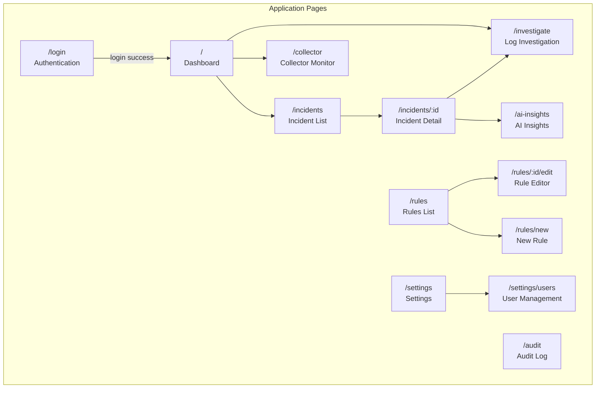
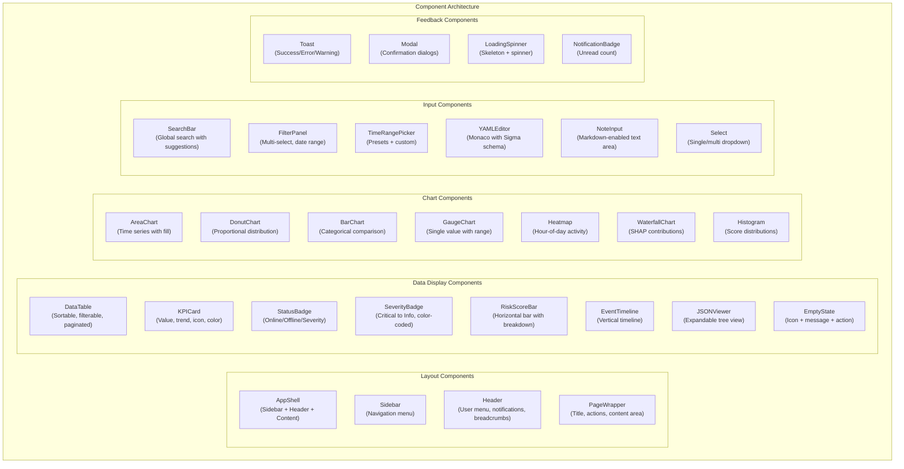
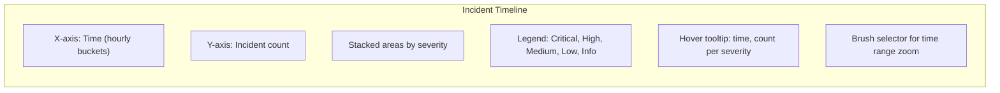
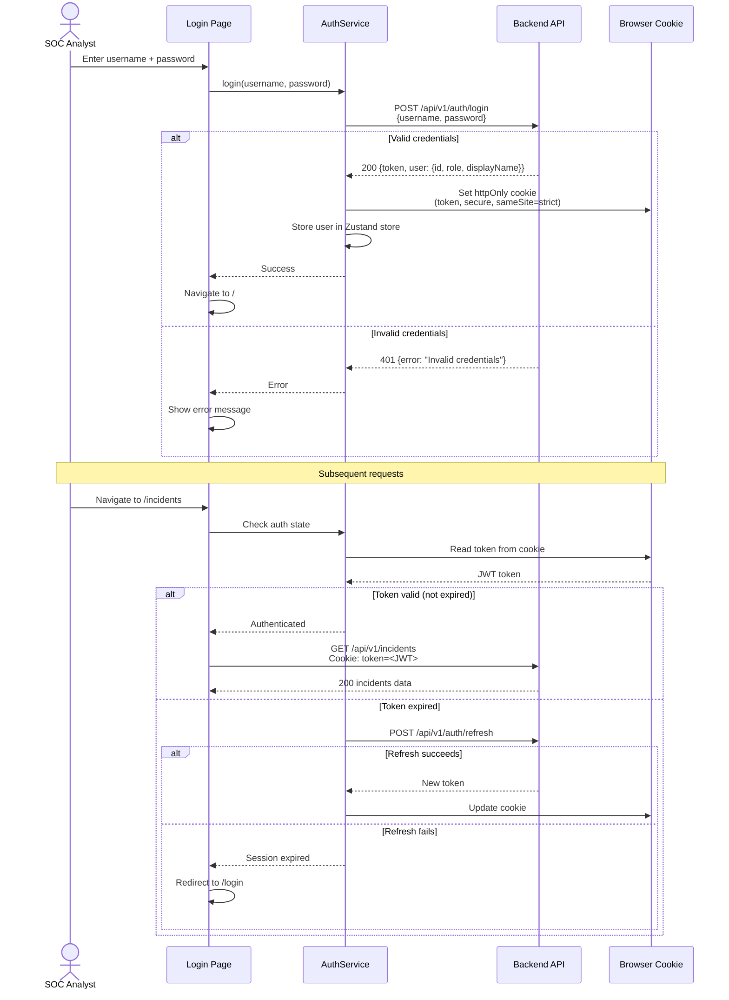
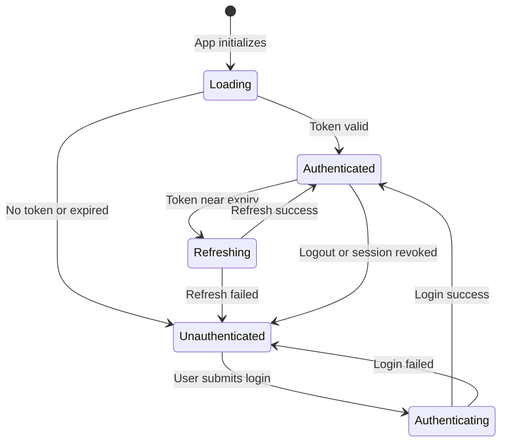
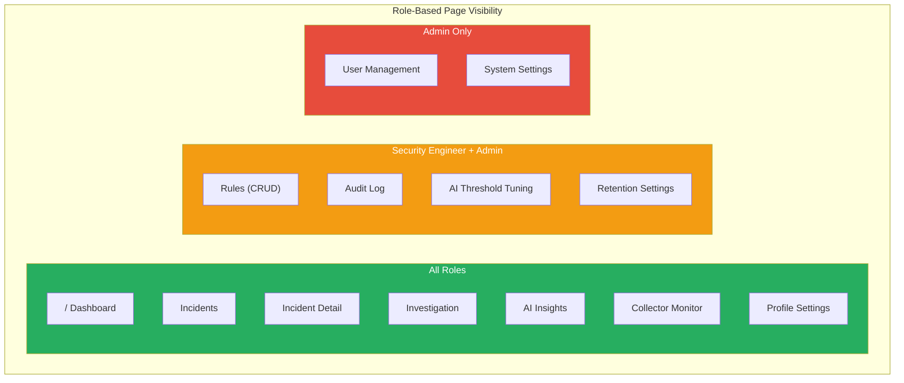
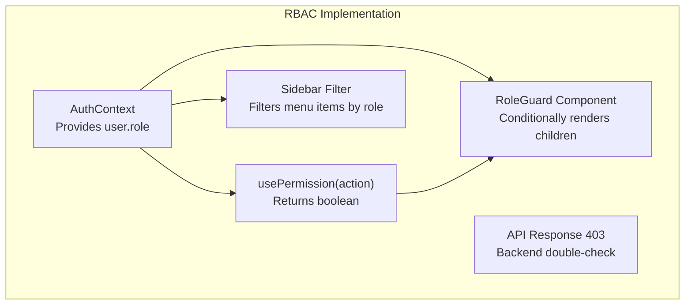

# Frontend Design

## AI-Powered Security Analytics Platform

| Field | Value |
|---|---|
| **Document ID** | FRONTEND-001 |
| **Version** | 1.0 |
| **Date** | 2026-07-18 |
| **Status** | Draft |
| **Framework** | Next.js 14+ (App Router) |
| **Language** | TypeScript |
| **Architecture Reference** | [ADR-001](file:///d:/AI%20SIEM/docs/architecture/decisions/ADR-001-modular-monolith.md) |
| **HLD Reference** | [HLD-001](file:///d:/AI%20SIEM/docs/HLD.md) |
| **Backend API** | [BACKEND-002](file:///d:/AI%20SIEM/docs/backend-detection.md) |

---

## Table of Contents

1. [Dashboard](#1-dashboard)
2. [Pages](#2-pages)
3. [Components](#3-components)
4. [Charts](#4-charts)
5. [Authentication](#5-authentication)
6. [Role-Based UI](#6-role-based-ui)
7. [Folder Structure](#7-folder-structure)

---

## 1. Dashboard

### 1.1 Dashboard Architecture

The Dashboard (`/`) is the primary landing page for SOC Analysts. It provides a **real-time operational overview** of the security posture through live-updating widgets powered by WebSocket subscriptions and periodic REST polling.

```mermaid
graph TB
    subgraph DASHBOARD["Dashboard Page"]

        subgraph TOP_BAR["Top Bar"]
            TIME_RANGE["Time Range Selector<br/>(Last 1h / 4h / 24h / 7d / Custom)"]
            REFRESH["Auto-refresh Toggle<br/>(30s interval)"]
            AI_STATUS["AI Engine Status<br/>(Online / Offline badge)"]
        end

        subgraph ROW1["Row 1 - KPI Cards"]
            KPI_OPEN["Open Incidents<br/>(count + trend arrow)"]
            KPI_CRIT["Critical Incidents<br/>(count + pulse animation)"]
            KPI_EPS["Events/Second<br/>(live counter)"]
            KPI_ALERTS["Alerts Today<br/>(count + vs yesterday)"]
            KPI_MTTR["Avg Response Time<br/>(minutes)"]
        end

        subgraph ROW2["Row 2 - Charts"]
            CHART_TIMELINE["Incident Timeline<br/>(Area chart: incidents over time<br/>by severity)"]
            CHART_SEVERITY["Severity Distribution<br/>(Donut chart: Critical/High/<br/>Medium/Low/Info)"]
        end

        subgraph ROW3["Row 3 - Tables and Maps"]
            TABLE_RECENT["Recent Incidents<br/>(Live feed: last 20 incidents<br/>with real-time WebSocket push)"]
            TABLE_ASSETS["Top Affected Assets<br/>(Sorted by incident count)"]
        end

        subgraph ROW4["Row 4 - Operational"]
            CHART_SOURCES["Events by Source<br/>(Bar chart: collector breakdown)"]
            COLLECTOR_HEALTH["Collector Status<br/>(Status badges: Online/Offline)"]
            QUEUE_DEPTH["Queue Depth<br/>(Gauge: processing backlog)"]
        end
    end

    WS["WebSocket Connection<br/>(incidents:new, collector:status)"]
    REST["REST Polling<br/>(/api/v1/dashboard/summary)"]

    WS -.->|"real-time push"| KPI_OPEN
    WS -.->|"real-time push"| TABLE_RECENT
    WS -.->|"real-time push"| COLLECTOR_HEALTH
    REST -.->|"30s interval"| CHART_TIMELINE
    REST -.->|"30s interval"| CHART_SEVERITY
    REST -.->|"30s interval"| TABLE_ASSETS
```



### 1.2 Dashboard Wireframe Layout

```
┌──────────────────────────────────────────────────────────────────┐
│  [🕐 Last 24h ▾]         AI-SIEM Dashboard         [🟢 AI Online]│
├──────────────────────────────────────────────────────────────────┤
│  ┌──────────┐ ┌──────────┐ ┌──────────┐ ┌──────────┐ ┌────────┐│
│  │ 🔴 Open  │ │ 🔥 Crit  │ │ ⚡ EPS   │ │ 🔔 Alerts│ │ ⏱ MTTR ││
│  │   142    │ │    7     │ │  2,450   │ │   89     │ │  23min ││
│  │  ↑ 12%   │ │  ↑ 2     │ │  ↓ 5%   │ │  ↑ 15%  │ │  ↓ 8%  ││
│  └──────────┘ └──────────┘ └──────────┘ └──────────┘ └────────┘│
├──────────────────────────────────────────────────────────────────┤
│  ┌──────────────────────────────┐ ┌───────────────────────────┐ │
│  │  📊 Incident Timeline       │ │  🍩 Severity Distribution │ │
│  │  [Area Chart]               │ │  [Donut Chart]            │ │
│  │  ▓▓▓▓▓▒▒▒▒▒░░░░░▓▓▓▓▓▓▓▓  │ │   Critical: 7  (5%)      │ │
│  │                             │ │   High:    23  (16%)      │ │
│  │  — Critical  — High         │ │   Medium:  56  (39%)      │ │
│  │  — Medium    — Low          │ │   Low:     42  (30%)      │ │
│  │                             │ │   Info:    14  (10%)      │ │
│  └──────────────────────────────┘ └───────────────────────────┘ │
├──────────────────────────────────────────────────────────────────┤
│  ┌──────────────────────────────┐ ┌───────────────────────────┐ │
│  │  🔴 Recent Incidents (Live) │ │  🖥 Top Affected Assets    │ │
│  │  ┌────────────────────────┐ │ │  web-server-01    12 inc  │ │
│  │  │ HIGH Brute Force SSH   │ │ │  db-server-03      8 inc  │ │
│  │  │ 192.168.1.100 → ...    │ │ │  vpn-gateway-01    6 inc  │ │
│  │  │ 2 min ago              │ │ │  mail-server-02    4 inc  │ │
│  │  └────────────────────────┘ │ │  app-server-05     3 inc  │ │
│  └──────────────────────────────┘ └───────────────────────────┘ │
├──────────────────────────────────────────────────────────────────┤
│  ┌────────────────┐ ┌─────────────────┐ ┌──────────────────────┐│
│  │ Events by Src  │ │ Collector Health│ │   Queue Depth        ││
│  │ [Bar Chart]    │ │ 🟢 collector-01 │ │   [Gauge: 234]       ││
│  │ ▓▓▓ Syslog     │ │ 🟢 collector-02 │ │   Waiting: 234       ││
│  │ ▓▓  ETW        │ │ 🔴 collector-03 │ │   Active:   4        ││
│  │ ▓   File       │ │    Last: 5m ago │ │   Failed:  12        ││
│  └────────────────┘ └─────────────────┘ └──────────────────────┘│
└──────────────────────────────────────────────────────────────────┘
```

### 1.3 Dashboard Data Sources

| Widget | Data Source | Update Method | Endpoint |
|---|---|---|---|
| Open Incidents KPI | REST + WebSocket | WebSocket push on `incidents:new` / `incidents:status` | `GET /api/v1/dashboard/summary` |
| Critical Incidents KPI | REST + WebSocket | WebSocket push | `GET /api/v1/dashboard/summary` |
| Events/Second | REST | Poll every 10s | `GET /api/v1/dashboard/summary` |
| Alerts Today | REST | Poll every 30s | `GET /api/v1/dashboard/summary` |
| Avg Response Time | REST | Poll every 60s | `GET /api/v1/dashboard/summary` |
| Incident Timeline | REST | Poll every 30s | `GET /api/v1/dashboard/timeline?range=24h` |
| Severity Distribution | REST | Poll every 30s | `GET /api/v1/dashboard/summary` |
| Recent Incidents | WebSocket | Real-time push | `WS /ws` (channel: `incidents:new`) |
| Top Affected Assets | REST | Poll every 60s | `GET /api/v1/dashboard/top-assets` |
| Events by Source | REST | Poll every 60s | `GET /api/v1/dashboard/source-breakdown` |
| Collector Health | WebSocket | Real-time push | `WS /ws` (channel: `collector:status`) |
| Queue Depth | REST | Poll every 15s | `GET /api/v1/collector/status` |
| AI Engine Status | REST | Poll every 30s | `GET /api/v1/collector/status` |

---

## 2. Pages

### 2.1 Page Map



### 2.2 Page Specifications

#### `/` — Dashboard

| Property | Value |
|---|---|
| **Purpose** | Real-time SOC operational overview |
| **Access** | All authenticated roles |
| **Data** | REST polling + WebSocket real-time |
| **Key interactions** | Click incident → navigate to `/incidents/:id`. Click asset → navigate to `/investigate?entity=<hostname>` |
| **Refresh** | Auto-refresh every 30s. Manual refresh button. WebSocket push for live data |

#### `/incidents` — Incident List

| Property | Value |
|---|---|
| **Purpose** | Browse, filter, and triage incidents |
| **Access** | All authenticated roles |
| **Filters** | Status (Open/Investigating/Resolved/Closed), Severity, Source (Rule/AI/Both), Time range, Assigned to, Search text |
| **Sorting** | Risk score (desc), Created at (desc), Severity, Alert count |
| **Pagination** | 25 per page, cursor-based pagination |
| **Bulk actions** | Assign to analyst, Change status (Admin/Engineer only) |

```
┌──────────────────────────────────────────────────────────────┐
│  Incidents                          [🔍 Search] [+ Filters] │
├──────────────────────────────────────────────────────────────┤
│  Status: [All ▾] Severity: [All ▾] Source: [All ▾]          │
├──────┬──────────────────────┬─────┬──────┬───────┬──────────┤
│ Sev  │ Title                │Score│Alerts│Assign │ Created  │
├──────┼──────────────────────┼─────┼──────┼───────┼──────────┤
│ 🔴   │ SSH Brute Force on   │ 78.5│  12  │ —     │ 2m ago   │
│ CRIT │ web-server-01        │     │      │       │          │
├──────┼──────────────────────┼─────┼──────┼───────┼──────────┤
│ 🟠   │ Unusual Login Time   │ 62.3│   3  │ Alice │ 15m ago  │
│ HIGH │ admin@db-server-03   │     │      │       │          │
├──────┼──────────────────────┼─────┼──────┼───────┼──────────┤
│ 🟡   │ High Data Transfer   │ 45.1│   5  │ —     │ 1h ago   │
│ MED  │ 10.0.0.50 → ext     │     │      │       │          │
└──────┴──────────────────────┴─────┴──────┴───────┴──────────┘
│  ← 1 2 3 ... 12 →                               25/page ▾  │
└──────────────────────────────────────────────────────────────┘
```

#### `/incidents/:id` — Incident Detail

| Property | Value |
|---|---|
| **Purpose** | Deep-dive into a single incident: alerts, events, AI explanation, timeline, notes |
| **Sections** | Header (title, severity, status, assignee), Alert list, Event timeline, AI Explanation panel (SHAP), Risk score breakdown, Notes & activity log |
| **Actions** | Change status, Assign analyst, Add note, Pivot to investigation |

```
┌──────────────────────────────────────────────────────────────┐
│  ← Back    INC-00142: SSH Brute Force on web-server-01      │
│            🔴 CRITICAL   Score: 78.5   Status: [Open ▾]     │
│            Assigned: [— Select ▾]   Source: Rule + AI        │
├──────────────────────────────────────────────────────────────┤
│  [Alerts] [Events] [AI Explanation] [Timeline] [Notes]       │
├──────────────────────────────────────────────────────────────┤
│  ALERTS (12)                                                 │
│  ┌────────────────────────────────────────────────────────┐  │
│  │ 🔴 Rule: SSH Brute Force (rule-bf-ssh-001)            │  │
│  │    Weight: 0.8  │ Matched 10 events │ 3:15:22 AM      │  │
│  ├────────────────────────────────────────────────────────┤  │
│  │ 🟠 AI: Anomaly Score 0.89 (Confidence: 92%)          │  │
│  │    Top SHAP: events_per_minute (+0.28)                │  │
│  │              failed_login_count (+0.22)               │  │
│  └────────────────────────────────────────────────────────┘  │
├──────────────────────────────────────────────────────────────┤
│  RISK SCORE BREAKDOWN                                        │
│  ▓▓▓▓▓▓▓░░░ Rule Weight:     0.80  (35%)                    │
│  ▓▓▓▓▓▓▓▓░░ ML Confidence:   0.92  (30%)                    │
│  ▓▓▓▓▓▓▓▓▓░ Asset Critical:  0.90  (20%)                    │
│  ▓▓▓▓▓▓░░░░ Alert Density:   0.60  (15%)                    │
│  ─────────── Composite: 78.5 / 100                           │
└──────────────────────────────────────────────────────────────┘
```

#### `/investigate` — Log Investigation

| Property | Value |
|---|---|
| **Purpose** | Search and explore raw normalized events |
| **Search** | Time range, keyword (full-text), source IP, destination IP, username, hostname, severity, OCSF class |
| **Results** | Sortable event table with expandable rows showing full OCSF event |
| **Pivoting** | Click IP → filter by IP. Click user → filter by user. Click event → view linked incidents |
| **Export** | CSV export of search results |

#### `/rules` — Rules List & Editor

| Property | Value |
|---|---|
| **Purpose** | Manage Sigma-compatible detection rules |
| **List view** | Name, type, severity, status (active/disabled), alerts generated, last triggered |
| **Editor** | Monaco YAML editor with syntax highlighting, validation errors inline, live preview |
| **Actions** | Create, Edit, Enable/Disable, Delete, Test (dry-run), Import, Export |
| **Access** | Read: all. Write: Admin + Security Engineer |

#### `/ai-insights` — AI Insights

| Property | Value |
|---|---|
| **Purpose** | Visualize AI detection results and SHAP explanations |
| **Sections** | Anomaly score distribution (histogram), top anomalous events, SHAP waterfall charts, feature importance ranking, model info (version, threshold, training date) |
| **Access** | All authenticated roles |

#### `/collector` — Collector Monitor

| Property | Value |
|---|---|
| **Purpose** | Monitor collector health, queue status, processing metrics |
| **Sections** | Collector status cards (Online/Offline/Degraded), files processed counter, events collected counter, queue depth gauge, failed/quarantined files, AI Engine health |
| **Updates** | WebSocket real-time for status changes |

#### `/settings` — Settings

| Property | Value |
|---|---|
| **Purpose** | Application configuration |
| **Sections** | Profile settings, notification preferences, data retention settings, AI threshold adjustment |
| **Access** | Profile: all users. System settings: Admin only |

#### `/settings/users` — User Management

| Property | Value |
|---|---|
| **Purpose** | Create, edit, deactivate users and assign roles |
| **Access** | Admin only |
| **Actions** | Create user, Edit user, Change role, Deactivate, Reset password |

#### `/audit` — Audit Log

| Property | Value |
|---|---|
| **Purpose** | View immutable audit trail of all actions |
| **Filters** | Action type, Actor, Target, Time range |
| **Access** | Admin + Security Engineer (read-only) |

---

## 3. Components

### 3.1 Component Architecture



### 3.2 Core Component Specifications

#### AppShell

The root layout wrapping all authenticated pages.

```
┌──────────────────────────────────────────────────────────────┐
│  ┌─────┐                                     🔔 3  👤 Admin │  ← Header
│  │SIEM │  AI-SIEM Dashboard                                 │
├──┴─────┴─────────────────────────────────────────────────────┤
│  │         │                                                 │
│  │ 📊 Dash │                                                 │
│  │ 🔴 Inc  │              Page Content                       │
│  │ 🔍 Inv  │                                                 │
│  │ 📋 Rules│              (rendered by App Router)           │
│  │ 🤖 AI   │                                                 │
│  │ 📡 Coll │                                                 │
│  │ ⚙ Set  │                                                 │
│  │ 📜 Audit│                                                 │
│  │         │                                                 │
│  │         │                                                 │
│  └─────────┘                                                 │
│   Sidebar                                                    │
└──────────────────────────────────────────────────────────────┘
```

| Property | Detail |
|---|---|
| **Sidebar** | Collapsible. Icons + labels. Active page highlighted. Role-filtered items |
| **Header** | Breadcrumbs, notification bell (unread count from WebSocket), user avatar + dropdown (profile, logout) |
| **Content** | Full-width below header, scrollable. Rendered by Next.js App Router |
| **Responsive** | Sidebar collapses to icon-only on medium screens. Hamburger menu on mobile |

#### DataTable

Reusable table component used on Incidents, Rules, Audit, Users, and Investigation pages.

| Feature | Implementation |
|---|---|
| **Sorting** | Click column header. Ascending/descending toggle. Sort indicator arrow |
| **Filtering** | Column-level filters via FilterPanel. Server-side for large datasets |
| **Pagination** | Cursor-based. Page size selector (10/25/50/100). Total count display |
| **Row expansion** | Expandable rows for inline detail preview |
| **Selection** | Checkbox column for bulk actions (where applicable) |
| **Loading** | Skeleton rows while loading. Empty state component when no results |
| **Responsive** | Horizontal scroll on mobile. Priority columns remain visible |

#### KPICard

Dashboard metric card with trend indicator.

| Prop | Type | Description |
|---|---|---|
| `title` | `string` | Metric name (e.g., "Open Incidents") |
| `value` | `number \| string` | Current value |
| `trend` | `number` | Percentage change from previous period |
| `trendDirection` | `"up" \| "down" \| "flat"` | Arrow direction |
| `trendColor` | `"positive" \| "negative" \| "neutral"` | Green for improvements, red for degradation |
| `icon` | `ReactNode` | Metric icon |
| `color` | `string` | Card accent color |
| `loading` | `boolean` | Show skeleton while data loads |

#### StatusBadge

| Status | Color | Animation |
|---|---|---|
| Online | Green | Subtle pulse |
| Degraded | Amber | Slow pulse |
| Offline | Red | None (static) |
| Critical | Red | Fast pulse |
| High | Orange | None |
| Medium | Yellow | None |
| Low | Blue | None |
| Informational | Grey | None |

#### YAMLEditor

Built on Monaco Editor with Sigma-specific features.

| Feature | Implementation |
|---|---|
| **Syntax highlighting** | YAML language mode |
| **Auto-completion** | Custom Sigma schema suggestions (field names, operators, OCSF classes) |
| **Inline validation** | Real-time YAML parse errors highlighted. Sigma schema violations shown as warnings |
| **Line numbers** | Always visible |
| **Minimap** | Disabled for compact view |
| **Theme** | Dark theme matching application design |

---

## 4. Charts

### 4.1 Chart Library

| Library | Version | Purpose |
|---|---|---|
| **Recharts** | 2.x | Primary chart library (Area, Bar, Donut, Line, Histogram) |
| **Custom SVG** | — | Gauge charts, SHAP waterfall (not natively supported by Recharts) |

### 4.2 Chart Component Specifications

#### Incident Timeline (Area Chart)



| Property | Value |
|---|---|
| **Type** | Stacked Area Chart |
| **X-axis** | Time (1h/4h/24h/7d depending on selected range) |
| **Y-axis** | Incident count |
| **Stacks** | Severity levels (5 colors) |
| **Interaction** | Hover tooltip, brush zoom, click to filter |
| **Colors** | Critical: `#e74c3c`, High: `#e67e22`, Medium: `#f1c40f`, Low: `#3498db`, Info: `#95a5a6` |

#### Severity Distribution (Donut Chart)

| Property | Value |
|---|---|
| **Type** | Donut Chart |
| **Segments** | One per severity level |
| **Center text** | Total incident count |
| **Interaction** | Hover: segment highlights, shows percentage. Click: filter incidents by severity |
| **Colors** | Same severity palette as Timeline |

#### Events by Source (Bar Chart)

| Property | Value |
|---|---|
| **Type** | Horizontal Bar Chart |
| **X-axis** | Event count |
| **Y-axis** | Source type (Syslog, Windows ETW, File, HTTP) |
| **Interaction** | Hover tooltip with exact count and percentage |

#### Queue Depth (Gauge Chart)

| Property | Value |
|---|---|
| **Type** | Radial Gauge (custom SVG) |
| **Range** | 0 to configurable max (default 1000) |
| **Zones** | Green (0-30%), Yellow (30-70%), Red (70-100%) |
| **Center** | Current value and label |
| **Animation** | Smooth needle transition on value change |

#### SHAP Waterfall (Waterfall Chart)

| Property | Value |
|---|---|
| **Type** | Horizontal waterfall |
| **Bars** | One per SHAP feature, sorted by absolute contribution |
| **Direction** | Positive (right, red) pushes toward anomaly. Negative (left, blue) pushes toward normal |
| **Base** | Base value (expected model output) shown as starting point |
| **Final** | Final anomaly score shown as endpoint |
| **Interaction** | Hover: feature name, actual value, SHAP contribution |

```
  SHAP Explanation — Anomaly Score: 0.89

  Base value: 0.32                                    Final: 0.89
  ├─────────────────────────────────────────────────────────────┤
  events_per_minute_src_ip = 45   ████████████████ +0.28
  failed_login_count = 38         ████████████ +0.22
  is_business_hours = 0           ████████ +0.15
  failed_to_success_ratio = 0.97  ██████ +0.12
  time_deviation_score = 2.8      ████ +0.08
  new_source_ip = 1               ███ +0.06
  bytes_sent = 120                █ -0.02 (toward normal)
                                  ────────────────────────────
                                  0.32 ──────────────────► 0.89
```

#### Anomaly Score Distribution (Histogram)

| Property | Value |
|---|---|
| **Type** | Histogram |
| **X-axis** | Anomaly score (0.0 to 1.0, 20 bins) |
| **Y-axis** | Event count |
| **Threshold line** | Vertical dashed line at current threshold (0.65) |
| **Highlight** | Bins above threshold highlighted in red |
| **Interaction** | Hover: bin range, count, percentage |

#### Activity Heatmap

| Property | Value |
|---|---|
| **Type** | Grid heatmap |
| **X-axis** | Hour of day (0-23) |
| **Y-axis** | Day of week (Mon-Sun) |
| **Color scale** | White (0 events) → Dark red (max events) |
| **Purpose** | Visualize when security events concentrate (used in Investigation page) |

### 4.3 Chart Theme

| Token | Value | Usage |
|---|---|---|
| `chart.critical` | `#e74c3c` | Critical severity |
| `chart.high` | `#e67e22` | High severity |
| `chart.medium` | `#f1c40f` | Medium severity |
| `chart.low` | `#3498db` | Low severity |
| `chart.info` | `#95a5a6` | Informational |
| `chart.anomaly` | `#e74c3c` | SHAP positive (toward anomaly) |
| `chart.normal` | `#3498db` | SHAP negative (toward normal) |
| `chart.grid` | `#2c3e50` | Chart grid lines |
| `chart.text` | `#ecf0f1` | Axis labels, legend text |
| `chart.background` | `#1a1a2e` | Chart container background |
| `chart.tooltip.bg` | `#16213e` | Tooltip background |
| `chart.tooltip.text` | `#ffffff` | Tooltip text |

---

## 5. Authentication

### 5.1 Authentication Flow



### 5.2 Authentication Components

| Component | Purpose |
|---|---|
| **LoginPage** | Login form with username/password. Error display. Loading state |
| **AuthProvider** | React Context wrapping the app. Provides `user`, `isAuthenticated`, `login()`, `logout()` |
| **AuthGuard** | HOC / middleware that redirects unauthenticated users to `/login` |
| **useAuth()** | Custom hook returning auth state and functions |
| **SessionManager** | Handles token refresh, session expiry detection, logout on 401 |

### 5.3 Token Management

| Property | Value |
|---|---|
| **Token type** | JWT (stored in httpOnly cookie) |
| **Storage** | httpOnly, Secure, SameSite=Strict cookie — never in localStorage |
| **Expiry** | Access token: 1 hour. Refresh: 7 days |
| **Refresh** | Automatic silent refresh when access token has < 5 min remaining |
| **Logout** | Delete cookie + `POST /api/v1/auth/logout` (revoke server-side session) |

### 5.4 Auth State Management



### 5.5 Protected Route Pattern

```typescript
// middleware.ts (Next.js middleware)

import { NextRequest, NextResponse } from "next/server";

const PUBLIC_ROUTES = ["/login"];

export function middleware(request: NextRequest) {
  const token = request.cookies.get("siem_token");
  const isPublicRoute = PUBLIC_ROUTES.includes(request.nextUrl.pathname);

  if (!token && !isPublicRoute) {
    return NextResponse.redirect(new URL("/login", request.url));
  }

  if (token && isPublicRoute) {
    return NextResponse.redirect(new URL("/", request.url));
  }

  return NextResponse.next();
}

export const config = {
  matcher: ["/((?!_next/static|_next/image|favicon.ico).*)"],
};
```

---

## 6. Role-Based UI

### 6.1 Roles

| Role | Description |
|---|---|
| **Admin** | Full system access. User management, settings, all CRUD |
| **Security Engineer** | Rule management, AI threshold tuning, incident management. No user management |
| **SOC Analyst** | View dashboards, investigate incidents, search events. No rule editing or user management |

### 6.2 Role-Based Visibility Matrix



### 6.3 UI Element Visibility by Role

| UI Element | Admin | Security Engineer | SOC Analyst |
|---|---|---|---|
| **Sidebar: Dashboard** | ✅ | ✅ | ✅ |
| **Sidebar: Incidents** | ✅ | ✅ | ✅ |
| **Sidebar: Investigation** | ✅ | ✅ | ✅ |
| **Sidebar: Rules** | ✅ | ✅ | ✅ (read-only) |
| **Sidebar: AI Insights** | ✅ | ✅ | ✅ |
| **Sidebar: Collector** | ✅ | ✅ | ✅ |
| **Sidebar: Settings** | ✅ | ✅ | ✅ (profile only) |
| **Sidebar: Audit Log** | ✅ | ✅ | ❌ Hidden |
| **Sidebar: Users** | ✅ | ❌ Hidden | ❌ Hidden |
| **Incident: Change status** | ✅ | ✅ | ✅ |
| **Incident: Assign analyst** | ✅ | ✅ | ❌ Hidden |
| **Incident: Add note** | ✅ | ✅ | ✅ |
| **Rule: Create button** | ✅ | ✅ | ❌ Hidden |
| **Rule: Edit button** | ✅ | ✅ | ❌ Hidden |
| **Rule: Delete button** | ✅ | ❌ Hidden | ❌ Hidden |
| **Rule: Enable/Disable** | ✅ | ✅ | ❌ Hidden |
| **Rule: Import/Export** | ✅ | ✅ | Export only |
| **Rule: Test (dry-run)** | ✅ | ✅ | ✅ |
| **Settings: AI threshold** | ✅ | ✅ | ❌ Hidden |
| **Settings: Retention** | ✅ | ❌ Hidden | ❌ Hidden |

### 6.4 RBAC Implementation



```typescript
// hooks/usePermission.ts

type Permission =
  | "incidents.assign"
  | "rules.create"
  | "rules.edit"
  | "rules.delete"
  | "rules.enable"
  | "users.manage"
  | "settings.system"
  | "settings.ai_threshold"
  | "audit.view";

const ROLE_PERMISSIONS: Record<UserRole, Permission[]> = {
  admin: [
    "incidents.assign",
    "rules.create", "rules.edit", "rules.delete", "rules.enable",
    "users.manage",
    "settings.system", "settings.ai_threshold",
    "audit.view",
  ],
  security_engineer: [
    "incidents.assign",
    "rules.create", "rules.edit", "rules.enable",
    "settings.ai_threshold",
    "audit.view",
  ],
  soc_analyst: [],
};

function usePermission(permission: Permission): boolean {
  const { user } = useAuth();
  if (!user) return false;
  return ROLE_PERMISSIONS[user.role].includes(permission);
}
```

```typescript
// components/RoleGuard.tsx

function RoleGuard({
  permission,
  children,
  fallback = null
}: {
  permission: Permission;
  children: React.ReactNode;
  fallback?: React.ReactNode;
}) {
  const hasPermission = usePermission(permission);
  return hasPermission ? <>{children}</> : <>{fallback}</>;
}

// Usage:
// <RoleGuard permission="rules.create">
//   <Button>Create Rule</Button>
// </RoleGuard>
```

---

## 7. Folder Structure

### 7.1 Complete Project Structure

```
frontend/
├── public/
│   ├── favicon.ico
│   ├── logo.svg
│   └── manifest.json
│
├── src/
│   ├── app/                                  # Next.js App Router
│   │   ├── layout.tsx                        # Root layout (fonts, metadata)
│   │   ├── page.tsx                          # Redirect to /login or /
│   │   ├── globals.css                       # Global styles + CSS variables
│   │   │
│   │   ├── (auth)/                           # Auth group (no layout shell)
│   │   │   └── login/
│   │   │       └── page.tsx                  # Login page
│   │   │
│   │   └── (dashboard)/                      # Dashboard group (with AppShell)
│   │       ├── layout.tsx                    # AppShell layout (sidebar+header)
│   │       ├── page.tsx                      # Dashboard (/)
│   │       │
│   │       ├── incidents/
│   │       │   ├── page.tsx                  # Incident list
│   │       │   └── [id]/
│   │       │       └── page.tsx              # Incident detail
│   │       │
│   │       ├── investigate/
│   │       │   └── page.tsx                  # Log investigation/search
│   │       │
│   │       ├── rules/
│   │       │   ├── page.tsx                  # Rules list
│   │       │   ├── new/
│   │       │   │   └── page.tsx              # Create rule
│   │       │   └── [id]/
│   │       │       └── edit/
│   │       │           └── page.tsx          # Edit rule
│   │       │
│   │       ├── ai-insights/
│   │       │   └── page.tsx                  # AI insights
│   │       │
│   │       ├── collector/
│   │       │   └── page.tsx                  # Collector monitor
│   │       │
│   │       ├── settings/
│   │       │   ├── page.tsx                  # Settings overview
│   │       │   └── users/
│   │       │       └── page.tsx              # User management
│   │       │
│   │       └── audit/
│   │           └── page.tsx                  # Audit log
│   │
│   ├── components/                           # Shared UI components
│   │   ├── layout/
│   │   │   ├── AppShell.tsx
│   │   │   ├── Sidebar.tsx
│   │   │   ├── Header.tsx
│   │   │   ├── PageWrapper.tsx
│   │   │   └── Breadcrumbs.tsx
│   │   │
│   │   ├── data-display/
│   │   │   ├── DataTable.tsx
│   │   │   ├── KPICard.tsx
│   │   │   ├── StatusBadge.tsx
│   │   │   ├── SeverityBadge.tsx
│   │   │   ├── RiskScoreBar.tsx
│   │   │   ├── EventTimeline.tsx
│   │   │   ├── JSONViewer.tsx
│   │   │   └── EmptyState.tsx
│   │   │
│   │   ├── charts/
│   │   │   ├── AreaChart.tsx
│   │   │   ├── DonutChart.tsx
│   │   │   ├── BarChart.tsx
│   │   │   ├── GaugeChart.tsx
│   │   │   ├── Heatmap.tsx
│   │   │   ├── WaterfallChart.tsx
│   │   │   ├── Histogram.tsx
│   │   │   └── ChartTheme.ts
│   │   │
│   │   ├── inputs/
│   │   │   ├── SearchBar.tsx
│   │   │   ├── FilterPanel.tsx
│   │   │   ├── TimeRangePicker.tsx
│   │   │   ├── YAMLEditor.tsx
│   │   │   ├── NoteInput.tsx
│   │   │   └── Select.tsx
│   │   │
│   │   ├── feedback/
│   │   │   ├── Toast.tsx
│   │   │   ├── Modal.tsx
│   │   │   ├── LoadingSpinner.tsx
│   │   │   ├── Skeleton.tsx
│   │   │   └── NotificationBadge.tsx
│   │   │
│   │   └── auth/
│   │       ├── AuthProvider.tsx
│   │       ├── AuthGuard.tsx
│   │       ├── RoleGuard.tsx
│   │       └── LoginForm.tsx
│   │
│   ├── hooks/                                # Custom React hooks
│   │   ├── useAuth.ts
│   │   ├── usePermission.ts
│   │   ├── useWebSocket.ts
│   │   ├── usePolling.ts
│   │   ├── usePagination.ts
│   │   ├── useFilters.ts
│   │   ├── useDebounce.ts
│   │   └── useMediaQuery.ts
│   │
│   ├── services/                             # API and WebSocket clients
│   │   ├── api/
│   │   │   ├── client.ts                     # Axios instance (base URL, interceptors)
│   │   │   ├── auth.ts                       # POST /auth/login, /auth/logout
│   │   │   ├── incidents.ts                  # CRUD /incidents
│   │   │   ├── events.ts                     # GET /events
│   │   │   ├── rules.ts                      # CRUD /rules
│   │   │   ├── dashboard.ts                  # GET /dashboard/*
│   │   │   ├── collector.ts                  # GET /collector/status
│   │   │   ├── users.ts                      # CRUD /users
│   │   │   └── audit.ts                      # GET /audit
│   │   │
│   │   └── websocket/
│   │       ├── WebSocketClient.ts            # WebSocket connection manager
│   │       └── channels.ts                   # Channel subscriptions
│   │
│   ├── stores/                               # Zustand state management
│   │   ├── authStore.ts                      # User, token, role
│   │   ├── incidentStore.ts                  # Active incident filters, selected
│   │   ├── dashboardStore.ts                 # Dashboard widget data
│   │   ├── notificationStore.ts              # Unread notifications
│   │   └── uiStore.ts                        # Sidebar collapsed, theme, etc.
│   │
│   ├── types/                                # TypeScript type definitions
│   │   ├── incident.ts
│   │   ├── alert.ts
│   │   ├── rule.ts
│   │   ├── event.ts
│   │   ├── user.ts
│   │   ├── collector.ts
│   │   ├── dashboard.ts
│   │   ├── auth.ts
│   │   └── api.ts                            # API request/response types
│   │
│   ├── utils/                                # Utility functions
│   │   ├── formatters.ts                     # Date, number, duration formatting
│   │   ├── severity.ts                       # Severity color/label mapping
│   │   ├── permissions.ts                    # ROLE_PERMISSIONS map
│   │   ├── constants.ts                      # API URLs, time ranges, etc.
│   │   └── validators.ts                     # Form validation helpers
│   │
│   └── styles/                               # Shared style utilities
│       ├── variables.css                     # CSS custom properties (design tokens)
│       ├── typography.css                    # Font definitions
│       ├── animations.css                    # Shared animations (pulse, fade, slide)
│       └── components.css                    # Shared component styles
│
├── middleware.ts                              # Next.js middleware (auth redirect)
├── next.config.js                            # Next.js configuration
├── tsconfig.json                             # TypeScript configuration
├── package.json
├── .env.local                                # Environment variables
├── .env.example
├── Dockerfile
└── README.md
```

### 7.2 Design Tokens (CSS Variables)

```css
/* src/styles/variables.css */

:root {
  /* --- Color Palette --- */
  --color-bg-primary: #0f0f1a;
  --color-bg-secondary: #1a1a2e;
  --color-bg-tertiary: #16213e;
  --color-bg-card: #1e1e36;
  --color-bg-hover: #252542;

  --color-text-primary: #ecf0f1;
  --color-text-secondary: #95a5a6;
  --color-text-muted: #7f8c8d;

  --color-accent-primary: #3498db;
  --color-accent-secondary: #2ecc71;
  --color-accent-warning: #f39c12;
  --color-accent-danger: #e74c3c;

  /* --- Severity Colors --- */
  --color-severity-critical: #e74c3c;
  --color-severity-high: #e67e22;
  --color-severity-medium: #f1c40f;
  --color-severity-low: #3498db;
  --color-severity-info: #95a5a6;

  /* --- Status Colors --- */
  --color-status-online: #2ecc71;
  --color-status-degraded: #f39c12;
  --color-status-offline: #e74c3c;

  /* --- Spacing --- */
  --space-xs: 4px;
  --space-sm: 8px;
  --space-md: 16px;
  --space-lg: 24px;
  --space-xl: 32px;
  --space-2xl: 48px;

  /* --- Border Radius --- */
  --radius-sm: 4px;
  --radius-md: 8px;
  --radius-lg: 12px;
  --radius-full: 9999px;

  /* --- Shadows --- */
  --shadow-sm: 0 1px 2px rgba(0, 0, 0, 0.3);
  --shadow-md: 0 4px 6px rgba(0, 0, 0, 0.4);
  --shadow-lg: 0 10px 15px rgba(0, 0, 0, 0.5);
  --shadow-glow-critical: 0 0 12px rgba(231, 76, 60, 0.4);
  --shadow-glow-accent: 0 0 12px rgba(52, 152, 219, 0.3);

  /* --- Typography --- */
  --font-family: 'Inter', -apple-system, BlinkMacSystemFont, sans-serif;
  --font-mono: 'JetBrains Mono', 'Fira Code', monospace;
  --font-size-xs: 0.75rem;
  --font-size-sm: 0.875rem;
  --font-size-md: 1rem;
  --font-size-lg: 1.125rem;
  --font-size-xl: 1.5rem;
  --font-size-2xl: 2rem;
  --font-size-3xl: 2.5rem;

  /* --- Sidebar --- */
  --sidebar-width: 250px;
  --sidebar-collapsed-width: 64px;

  /* --- Transitions --- */
  --transition-fast: 150ms ease;
  --transition-normal: 250ms ease;
  --transition-slow: 400ms ease;

  /* --- Z-Index Scale --- */
  --z-sidebar: 100;
  --z-header: 200;
  --z-modal: 300;
  --z-toast: 400;
}
```

### 7.3 Key Dependencies

| Dependency | Version | Purpose |
|---|---|---|
| **next** | 14+ | React SSR framework with App Router |
| **react** | 18+ | UI library |
| **typescript** | 5.x | Type safety |
| **recharts** | 2.x | Chart components (Area, Bar, Donut, Line) |
| **zustand** | 4.x | Lightweight state management |
| **axios** | 1.x | HTTP client for REST API |
| **@monaco-editor/react** | 4.x | YAML rule editor |
| **react-hot-toast** | 2.x | Toast notifications |
| **date-fns** | 3.x | Date formatting and manipulation |
| **clsx** | 2.x | Conditional className composition |
| **lucide-react** | latest | Icon library |

### 7.4 Environment Variables

```env
# .env.local

# Backend API
NEXT_PUBLIC_API_URL=http://localhost:3000
NEXT_PUBLIC_WS_URL=ws://localhost:3000/ws

# App Configuration
NEXT_PUBLIC_APP_NAME=AI-SIEM
NEXT_PUBLIC_REFRESH_INTERVAL=30000
NEXT_PUBLIC_WS_RECONNECT_INTERVAL=5000
```

### 7.5 Build and Run

| Command | Description |
|---|---|
| `npm run dev` | Development server on `http://localhost:3001` |
| `npm run build` | Production build |
| `npm run start` | Start production server |
| `npm run lint` | ESLint check |
| `npm run type-check` | TypeScript compilation check |

---

> **This document is governed by [ADR-001](file:///d:/AI%20SIEM/docs/architecture/decisions/ADR-001-modular-monolith.md). The Frontend is Process 4 in the platform architecture. It is a Next.js 14 application using the App Router, communicating with the backend via REST API and WebSocket. Authentication uses JWT in httpOnly cookies. Role-based visibility is enforced at the UI level and double-checked by the backend API.**
>
> **Document Version**: 1.0
> **Last Updated**: 2026-07-18
