# Incident Correlation & Management Design

## AI-Powered Security Analytics Platform

| Field | Value |
|---|---|
| **Document ID** | INCIDENTS-001 |
| **Version** | 2.0 |
| **Date** | 2026-07-19 |
| **Status** | Draft |
| **Language** | Node.js + TypeScript |
| **Architecture Reference** | [ADR-001](file:///d:/AI%20SIEM/docs/architecture/decisions/ADR-001-modular-monolith.md) |
| **Backend Detection** | [BACKEND-002](file:///d:/AI%20SIEM/docs/backend-detection.md) |
| **Rule Engine** | [RULE-ENGINE-001](file:///d:/AI%20SIEM/docs/rule-engine.md) |
| **AI Engine** | [AI-ENGINE-001](file:///d:/AI%20SIEM/docs/ai-engine.md) |
| **Database** | [DB-001](file:///d:/AI%20SIEM/docs/database.md) |

---

## Table of Contents

1. [Overview](#1-overview)
2. [Correlation Strategy](#2-correlation-strategy)
3. [Alert Grouping](#3-alert-grouping)
4. [Timeline](#4-timeline)
5. [Risk Score](#5-risk-score)
6. [Investigation](#6-investigation)

---

## 1. Overview

### 1.1 Position in the Pipeline

The Incident Correlator sits between the detection engines (Rule Engine + AI Client) and the persistence layer. It receives raw alerts, groups them into actionable incidents, and passes scored incidents to the database and dashboard.

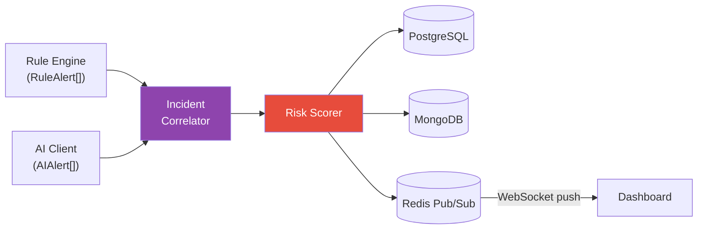

### 1.2 Problem Statement

Without correlation, a single brute force attack generates **50+ individual alerts** — one per failed login. An analyst cannot review 50 identical alerts. The Incident Correlator solves this by producing **one incident** that contains the full attack narrative, scored by risk, and arranged chronologically.

| Without Correlation | With Correlation |
|---|---|
| 50 individual alerts | 1 incident with 50 grouped alerts |
| Each alert reviewed separately | Single triage point for the analyst |
| No context across detections | Full entity context, kill chain mapping |
| Manual pattern recognition | Automated attack narrative |
| Alert fatigue | Actionable queue |

### 1.3 Internal Architecture

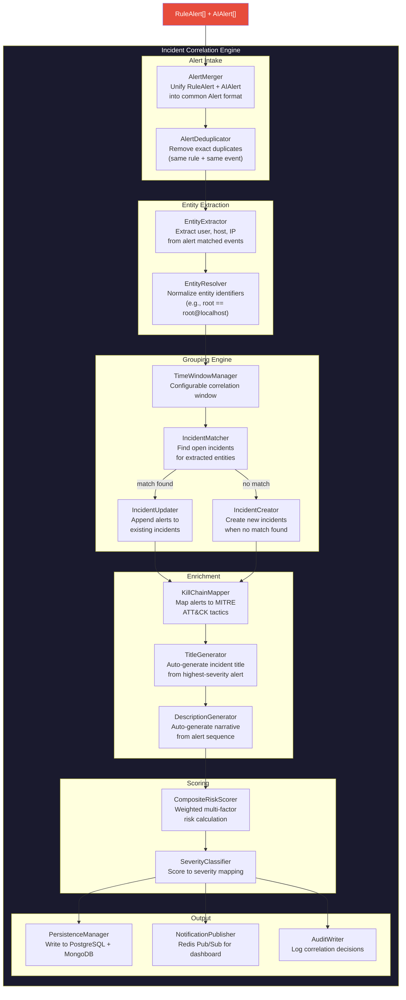

### 1.4 Class Diagram

```mermaid
classDiagram
    class IIncidentCorrelator {
        <<interface>>
        +correlate(ruleAlerts: RuleAlert[], aiAlerts: AIAlert[], events: FeatureEnrichedEvent[]) CorrelationResult
        +getStats() CorrelatorStats
    }

    class EntityCorrelator {
        -alertMerger: AlertMerger
        -deduplicator: AlertDeduplicator
        -entityExtractor: EntityExtractor
        -timeWindowManager: TimeWindowManager
        -incidentMatcher: IncidentMatcher
        -incidentCreator: IncidentCreator
        -incidentUpdater: IncidentUpdater
        -killChainMapper: KillChainMapper
        -titleGenerator: TitleGenerator
        -riskScorer: IRiskScorer
        -incidentRepository: IIncidentRepository
        -notificationPublisher: NotificationPublisher
        +correlate(ruleAlerts, aiAlerts, events) CorrelationResult
        +getStats() CorrelatorStats
    }

    class AlertMerger {
        +merge(ruleAlerts: RuleAlert[], aiAlerts: AIAlert[]) UnifiedAlert[]
        -normalizeRuleAlert(alert: RuleAlert) UnifiedAlert
        -normalizeAIAlert(alert: AIAlert) UnifiedAlert
    }

    class AlertDeduplicator {
        +deduplicate(alerts: UnifiedAlert[]) UnifiedAlert[]
        -computeDedupKey(alert: UnifiedAlert) string
    }

    class EntityExtractor {
        +extract(alert: UnifiedAlert, events: FeatureEnrichedEvent[]) Entity[]
        -extractFromEndpoints(event: FeatureEnrichedEvent) Entity[]
        -extractFromActor(event: FeatureEnrichedEvent) Entity[]
        -extractFromDevice(event: FeatureEnrichedEvent) Entity[]
    }

    class TimeWindowManager {
        -windowMinutes: number
        -maxDurationHours: number
        +isWithinWindow(incidentLastEventAt: Date, alertTimestamp: Date) boolean
        +isExpired(incidentCreatedAt: Date) boolean
        +extendWindow(incident: Incident, alertTimestamp: Date) void
    }

    class IncidentMatcher {
        -incidentRepository: IIncidentRepository
        +findOpenIncident(entities: Entity[]) Incident or null
        -matchByEntity(entity: Entity) Incident[]
        -rankCandidates(candidates: Incident[], entities: Entity[]) Incident or null
    }

    class KillChainMapper {
        -tacticMap: Map
        +mapAlerts(alerts: UnifiedAlert[]) KillChainStage[]
        +getProgression(stages: KillChainStage[]) number
    }

    class TitleGenerator {
        +generate(alerts: UnifiedAlert[], entities: Entity[], killChain: KillChainStage[]) string
    }

    class IRiskScorer {
        <<interface>>
        +score(incident: Incident) ScoredIncident
        +scoreBatch(incidents: Incident[]) ScoredIncident[]
    }

    class CompositeRiskScorer {
        -weights: ScoreWeights
        +score(incident: Incident) ScoredIncident
        -computeRuleWeight(incident: Incident) number
        -computeMLConfidence(incident: Incident) number
        -computeAssetCriticality(incident: Incident) number
        -computeAlertDensity(incident: Incident) number
        -computeKillChainBonus(incident: Incident) number
    }

    IIncidentCorrelator <|.. EntityCorrelator
    IRiskScorer <|.. CompositeRiskScorer
    EntityCorrelator --> AlertMerger
    EntityCorrelator --> AlertDeduplicator
    EntityCorrelator --> EntityExtractor
    EntityCorrelator --> TimeWindowManager
    EntityCorrelator --> IncidentMatcher
    EntityCorrelator --> KillChainMapper
    EntityCorrelator --> TitleGenerator
    EntityCorrelator --> IRiskScorer
```

---

## 2. Correlation Strategy

### 2.1 Multi-Dimensional Correlation

The Correlator uses three dimensions to decide whether alerts belong together:

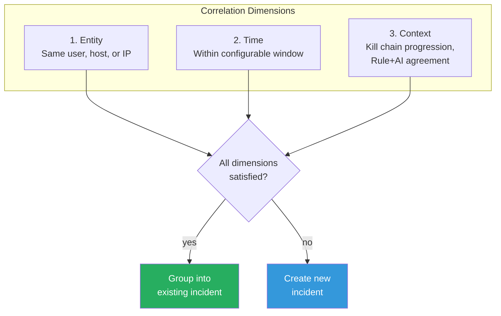

### 2.2 Entity-Centric Correlation (Primary)

The **primary correlation pivot** is the Entity. Every alert is associated with one or more entities extracted from its matched events.

#### Entity Extraction Rules

| Event Field | Extracted Entity | Entity Type | Priority |
|---|---|---|---|
| `srcEndpoint.ip` | `192.168.1.100` | `src_ip` | High |
| `dstEndpoint.ip` | `10.0.0.5` | `dst_ip` | Medium |
| `actor.user.name` | `root` | `user` | High |
| `actor.user.uid` | `0` | `user_id` | Low |
| `device.hostname` | `web-server-01` | `host` | High |
| `srcEndpoint.hostname` | `attacker-ws` | `src_host` | Medium |

#### Entity Normalization

Entities are normalized before comparison to prevent near-duplicates:

| Raw Value | Normalized | Rule |
|---|---|---|
| `root` | `root` | Lowercase |
| `ROOT` | `root` | Lowercase |
| `root@localhost` | `root` | Strip domain suffix for local users |
| `DOMAIN\admin` | `domain\admin` | Lowercase domain\user |
| `192.168.1.100` | `192.168.1.100` | No change (IP literal) |
| `WEB-SERVER-01` | `web-server-01` | Lowercase hostname |
| `web-server-01.corp.local` | `web-server-01` | Strip domain suffix |

### 2.3 Time-Window Correlation (Secondary)

Entity matches are further constrained by a **time window**. Two alerts sharing an entity but occurring 12 hours apart are likely unrelated.

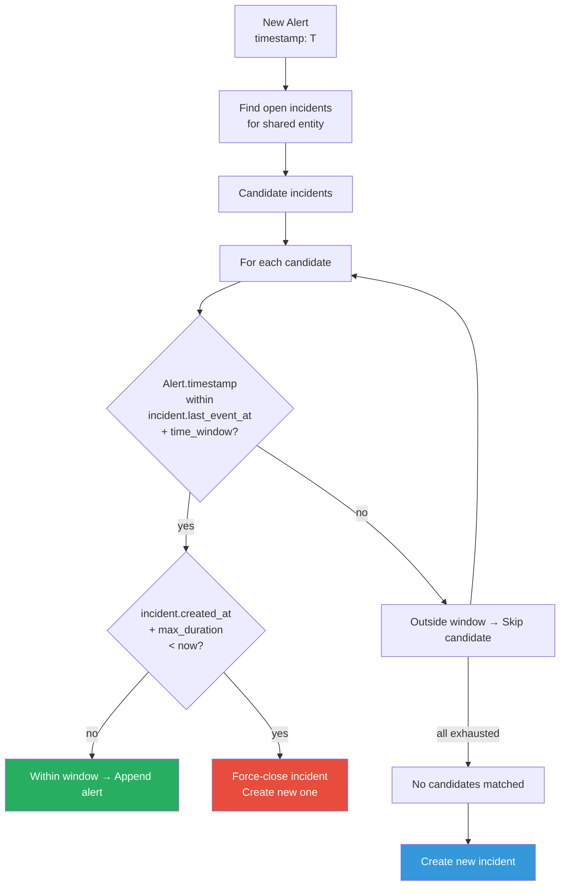

#### Time Window Configuration

| Setting | Default | Description |
|---|---|---|
| `correlation.time_window_minutes` | `15` | Alerts within this window of the incident's last event are correlated |
| `correlation.max_duration_hours` | `24` | Hard cap — after 24h, force-close and start a new incident |
| `correlation.extend_on_alert` | `true` | Each new alert extends the window by `time_window_minutes` from the alert's timestamp |

**Example: Sliding Window**

```
Time:    T+0    T+5    T+10   T+15   T+20   T+25   T+30   T+35
         |      |      |      |      |      |      |      |
Alert:   A1     A2            A3                   A4
Window:  [---- T+0 to T+15 ----]
                [---- T+5 to T+20 ----]
                               [---- T+10 to T+25 ----]
                                                    A4 → within T+10+25? YES
         ^^^^^^^^^^^^^^^^^^^^^^^^^^^^^^^^^^^^^^^^^^^^^^^^^^^^^^^^
         All four alerts are in ONE incident (window slides forward)
```

### 2.4 Context Correlation (Tertiary)

Beyond entity and time, the Correlator considers contextual signals:

| Signal | Effect | Example |
|---|---|---|
| **Rule + AI agreement** | Both engines flag the same event → boost confidence, single incident | Rule: brute force, AI: anomalous frequency → merged |
| **Kill chain progression** | Alerts map to consecutive MITRE ATT&CK tactics → single incident | Credential Access → Privilege Escalation → Lateral Movement |
| **Same source IP, different targets** | One attacker hitting multiple hosts → single multi-entity incident | `192.168.1.100` → brute force against 5 accounts |
| **Same campaign** | Multiple entities affected by the same rule in a burst → campaign incident | Rule `rule-malware-001` fires on 10 hosts in 2 minutes |

### 2.5 Complete Correlation Algorithm

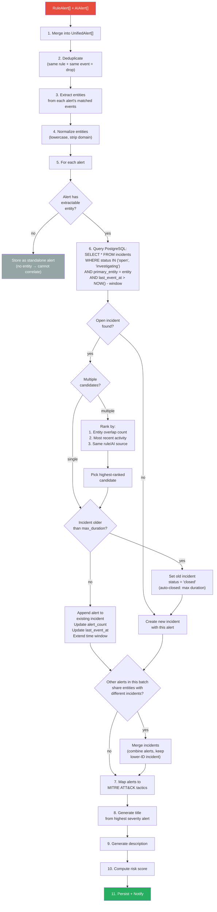

### 2.6 Correlation Configuration

| Setting | Default | Description |
|---|---|---|
| `correlation.time_window_minutes` | `15` | Rolling window for entity correlation |
| `correlation.max_duration_hours` | `24` | Hard cap before force-close |
| `correlation.max_alerts_per_incident` | `500` | Cap to prevent unbounded growth |
| `correlation.entity_types` | `["user","src_ip","dst_ip","host"]` | Which entity types to correlate on |
| `correlation.merge_cross_entity` | `true` | Merge incidents sharing alerts across entities |
| `correlation.kill_chain_enabled` | `false` | Enable MITRE ATT&CK mapping (post-MVP) |
| `correlation.auto_close_resolved_hours` | `72` | Auto-close resolved incidents after 72h of inactivity |

---

## 3. Alert Grouping

### 3.1 Alert Unification

Rule Alerts and AI Alerts arrive in different formats. The `AlertMerger` normalizes them into a common `UnifiedAlert` structure before correlation.

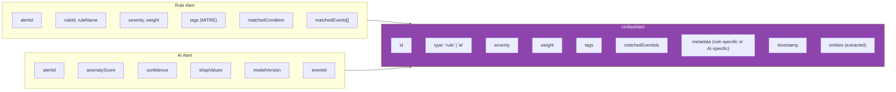

### 3.2 Deduplication

Before grouping, exact duplicates are removed. Two alerts are duplicates if they have the **same dedup key**:

```
DedupKey = hash(alert.type + alert.ruleId + sorted(alert.matchedEventIds))
```

| Scenario | Dedup Key Match? | Action |
|---|---|---|
| Same rule fires twice on the same event (race condition) | Yes | Drop duplicate |
| Same rule fires on different events | No | Keep both |
| Different rules fire on the same event | No | Keep both |
| AI and Rule fire on the same event | No | Keep both (different type) |

### 3.3 Grouping Strategies

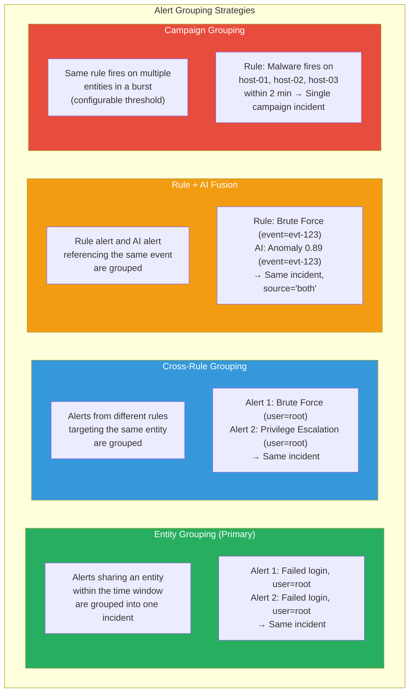

### 3.4 Cross-Entity Merge

When alerts in the **same processing batch** are correlated to different existing incidents that share overlapping entities, the incidents are merged:

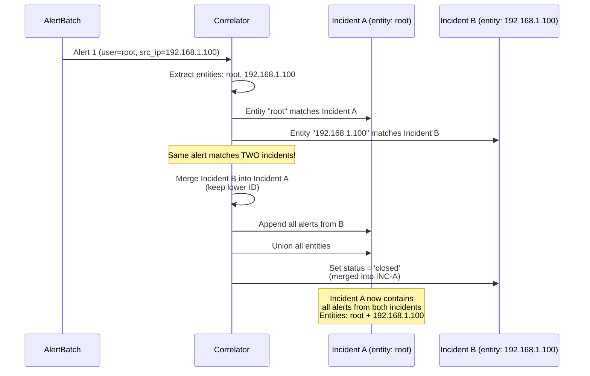

### 3.5 Max Alerts Cap

To prevent mega-incidents (e.g., a DDoS generating 100,000 count-rule alerts), incidents are capped at `max_alerts_per_incident` (default: 500).

| Alert Count | Behavior |
|---|---|
| 1-500 | Normal — alert appended to incident |
| 501+ | New alert logged but NOT appended. Incident metadata field `alerts_suppressed` incremented. Warning logged |
| 1000+ (any incident) | Operational alert to SOC: "Incident INC-XXX has exceeded alert cap. Possible alert storm." |

---

## 4. Timeline

### 4.1 Timeline Architecture

Every incident maintains a chronological timeline of **three types of entries**: Events (raw logs), Alerts (detections), and Actions (analyst/system activity).

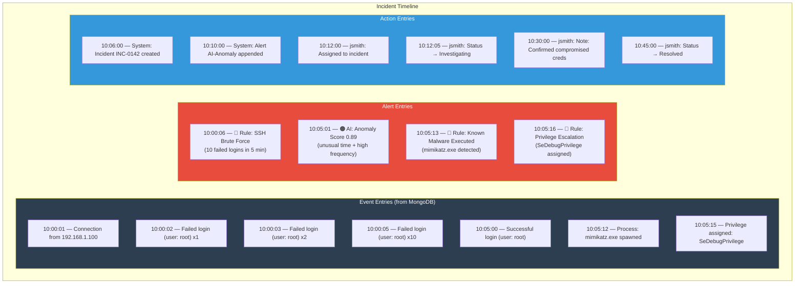

### 4.2 Timeline Entry Data Model

```typescript
// Domain Layer - modules/incidents/domain/TimelineEntry.ts

type TimelineEntryType = "event" | "alert" | "action";

interface TimelineEntry {
  id: string;
  incidentId: string;
  type: TimelineEntryType;
  timestamp: Date;
  
  // Event-specific (type = "event")
  eventId?: string;           // MongoDB normalized_events._id
  eventClassUid?: number;     // OCSF class
  eventMessage?: string;      // Event message
  eventSeverity?: number;     // OCSF severity_id
  
  // Alert-specific (type = "alert")
  alertId?: string;
  alertType?: "rule" | "ai";
  alertSeverity?: string;
  alertTitle?: string;        // Rule name or "AI Anomaly"
  anomalyScore?: number;      // AI alert score
  
  // Action-specific (type = "action")
  action?: string;            // "created" | "status_change" | "assigned" | "note_added" | "merged"
  actorId?: string;           // User ID or "system"
  actorName?: string;
  previousValue?: string;     // For status changes
  newValue?: string;
  noteContent?: string;       // For note_added actions
}
```

### 4.3 Timeline Construction

The timeline is not pre-stored as a single document. It is **constructed on demand** from three sources when an analyst opens the incident detail page.

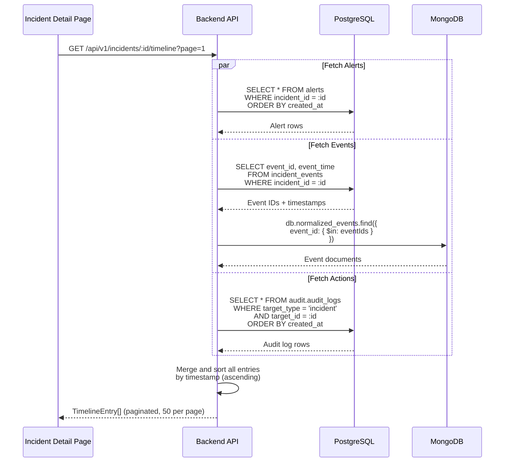

### 4.4 Timeline Grouping (UI Optimization)

To prevent 1000+ individual entries flooding the timeline, the frontend groups consecutive similar events:

| Raw Timeline | Grouped Timeline |
|---|---|
| 10:00:01 — Failed login (root) | |
| 10:00:02 — Failed login (root) | **10:00:01-10:00:05 — Failed login (root) × 10** |
| 10:00:03 — Failed login (root) | *(expandable to show individual entries)* |
| ... (7 more) | |
| 10:00:06 — 🔴 Alert: Brute Force | 10:00:06 — 🔴 Alert: Brute Force |
| 10:05:00 — Successful login (root) | 10:05:00 — Successful login (root) |

Grouping rules:
- Consecutive events with the **same message pattern** and **same actor** are collapsed
- Alerts are **never** collapsed — each alert is shown individually
- Actions are **never** collapsed

### 4.5 Timeline API

| Endpoint | Method | Description |
|---|---|---|
| `/api/v1/incidents/:id/timeline` | GET | Paginated timeline (events + alerts + actions) |
| `/api/v1/incidents/:id/timeline?type=alert` | GET | Alerts only |
| `/api/v1/incidents/:id/timeline?type=event` | GET | Events only |
| `/api/v1/incidents/:id/timeline?type=action` | GET | Actions only |
| `/api/v1/incidents/:id/timeline?from=&to=` | GET | Time-range filtered |

---

## 5. Risk Score

### 5.1 Scoring Architecture

Every incident receives a **composite risk score (0-100)** calculated from multiple weighted factors. The score is recalculated every time a new alert is appended to the incident.

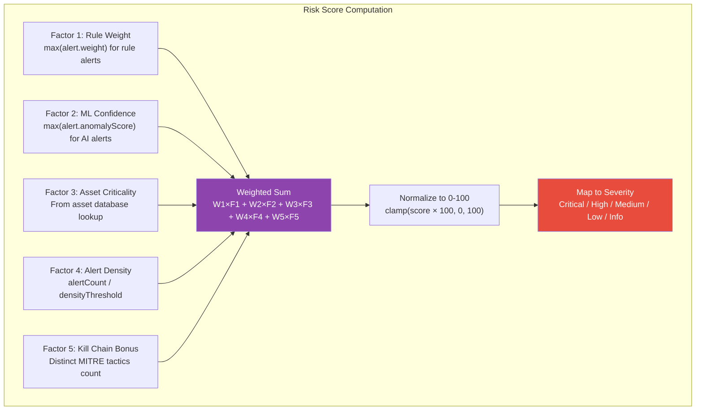

### 5.2 Scoring Formula

```
RiskScore = 100 × clamp(
    W_rule   × MaxRuleWeight +
    W_ml     × MaxMLConfidence +
    W_asset  × AssetCriticality +
    W_density × AlertDensityFactor +
    W_kc     × KillChainBonus
, 0.0, 1.0)
```

### 5.3 Factor Computation

| Factor | Computation | Range | Default Weight |
|---|---|---|---|
| **MaxRuleWeight** | `max(alert.weight for alert in alerts where alert.type == 'rule')` | 0.0 - 1.0 | **0.30** |
| **MaxMLConfidence** | `max(alert.anomalyScore for alert in alerts where alert.type == 'ai')` | 0.0 - 1.0 | **0.25** |
| **AssetCriticality** | `assetRepository.getCriticality(incident.primaryEntity)` | 0.0 - 1.0 | **0.20** |
| **AlertDensityFactor** | `min(1.0, incident.alertCount / density_threshold)` | 0.0 - 1.0 | **0.15** |
| **KillChainBonus** | `min(1.0, distinctTacticsCount / 3)` | 0.0 - 1.0 | **0.10** |

### 5.4 Missing Factor Handling

When a factor is unavailable, it defaults to **0.5 (neutral)** — it neither inflates nor deflates the score.

| Scenario | Factor Value | Impact |
|---|---|---|
| AI Engine offline (fallback used) | `MaxMLConfidence = 0.5` | Neutral |
| No AI alerts (rule-only detection) | `MaxMLConfidence = 0.5` | Neutral |
| No rule alerts (AI-only detection) | `MaxRuleWeight = 0.5` | Neutral |
| Asset not in database | `AssetCriticality = 0.5` | Neutral |
| Kill chain disabled | `KillChainBonus = 0.0` | No contribution |

### 5.5 Severity Classification

| Score Range | Severity | Color | Dashboard Behavior |
|---|---|---|---|
| **80 - 100** | Critical | `#e74c3c` 🔴 | Immediate notification, top of queue, pulse animation |
| **60 - 79** | High | `#e67e22` 🟠 | Notification, elevated in queue |
| **40 - 59** | Medium | `#f1c40f` 🟡 | Normal queue position |
| **20 - 39** | Low | `#3498db` 🔵 | Below fold |
| **0 - 19** | Informational | `#95a5a6` ⚪ | Collapsed by default |

### 5.6 Score Recalculation Trigger

The score is recalculated when:

| Trigger | Example |
|---|---|
| New alert appended | Brute force count rule fires again → alert added → rescore |
| AI alert added after rule-only creation | AI Engine processes same event batch → AI alert added → rescore (source changes from `rule` to `both`) |
| Asset criticality updated | Admin updates asset criticality from 0.5 to 0.9 → all open incidents for that asset are rescored |
| Kill chain stage discovered | New alert maps to a new MITRE tactic → `distinctTacticsCount` increases → rescore |

### 5.7 Score Breakdown Example

```json
{
  "incidentId": "inc-0142",
  "riskScore": 78.5,
  "severity": "high",
  "scoreBreakdown": {
    "factors": {
      "ruleWeight": {
        "value": 0.80,
        "weight": 0.30,
        "contribution": 0.240,
        "source": "rule-bf-ssh-001 (weight: 0.8)"
      },
      "mlConfidence": {
        "value": 0.92,
        "weight": 0.25,
        "contribution": 0.230,
        "source": "AI anomaly score 0.92 (event evt-456)"
      },
      "assetCriticality": {
        "value": 0.90,
        "weight": 0.20,
        "contribution": 0.180,
        "source": "web-server-01 (production database proxy)"
      },
      "alertDensity": {
        "value": 0.60,
        "weight": 0.15,
        "contribution": 0.090,
        "source": "12 alerts / 20 threshold = 0.60"
      },
      "killChainBonus": {
        "value": 0.67,
        "weight": 0.10,
        "contribution": 0.067,
        "source": "2 tactics: credential_access, privilege_escalation (2/3 = 0.67)"
      }
    },
    "rawScore": 0.807,
    "finalScore": 78.5,
    "formula": "100 × (0.30×0.80 + 0.25×0.92 + 0.20×0.90 + 0.15×0.60 + 0.10×0.67) = 78.5"
  }
}
```

### 5.8 Scoring Configuration

| Setting | Default | Description |
|---|---|---|
| `scoring.weight_rule` | `0.30` | Weight for rule component |
| `scoring.weight_ml` | `0.25` | Weight for ML component |
| `scoring.weight_asset` | `0.20` | Weight for asset criticality |
| `scoring.weight_density` | `0.15` | Weight for alert density |
| `scoring.weight_killchain` | `0.10` | Weight for kill chain progression |
| `scoring.density_threshold` | `20` | Alert count that maps to density=1.0 |
| `scoring.neutral_default` | `0.5` | Default when a factor is unavailable |
| `scoring.severity_critical` | `80` | Min score for Critical |
| `scoring.severity_high` | `60` | Min score for High |
| `scoring.severity_medium` | `40` | Min score for Medium |
| `scoring.severity_low` | `20` | Min score for Low |

---

## 6. Investigation

### 6.1 Investigation Architecture

The investigation workflow connects the incident directly to raw log data and AI explainability, enabling an analyst to transition from **detection to response** without changing context.

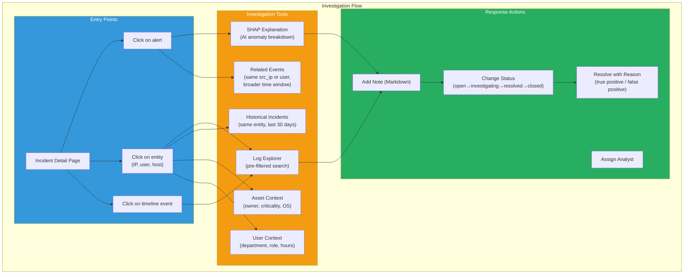

### 6.2 Entity Pivoting

Any entity (IP, username, hostname) displayed within the incident is **clickable**. Clicking an entity navigates the analyst to the Log Explorer with a pre-built query.

| Click Target | Pre-Built Query | Time Range |
|---|---|---|
| Source IP `192.168.1.100` | `src_endpoint.ip:"192.168.1.100" OR dst_endpoint.ip:"192.168.1.100"` | Incident first_event_at − 1h to last_event_at + 1h |
| Username `root` | `actor.user.name:"root"` | Same as above |
| Hostname `web-server-01` | `device.hostname:"web-server-01"` | Same as above |
| Alert (rule) | `event_id IN [matched_event_ids]` | Direct event lookup |
| Alert (AI) | `event_id:"evt-456"` with SHAP panel open | Direct event + explanation |

### 6.3 Entity Pivoting Flow

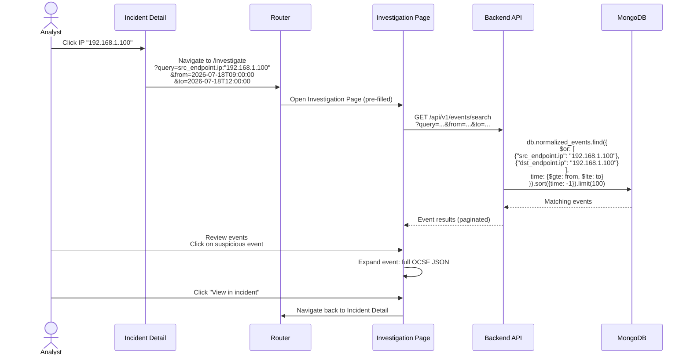

### 6.4 SHAP Explanation Panel

When an AI alert is present in the incident, the analyst can view the **SHAP waterfall** directly within the incident detail page.

```
┌─────────────────────────────────────────────────────────┐
│  AI Alert: Anomaly Score 0.89  (Confidence: 92%)        │
│  Model: isolation_forest v20260718_120000                │
│                                                         │
│  Why was this flagged?                                  │
│                                                         │
│  Base value: 0.32                        Final: 0.89    │
│  ├────────────────────────────────────────────────────┤  │
│  events_per_minute_src_ip = 45  ██████████████ +0.28    │
│  failed_login_count = 38        ██████████ +0.22        │
│  is_business_hours = 0          ██████ +0.15            │
│  failed_to_success_ratio = 0.97 █████ +0.12             │
│  time_deviation_score = 2.8     ███ +0.08               │
│  new_source_ip = 1              ██ +0.06                │
│  bytes_sent = 120               █ -0.02 (normal)        │
│                                                         │
│  ℹ The event frequency (45/min) was 15x higher than     │
│    the 24-hour average for this source IP, during       │
│    non-business hours.                                  │
└─────────────────────────────────────────────────────────┘
```

### 6.5 Historical Context Panel

When an entity is selected, the system automatically queries for historical context:

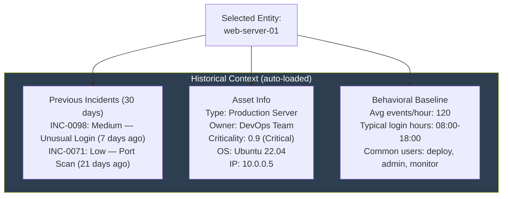

### 6.6 Resolution Workflow

When an analyst resolves an incident, they must select a resolution reason. This data feeds back into operational metrics and future rule tuning.

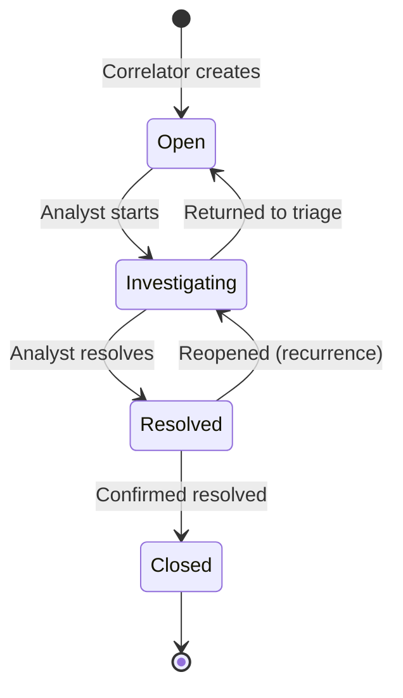

#### Resolution Reasons

| Reason | Code | Effect |
|---|---|---|
| True Positive — Mitigated | `tp_mitigated` | Counts toward rule accuracy. No action on rules |
| True Positive — Accepted Risk | `tp_accepted` | Counts as acknowledged threat. No mitigation taken |
| False Positive — Rule Tuning | `fp_rule_tuning` | Flags the rule for review. Increments rule's false_positive counter |
| False Positive — AI Noise | `fp_ai_noise` | Flags the AI threshold for review. Tracked in AI Insights dashboard |
| False Positive — Known Behavior | `fp_known` | Suggests creating an exclusion/whitelist entry |
| Duplicate | `duplicate` | Merged with another incident |
| Informational — No Action | `informational` | Closed as noise |

### 6.7 Investigation API Endpoints

| Method | Endpoint | Description |
|---|---|---|
| `GET` | `/api/v1/incidents/:id` | Full incident detail |
| `GET` | `/api/v1/incidents/:id/timeline` | Paginated timeline |
| `GET` | `/api/v1/incidents/:id/alerts` | Alerts for this incident |
| `GET` | `/api/v1/incidents/:id/events` | Events linked to this incident |
| `GET` | `/api/v1/incidents/:id/context` | Historical incidents + asset info for entities |
| `PUT` | `/api/v1/incidents/:id/status` | Change incident status |
| `PUT` | `/api/v1/incidents/:id/assign` | Assign to analyst |
| `POST` | `/api/v1/incidents/:id/notes` | Add investigation note |
| `PUT` | `/api/v1/incidents/:id/resolve` | Resolve with reason |
| `GET` | `/api/v1/events/search` | Full-text event search (investigation) |

---

> **This document is governed by [ADR-001](file:///d:/AI%20SIEM/docs/architecture/decisions/ADR-001-modular-monolith.md). The Incident Correlator operates within the Node.js backend monolith as part of the Correlation Module. It receives alerts from the Rule Engine ([RULE-ENGINE-001](file:///d:/AI%20SIEM/docs/rule-engine.md)) and AI Client ([AI-ENGINE-001](file:///d:/AI%20SIEM/docs/ai-engine.md)), stores incidents in PostgreSQL and events in MongoDB ([DB-001](file:///d:/AI%20SIEM/docs/database.md)), and pushes real-time notifications to the Next.js dashboard ([FRONTEND-001](file:///d:/AI%20SIEM/docs/frontend.md)).**
>
> **Document Version**: 2.0
> **Last Updated**: 2026-07-19
