# Rule Engine Design

## AI-Powered Security Analytics Platform

| Field | Value |
|---|---|
| **Document ID** | RULE-ENGINE-001 |
| **Version** | 1.0 |
| **Date** | 2026-07-18 |
| **Status** | Draft |
| **Language** | Node.js + TypeScript |
| **Architecture Reference** | [ADR-001](file:///d:/AI%20SIEM/docs/architecture/decisions/ADR-001-modular-monolith.md) |
| **Backend Detection** | [BACKEND-002](file:///d:/AI%20SIEM/docs/backend-detection.md) |
| **Database Design** | [DB-001](file:///d:/AI%20SIEM/docs/database.md) |

---

## Table of Contents

1. [Architecture](#1-architecture)
2. [Execution Flow](#2-execution-flow)
3. [Rule Storage](#3-rule-storage)
4. [Rule Evaluation](#4-rule-evaluation)
5. [Rule Priorities](#5-rule-priorities)
6. [Rule CRUD](#6-rule-crud)
7. [Performance Optimization](#7-performance-optimization)

---

## 1. Architecture

### 1.1 Position in the Pipeline

The Rule Engine sits in the **Detection Layer** of the backend pipeline. It receives feature-enriched events from the Feature Extractor and produces rule-based alerts that feed into the Incident Correlator.

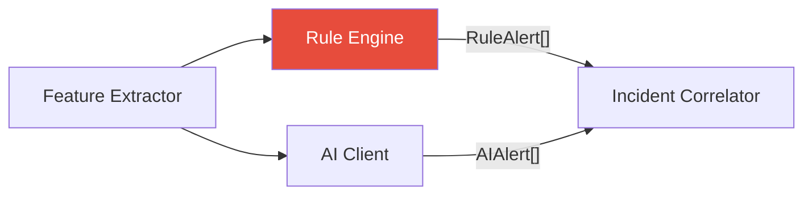
```mermaid
flowchart LR
    FEX["Feature Extractor"]
    RE["Rule Engine"]
    AIC["AI Client"]
    COR["Incident Correlator"]

    FEX --> RE
    FEX --> AIC
    RE -->|"RuleAlert[]"| COR
    AIC -->|"AIAlert[]"| COR

    style RE fill:#e74c3c,color:#fff
```

### 1.2 Internal Architecture

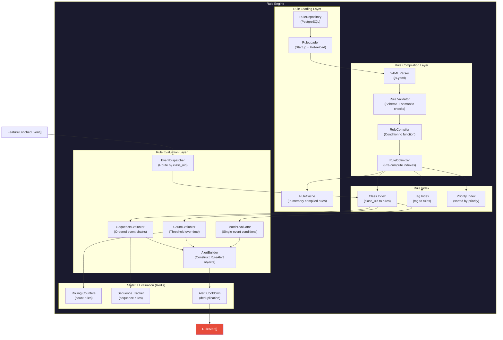
```mermaid
graph TB
    subgraph RULE_ENGINE["Rule Engine"]

        subgraph LOAD["Rule Loading Layer"]
            REPO["RuleRepository<br/>(PostgreSQL)"]
            LOADER["RuleLoader<br/>(Startup + Hot-reload)"]
            CACHE["RuleCache<br/>(In-memory compiled rules)"]
        end

        subgraph COMPILE["Rule Compilation Layer"]
            PARSER_Y["YAML Parser<br/>(js-yaml)"]
            VALIDATOR_R["Rule Validator<br/>(Schema + semantic checks)"]
            COMPILER["RuleCompiler<br/>(Condition to function)"]
            OPT["RuleOptimizer<br/>(Pre-compute indexes)"]
        end

        subgraph EVAL["Rule Evaluation Layer"]
            DISPATCHER["EventDispatcher<br/>(Route by class_uid)"]
            MATCH_EVAL["MatchEvaluator<br/>(Single-event conditions)"]
            COUNT_EVAL["CountEvaluator<br/>(Threshold over time)"]
            SEQ_EVAL["SequenceEvaluator<br/>(Ordered event chains)"]
            ALERT_BUILD["AlertBuilder<br/>(Construct RuleAlert objects)"]
        end

        subgraph STATE["Stateful Evaluation (Redis)"]
            COUNTERS["Rolling Counters<br/>(count rules)"]
            SEQ_TRACK["Sequence Tracker<br/>(sequence rules)"]
            COOLDOWN["Alert Cooldown<br/>(deduplication)"]
        end

        subgraph INDEX["Rule Index"]
            CLASS_IDX["Class Index<br/>(class_uid to rules)"]
            TAG_IDX["Tag Index<br/>(tag to rules)"]
            PRIO_IDX["Priority Index<br/>(sorted by priority)"]
        end
    end

    REPO --> LOADER --> PARSER_Y --> VALIDATOR_R --> COMPILER --> OPT
    OPT --> CACHE
    OPT --> CLASS_IDX
    OPT --> TAG_IDX
    OPT --> PRIO_IDX

    EVENTS_IN["FeatureEnrichedEvent[]"] --> DISPATCHER
    DISPATCHER --> CLASS_IDX
    CLASS_IDX --> MATCH_EVAL
    CLASS_IDX --> COUNT_EVAL
    CLASS_IDX --> SEQ_EVAL
    COUNT_EVAL --> COUNTERS
    SEQ_EVAL --> SEQ_TRACK
    MATCH_EVAL --> ALERT_BUILD
    COUNT_EVAL --> ALERT_BUILD
    SEQ_EVAL --> ALERT_BUILD
    ALERT_BUILD --> COOLDOWN
    COOLDOWN --> ALERTS_OUT["RuleAlert[]"]

    style RULE_ENGINE fill:#1a1a2e,color:#fff
    style ALERTS_OUT fill:#e74c3c,color:#fff
```

### 1.3 Class Diagram


```mermaid
classDiagram
    class IRuleEngine {
        <<interface>>
        +evaluate(events: FeatureEnrichedEvent[]) RuleEvaluationResult
        +reloadRules() void
        +getStats() RuleEngineStats
    }

    class SigmaRuleEngine {
        -ruleCache: RuleCache
        -ruleLoader: RuleLoader
        -matchEvaluator: MatchEvaluator
        -countEvaluator: CountEvaluator
        -sequenceEvaluator: SequenceEvaluator
        -alertBuilder: AlertBuilder
        -cooldownManager: CooldownManager
        -logger: ILogger
        +evaluate(events: FeatureEnrichedEvent[]) RuleEvaluationResult
        +reloadRules() void
        +getStats() RuleEngineStats
    }

    class RuleLoader {
        -ruleRepository: IRuleRepository
        -ruleCompiler: RuleCompiler
        -ruleValidator: RuleValidator
        +loadAll() CompiledRule[]
        +loadById(id: string) CompiledRule
        +onRuleChanged(callback: Function) void
    }

    class RuleCompiler {
        -conditionParser: ConditionParser
        -fieldResolver: FieldResolver
        +compile(rule: RuleDefinition) CompiledRule
        -compileMatchCondition(condition: MatchCondition) ConditionFunction
        -compileCountCondition(condition: CountCondition) ConditionFunction
        -compileSequenceCondition(condition: SequenceCondition) ConditionFunction
    }

    class RuleValidator {
        +validate(yaml: string) ValidationResult
        -validateStructure(rule: RuleDefinition) ValidationError[]
        -validateCondition(condition: Condition) ValidationError[]
        -validateFieldReferences(fields: string[]) ValidationError[]
    }

    class RuleCache {
        -rules: Map~string_CompiledRule~
        -classIndex: Map~number_CompiledRule[]~
        -tagIndex: Map~string_CompiledRule[]~
        -priorityOrder: CompiledRule[]
        +get(id: string) CompiledRule
        +getByClass(classUid: number) CompiledRule[]
        +getAll() CompiledRule[]
        +set(rule: CompiledRule) void
        +remove(id: string) void
        +rebuild() void
    }

    class MatchEvaluator {
        +evaluate(event: FeatureEnrichedEvent, rules: CompiledRule[]) MatchResult[]
        -evaluateCondition(event: any, condition: ConditionFunction) boolean
        -resolveField(event: any, fieldPath: string) any
    }

    class CountEvaluator {
        -redisClient: IFeatureCache
        +evaluate(event: FeatureEnrichedEvent, rules: CompiledRule[]) CountResult[]
        -incrementCounter(key: string, windowSeconds: number) number
        -checkThreshold(count: number, threshold: number) boolean
    }

    class SequenceEvaluator {
        -redisClient: IFeatureCache
        +evaluate(event: FeatureEnrichedEvent, rules: CompiledRule[]) SequenceResult[]
        -trackEvent(sequenceId: string, step: number, eventId: string) void
        -checkSequenceComplete(sequenceId: string, steps: number) boolean
    }

    class AlertBuilder {
        +build(rule: CompiledRule, matchedEvents: string[], matchedCondition: string) RuleAlert
    }

    class CooldownManager {
        -redisClient: IFeatureCache
        +shouldAlert(ruleId: string, entityKey: string) boolean
        +recordAlert(ruleId: string, entityKey: string, cooldownSeconds: number) void
    }

    class CompiledRule {
        +id: string
        +name: string
        +description: string
        +type: RuleType
        +severity: RuleSeverity
        +weight: number
        +priority: number
        +classUid: number
        +categoryUid: number
        +tags: string[]
        +conditionFn: ConditionFunction
        +countConfig: CountConfig
        +sequenceConfig: SequenceConfig
        +cooldownSeconds: number
        +isActive: boolean
        +compiledAt: Date
        +compiledHash: string
    }

    IRuleEngine <|.. SigmaRuleEngine
    SigmaRuleEngine --> RuleLoader
    SigmaRuleEngine --> RuleCache
    SigmaRuleEngine --> MatchEvaluator
    SigmaRuleEngine --> CountEvaluator
    SigmaRuleEngine --> SequenceEvaluator
    SigmaRuleEngine --> AlertBuilder
    SigmaRuleEngine --> CooldownManager
    RuleLoader --> RuleCompiler
    RuleLoader --> RuleValidator
    RuleCache --> CompiledRule
```

### 1.4 Design Principles

| Principle | Application |
|---|---|
| **Hot-reloadable** | Rules are loaded from PostgreSQL into memory. CRUD operations trigger a targeted cache update — no restart needed |
| **Compiled rules** | Sigma YAML is compiled into JavaScript condition functions at load time. Evaluation is a function call, not a YAML re-parse |
| **Class-indexed dispatch** | Events are routed only to rules that match their OCSF `class_uid`. Rules irrelevant to an event class are never evaluated |
| **Stateful evaluation** | Count and Sequence rules maintain state in Redis with TTL. State automatically expires — no cleanup needed |
| **Cooldown deduplication** | After a rule fires, it enters a cooldown period for that entity. Prevents 1000 identical alerts from a brute force burst |

---

## 2. Execution Flow

### 2.1 Startup Flow

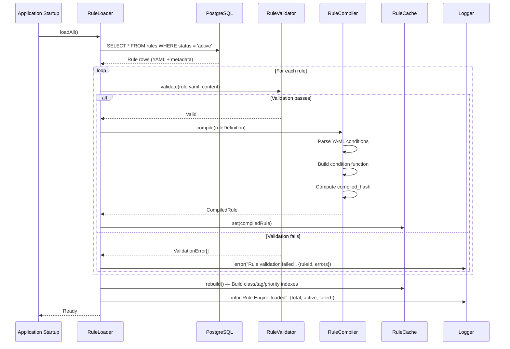
```mermaid
sequenceDiagram
    participant APP as Application Startup
    participant RL as RuleLoader
    participant PG as PostgreSQL
    participant RV as RuleValidator
    participant RC as RuleCompiler
    participant CACHE as RuleCache
    participant LOG as Logger

    APP->>RL: loadAll()
    RL->>PG: SELECT * FROM rules WHERE status = 'active'
    PG-->>RL: Rule rows (YAML + metadata)

    loop For each rule
        RL->>RV: validate(rule.yaml_content)
        alt Validation passes
            RV-->>RL: Valid
            RL->>RC: compile(ruleDefinition)
            RC->>RC: Parse YAML conditions
            RC->>RC: Build condition function
            RC->>RC: Compute compiled_hash
            RC-->>RL: CompiledRule
            RL->>CACHE: set(compiledRule)
        else Validation fails
            RV-->>RL: ValidationError[]
            RL->>LOG: error("Rule validation failed", {ruleId, errors})
        end
    end

    RL->>CACHE: rebuild() — Build class/tag/priority indexes
    RL->>LOG: info("Rule Engine loaded", {total, active, failed})
    RL-->>APP: Ready
```

### 2.2 Event Evaluation Flow

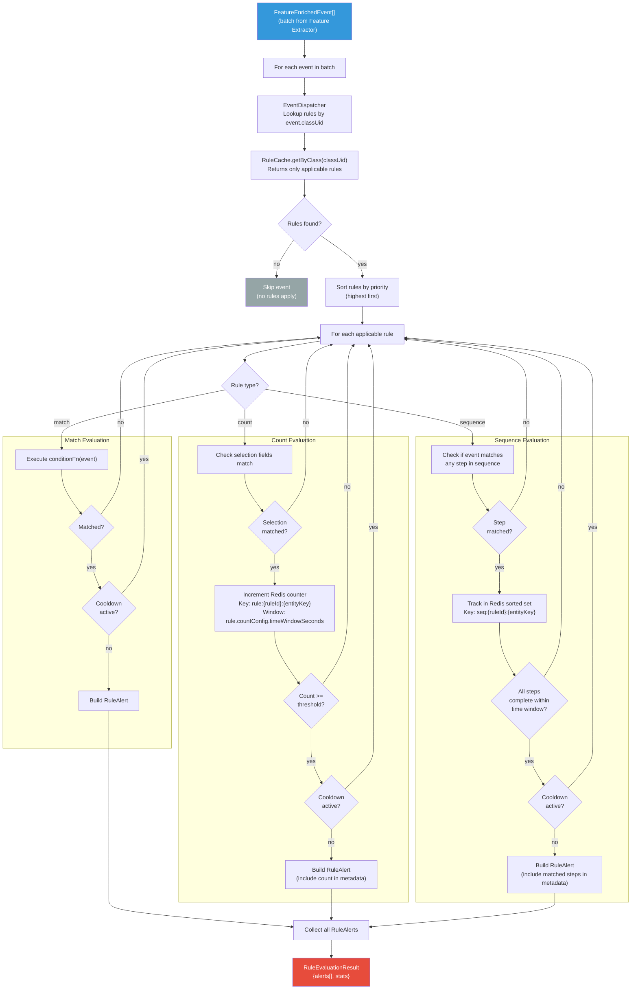
```mermaid
flowchart TD
    INPUT["FeatureEnrichedEvent[]<br/>(batch from Feature Extractor)"]

    LOOP["For each event in batch"]

    DISPATCH["EventDispatcher<br/>Lookup rules by event.classUid"]
    CLASS_LOOKUP["RuleCache.getByClass(classUid)<br/>Returns only applicable rules"]
    EMPTY{"Rules found?"}
    SKIP["Skip event<br/>(no rules apply)"]

    SORT["Sort rules by priority<br/>(highest first)"]

    FOREACH_RULE["For each applicable rule"]
    TYPE{"Rule type?"}

    subgraph MATCH_PATH["Match Evaluation"]
        MATCH_EXEC["Execute conditionFn(event)"]
        MATCH_RESULT{"Matched?"}
        MATCH_COOLDOWN{"Cooldown<br/>active?"}
        MATCH_ALERT["Build RuleAlert"]
    end

    subgraph COUNT_PATH["Count Evaluation"]
        COUNT_SELECT["Check selection fields match"]
        COUNT_HIT{"Selection<br/>matched?"}
        COUNT_INC["Increment Redis counter<br/>Key: rule:{ruleId}:{entityKey}<br/>Window: rule.countConfig.timeWindowSeconds"]
        COUNT_CHECK{"Count >=<br/>threshold?"}
        COUNT_COOLDOWN{"Cooldown<br/>active?"}
        COUNT_ALERT["Build RuleAlert<br/>(include count in metadata)"]
    end

    subgraph SEQ_PATH["Sequence Evaluation"]
        SEQ_MATCH["Check if event matches<br/>any step in sequence"]
        SEQ_STEP{"Step<br/>matched?"}
        SEQ_TRACK_S["Track in Redis sorted set<br/>Key: seq:{ruleId}:{entityKey}"]
        SEQ_COMPLETE{"All steps<br/>complete within<br/>time window?"}
        SEQ_COOLDOWN{"Cooldown<br/>active?"}
        SEQ_ALERT["Build RuleAlert<br/>(include matched steps in metadata)"]
    end

    COLLECT["Collect all RuleAlerts"]
    OUTPUT["RuleEvaluationResult<br/>{alerts[], stats}"]

    INPUT --> LOOP --> DISPATCH --> CLASS_LOOKUP --> EMPTY
    EMPTY -->|"no"| SKIP
    EMPTY -->|"yes"| SORT --> FOREACH_RULE --> TYPE

    TYPE -->|"match"| MATCH_EXEC --> MATCH_RESULT
    MATCH_RESULT -->|"no"| FOREACH_RULE
    MATCH_RESULT -->|"yes"| MATCH_COOLDOWN
    MATCH_COOLDOWN -->|"yes"| FOREACH_RULE
    MATCH_COOLDOWN -->|"no"| MATCH_ALERT --> COLLECT

    TYPE -->|"count"| COUNT_SELECT --> COUNT_HIT
    COUNT_HIT -->|"no"| FOREACH_RULE
    COUNT_HIT -->|"yes"| COUNT_INC --> COUNT_CHECK
    COUNT_CHECK -->|"no"| FOREACH_RULE
    COUNT_CHECK -->|"yes"| COUNT_COOLDOWN
    COUNT_COOLDOWN -->|"yes"| FOREACH_RULE
    COUNT_COOLDOWN -->|"no"| COUNT_ALERT --> COLLECT

    TYPE -->|"sequence"| SEQ_MATCH --> SEQ_STEP
    SEQ_STEP -->|"no"| FOREACH_RULE
    SEQ_STEP -->|"yes"| SEQ_TRACK_S --> SEQ_COMPLETE
    SEQ_COMPLETE -->|"no"| FOREACH_RULE
    SEQ_COMPLETE -->|"yes"| SEQ_COOLDOWN
    SEQ_COOLDOWN -->|"yes"| FOREACH_RULE
    SEQ_COOLDOWN -->|"no"| SEQ_ALERT --> COLLECT

    COLLECT --> OUTPUT

    style INPUT fill:#3498db,color:#fff
    style OUTPUT fill:#e74c3c,color:#fff
    style SKIP fill:#95a5a6,color:#fff
```

### 2.3 Hot-Reload Flow

When a rule is created, updated, deleted, enabled, or disabled via the REST API, the Rule Engine is updated in real-time without restart.

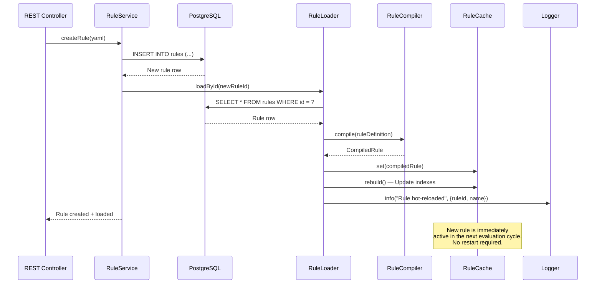
```mermaid
sequenceDiagram
    participant API as REST Controller
    participant SVC as RuleService
    participant PG as PostgreSQL
    participant RL as RuleLoader
    participant RC as RuleCompiler
    participant CACHE as RuleCache
    participant LOG as Logger

    API->>SVC: createRule(yaml)
    SVC->>PG: INSERT INTO rules (...)
    PG-->>SVC: New rule row

    SVC->>RL: loadById(newRuleId)
    RL->>PG: SELECT * FROM rules WHERE id = ?
    PG-->>RL: Rule row
    RL->>RC: compile(ruleDefinition)
    RC-->>RL: CompiledRule
    RL->>CACHE: set(compiledRule)
    RL->>CACHE: rebuild() — Update indexes
    RL->>LOG: info("Rule hot-reloaded", {ruleId, name})

    SVC-->>API: Rule created + loaded

    Note over CACHE: New rule is immediately<br/>active in the next evaluation cycle.<br/>No restart required.
```

---

## 3. Rule Storage

### 3.1 Rule Storage Model

Rules are stored in PostgreSQL in the `rules` table (defined in [DB-001](file:///d:/AI%20SIEM/docs/database.md)). The YAML content is the **source of truth**. Compiled representations are in-memory only.

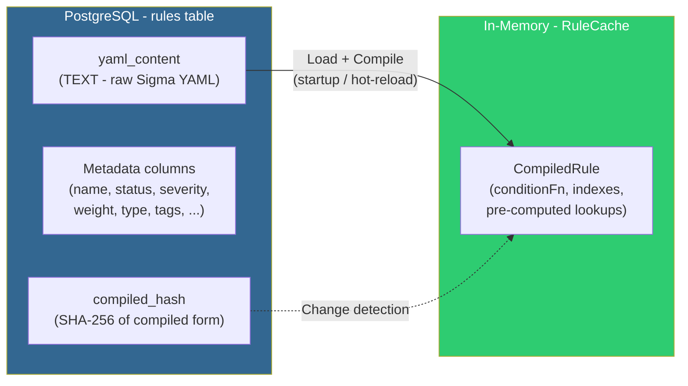
```mermaid
graph LR
    subgraph STORAGE["PostgreSQL - rules table"]
        YAML["yaml_content<br/>(TEXT - raw Sigma YAML)"]
        META["Metadata columns<br/>(name, status, severity,<br/>weight, type, tags, ...)"]
        HASH["compiled_hash<br/>(SHA-256 of compiled form)"]
    end

    subgraph MEMORY["In-Memory - RuleCache"]
        COMPILED["CompiledRule<br/>(conditionFn, indexes,<br/>pre-computed lookups)"]
    end

    YAML -->|"Load + Compile<br/>(startup / hot-reload)"| COMPILED
    HASH -.->|"Change detection"| COMPILED

    style STORAGE fill:#336791,color:#fff
    style MEMORY fill:#2ecc71,color:#fff
```

### 3.2 Sigma Rule Schema

Every rule follows a standardized Sigma-inspired YAML schema:

```yaml
# ============================================================
# Sigma-Compatible Rule Schema
# ============================================================

# --- Identity ---
title: "Human-readable rule name"          # REQUIRED
id: "rule-unique-id-001"                   # REQUIRED (UUID or slug)
description: |                             # OPTIONAL
  Multi-line description of what this
  rule detects and why it matters.

# --- Metadata ---
status: active                             # REQUIRED: active | disabled | archived
level: high                                # REQUIRED: critical | high | medium | low | informational
weight: 0.8                                # REQUIRED: 0.0 - 1.0 (used in risk scoring)
priority: 100                              # OPTIONAL: 1-1000 (higher = evaluated first)
version: 1                                 # AUTO-INCREMENTED on update

# --- OCSF Source Filter ---
logsource:
  class_uid: 3002                          # REQUIRED: OCSF event class
  category_uid: 3                          # OPTIONAL: OCSF category

# --- Detection Logic ---
detection:
  # Selection: field conditions that must match
  selection:
    field_name: "exact value"              # Exact match
    field_name|contains: "substring"       # Substring match
    field_name|startswith: "prefix"        # Prefix match
    field_name|endswith: "suffix"          # Suffix match
    field_name|re: "regex_pattern"         # Regex match
    field_name|gt: 100                     # Greater than
    field_name|gte: 100                    # Greater or equal
    field_name|lt: 50                      # Less than
    field_name|lte: 50                     # Less or equal
    field_name|in:                         # In list
      - "value1"
      - "value2"
    field_name|exists: true                # Field exists
    field_name|not: "excluded_value"       # Not equal

  # Optional: additional selection groups (AND/OR logic)
  selection_extra:
    another_field: "value"

  # Filter: events to exclude from matching (NOT)
  filter:
    field_name: "legitimate_value"

  # Condition: how selections combine
  condition: "selection AND selection_extra AND NOT filter"

  # For count rules: threshold configuration
  count:
    field: "src_endpoint.ip"               # Group-by field for counting
    threshold: 10                          # Alert when count >= threshold
    timewindow: "5m"                       # Rolling time window (s/m/h)

  # For sequence rules: ordered step definitions
  sequence:
    timewindow: "10m"                      # All steps within this window
    by: "actor.user.name"                  # Entity that links the steps
    steps:
      - selection_step1:
          message|contains: "Failed password"
      - selection_step2:
          message|contains: "Accepted password"
      - selection_step3:
          class_uid: 3004                  # Authorization event

# --- Alert Configuration ---
alert:
  cooldown: "5m"                           # Suppress duplicate alerts for this entity+rule

# --- Classification ---
tags:
  - attack.credential_access              # MITRE ATT&CK tactic
  - attack.t1110                           # MITRE ATT&CK technique
  - compliance.pci_dss

falsepositives:
  - "Automated backup processes"
  - "Scheduled password rotation scripts"

references:
  - "https://attack.mitre.org/techniques/T1110/"
  - "https://schema.ocsf.io/1.1.0/classes/authentication"
```

### 3.3 Rule Field Resolution

Rule conditions reference event fields using **dot-notation paths**. The Rule Engine resolves these paths against `FeatureEnrichedEvent` objects.

| Dot-Notation Path | Resolved From | Example Value |
|---|---|---|
| `class_uid` | `event.classUid` | `3002` |
| `severity_id` | `event.severityId` | `3` |
| `message` | `event.message` | `"Failed password for root"` |
| `src_endpoint.ip` | `event.srcEndpoint.ip` | `"192.168.1.100"` |
| `dst_endpoint.ip` | `event.dstEndpoint.ip` | `"10.0.0.5"` |
| `dst_endpoint.port` | `event.dstEndpoint.port` | `22` |
| `actor.user.name` | `event.actor.user.name` | `"root"` |
| `actor.process.name` | `event.actor.process.name` | `"sshd"` |
| `device.hostname` | `event.device.hostname` | `"web-server-01"` |
| `metadata.product.name` | `event.metadata.product.name` | `"sshd"` |
| `features.frequency.events_per_minute_src_ip` | `event.features.frequency.events_per_minute_src_ip` | `45` |
| `features.temporal.is_business_hours` | `event.features.temporal.is_business_hours` | `false` |
| `features.authentication.failed_login_count_10min` | `event.features.authentication.failed_login_count_10min` | `12` |
| `enrichments.geo_src.country` | `event.enrichments.geo_src.country` | `"CN"` |

> [!NOTE]
> Rules can reference **features** and **enrichments** directly. This means rules like "alert when `features.frequency.events_per_minute_src_ip > 30` AND `features.temporal.is_business_hours = false`" are fully supported. This bridges rule-based and statistical detection.

### 3.4 Condition Operators

| Operator | YAML Suffix | JavaScript Compiled Form | Example |
|---|---|---|---|
| Exact match | *(none)* | `value === target` | `message: "audit log cleared"` |
| Contains | `\|contains` | `value.includes(target)` | `message\|contains: "Failed password"` |
| Starts with | `\|startswith` | `value.startsWith(target)` | `actor.user.name\|startswith: "admin"` |
| Ends with | `\|endswith` | `value.endsWith(target)` | `src_endpoint.ip\|endswith: ".100"` |
| Regex | `\|re` | `new RegExp(target).test(value)` | `message\|re: "Failed.*root"` |
| Greater than | `\|gt` | `value > target` | `severity_id\|gt: 3` |
| Greater or equal | `\|gte` | `value >= target` | `features.frequency.events_per_minute_src_ip\|gte: 30` |
| Less than | `\|lt` | `value < target` | `features.temporal.hour_of_day\|lt: 6` |
| Less or equal | `\|lte` | `value <= target` | `dst_endpoint.port\|lte: 1024` |
| In list | `\|in` | `targets.includes(value)` | `actor.process.name\|in: ["mimikatz", "nc"]` |
| Not equal | `\|not` | `value !== target` | `actor.user.name\|not: "SYSTEM"` |
| Exists | `\|exists` | `value !== undefined && value !== null` | `enrichments.geo_src\|exists: true` |

### 3.5 Condition Logic

Selections combine using boolean logic in the `condition` string:

| Logic | Syntax | Meaning |
|---|---|---|
| AND | `selection AND selection_extra` | Both must match |
| OR | `selection OR selection_extra` | Either must match |
| NOT | `NOT filter` | Exclude events matching filter |
| Combined | `(selection OR selection_alt) AND NOT filter` | Grouped boolean logic |

The RuleCompiler parses the condition string into an AST and compiles it to a nested JavaScript function:

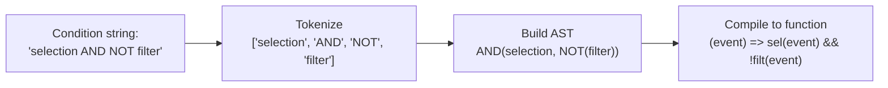
```mermaid
flowchart LR
    COND["Condition string:<br/>'selection AND NOT filter'"]
    TOKENIZE["Tokenize<br/>['selection', 'AND', 'NOT', 'filter']"]
    AST["Build AST<br/>AND(selection, NOT(filter))"]
    FUNC["Compile to function<br/>(event) => sel(event) && !filt(event)"]

    COND --> TOKENIZE --> AST --> FUNC
```

---

## 4. Rule Evaluation

### 4.1 Match Rule Evaluation

Match rules evaluate a single event against a condition function. If the function returns `true`, the event matches.

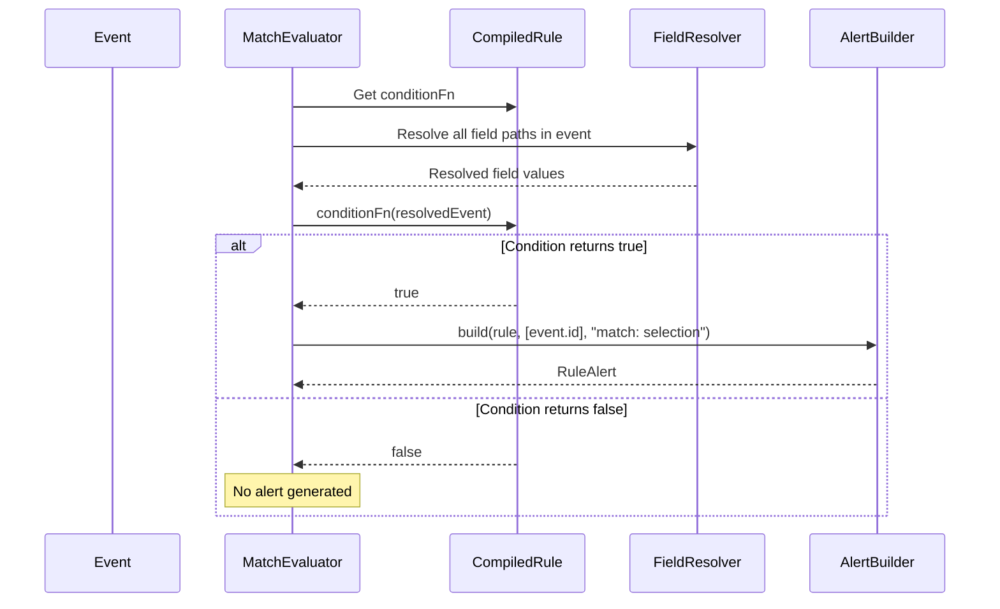
```mermaid
sequenceDiagram
    participant EV as Event
    participant ME as MatchEvaluator
    participant CR as CompiledRule
    participant FR as FieldResolver
    participant AB as AlertBuilder

    ME->>CR: Get conditionFn
    ME->>FR: Resolve all field paths in event
    FR-->>ME: Resolved field values

    ME->>CR: conditionFn(resolvedEvent)

    alt Condition returns true
        CR-->>ME: true
        ME->>AB: build(rule, [event.id], "match: selection")
        AB-->>ME: RuleAlert
    else Condition returns false
        CR-->>ME: false
        Note over ME: No alert generated
    end
```

**Example: Audit Log Cleared (Match Rule)**

```yaml
title: Audit Log Cleared
id: rule-audit-clear-001
level: critical
weight: 0.95
priority: 900
logsource:
  class_uid: 6003    # System Activity
detection:
  selection:
    message|contains: "audit log cleared"
  selection_win:
    class_uid: 6003
    message|contains: "1102"
  condition: "selection OR selection_win"
tags:
  - attack.defense_evasion
  - attack.t1070
```

### 4.2 Count Rule Evaluation

Count rules track how many matching events occur within a rolling time window. An alert fires when the count reaches the threshold.

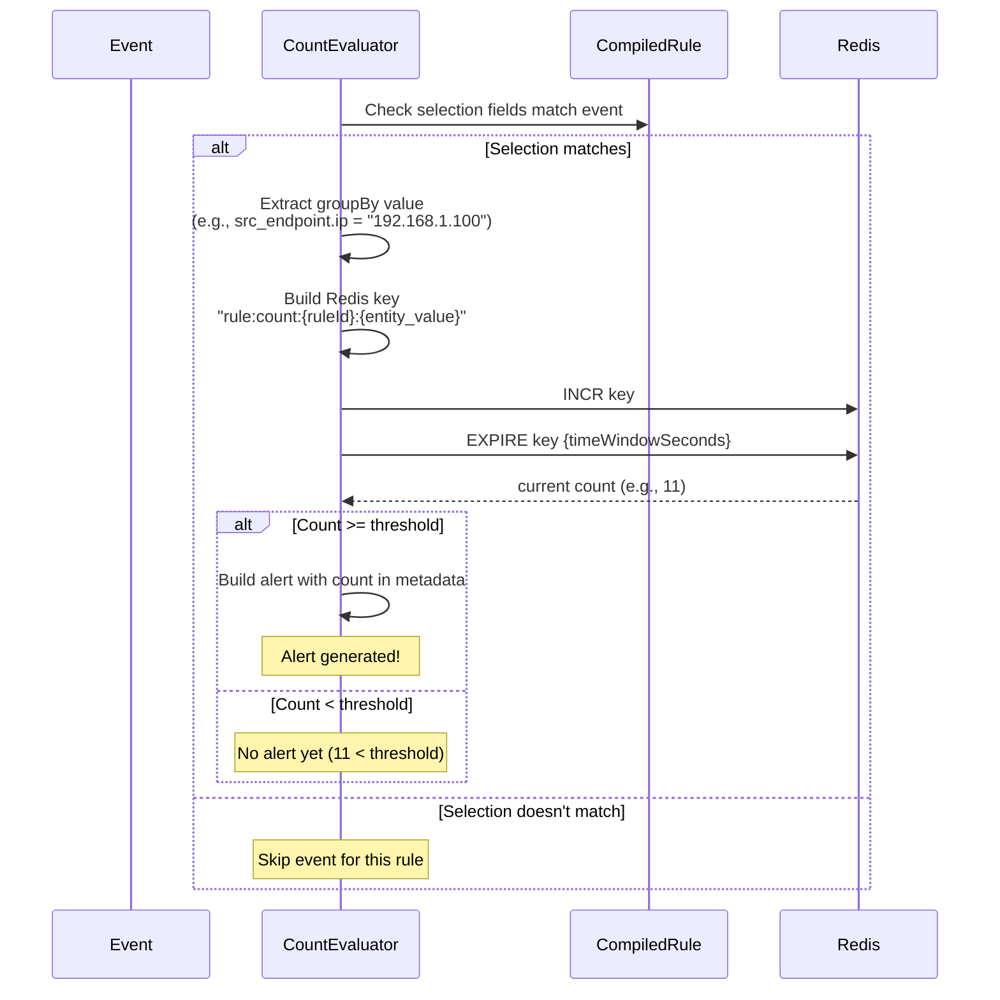
```mermaid
sequenceDiagram
    participant EV as Event
    participant CE as CountEvaluator
    participant CR as CompiledRule
    participant RD as Redis

    CE->>CR: Check selection fields match event
    alt Selection matches
        CE->>CE: Extract groupBy value<br/>(e.g., src_endpoint.ip = "192.168.1.100")
        CE->>CE: Build Redis key<br/>"rule:count:{ruleId}:{entity_value}"
        CE->>RD: INCR key
        CE->>RD: EXPIRE key {timeWindowSeconds}
        RD-->>CE: current count (e.g., 11)

        alt Count >= threshold
            CE->>CE: Build alert with count in metadata
            Note over CE: Alert generated!
        else Count < threshold
            Note over CE: No alert yet (11 < threshold)
        end
    else Selection doesn't match
        Note over CE: Skip event for this rule
    end
```

**Redis State for Count Rules:**

| Redis Key | TTL | Value | Meaning |
|---|---|---|---|
| `rule:count:rule-bf-ssh-001:192.168.1.100` | 300s (5m window) | `11` | 11 failed logins from this IP in last 5 min |
| `rule:count:rule-bf-ssh-001:10.0.0.50` | 300s | `3` | 3 failed logins from this IP in last 5 min |
| `rule:count:rule-lockout-001:admin` | 600s (10m) | `6` | 6 lockout events for this user in last 10 min |

**Example: Brute Force Detection (Count Rule)**

```yaml
title: SSH Brute Force
id: rule-bf-ssh-001
level: high
weight: 0.8
priority: 800
logsource:
  class_uid: 3002    # Authentication
detection:
  selection:
    message|contains: "Failed password"
    severity_id|gte: 3
  condition: "selection"
  count:
    field: "src_endpoint.ip"
    threshold: 10
    timewindow: "5m"
alert:
  cooldown: "5m"
tags:
  - attack.credential_access
  - attack.t1110
```

### 4.3 Sequence Rule Evaluation

Sequence rules detect ordered multi-event patterns. Events must occur in the defined order, from the same entity, within a time window.

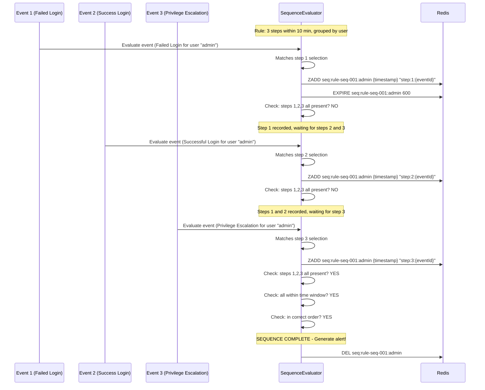
```mermaid
sequenceDiagram
    participant EV1 as Event 1 (Failed Login)
    participant EV2 as Event 2 (Success Login)
    participant EV3 as Event 3 (Privilege Escalation)
    participant SE as SequenceEvaluator
    participant RD as Redis

    Note over SE: Rule: 3 steps within 10 min, grouped by user

    EV1->>SE: Evaluate event (Failed Login for user "admin")
    SE->>SE: Matches step 1 selection
    SE->>RD: ZADD seq:rule-seq-001:admin {timestamp} "step:1:{eventId}"
    SE->>RD: EXPIRE seq:rule-seq-001:admin 600
    SE->>SE: Check: steps 1,2,3 all present? NO
    Note over SE: Step 1 recorded, waiting for steps 2 and 3

    EV2->>SE: Evaluate event (Successful Login for user "admin")
    SE->>SE: Matches step 2 selection
    SE->>RD: ZADD seq:rule-seq-001:admin {timestamp} "step:2:{eventId}"
    SE->>SE: Check: steps 1,2,3 all present? NO
    Note over SE: Steps 1 and 2 recorded, waiting for step 3

    EV3->>SE: Evaluate event (Privilege Escalation for user "admin")
    SE->>SE: Matches step 3 selection
    SE->>RD: ZADD seq:rule-seq-001:admin {timestamp} "step:3:{eventId}"
    SE->>SE: Check: steps 1,2,3 all present? YES
    SE->>SE: Check: all within time window? YES
    SE->>SE: Check: in correct order? YES

    Note over SE: SEQUENCE COMPLETE - Generate alert!
    SE->>RD: DEL seq:rule-seq-001:admin
```

**Example: Login Failure then Success with Privilege Escalation (Sequence Rule)**

```yaml
title: Suspicious Login Sequence
id: rule-seq-login-001
level: high
weight: 0.85
priority: 850
logsource:
  class_uid: 3002
detection:
  condition: "sequence"
  sequence:
    timewindow: "10m"
    by: "actor.user.name"
    steps:
      - step1:
          message|contains: "Failed password"
          severity_id|gte: 3
      - step2:
          message|contains: "Accepted"
          severity_id: 1
      - step3:
          class_uid: 3004
          message|contains: "privilege"
alert:
  cooldown: "15m"
tags:
  - attack.initial_access
  - attack.privilege_escalation
```

### 4.4 Alert Cooldown

After a rule fires for a specific entity, it enters a cooldown period. During cooldown, the same rule+entity combination does not generate additional alerts — this prevents alert storms.

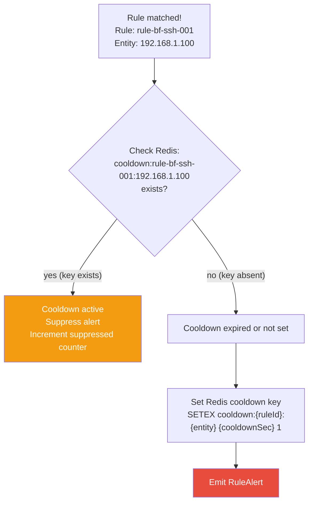
```mermaid
flowchart TD
    ALERT_CANDIDATE["Rule matched!<br/>Rule: rule-bf-ssh-001<br/>Entity: 192.168.1.100"]
    COOLDOWN_CHECK{"Check Redis:<br/>cooldown:rule-bf-ssh-001:192.168.1.100<br/>exists?"}
    ACTIVE["Cooldown active<br/>Suppress alert<br/>Increment suppressed counter"]
    INACTIVE["Cooldown expired or not set"]
    SET_COOLDOWN["Set Redis cooldown key<br/>SETEX cooldown:{ruleId}:{entity} {cooldownSec} 1"]
    EMIT["Emit RuleAlert"]

    ALERT_CANDIDATE --> COOLDOWN_CHECK
    COOLDOWN_CHECK -->|"yes (key exists)"| ACTIVE
    COOLDOWN_CHECK -->|"no (key absent)"| INACTIVE
    INACTIVE --> SET_COOLDOWN --> EMIT

    style ACTIVE fill:#f39c12,color:#fff
    style EMIT fill:#e74c3c,color:#fff
```

| Redis Key | TTL | Purpose |
|---|---|---|
| `cooldown:rule-bf-ssh-001:192.168.1.100` | 300s | Suppress brute force alerts for this IP for 5 min |
| `cooldown:rule-audit-clear-001:web-server-01` | 60s | Suppress audit log cleared alerts for this host for 1 min |

---

## 5. Rule Priorities

### 5.1 Priority System

Each rule has a `priority` field (1-1000). Higher numbers are evaluated first. This ensures critical rules fire before lower-priority rules and allows short-circuit optimizations.

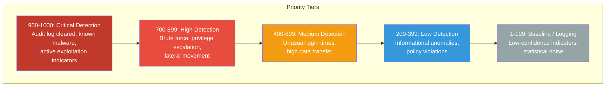
```mermaid
graph TB
    subgraph PRIORITY["Priority Tiers"]
        T1["900-1000: Critical Detection<br/>Audit log cleared, known malware,<br/>active exploitation indicators"]
        T2["700-899: High Detection<br/>Brute force, privilege escalation,<br/>lateral movement"]
        T3["400-699: Medium Detection<br/>Unusual login times,<br/>high data transfer"]
        T4["200-399: Low Detection<br/>Informational anomalies,<br/>policy violations"]
        T5["1-199: Baseline / Logging<br/>Low-confidence indicators,<br/>statistical noise"]
    end

    T1 --> T2 --> T3 --> T4 --> T5

    style T1 fill:#c0392b,color:#fff
    style T2 fill:#e74c3c,color:#fff
    style T3 fill:#f39c12,color:#fff
    style T4 fill:#3498db,color:#fff
    style T5 fill:#95a5a6,color:#fff
```

### 5.2 Priority Resolution Rules

| Scenario | Behavior |
|---|---|
| **Same event, multiple rules match** | All matching rules generate alerts. Priority determines evaluation order, not exclusivity |
| **Same event, same priority** | Rules at the same priority level are evaluated in alphabetical order by name (deterministic) |
| **No priority specified** | Default priority is `500` (medium) |
| **Priority change via API** | Triggers hot-reload. New priority takes effect on next evaluation cycle |
| **Builtin vs custom rules** | No priority difference. Custom rules can override builtin rule priority |

### 5.3 Priority and Evaluation Order

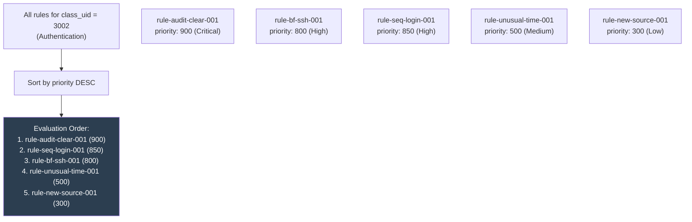
```mermaid
flowchart TD
    RULES["All rules for class_uid = 3002<br/>(Authentication)"]

    SORT["Sort by priority DESC"]

    R1["rule-audit-clear-001<br/>priority: 900 (Critical)"]
    R2["rule-bf-ssh-001<br/>priority: 800 (High)"]
    R3["rule-seq-login-001<br/>priority: 850 (High)"]
    R4["rule-unusual-time-001<br/>priority: 500 (Medium)"]
    R5["rule-new-source-001<br/>priority: 300 (Low)"]

    EVAL_ORDER["Evaluation Order:<br/>1. rule-audit-clear-001 (900)<br/>2. rule-seq-login-001 (850)<br/>3. rule-bf-ssh-001 (800)<br/>4. rule-unusual-time-001 (500)<br/>5. rule-new-source-001 (300)"]

    RULES --> SORT --> EVAL_ORDER

    style EVAL_ORDER fill:#2c3e50,color:#fff
```

### 5.4 Priority and Performance

Priority ordering enables an optional **early termination** strategy for future optimization:

| Strategy | Description | MVP Status |
|---|---|---|
| **Evaluate all** | Every applicable rule is evaluated regardless of matches | ✅ MVP (default) |
| **Max alerts per event** | Stop after N rules match for a single event (configurable) | ⏳ Post-MVP |
| **Priority cutoff** | Skip rules below a priority threshold under load | ⏳ Post-MVP |

---

## 6. Rule CRUD

### 6.1 Rule CRUD Component Diagram

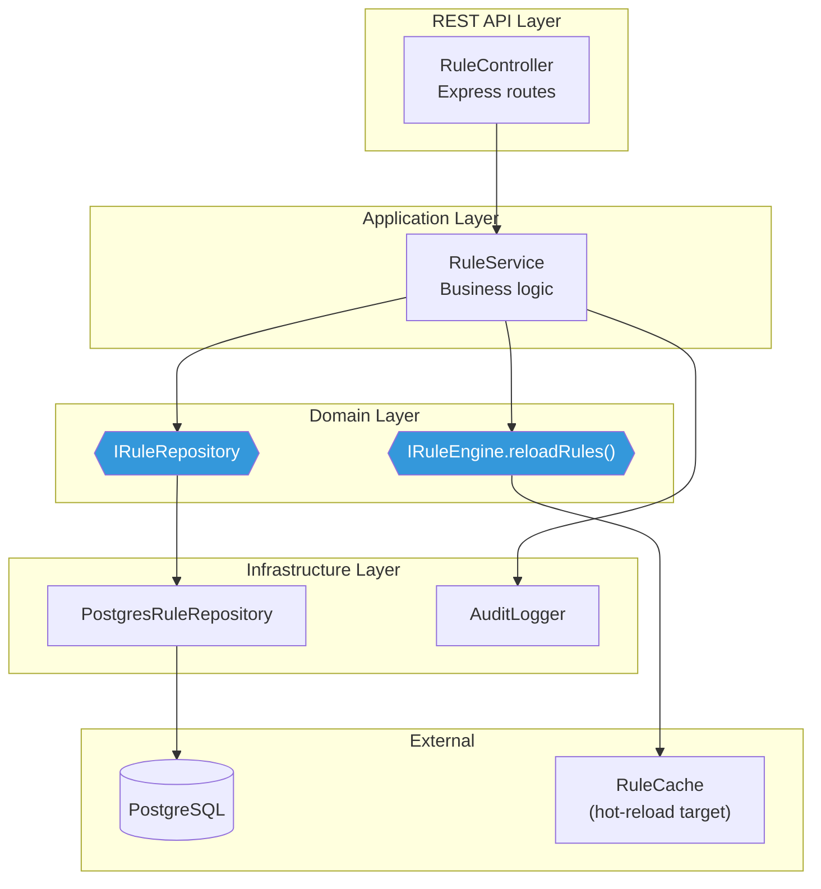
```mermaid
graph TB
    subgraph API["REST API Layer"]
        RC["RuleController<br/>Express routes"]
    end

    subgraph SERVICE["Application Layer"]
        RS["RuleService<br/>Business logic"]
    end

    subgraph DOMAIN["Domain Layer"]
        IRR{{"IRuleRepository"}}
        IRE_HOT{{"IRuleEngine.reloadRules()"}}
    end

    subgraph INFRA["Infrastructure Layer"]
        PGR["PostgresRuleRepository"]
        AUDIT_SVC["AuditLogger"]
    end

    subgraph EXTERNAL["External"]
        PG_EXT[("PostgreSQL")]
        CACHE_EXT["RuleCache<br/>(hot-reload target)"]
    end

    RC --> RS
    RS --> IRR
    RS --> IRE_HOT
    RS --> AUDIT_SVC
    IRR --> PGR
    PGR --> PG_EXT
    IRE_HOT --> CACHE_EXT

    style IRR fill:#3498db,color:#fff
    style IRE_HOT fill:#3498db,color:#fff
```

### 6.2 CRUD Operations

#### Create Rule

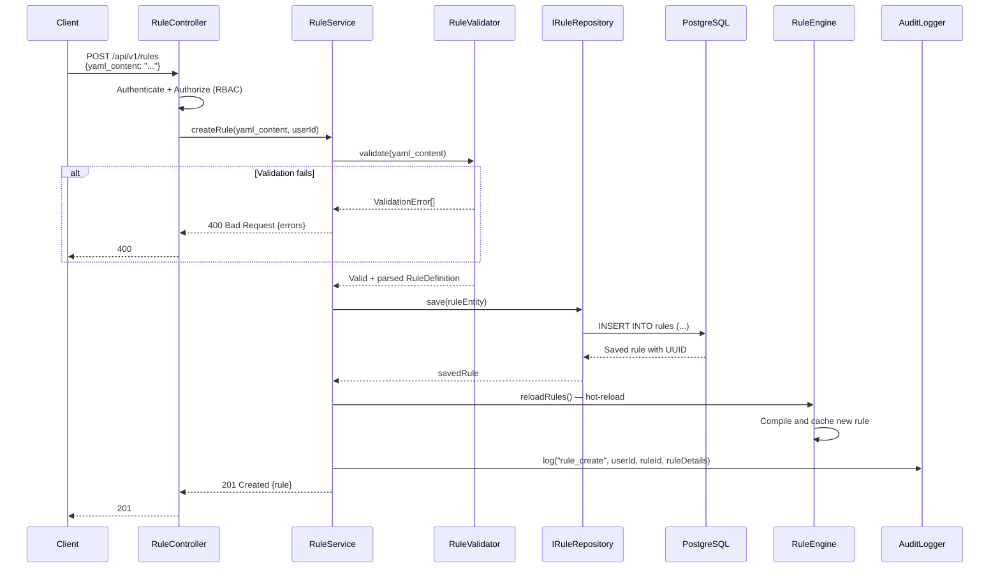
```mermaid
sequenceDiagram
    participant C as Client
    participant API as RuleController
    participant SVC as RuleService
    participant VAL as RuleValidator
    participant REPO as IRuleRepository
    participant PG as PostgreSQL
    participant RE as RuleEngine
    participant AUD as AuditLogger

    C->>API: POST /api/v1/rules<br/>{yaml_content: "..."}
    API->>API: Authenticate + Authorize (RBAC)
    API->>SVC: createRule(yaml_content, userId)

    SVC->>VAL: validate(yaml_content)
    alt Validation fails
        VAL-->>SVC: ValidationError[]
        SVC-->>API: 400 Bad Request {errors}
        API-->>C: 400
    end
    VAL-->>SVC: Valid + parsed RuleDefinition

    SVC->>REPO: save(ruleEntity)
    REPO->>PG: INSERT INTO rules (...)
    PG-->>REPO: Saved rule with UUID
    REPO-->>SVC: savedRule

    SVC->>RE: reloadRules() — hot-reload
    RE->>RE: Compile and cache new rule

    SVC->>AUD: log("rule_create", userId, ruleId, ruleDetails)
    SVC-->>API: 201 Created {rule}
    API-->>C: 201
```

#### Update Rule

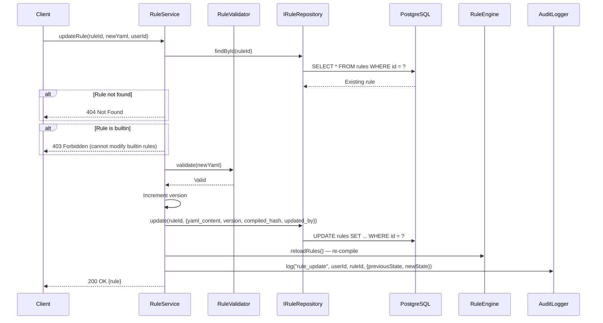
```mermaid
sequenceDiagram
    participant C as Client
    participant SVC as RuleService
    participant VAL as RuleValidator
    participant REPO as IRuleRepository
    participant PG as PostgreSQL
    participant RE as RuleEngine
    participant AUD as AuditLogger

    C->>SVC: updateRule(ruleId, newYaml, userId)

    SVC->>REPO: findById(ruleId)
    REPO->>PG: SELECT * FROM rules WHERE id = ?
    PG-->>REPO: Existing rule
    alt Rule not found
        SVC-->>C: 404 Not Found
    end
    alt Rule is builtin
        SVC-->>C: 403 Forbidden (cannot modify builtin rules)
    end

    SVC->>VAL: validate(newYaml)
    VAL-->>SVC: Valid

    SVC->>SVC: Increment version
    SVC->>REPO: update(ruleId, {yaml_content, version, compiled_hash, updated_by})
    REPO->>PG: UPDATE rules SET ... WHERE id = ?

    SVC->>RE: reloadRules() — re-compile
    SVC->>AUD: log("rule_update", userId, ruleId, {previousState, newState})
    SVC-->>C: 200 OK {rule}
```

#### Delete Rule

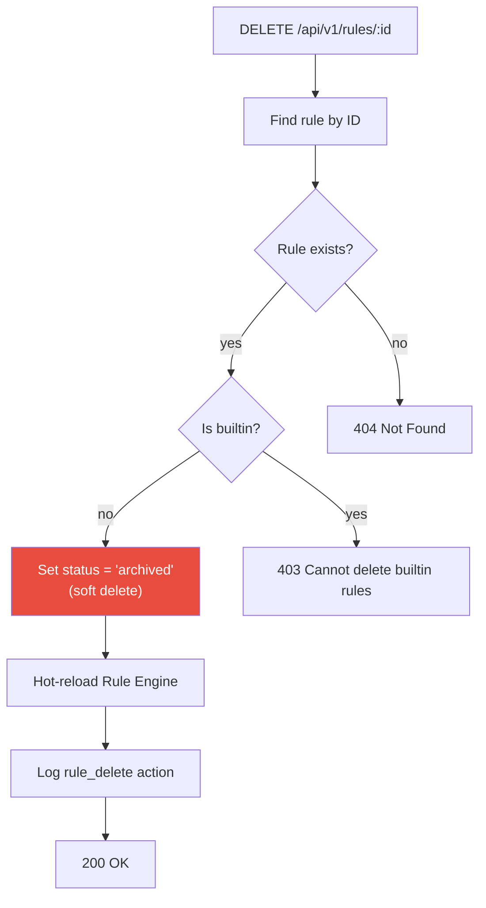
```mermaid
flowchart TD
    REQ["DELETE /api/v1/rules/:id"]
    FIND["Find rule by ID"]
    FOUND{"Rule exists?"}
    BUILTIN{"Is builtin?"}
    ARCHIVE["Set status = 'archived'<br/>(soft delete)"]
    RELOAD["Hot-reload Rule Engine"]
    AUDIT["Log rule_delete action"]
    RESP["200 OK"]
    ERR404["404 Not Found"]
    ERR403["403 Cannot delete builtin rules"]

    REQ --> FIND --> FOUND
    FOUND -->|"no"| ERR404
    FOUND -->|"yes"| BUILTIN
    BUILTIN -->|"yes"| ERR403
    BUILTIN -->|"no"| ARCHIVE --> RELOAD --> AUDIT --> RESP

    style ARCHIVE fill:#e74c3c,color:#fff
```

> [!IMPORTANT]
> Rules are **never hard-deleted**. Delete sets `status = 'archived'`. This preserves referential integrity with historical alerts and ensures the audit trail is complete.

#### Enable / Disable Rule

| Operation | Endpoint | Effect |
|---|---|---|
| Enable | `PUT /api/v1/rules/:id/enable` | `status = 'active'`, hot-reload into engine |
| Disable | `PUT /api/v1/rules/:id/disable` | `status = 'disabled'`, hot-reload removes from engine |

#### Test Rule (Dry-Run)

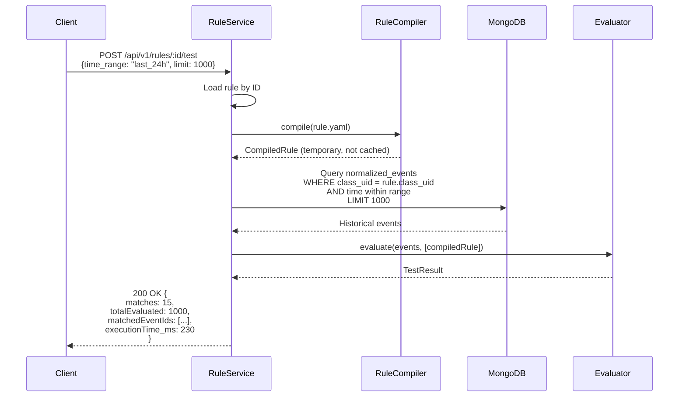
```mermaid
sequenceDiagram
    participant C as Client
    participant SVC as RuleService
    participant RC as RuleCompiler
    participant MDB as MongoDB
    participant EVAL as Evaluator

    C->>SVC: POST /api/v1/rules/:id/test<br/>{time_range: "last_24h", limit: 1000}

    SVC->>SVC: Load rule by ID
    SVC->>RC: compile(rule.yaml)
    RC-->>SVC: CompiledRule (temporary, not cached)

    SVC->>MDB: Query normalized_events<br/>WHERE class_uid = rule.class_uid<br/>AND time within range<br/>LIMIT 1000
    MDB-->>SVC: Historical events

    SVC->>EVAL: evaluate(events, [compiledRule])
    EVAL-->>SVC: TestResult

    SVC-->>C: 200 OK {<br/>  matches: 15,<br/>  totalEvaluated: 1000,<br/>  matchedEventIds: [...],<br/>  executionTime_ms: 230<br/>}
```

#### Import / Export Rules

| Operation | Endpoint | Format | Description |
|---|---|---|---|
| Import | `POST /api/v1/rules/import` | YAML (multi-document: `---` separated) | Bulk import Sigma rules. Validates each, skips invalid |
| Export | `GET /api/v1/rules/export` | YAML archive (all active rules) | Download all rules as multi-document YAML |

### 6.3 CRUD Validation Rules

| Validation | Rule | Error |
|---|---|---|
| Title required | `title` must be non-empty string | `"Rule title is required"` |
| ID format | `id` must be alphanumeric + hyphens | `"Invalid rule ID format"` |
| ID unique | `id` must not exist in database (on create) | `"Rule ID already exists"` |
| Level valid | `level` must be a valid severity | `"Invalid severity level"` |
| Weight range | `weight` must be 0.0 - 1.0 | `"Weight must be between 0.0 and 1.0"` |
| Priority range | `priority` must be 1-1000 | `"Priority must be between 1 and 1000"` |
| Class UID valid | `logsource.class_uid` must be a known OCSF class | `"Unknown OCSF class UID"` |
| Condition parseable | `detection.condition` must be valid boolean expression | `"Cannot parse condition expression"` |
| Fields resolvable | All field paths in selections must be valid event paths | `"Unknown field: {fieldPath}"` |
| Count threshold | `count.threshold` must be positive integer | `"Count threshold must be > 0"` |
| Time window format | `count.timewindow` must match `\d+[smh]` | `"Invalid time window format"` |
| Sequence steps | `sequence.steps` must have >= 2 entries | `"Sequence rules need at least 2 steps"` |
| YAML syntax | YAML must parse without errors | `"Invalid YAML syntax: {error}"` |

### 6.4 Rule RBAC Permissions

| Operation | Admin | Security Engineer | SOC Analyst |
|---|---|---|---|
| List rules | ✅ | ✅ | ✅ (read-only) |
| View rule detail | ✅ | ✅ | ✅ (read-only) |
| Create rule | ✅ | ✅ | ❌ |
| Update rule | ✅ | ✅ | ❌ |
| Delete rule | ✅ | ❌ | ❌ |
| Enable/Disable | ✅ | ✅ | ❌ |
| Import rules | ✅ | ✅ | ❌ |
| Export rules | ✅ | ✅ | ✅ |
| Test rule (dry-run) | ✅ | ✅ | ✅ |

---

## 7. Performance Optimization

### 7.1 Optimization Architecture

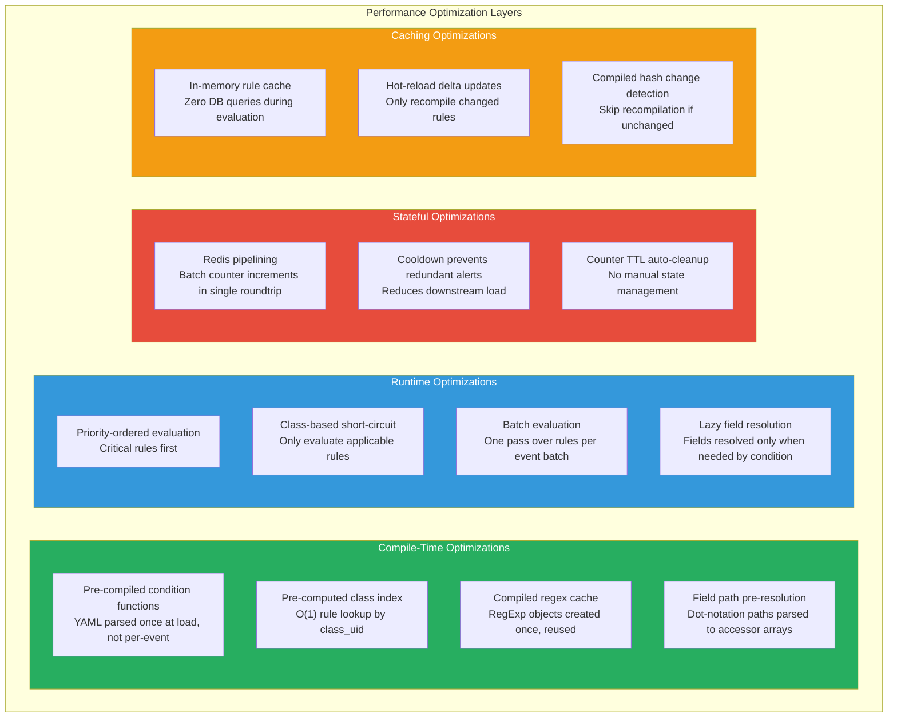
```mermaid
graph TB
    subgraph PERF["Performance Optimization Layers"]

        subgraph COMPILE_OPT["Compile-Time Optimizations"]
            C1["Pre-compiled condition functions<br/>YAML parsed once at load, not per-event"]
            C2["Pre-computed class index<br/>O(1) rule lookup by class_uid"]
            C3["Compiled regex cache<br/>RegExp objects created once, reused"]
            C4["Field path pre-resolution<br/>Dot-notation paths parsed to accessor arrays"]
        end

        subgraph RUNTIME_OPT["Runtime Optimizations"]
            R1["Priority-ordered evaluation<br/>Critical rules first"]
            R2["Class-based short-circuit<br/>Only evaluate applicable rules"]
            R3["Batch evaluation<br/>One pass over rules per event batch"]
            R4["Lazy field resolution<br/>Fields resolved only when needed by condition"]
        end

        subgraph STATE_OPT["Stateful Optimizations"]
            S1["Redis pipelining<br/>Batch counter increments in single roundtrip"]
            S2["Cooldown prevents redundant alerts<br/>Reduces downstream load"]
            S3["Counter TTL auto-cleanup<br/>No manual state management"]
        end

        subgraph CACHE_OPT["Caching Optimizations"]
            CA1["In-memory rule cache<br/>Zero DB queries during evaluation"]
            CA2["Hot-reload delta updates<br/>Only recompile changed rules"]
            CA3["Compiled hash change detection<br/>Skip recompilation if unchanged"]
        end
    end

    style COMPILE_OPT fill:#27ae60,color:#fff
    style RUNTIME_OPT fill:#3498db,color:#fff
    style STATE_OPT fill:#e74c3c,color:#fff
    style CACHE_OPT fill:#f39c12,color:#fff
```

### 7.2 Compile-Time Optimizations

#### Pre-Compiled Condition Functions

The most critical optimization. Instead of interpreting YAML at evaluation time, each rule's condition is compiled to a native JavaScript function:

```
YAML parse (once at load)
    ↓
Condition AST (tree structure)
    ↓
JavaScript function (called per event)
```

| Approach | Cost per Event | 1000 events × 50 rules |
|---|---|---|
| **Interpret YAML** at evaluation | ~500µs | ~25,000ms (25s) |
| **Pre-compiled function** call | ~2µs | ~100ms |
| **Speedup** | | **~250x faster** |

#### Class-Based Index

Events are dispatched only to rules matching their `class_uid`. With 50 rules across 10 OCSF classes, each event only evaluates ~5 rules instead of 50.

```
Without index:  50 rules × 1000 events = 50,000 evaluations
With index:      5 rules × 1000 events =  5,000 evaluations
Reduction:       90%
```

#### Compiled Regex Cache

Regex patterns from `|re` operators are compiled to `RegExp` objects once and stored in the `CompiledRule`. Per-event evaluation calls `.test()` on the pre-compiled regex.

### 7.3 Runtime Optimizations

#### Batch Evaluation Pipeline

Events are processed in batches (one batch per worker job, typically 1000 events). The Rule Engine evaluates the entire batch efficiently:

```mermaid
flowchart LR
    BATCH["Event Batch<br/>(1000 events)"]
    GROUP["Group by class_uid<br/>(O(n) single pass)"]
    
    G1["class 3002: 800 events"]
    G2["class 6003: 150 events"]
    G3["class 4001: 50 events"]

    R1["5 rules for class 3002<br/>→ 4000 evaluations"]
    R2["2 rules for class 6003<br/>→ 300 evaluations"]
    R3["3 rules for class 4001<br/>→ 150 evaluations"]

    TOTAL["Total: 4450 evaluations<br/>(vs 50,000 without class index)"]

    BATCH --> GROUP
    GROUP --> G1 --> R1
    GROUP --> G2 --> R2
    GROUP --> G3 --> R3
    R1 --> TOTAL
    R2 --> TOTAL
    R3 --> TOTAL

    style TOTAL fill:#27ae60,color:#fff
```

#### Lazy Field Resolution

Fields are resolved **only when the condition function accesses them**. If a condition checks `message|contains: "Failed"` first and that fails, deeper fields like `features.authentication.failed_login_count_10min` are never resolved.

### 7.4 Redis Pipeline Optimization

Count and Sequence rules require Redis operations. Instead of individual Redis calls per rule per event, operations are batched using Redis pipelining:

```mermaid
sequenceDiagram
    participant CE as CountEvaluator
    participant PIPE as Redis Pipeline
    participant RD as Redis Server

    Note over CE: Processing batch of 1000 events<br/>against 3 count rules

    CE->>CE: Collect all counter operations<br/>(3 rules × N matching events)
    CE->>PIPE: pipeline.incr("rule:count:r1:ip1")
    CE->>PIPE: pipeline.expire("rule:count:r1:ip1", 300)
    CE->>PIPE: pipeline.incr("rule:count:r1:ip2")
    CE->>PIPE: pipeline.expire("rule:count:r1:ip2", 300)
    CE->>PIPE: pipeline.incr("rule:count:r2:user1")
    CE->>PIPE: pipeline.expire("rule:count:r2:user1", 600)
    Note over CE: ... (all operations collected)

    CE->>PIPE: pipeline.exec()
    PIPE->>RD: Single roundtrip with all commands
    RD-->>PIPE: All results in one response
    PIPE-->>CE: Results array

    Note over CE: 1 Redis roundtrip instead of<br/>potentially hundreds
```

| Approach | Redis Roundtrips (1000 events, 3 count rules) | Latency |
|---|---|---|
| Individual calls | Up to 6000 (2 per match: INCR + EXPIRE) | ~300ms |
| Pipelined | 1 | ~5ms |

### 7.5 Performance Benchmarks (Target)

| Metric | Target | Notes |
|---|---|---|
| **Event evaluation throughput** | 10,000 events/sec per worker | With 4 workers: 40,000 EPS |
| **Single match rule evaluation** | < 5µs per event-rule pair | Pre-compiled function call |
| **Single count rule evaluation** | < 50µs per event-rule pair | Includes Redis pipeline contribution |
| **Rule reload (hot-reload)** | < 100ms for single rule | Delta compilation |
| **Full reload (startup)** | < 2s for 100 rules | Compile all + build indexes |
| **Memory per compiled rule** | ~2KB | Function + metadata + index entries |
| **Max active rules** | 500 | Soft limit; beyond this, evaluate performance |
| **Cooldown check** | < 10µs per check | Redis GET (pipelined) |

### 7.6 Performance Monitoring

| Metric | Collection | Alert Threshold |
|---|---|---|
| `rule_engine.evaluation_duration_ms` | Per batch | > 500ms (warning), > 2000ms (critical) |
| `rule_engine.rules_evaluated_per_second` | Rolling | < 1000 (warning — may be underloaded or stuck) |
| `rule_engine.alerts_per_minute` | Rolling | > 1000 (warning — possible alert storm) |
| `rule_engine.compile_errors` | Per reload | > 0 (warning — broken rule) |
| `rule_engine.cooldown_suppressions` | Rolling | Informational (track effectiveness) |
| `rule_engine.redis_pipeline_duration_ms` | Per batch | > 50ms (warning) |
| `rule_engine.cache_size` | Gauge | > 500 rules (warning) |

### 7.7 Future Performance Enhancements

| Enhancement | Description | Complexity | Impact |
|---|---|---|---|
| **WASM-compiled conditions** | Compile rule conditions to WebAssembly instead of JS functions | High | 2-5x faster evaluation |
| **Bloom filter pre-check** | Bloom filter on common field values to skip events before evaluation | Medium | Reduce unnecessary evaluations by ~30% |
| **Max alerts per event** | Stop evaluating rules after N matches for a single event | Low | Reduce alert volume under load |
| **Priority cutoff under load** | Skip rules below priority threshold when queue depth exceeds limit | Low | Graceful degradation |
| **Rule sharding** | Distribute rules across workers by class_uid partition | Medium | Linear scaling with workers |

---

> **This document is governed by [ADR-001](file:///d:/AI%20SIEM/docs/architecture/decisions/ADR-001-modular-monolith.md). The Rule Engine operates within the Node.js backend monolith as part of the Analysis Module. Rules are stored in PostgreSQL (see [DB-001](file:///d:/AI%20SIEM/docs/database.md)), stateful counters use Redis, and alerts feed into the Incident Correlator (see [BACKEND-002](file:///d:/AI%20SIEM/docs/backend-detection.md)).**
>
> **Document Version**: 1.0
> **Last Updated**: 2026-07-18
