# Scalability Strategy

## AI-Powered Security Analytics Platform

| Field | Value |
|---|---|
| **Document ID** | SCALE-001 |
| **Version** | 1.0 |
| **Date** | 2026-07-19 |
| **Status** | Draft |
| **Architecture Reference** | [ADR-001](file:///d:/AI%20SIEM/docs/architecture/decisions/ADR-001-modular-monolith.md) |
| **Database Reference** | [DB-001](file:///d:/AI%20SIEM/docs/database.md) |
| **Backend Reference** | [BACKEND-001](file:///d:/AI%20SIEM/docs/backend.md) |

---

## Table of Contents

1. [Scaling Tiers](#1-scaling-tiers)
2. [Caching](#2-caching)
3. [Database Scaling](#3-database-scaling)
4. [Worker Scaling](#4-worker-scaling)
5. [Queue Scaling](#5-queue-scaling)
6. [Collector Scaling](#6-collector-scaling)

---

## 1. Scaling Tiers

The platform is designed as a **Modular Monolith** (ADR-001). Scaling follows a progressive strategy — each tier introduces incremental changes without rewriting the architecture.

### 1.1 Scaling Roadmap

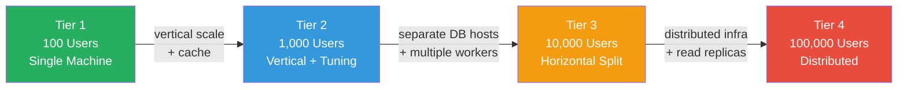

---

### 1.2 Tier 1 — 100 Users (MVP)

**Profile:** Small SOC team, single organization, ~500 EPS (events per second).

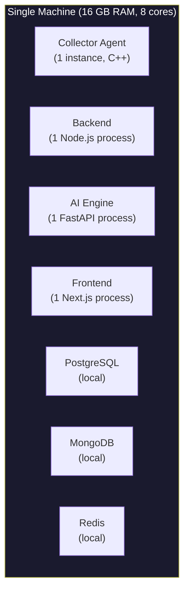

| Component | Configuration | Capacity |
|---|---|---|
| **Backend** | 1 Node.js process, 4 BullMQ workers | ~500 EPS ingestion |
| **AI Engine** | 1 FastAPI process, 1 uvicorn worker | ~200 inferences/sec |
| **PostgreSQL** | Single instance, 4 GB RAM, no replication | ~5M incidents, ~50M alerts |
| **MongoDB** | Single instance, 4 GB RAM, WiredTiger | ~500M events (90-day retention) |
| **Redis** | Single instance, 512 MB | Queue + cache + rate limits |
| **Collector** | 1 instance, 4 log sources | ~500 EPS combined |
| **Disk** | 500 GB SSD | ~6 months of data |

**Bottleneck:** CPU-bound on a single Node.js process at ~500 EPS.

**Scaling levers at this tier:**
- Tune `pm2` cluster mode for Node.js (see Tier 2)
- Enable Redis caching for dashboard queries
- Configure MongoDB indexes properly

---

### 1.3 Tier 2 — 1,000 Users (Growth)

**Profile:** Medium SOC, ~2,000 EPS, multiple Collectors across sites.

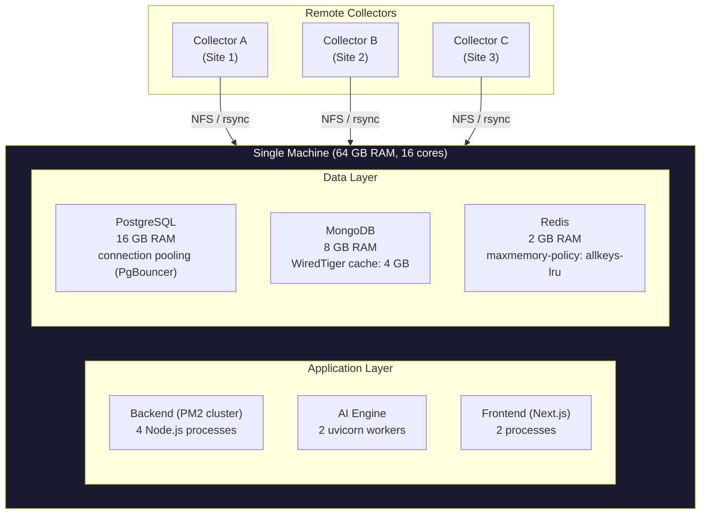

**Changes from Tier 1:**

| Change | Description | Impact |
|---|---|---|
| **PM2 cluster mode** | 4 Node.js worker processes behind PM2 | 4× request throughput |
| **PgBouncer** | Connection pooler in front of PostgreSQL | Handle 1000+ concurrent connections with 50 actual DB connections |
| **Redis caching** | Dashboard summary cached for 30s, rule cache, session cache | 90% reduction in dashboard DB queries |
| **MongoDB WiredTiger tuning** | `cacheSizeGB: 4`, dedicated SSD for data directory | 4× read throughput |
| **uvicorn workers** | 2 AI Engine workers behind uvicorn | 2× inference throughput |
| **Multiple Collectors** | 3 Collectors across sites, writing to shared NFS or syncing via rsync | Geographic log collection |
| **Increased retention** | PostgreSQL partitioning active, MongoDB TTL indexes | Automated cleanup |

| Component | Configuration | Capacity |
|---|---|---|
| **Backend** | PM2 cluster × 4, 8 BullMQ workers (2 per process) | ~2,000 EPS |
| **AI Engine** | 2 uvicorn workers | ~400 inferences/sec |
| **PostgreSQL** | PgBouncer, 16 GB RAM, monthly partitions | ~20M incidents |
| **MongoDB** | 8 GB WiredTiger cache, dedicated SSD | ~2B events (90 days) |
| **Redis** | 2 GB, LRU eviction | Queue + cache + 1000 sessions |

**Bottleneck:** Single PostgreSQL and single MongoDB at ~2,000 EPS.

---

### 1.4 Tier 3 — 10,000 Users (Enterprise)

**Profile:** Large SOC, ~10,000 EPS, 10+ Collectors, requires high availability.

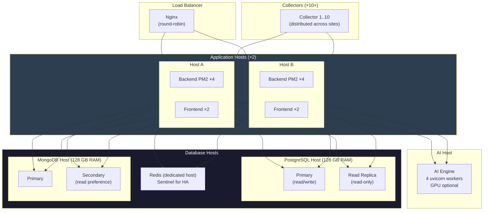

**Changes from Tier 2:**

| Change | Description | Impact |
|---|---|---|
| **Separate hosts** | Application, AI, and Database on dedicated machines | Resource isolation, independent scaling |
| **Load balancer** | Nginx round-robin across 2 app hosts | 2× app throughput, no single point of failure |
| **PostgreSQL read replica** | Dashboard reads and event search go to replica | 60% reduction in primary load |
| **MongoDB replica set** | Secondary for read-heavy operations (investigation, search) | Read scalability, data redundancy |
| **Redis Sentinel** | Automated failover for Redis | High availability for queues and cache |
| **AI Engine dedicated host** | 4 uvicorn workers, optional GPU for SHAP | Compute isolation, ~800 inferences/sec |
| **10+ Collectors** | Distributed across network segments and sites | Full network coverage |

| Component | Configuration | Capacity |
|---|---|---|
| **Backend** | 2 hosts × PM2 ×4 = 8 Node.js processes, 16 workers | ~10,000 EPS |
| **AI Engine** | Dedicated host, 4 workers | ~800 inferences/sec |
| **PostgreSQL** | Primary + 1 replica, 128 GB RAM | ~100M incidents |
| **MongoDB** | Primary + 1 secondary, 128 GB RAM | ~10B events |
| **Redis** | Dedicated host, Sentinel, 8 GB | Full cache + queue HA |

**Bottleneck:** Single PostgreSQL primary for writes. MongoDB write throughput at ~10K EPS.

---

### 1.5 Tier 4 — 100,000 Users (Massive Scale)

**Profile:** Enterprise/MSSP, ~100,000 EPS, 50+ Collectors, multi-region.

> [!IMPORTANT]
> Tier 4 exceeds the Modular Monolith boundary defined in ADR-001. Reaching this tier requires a partial architectural transition — extracting the ingestion pipeline into a dedicated service and introducing message brokers. This is a planned evolution, not an MVP concern.

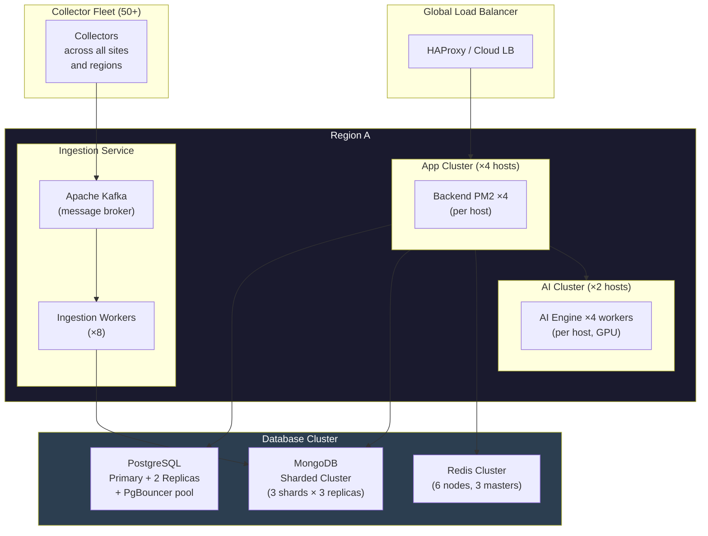

**Changes from Tier 3:**

| Change | Description | Impact |
|---|---|---|
| **Kafka ingestion** | Filesystem watcher replaced with Kafka for log transport | Decoupled ingestion, replay capability, 100K+ EPS |
| **MongoDB sharding** | Shard by `time` field (range-based) | Horizontal write scaling |
| **PostgreSQL read replicas ×2** | Multiple replicas for different read patterns | Dashboard + search + export isolated |
| **Redis Cluster** | 3 masters, 3 replicas | Queue/cache HA + horizontal throughput |
| **AI GPU cluster** | 2 hosts with GPUs, 4 workers each | ~3,200 inferences/sec |
| **Multi-region** | Active-passive or active-active regions | Disaster recovery |

| Component | Configuration | Capacity |
|---|---|---|
| **Backend** | 4 hosts × PM2 ×4 = 16 processes | ~50,000 API req/sec |
| **Ingestion** | Kafka + 8 workers | ~100,000 EPS |
| **AI Engine** | 2 GPU hosts, 8 workers | ~3,200 inferences/sec |
| **PostgreSQL** | Primary + 2 replicas, PgBouncer | ~500M incidents |
| **MongoDB** | 3 shards × 3 replicas | ~100B events |
| **Redis** | 6-node cluster | Unlimited cache + queue HA |

---

### 1.6 Tier Comparison Summary

| Dimension | 100 Users | 1,000 Users | 10,000 Users | 100,000 Users |
|---|---|---|---|---|
| **EPS** | 500 | 2,000 | 10,000 | 100,000 |
| **Backend processes** | 1 | 4 (PM2) | 8 (2 hosts) | 16 (4 hosts) |
| **BullMQ workers** | 4 | 8 | 16 | Kafka + 8 |
| **AI workers** | 1 | 2 | 4 | 8 (GPU) |
| **Collectors** | 1 | 3 | 10+ | 50+ |
| **PostgreSQL** | Local | PgBouncer | Primary + replica | Primary + 2 replicas |
| **MongoDB** | Local | Tuned cache | Replica set | 3-shard cluster |
| **Redis** | Local | 2 GB | Sentinel HA | 6-node cluster |
| **Hosts total** | 1 | 1 | 5-6 | 15+ |
| **RAM total** | 16 GB | 64 GB | 512 GB | 2+ TB |
| **Storage** | 500 GB | 2 TB | 10 TB | 50+ TB |
| **Architecture** | Monolith | Monolith + tuning | Split hosts | Partial microservices |

---

## 2. Caching

### 2.1 Caching Architecture

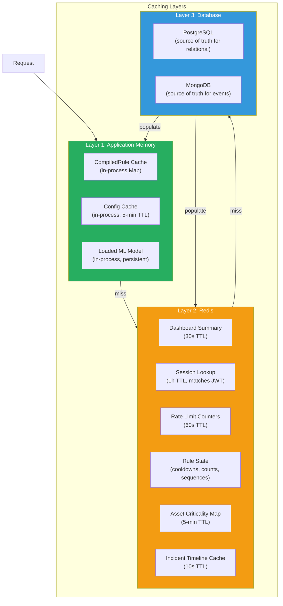

### 2.2 Cache Key Design

| Cache Item | Key Pattern | TTL | Invalidation |
|---|---|---|---|
| Dashboard summary | `cache:dash:summary:{range}` | 30s | TTL expiry (auto) |
| Dashboard timeline | `cache:dash:timeline:{range}:{interval}` | 30s | TTL expiry |
| Top assets | `cache:dash:assets:{range}` | 60s | TTL expiry |
| Source breakdown | `cache:dash:sources:{range}` | 60s | TTL expiry |
| Session lookup | `cache:session:{jti}` | 1h | Explicit delete on logout/revoke |
| Incident detail | `cache:incident:{id}` | 10s | Explicit delete on update |
| Rule list | `cache:rules:list:{hash(filters)}` | 60s | Explicit delete on rule CRUD |
| Asset criticality | `cache:asset:crit:{hostname}` | 5m | Explicit delete on asset update |
| Rate limit | `rl:{tier}:{key}` | 60s | TTL expiry |
| Rule cooldown | `rule:cooldown:{ruleId}:{entity}` | Varies | TTL expiry (matches cooldown period) |
| Rule count window | `rule:count:{ruleId}:{field}:{value}` | Varies | TTL expiry (matches time window) |

### 2.3 Cache-Aside Pattern

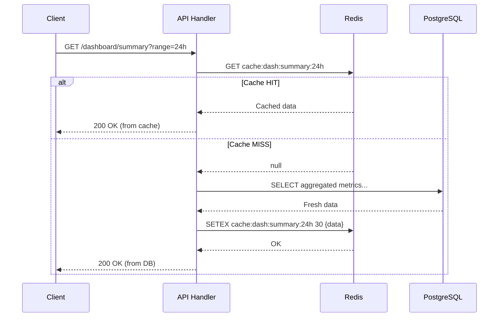

### 2.4 Cache Invalidation Strategy

| Strategy | Used For | How |
|---|---|---|
| **TTL expiry** | Dashboard, timelines, counters | Data auto-expires. Next request fetches fresh. Simplest approach |
| **Explicit delete** | Sessions, incidents, rules, assets | On CRUD operation, `DEL cache:key`. Next request populates fresh |
| **Write-through** | Rule compilation cache | On rule update, recompile and update cache in same operation |
| **Never cached** | Audit logs, event search | Always fetched from database. Too variable to cache |

### 2.5 Cache Hit Rate Targets

| Endpoint | Expected Hit Rate | Impact |
|---|---|---|
| Dashboard summary | 95%+ | Dashboard is viewed constantly by many analysts. 30s TTL means 1 DB query per 30s regardless of viewer count |
| Session lookup | 99%+ | Every authenticated request checks session. Cache prevents a PostgreSQL query per request |
| Asset criticality | 90%+ | Looked up during risk scoring. Assets change rarely |
| Incident detail | 70% | Moderate — analysts open and close different incidents |
| Rule list | 80% | Viewed often, changed rarely |

### 2.6 Cache Sizing by Tier

| Tier | Redis Memory | Key Count | Description |
|---|---|---|---|
| 100 users | 512 MB | ~10,000 | Dashboard, sessions, rule state |
| 1,000 users | 2 GB | ~100,000 | + rate limits, asset map |
| 10,000 users | 8 GB | ~1,000,000 | + incident cache, timeline cache |
| 100,000 users | Redis Cluster 48 GB | ~10,000,000 | Full cache + distributed queue |

---

## 3. Database Scaling

### 3.1 PostgreSQL Scaling Strategy

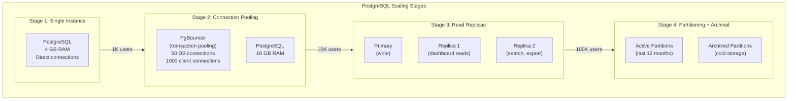

### 3.2 PostgreSQL Partition Strategy

| Table | Partition Key | Interval | Active Partitions | Archive After |
|---|---|---|---|---|
| `incidents` | `created_at` | Monthly | 12 months | 24 months |
| `alerts` | `created_at` | Monthly | 12 months | 24 months |
| `incident_events` | `linked_at` | Monthly | 12 months | 24 months |
| `audit.audit_logs` | `created_at` | Monthly | 24 months | 36 months |
| `users` | None | Not partitioned | — | Never archived |
| `rules` | None | Not partitioned | — | Never archived |

### 3.3 PostgreSQL Index Strategy

| Table | Index | Type | Purpose |
|---|---|---|---|
| `incidents` | `(status, severity, created_at DESC)` | B-tree composite | Incident list with filters |
| `incidents` | `(primary_entity)` | B-tree | Entity correlation lookup |
| `incidents` | `(assigned_to) WHERE status IN ('open','investigating')` | Partial index | Analyst queue |
| `alerts` | `(incident_id, created_at)` | B-tree composite | Alert timeline |
| `alerts` | `(rule_id, created_at)` | B-tree composite | Rule performance metrics |
| `audit.audit_logs` | `(action, created_at)` | B-tree composite | Audit search |
| `audit.audit_logs` | `(actor_id, created_at)` | B-tree composite | User activity search |
| `sessions` | `(jwt_id) WHERE revoked_at IS NULL` | Partial unique | Active session lookup |

### 3.4 MongoDB Scaling Strategy

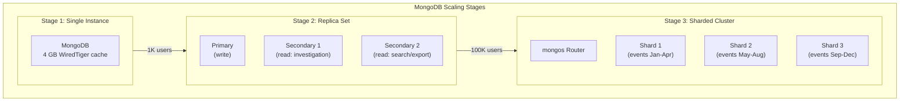

### 3.5 MongoDB Index Strategy

| Collection | Index | Type | Purpose |
|---|---|---|---|
| `normalized_events` | `{ time: -1 }` | Descending | Time-based queries (primary access pattern) |
| `normalized_events` | `{ "src_endpoint.ip": 1, time: -1 }` | Compound | Source IP investigation |
| `normalized_events` | `{ "actor.user.name": 1, time: -1 }` | Compound | User investigation |
| `normalized_events` | `{ "device.hostname": 1, time: -1 }` | Compound | Host investigation |
| `normalized_events` | `{ class_uid: 1, time: -1 }` | Compound | Class-filtered queries |
| `normalized_events` | `{ event_id: 1 }` | Unique | Single event lookup |
| `normalized_events` | `{ message: "text" }` | Text | Full-text search |
| `normalized_events` | `{ time: 1 }` | TTL (90 days) | Automatic data expiry |

### 3.6 MongoDB Sharding Key (Tier 4)

| Shard Key | Value |
|---|---|
| **Key** | `{ time: 1 }` (range-based) |
| **Rationale** | Events are always queried by time range. Range sharding places temporal neighbors on the same shard, minimizing cross-shard scatter |
| **Chunk size** | 64 MB (default) |
| **Balancer** | Enabled, runs during off-peak hours |

### 3.7 Database Connection Pools

| Tier | PostgreSQL Pool | MongoDB Pool | Redis Pool |
|---|---|---|---|
| 100 users | 10 connections | 10 connections | 10 connections |
| 1,000 users | PgBouncer: 50 DB / 1000 client | 50 connections | 50 connections |
| 10,000 users | PgBouncer: 100 DB / 5000 client | 100 connections (per replica) | Sentinel managed |
| 100,000 users | PgBouncer: 200 DB / 10000 client | 200 per shard router | Cluster managed |

---

## 4. Worker Scaling

### 4.1 Worker Architecture

Workers are the units that process events through the detection pipeline. They pull jobs from the BullMQ processing queue and run the pipeline stages (parse → normalize → extract → detect → correlate).

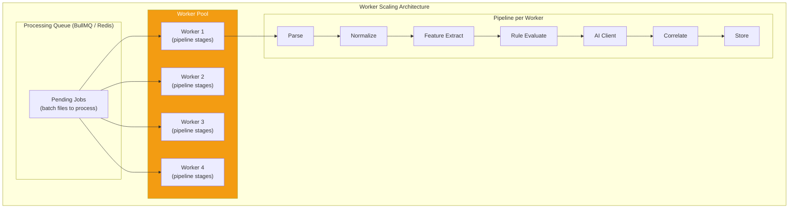

### 4.2 Workers per Tier

| Tier | Workers | Worker Concurrency | Throughput |
|---|---|---|---|
| 100 users | 4 workers (1 Node.js process) | 4 concurrent jobs | ~500 EPS |
| 1,000 users | 8 workers (4 PM2 processes × 2) | 8 concurrent jobs | ~2,000 EPS |
| 10,000 users | 16 workers (2 hosts × 4 PM2 × 2) | 16 concurrent jobs | ~10,000 EPS |
| 100,000 users | 32+ workers (4 hosts × 4 PM2 × 2) + Kafka consumers | 32+ concurrent | ~100,000 EPS |

### 4.3 Worker Scaling Rules

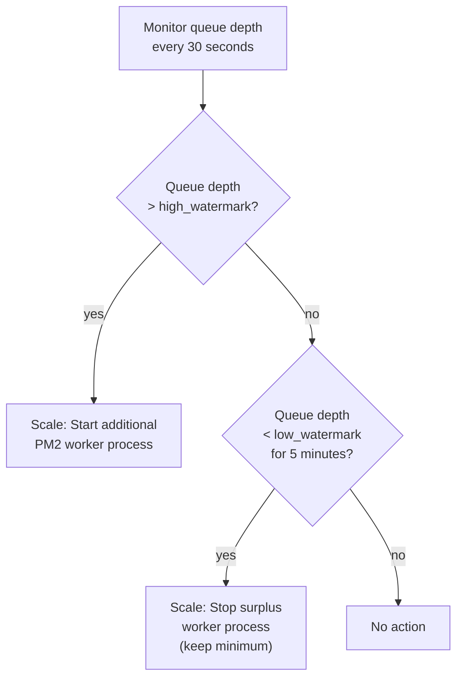

| Setting | Default | Description |
|---|---|---|
| `workers.min_count` | 4 | Minimum workers (never scale below) |
| `workers.max_count` | 16 | Maximum workers per host |
| `workers.high_watermark` | 1000 | Queue depth to trigger scale-up |
| `workers.low_watermark` | 50 | Queue depth to trigger scale-down |
| `workers.cooldown_seconds` | 300 | Minimum time between scaling events |

### 4.4 Worker Job Processing

Each worker processes one batch file (job) at a time:

| Stage | Avg Duration | Bottleneck Factor |
|---|---|---|
| Parse (OCSF validation) | 5ms per event | CPU |
| Normalize (field mapping) | 2ms per event | CPU |
| Feature Extract (temporal, frequency, entropy) | 10ms per event | CPU + Redis |
| Rule Evaluate (compiled functions) | 1ms per event | CPU |
| AI Client (HTTP to AI Engine) | 45ms per batch (100 events) | Network + AI compute |
| Correlate (entity match, risk score) | 5ms per incident | CPU + PostgreSQL |
| Store (PostgreSQL + MongoDB) | 20ms per batch | I/O |

**Total per 100-event batch:** ~150ms → ~650 events/sec/worker.

### 4.5 Worker Backpressure

If workers cannot keep up with ingestion:

| Queue Depth | Action |
|---|---|
| 0-100 | Normal operation |
| 100-1,000 | Warning logged. Scale-up triggered if auto-scaling enabled |
| 1,000-10,000 | Alert to SOC: "Processing backlog detected" |
| 10,000+ | Critical alert. Oldest jobs prioritized. New batch files may be delayed (Directory Watcher pauses file pickup until queue drains below 5,000) |

---

## 5. Queue Scaling

### 5.1 Queue Architecture

The processing queue is abstracted behind `IProcessingQueue` (as defined in ADR-001). The MVP uses BullMQ backed by Redis.

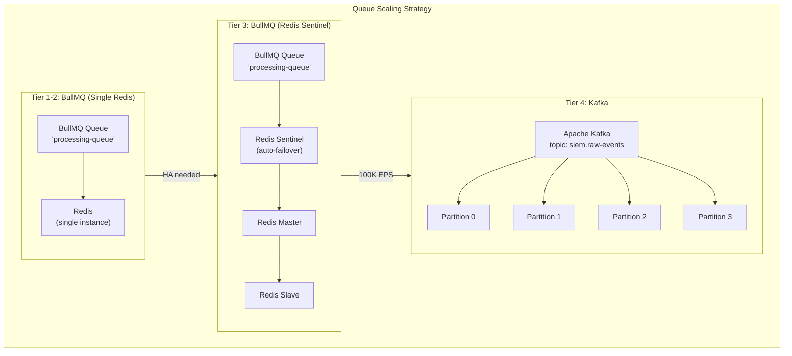

### 5.2 BullMQ Configuration by Tier

| Setting | Tier 1 | Tier 2 | Tier 3 |
|---|---|---|---|
| `maxRetriesPerRequest` | 3 | 3 | 3 |
| `concurrency` (per worker) | 4 | 2 | 2 |
| `removeOnComplete` | `{ count: 1000 }` | `{ count: 5000 }` | `{ count: 10000 }` |
| `removeOnFail` | `{ count: 500 }` | `{ count: 2000 }` | `{ count: 5000 }` |
| `attempts` | 3 | 3 | 3 |
| `backoff` | `{ type: "exponential", delay: 1000 }` | Same | Same |
| `stalledInterval` | 30,000 ms | 30,000 ms | 30,000 ms |
| `lockDuration` | 60,000 ms | 60,000 ms | 120,000 ms |

### 5.3 Queue Monitoring Metrics

| Metric | Source | Alert Threshold |
|---|---|---|
| `queue.waiting` | BullMQ `getWaitingCount()` | > 1,000 → Warning, > 10,000 → Critical |
| `queue.active` | BullMQ `getActiveCount()` | Should equal worker count |
| `queue.failed` | BullMQ `getFailedCount()` | > 100/hour → Warning |
| `queue.completed_rate` | Calculated | < expected EPS → Warning |
| `queue.job_duration_p99` | BullMQ job lifecycle | > 5,000ms → Warning |
| `queue.dead_letter_count` | Dead letter queue | Any → Alert |

### 5.4 Dead Letter Queue

Jobs that fail all retry attempts are moved to a dead letter queue for manual review:

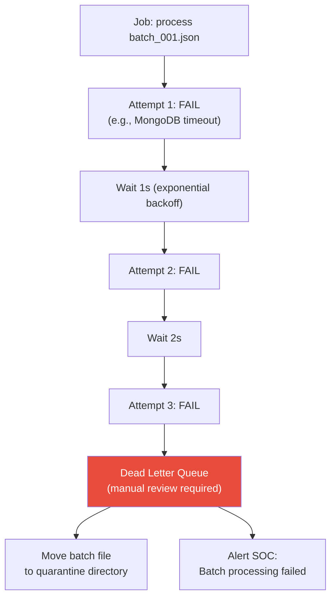

### 5.5 IProcessingQueue Interface (Queue Abstraction)

The `IProcessingQueue` interface allows swapping BullMQ for Kafka at Tier 4 without changing worker code:

```typescript
// IProcessingQueue — same interface for BullMQ or Kafka

interface IProcessingQueue {
  enqueue(job: ProcessingJob): Promise<string>;
  onJob(handler: (job: ProcessingJob) => Promise<void>): void;
  getStats(): Promise<QueueStats>;
  pause(): Promise<void>;
  resume(): Promise<void>;
}

// BullMQProcessingQueue implements IProcessingQueue  (Tier 1-3)
// KafkaProcessingQueue implements IProcessingQueue   (Tier 4)
```

---

## 6. Collector Scaling

### 6.1 Collector Deployment Models

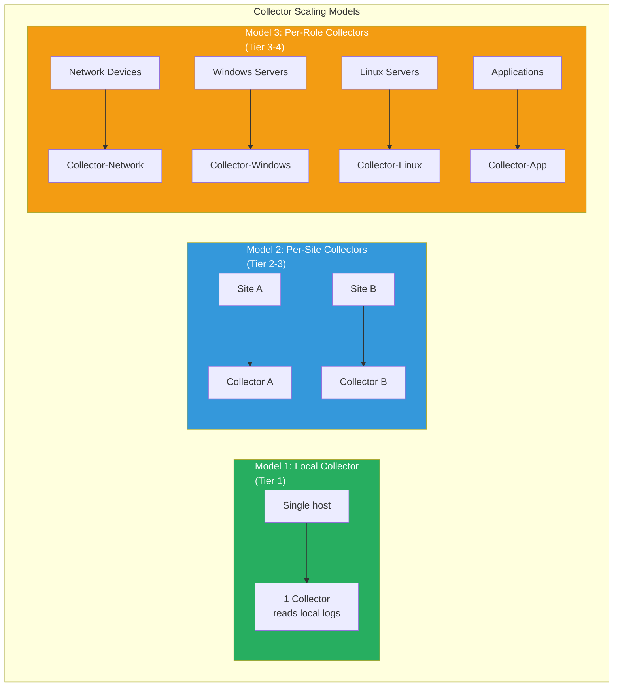

### 6.2 Collectors per Tier

| Tier | Collectors | Deployment | Transport |
|---|---|---|---|
| 100 users | 1 | Local on backend host | Local filesystem |
| 1,000 users | 3-5 | Per site/network segment | NFS mount or rsync |
| 10,000 users | 10-20 | Per role + per site | NFS or rsync to central storage |
| 100,000 users | 50+ | Per role + per site + per region | Kafka producer (direct publish) |

### 6.3 Single Collector Capacity

Each C++ Collector instance has the following capacity based on log source type:

| Source Type | EPS per Collector | Limiting Factor |
|---|---|---|
| File (flat log) | ~5,000 EPS | Disk I/O read speed |
| Syslog (UDP) | ~10,000 EPS | Network + parse speed |
| Windows ETW | ~3,000 EPS | ETW buffer speed |
| HTTP (webhook) | ~2,000 EPS | Network + TLS overhead |

### 6.4 Collector Resource Requirements

| EPS Range | CPU Cores | RAM | Disk I/O |
|---|---|---|---|
| 0-1,000 | 1 core | 128 MB | 10 MB/s write |
| 1,000-5,000 | 2 cores | 256 MB | 50 MB/s write |
| 5,000-10,000 | 4 cores | 512 MB | 100 MB/s write |

### 6.5 Collector Batch Size Scaling

| EPS | Batch Size | Batch Interval | File Size |
|---|---|---|---|
| 100 | 100 events | 10s | ~50 KB |
| 500 | 500 events | 10s | ~250 KB |
| 2,000 | 1,000 events | 5s | ~500 KB |
| 10,000 | 5,000 events | 5s | ~2.5 MB |

### 6.6 Collector Transport Scaling

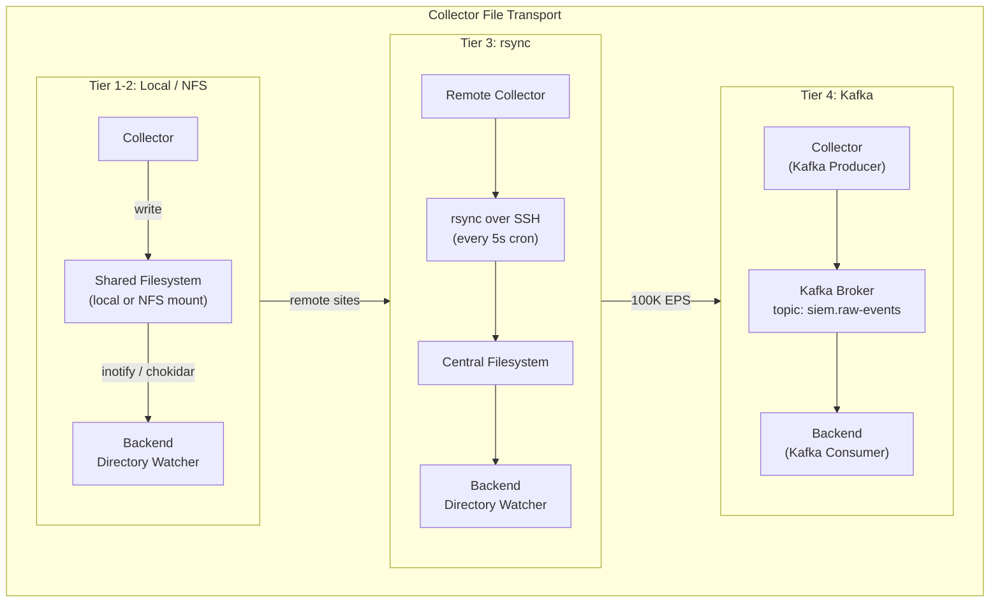

### 6.7 Collector High Availability

| Strategy | Tier | Description |
|---|---|---|
| **Checkpoint recovery** | All tiers | Collector resumes from last checkpoint on restart. No duplicate or lost events |
| **Watchdog process** | Tier 2+ | Systemd service with `Restart=always`. Auto-restart on crash |
| **Dual collectors** | Tier 3+ | Two collectors per critical site in active-passive mode. Passive takes over if active goes offline |
| **Collector fleet management** | Tier 4 | Central management of collector config, versioning, and deployment via Ansible or similar |

### 6.8 Collector Monitoring

| Metric | Source | Alert |
|---|---|---|
| Heartbeat interval | Heartbeat file (every 30s) | Missing 2+ heartbeats → Collector Offline alert |
| EPS rate | Heartbeat metadata | Drop > 50% from baseline → Warning |
| Error count | Heartbeat metadata | > 10 errors/hour → Warning |
| Checkpoint lag | Checkpoint file vs log file position | Lag > 5 min of data → Warning |
| Disk usage | Heartbeat metadata | Collector output dir > 80% → Warning |
| CPU / Memory | Heartbeat metadata | CPU > 90% sustained or Memory > 90% → Warning |

---

## Scaling Decision Tree

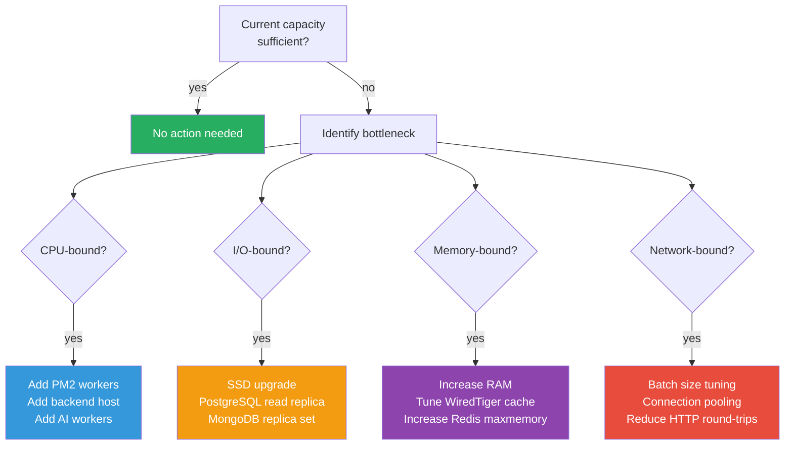

---

> **This document is governed by [ADR-001](file:///d:/AI%20SIEM/docs/architecture/decisions/ADR-001-modular-monolith.md). Tiers 1-3 maintain the Modular Monolith architecture. Tier 4 introduces a controlled architectural evolution (Kafka, MongoDB sharding) as a planned upgrade path. All scaling decisions prioritize vertical scaling and tuning before horizontal splitting.**
>
> **Document Version**: 1.0
> **Last Updated**: 2026-07-19
